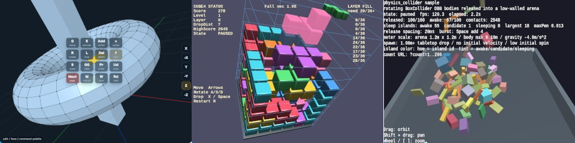

# webg 2

English | [日本語](README.md)

`webg` is a self-contained library for building 3D applications with JavaScript and WebGPU.

In addition to the rendering, 3D mathematics, scene graph, model asset, animation, UI, input, collision detection, physics, sound, and diagnostics features inherited from version 1, version 2 fully integrates GPU computation and deferred rendering using Compute Shaders.
Simple 3D displays can continue to use the short forward-rendering path, while applications that need advanced lighting or screen effects sharing a G-buffer can select `ComputeEffectPipeline`.
For applications such as GPU particles, cloth, physics simulation, and procedural textures that update state on the GPU before rendering, version 2 also provides a compute-first frame mode.

`webg` is not a library that merely wraps WebGPU and hides its internal structure.
It is designed so that you can start with the high-level `WebgApp` API and, when necessary, trace the processing down to `Screen`, `Shape`, Render Passes, Compute Passes, WGSL, and GPU resources.

[All sample applications can be run from here.](https://jun-mizutani.github.io/webg/samples/index.html)



## About version 2.0

When migrating an application from version 1, first refer to [Appendix B, “Migrating from webg 1.0 to 2.0”](book/付録B_webg_1.0から2.0への移行.md).
A simple application that does not use custom shaders, post-processing, G-buffers, translucent materials, or assumptions about the normal-camera depth convention can retain its existing `WebgApp`, `Space`, `Node`, and `Shape` structure.
You do not need to rebuild every application exclusively around Compute Shaders.

## Design Principles

`webg` is designed around the following principles:

- Do not depend on an external 3D engine
- Do not hide the relationships among WebGPU Render Passes, Compute Passes, and GPU resources
- Make high-level and low-level APIs available within the same library
- Connect geometry, scenes, cameras, input, UI, physics, sound, and diagnostics within one application structure
- Allow applications to choose whether the CPU or GPU updates state according to the task
- Make it easy to trace among samples, the book, automated tests, and core implementations
- Do not hide errors through implicit numeric correction or silent fallback; report mismatched input conditions as exceptions
- Provide explanations and validation environments that are easy for both humans and coding AIs to reference

The direct goal is not to replace large general-purpose 3D engines such as Three.js or Babylon.js.
The emphasis is on a library of a manageable scale that helps users understand the processing flow of a WebGPU 3D application and control the portions they need.

## Application Structure

### WebgApp is the common foundation

`WebgApp` brings together GPU initialization, `Screen`, standard shaders, `Space`, cameras, input, the HUD, Overlay Panel, CommandPalette, diagnostics, the update loop, and rendering timing.
It can be used as the common application entry point whether you choose standard forward rendering, deferred rendering, or compute-first execution.

A 3D scene is constructed with `Space`, `Node`, `Shape`, and `ModelAsset`.
Changing the lighting path does not require rebuilding models, Node hierarchies, animation, input, or UI in a different system.

```text
WebgApp
  ├─ initialization, update loop, camera, input, UI, diagnostics
  ├─ Space, Node, Shape, ModelAsset
  └─ frame-processing choice
       ├─ standard frame
       │    ├─ standard forward rendering
       │    │    └─ direct lighting with SmoothShader
       │    └─ deferred rendering
       │         └─ G-buffer + ComputeEffectPipeline
       └─ compute-first mode
            └─ computeFrame + ComputePass / GpuParticleEmitter
```

### Standard forward rendering

In standard forward rendering, `SmoothShader` calculates lighting while drawing each Shape and outputs the result to the Canvas.
This path is suitable when a small number of lights is enough, when no screen effect requires a G-buffer, and when you want to keep the number of GPU resources and processing stages small.

The standard `WebgApp` frame internally handles Reverse-Z for the normal camera, camera-relative rendering, and camera state shared within the same frame.
There is no need to add a `CameraFrame` or custom Render Pass to a simple application.

### Deferred rendering and ComputeEffectPipeline

Deferred rendering first stores the surface information of opaque Shapes in a G-buffer, then calculates lighting and screen effects in later stages.
`ComputeEffectPipeline` connects shadows, SSAO, deferred lighting, SSR, translucency, fog, toon shading, DoF, Bloom, tone mapping, edge extraction, and vignette in an order whose inputs and outputs have consistent meanings.

Intermediate colors from deferred lighting through Bloom remain linear HDR.
Exposure, tone mapping, and sRGB conversion are applied only once at the final display boundary.
Applying individual gamma conversions or clamping to the range from 0 to 1 in each stage would discard lighting and Bloom luminance information.

Translucent triangles are not written to the G-buffer.
After opaque lighting and SSR, `TransparencyPass` composites them into the linear HDR scene, and later screen effects process the result.
The application does not need to add a separate Render Pass for translucent geometry.

### Compute-first mode

Use `computeFrame: true` when GPU particles, cloth, physics simulation, procedural textures, or another application needs to update GPU state and render that updated state in the same frame.
Inside `onComputeFrame`, the application creates a command encoder, records Compute Passes and Render Passes in the required order, and submits them together once at the end.

This mode is not a setting for enabling deferred lighting.
Choosing where lighting is calculated and choosing whether GPU state is updated before rendering are separate decisions.

## Major Features of version 2

### Camera Reverse-Z and camera-relative rendering

The normal camera consistently uses `CAMERA_REVERSE_Z` with `depth32float`, a clear value of 0, and the `greater` comparison function.
Shadow maps use `SHADOW_STANDARD_Z`; although they also use `depth32float`, they use a clear value of 1 and the `less` comparison function.
Do not treat the normal-camera depth convention and the shadow depth convention as the same convention.

In a large world, JavaScript `Number` values are used to calculate the difference between an object position and the camera position before passing a small coordinate near the camera to the GPU.
Because two large world coordinates are not canceled in a GPU `float32` matrix, fine positional information is easier to preserve even far from the world origin.

### CameraFrame and depth-dependent processing

`CameraFrame` is a finalized camera state shared by one rendering operation.
The same `cameraFrame` is passed to G-buffer rendering and to later stages that reconstruct positions or distances from that depth.
Individual Passes do not independently guess `near`, `far`, FOV, or camera matrices.

For a normal single-pass rendering operation, `WebgApp` manages this internally, so the application does not need to assemble a `CameraFrame`.
When connecting `ComputeEffectPipeline.renderScene()` and `encode()`, share the value received from the same callback.

### Multiple materials and automatic translucency composition

One `Shape` can have multiple material slots, and each triangle can retain the slot number it uses.
The existing `setMaterial()`, `getMaterial()`, and `updateMaterial()` methods operate on slot 0, so version 1 code using a single material can be retained.

Rendering opacity is specified by the material’s independent `alpha` value.
`color[3]` keeps its previous meaning as the texture-mixing ratio and is not reinterpreted as opacity.
Triangles with `alpha === 1.0` are classified as opaque, while triangles with `0.0 <= alpha < 1.0` are classified as translucent, and translucent triangles from all Shapes are sorted from back to front.

```js
const shape = new Shape(gpu);

shape.setMaterial("smooth-shader", {
  color: [0.84, 0.28, 0.10, 1.0],
  alpha: 1.0,
  specular: 0.6,
  roughness: 0.32
});

shape.setMaterialAt(1, "smooth-shader", {
  color: [0.15, 0.65, 1.0, 1.0],
  alpha: 0.42,
  specular: 1.0,
  roughness: 0.18,
  power: 128
});

shape.addTriangle(a, b, c, 0);
shape.addTriangle(a, c, d, 1);
shape.endShape();
```

Ordinary alpha composition based on representative depth cannot uniquely resolve intersecting translucent surfaces or surfaces with cyclic front-to-back relationships.
If this limitation matters in a scene, consider splitting the geometry or using another transparency technique.

### G-buffer, lighting, and screen effects

The G-buffer stores pre-lighting albedo, normals, specular reflection, roughness, metallic, emissive, and related surface data.
For a material passed to deferred rendering, explicitly specify `specular`, `roughness`, `metallic`, and `emissive` according to the meaning of the surface instead of asking the G-buffer stage to infer missing values.

SSAO and shadows return visibility rather than finished color, and `DeferredLightingPass` applies that visibility to materials and lights.
Each local light explicitly uses `type: "point"` or `type: "cone"`.
SSR is not stored in the albedo alpha channel; it is composited as an independent HDR reflection.

### Wide blur using image pyramids

Bloom, DoF, frosted glass, and general wide-blur processing use successive low-pass filtering and image pyramids instead of sparsely sampling distant texels with a large sample step.
`ComputeImagePyramid` shares the successive downsampling process, while `ComputePyramidBlurPass` expands the smallest level back to the original resolution one level at a time.

Bloom combines weighted levels from 1/2 through 1/32 to create a wide glow.
DoF separates near- and far-field geometry coverage from the CoC, treating the proportion of geometry included in the filter region separately from the pyramid level selected by focal distance.

### GPU computation and reusable helpers

`ComputePass` records a Compute Pass into the command encoder supplied by the application.
`StorageTargetFactory` standardizes the creation requirements for storage textures written by compute processing and read by later stages.
`PingPongBuffer`, `PingPongTexture`, and `PingPongTarget` share the operation of swapping the previous output and the next input during iterative calculation.

`GpuParticleEmitter` combines the particle-state storage buffer, update Compute Pipeline, and instanced rendering.
Its coordinate space and render-target depth convention are explicitly specified with `coordinateSpace` and `depthConvention`.

### UI, input, diagnostics, and performance measurement

Canvas HUD, DOM overlays, `OverlayPanel`, `CommandPalette`, and `DebugDock` can display runtime state, settings, and controls inside the same application.
Pointer Events are the common input entry point, allowing touch, mouse, and pen input to use the same gesture specification.

`Diagnostics` and `DebugProbe` inspect internal state and errors, while `FrameTimer` helps measure GPU timestamps and JavaScript execution time.
Depending on the purpose, you can combine visual inspection with `headless_tests`, `unittest`, feature-specific samples, and `compute_benchmark`.

## API Layers

| Layer | Main Classes | Purpose |
|---|---|---|
| Application | `WebgApp` | Integrates initialization, update loop, camera, input, UI, diagnostics, and frame processing |
| Scene | `Space`, `Node`, `SceneAsset`, `SceneLoader` | Handles scene hierarchy, placement, and JSON-based scene loading |
| Model | `Shape`, `Primitive`, `ModelAsset`, `ModelBuilder`, `ModelLoader` | Handles meshes, multiple materials, external models, and runtime instances |
| Math and camera | `Matrix`, `Quat`, `EyeRig`, `CameraFrame` | Handles coordinate transformations, orientation, viewpoints, and camera state shared in one frame |
| Render API | `Screen`, `Shader`, `RenderTarget`, `FullscreenPass` | Directly handles Render Passes, WGSL, render targets, and final presentation |
| Deferred rendering | `GeometryBufferPass`, `DeferredLightingPass`, `ComputeEffectPipeline` | Integrates the G-buffer, lighting, translucency, and screen effects |
| Compute API | `ComputePass`, `ComputeImagePyramid`, `ComputePyramidBlurPass` | Handles Compute Pipelines, image pyramids, and wide blur |
| GPU simulation | `GpuParticleEmitter`, `StorageTargetFactory`, `PingPongBuffer`, `PingPongTexture`, `PingPongTarget` | Handles GPU state updates, storage resources, and iterative calculation |
| Animation | `Tween`, `Animation`, `Action`, `AnimationState` | Handles interpolation, key-range playback, actions, and state transitions |
| Input and UI | `InputController`, `Touch`, `OverlayPanel`, `CommandPalette` | Handles keyboard input, Pointer Events, gestures, and control interfaces |
| Physics | `PhysicsSpace`, `PhysicsNode`, Collider classes | Handles gravity, collision detection, and physical behavior |
| Sound | `AudioSynth`, `ToneSynth`, `GameAudioSynth` | Handles sound processing using the Web Audio API |
| Diagnostics and measurement | `Diagnostics`, `DebugDock`, `DebugProbe`, `FrameTimer` | Performs state inspection, error display, and CPU/GPU time measurement |

Ordinary applications begin with `WebgApp` and select only the required features from lower-level APIs.
The availability of Compute Shaders alone is not a reason to replace standard forward rendering with `ComputeEffectPipeline`.

## Repository Structure

```text
webg/
  book/            Technical explanations for version 2
    examples/      Single-file executable examples for each chapter
  headless_tests/  Automated tests that do not require screen interaction
  samples/         Feature-specific sample applications
  tools/           Utility tools
  unittest/        Small browser-based validation applications
  webg/            Library source code
```

## Getting Started

### 1. Clone the Repository

```bash
git clone https://github.com/jun-mizutani/webg.git
cd webg
```

`webg` does not depend on an npm package and is used while preserving the repository’s directory structure.
Because it uses relative ES Module imports and asset loading through `fetch()`, do not move only selected files to unrelated locations.

### 2. Start a Local HTTP Server

To use WebGPU, ES Modules, and asset loading correctly, open the files through an HTTP server instead of `file://`.

Using Python 3:

```bash
python3 -m http.server 8000
```

Using Node.js:

```bash
npx http-server . -p 8000
```

### 3. Open the Sample Index

```text
http://localhost:8000/samples/index.html
```

## Basic Usage

### Start with standard forward rendering

When using `webg` for the first time, begin with the standard `WebgApp` frame.
After GPU initialization is complete, create a Shape and Node, then update application state in `onUpdate`.

```js
import WebgApp from "./webg/WebgApp.js";
import Shape from "./webg/Shape.js";
import Primitive from "./webg/Primitive.js";

const app = new WebgApp({
  document,
  clearColor: [0.1, 0.15, 0.1, 1.0]
});

await app.init();

const shape = new Shape(app.getGPU());
shape.applyPrimitiveAsset(
  Primitive.cube(2.0, shape.getPrimitiveOptions())
);
shape.endShape();
shape.setMaterial("smooth-shader", {
  color: [1.0, 0.5, 0.3, 1.0]
});

const node = app.space.addNode(null, "cube");
node.addShape(shape);

app.createOrbitEyeRig({
  target: [0.0, 0.0, 0.0],
  distance: 8.0
});

app.start({
  onUpdate: () => {
    node.rotateY(0.8);
  }
});
```

See `samples/high_level` for a complete implementation including its HTML and error display.

### Use ComputeEffectPipeline

When a G-buffer and multiple screen effects are needed, initialize `ComputeEffectPipeline` and pass the same `cameraFrame` to scene rendering and later processing.
Present the final texture to the Canvas with `beginPresentPass()`, then return to the depth-enabled pass used by the HUD.

```js
const pipeline = new ComputeEffectPipeline(gpu, {
  width: app.screen.getWidth(),
  height: app.screen.getHeight()
});

const copyPass = new FullscreenPass(gpu);
await Promise.all([pipeline.ready, copyPass.init()]);

app.start({
  onUpdate: ({ screen }) => {
    pipeline.resize(screen.getWidth(), screen.getHeight());
  },

  onBeforeDraw: ({ cameraFrame }) => {
    pipeline.renderScene(
      app.space,
      cameraFrame,
      app.clearColor
    );
  },

  onAfterDraw3d: ({ cameraFrame }) => {
    gpu.endPass();

    const finalColor = pipeline.encode(gpu.commandEncoder, {
      cameraFrame,
      ssaoEnabled: true,
      bloomEnabled: true
    });

    app.screen.beginPresentPass({
      clearColor: app.clearColor,
      colorLoadOp: "clear"
    });
    copyPass.draw(finalColor);
    app.screen.clearDepthBuffer();
  }
});
```

This example shows only the connection order.
See `samples/compute_effect` for an implementation that also includes materials, lights, effect settings, diagnostics, GPU measurement, and resource destruction.

### Use compute-first mode

When GPU state must be updated before rendering, specify `computeFrame: true` and gather the recording and submission of one frame in `onComputeFrame`.

```js
const app = new WebgApp({
  document,
  computeFrame: true
});

await app.init();

app.start({
  onComputeFrame: ({ cameraFrame, deltaSec }) => {
    const gpu = app.getGPU();
    const encoder = gpu.device.createCommandEncoder();

    simulation.encode(encoder, resources, { deltaSec });
    renderer.encode(encoder, cameraFrame);

    gpu.queue.submit([encoder.finish()]);
  }
});
```

For concrete GPU particle, cloth, physics, and texture-generation examples, see `samples/compute_particles`, `samples/compute_cloth`, `samples/compute_physics_bounce`, and `samples/compute_texture`.

## Recommended Validation Order

You do not need to read every Compute feature first.
Begin with the path closest to the application you want to build.

1. `samples/low_level`
   Check the minimal WebGPU Render Pipeline, buffers, WGSL, and command submission.

2. `samples/high_level`
   Check standard forward rendering using `WebgApp`, `Space`, `Shape`, and EyeRig.

3. `samples/materials` and `samples/opacity`
   Check material values, multiple materials, per-triangle material indices, and automatic translucency composition.

4. `samples/compute_deferred_lighting`
   Check the basic connection between the G-buffer and deferred lighting.

5. `samples/compute_effect`
   Check the integrated order of SSAO, shadows, SSR, translucency, fog, toon shading, DoF, Bloom, tone mapping, edges, and vignette.

6. `samples/compute_bloom` and `samples/compute_dof`
   Check image-pyramid Bloom and DoF that separates geometry coverage from the CoC.

7. `samples/compute_particles`, `samples/compute_cloth`, and `samples/compute_texture`
   Check how compute-first mode records Compute Passes and Render Passes into the same frame.

8. `samples/compute_benchmark`
   Compare GPU time, settings, resolution, and image-pyramid stages for each Compute process.

9. `samples/maze2`
   Check deferred lighting, multiple local lights, SSR, Bloom, and related features at practical application scale.

## Documentation

The `book/` directory explains the design and usage of version 2 in chapters.
When reading it for the first time, begin with the runtime environment, minimal WebGPU rendering, `WebgApp`, cameras, Shape, and materials, then continue to the Compute Shader and advanced-rendering chapters as needed.

The following documents are particularly useful entry points for version 2:

- [`book/付録A_コーディングAIの皆さまへ.md`](book/付録A_コーディングAIの皆さまへ.md)
  Explains how humans and AIs can select the appropriate book chapters, samples, tests, and core implementations for a task.
- [`book/付録B_webg_1.0から2.0への移行.md`](book/付録B_webg_1.0から2.0への移行.md)
  Explains differences, precautions, and the recommended validation order when migrating a version 1 application.
- [`book/付録C_API一覧.md`](book/付録C_API一覧.md)
  Lists the public classes and major methods in version 2 by feature.
- [`book/27_コンピュートシェーダーの基礎.md`](book/27_コンピュートシェーダーの基礎.md)
  Explains Compute Pipelines, storage resources, depth conventions, CameraFrame, and compute-first mode.
- [`book/28_コンピュートパスによる高度な表現.md`](book/28_コンピュートパスによる高度な表現.md)
  Explains SSAO, shadows, deferred lighting, SSR, GPU particles, DoF, Bloom, and other individual processes.
- [`book/29_リアルタイム3D表現の統合.md`](book/29_リアルタイム3D表現の統合.md)
  Explains the order in which processes are connected to `ComputeEffectPipeline`, along with color formats, resizing, and destruction.

For current API settings, defaults, and exception conditions, treat the book chapters, Appendix C, the relevant samples, and the current implementation as authoritative rather than the short examples in this README.

## Samples and Tests

The `samples/` directory contains reference implementations showing how features are used in actual applications.
Read each sample’s README, explanation page, `.txt` file, and executable HTML together with its implementation.

`headless_tests/` automatically checks argument validation, depth conventions, color formats, GPU resource creation and destruction, and other conditions that do not require screen interaction.
Run the following command to execute the complete set:

```bash
node headless_tests/run_all.js
```

`unittest/` contains small validation applications for checking display and interaction in a browser.
Final validation should include not only headless tests but also the relevant unittest and sample on an actual screen.

## AI-Assisted Development

When asking a coding AI to implement or investigate an application using webg version 2, first provide `book/付録A_コーディングAIの皆さまへ.md`.
Then identify the book chapters, samples, headless tests, unittests, and current `webg/*.js` files related to the task so that general assumptions about WebGPU engines are not confused with webg-specific APIs.

**Note on Language:** While the documentation and internal code comments are predominantly written in Japanese, the source code itself is written in English. Since modern LLMs are proficient in both languages, non-Japanese speakers can seamlessly use AI to bridge the language gap and obtain accurate technical guidance by providing the relevant chapters from `book/` or implementation examples from `samples/` as context.

## Supported Environment

`webg` assumes a modern browser that supports WebGPU and the WebGPU APIs required by the features being used.

- Google Chrome
- Microsoft Edge
- Firefox
- Safari

Available features, performance, and Canvas presentation behavior may differ depending on the WebGPU implementation, operating system, GPU, and driver.
For samples using Compute Shaders, inspect the in-application Diagnostics, DebugDock, and GPU measurement results in addition to the browser developer tools.

If a problem occurs, check the following in order:

- Whether the page is opened through an HTTP server rather than `file://`
- Whether the browser and GPU driver support WebGPU
- Whether the developer tools report a WebGPU validation error or initialization error
- Whether the color format, depth format, and depth convention of the Render Pipeline match the render target
- Whether the same `cameraFrame` is passed to depth-dependent processing
- Whether `resize()` is called on classes that retain processing resources when the Canvas physical pixel dimensions change
- Whether `destroy()` is called exactly once on classes that retain GPU resources when the application ends

For detailed instructions on browsers, HTTP servers, and caches, refer to [Chapter 2, “Installation and Runtime Environment”](book/02_インストールと実行環境.md).

## License

MIT License

## Author

- Author: Jun Mizutani
- Website: https://www.mztn.org/
