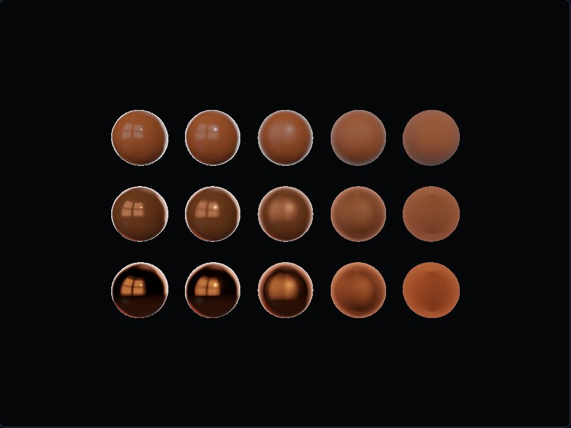
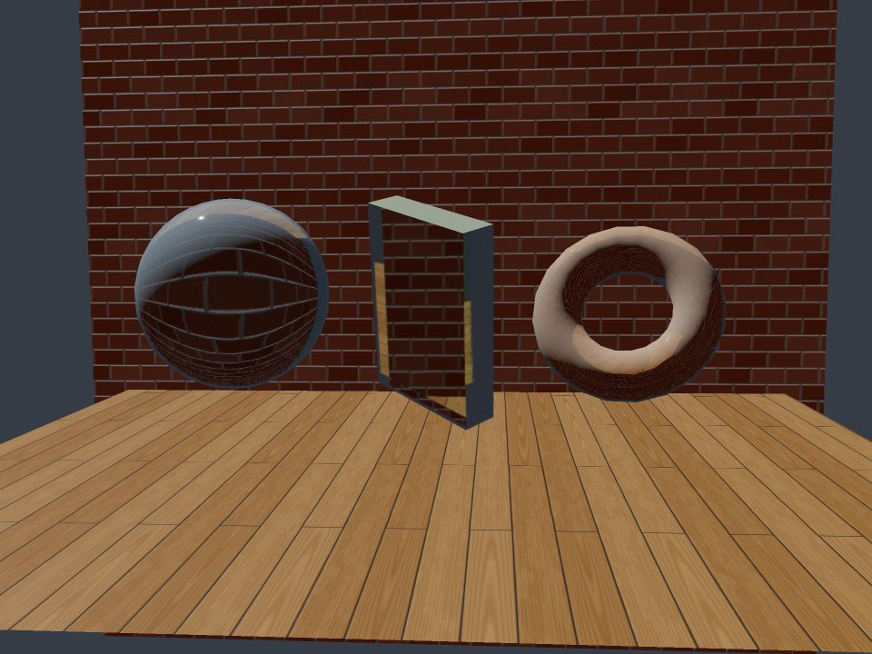
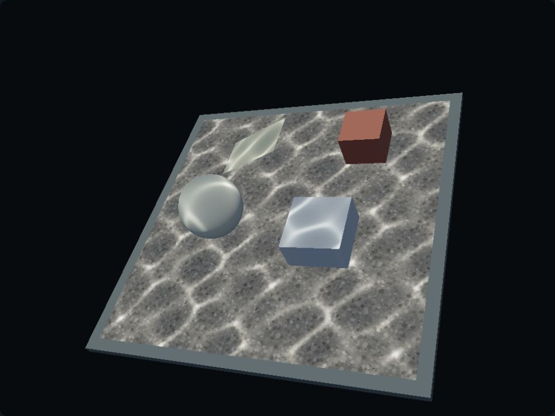
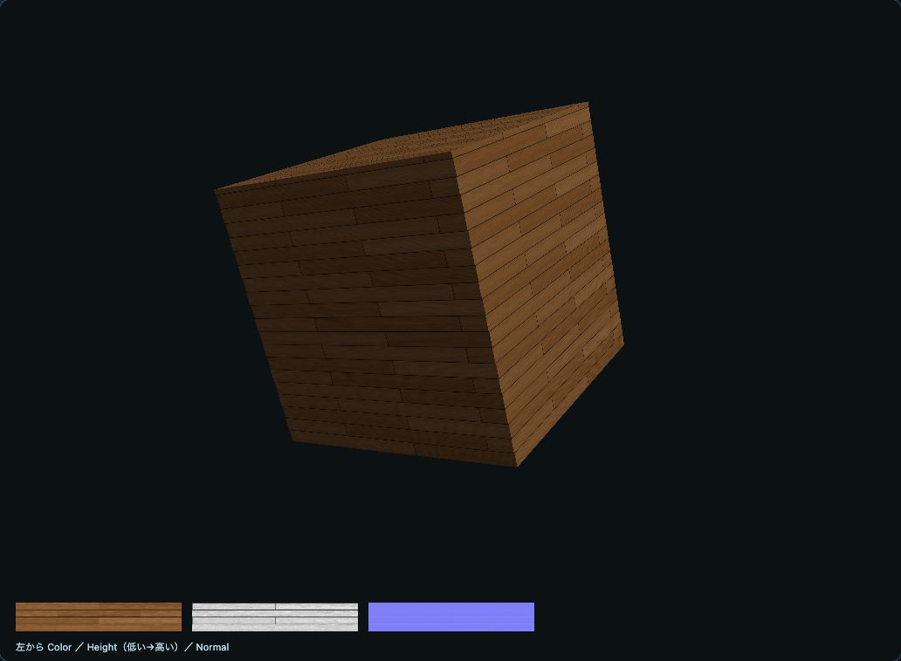
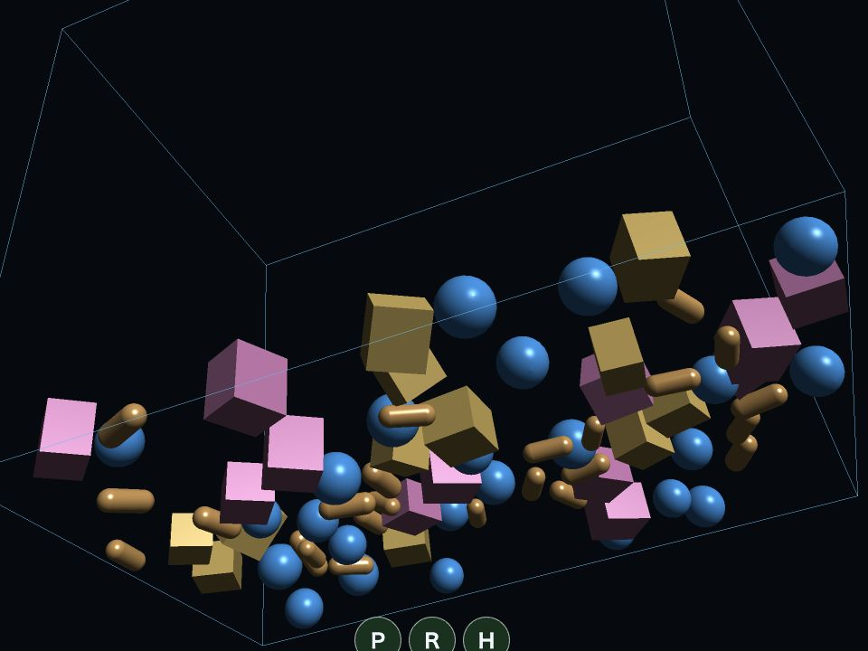

# webg 3.0

[日本語](README.md) · [GitHub](https://github.com/jun-mizutani/webg) · [Sample gallery](https://jun-mizutani.github.io/webg/samples/index.en.html) · [Guide to examples and samples](https://jun-mizutani.github.io/webg/book/examples/guide.en.html)

Build 3D applications with light, materials, and motion using JavaScript and WebGPU.

`webg` is a self-contained library that combines PBR, environment lighting, water surfaces and caustics, CPU/GPU physics simulation, animation, particles, and sound.
You can move from high-level application development to direct control of Render Passes, Compute Passes, and WGSL while using the same scenes and models.

[](https://jun-mizutani.github.io/webg/samples/aquarium/aquarium.html)

**Aquarium — Light beneath the water** — A scene combining glTF model animation, caustics, a water surface, particles, and lighting.
[Run the sample](https://jun-mizutani.github.io/webg/samples/aquarium/aquarium.html) · [Explanation and code](https://jun-mizutani.github.io/webg/samples/aquarium/index.en.html)

## Explore webg through samples

Click an image to run the sample in a WebGPU-enabled browser. Each sample's explanation page guides you through its implementation and the APIs it uses.

<table>
  <tr>
    <td width="50%">
      <a href="samples/pbr_reference/pbr_reference.html"></a><br />
      <strong>PBR and environment lighting</strong><br />
      See how metallic and roughness change a material's appearance. <a href="samples/pbr_reference/index.en.html">Explanation and code</a>
    </td>
    <td width="50%">
      <a href="samples/transmission/transmission.html"></a><br />
      <strong>Transparency, refraction, and absorption</strong><br />
      Glass refraction and background blur controlled by roughness. <a href="samples/transmission/index.en.html">Explanation and code</a>
    </td>
  </tr>
  <tr>
    <td width="50%">
      <a href="samples/water/water.html"></a><br />
      <strong>Water surfaces and caustics</strong><br />
      Wave-driven reflection and refraction, with caustics applied to selected objects. <a href="samples/water/index.en.html">Explanation and code</a>
    </td>
    <td width="50%">
      <a href="samples/texture_catalog/texture_catalog.html"></a><br />
      <strong>Procedural materials</strong><br />
      Generate wood, brick, stone, and gravel patterns at physical scale. <a href="samples/texture_catalog/index.en.html">Explanation and code</a>
    </td>
  </tr>
  <tr>
    <td width="50%">
      <a href="samples/compute_physics/compute_physics.html"></a><br />
      <strong>CPU/GPU physics simulation</strong><br />
      Compare rigid-body motion and contact with the same initial conditions. <a href="samples/compute_physics/index.en.html">Explanation and code</a>
    </td>
    <td width="50%">
      <a href="samples/fantasy/fantasy.html"></a><br />
      <strong>A small 3D game</strong><br />
      Combine selection, movement, combat, animation, and particles. <a href="samples/fantasy/index.en.html">Explanation and code</a>
    </td>
  </tr>
</table>

[Browse all samples](https://jun-mizutani.github.io/webg/samples/)

## Main features

### PBR, environment lighting, and transparency

Physically based rendering (PBR) uses base color, metallic, roughness, specular reflection, and emission to represent materials under direct light and image-based lighting (IBL).
High dynamic range (HDR) environment maps, glTF 2.0 core materials, and procedural environments are available.
Deferred rendering for opaque objects and forward rendering for translucent objects share a GGX reflection model and linear-HDR color processing.

Transparent materials support refractive index, thickness, color absorption, and roughness-dependent background blur.
`ComputeEffectPipeline` connects shadows, screen-space ambient occlusion (SSAO), screen-space reflections (SSR), fog, depth of field (DoF), bloom, tone mapping, and other effects.
The high-level `PbrRenderer` can also configure lighting, environments, and screen effects together.

### Water surfaces and caustics

`WaterBody` configures the water region, wave mixing, wavelength, speed, refractive index, and color absorption.
Water-surface reflection and refraction, and caustics—the light concentrated by waves onto the waterbed and objects—are calculated from the same wave field.
Register opaque `Shape` or `Node` receivers and adjust the intensity for each object.

The surface and caustics can be switched independently. Turning both off releases water-specific GPU resources and returns to the regular PBR pipeline.
The core water surface supports finite horizontal water regions viewed from above. Caustics use an approximation that projects vertically directed light from a reference plane onto 3D objects.
The aquarium sample also includes its own water-surface rendering for underwater viewpoints. The scope of each effect is described in the [water sample documentation](https://jun-mizutani.github.io/webg/samples/water/index.en.html).

### Procedural materials and models

Generate wood, brick, tile, stone, and other materials from dimensions in meters.
Color, height, and normals are handled separately, with presets for rounded stones, mixed stones and gravel, and gravel alone.
Combining `ProceduralMaterials` with physical-scale UVs produces patterns suited to the size of each object.

Build meshes with `Shape`, create basic geometry with `Primitive`, load external models such as glTF/GLB, and instantiate models multiple times.
Node hierarchies, multiple materials, skinning, and keyframe animation connect to the same scene.

### CPU/GPU physics engines

The CPU-based `PhysicsSpace` and the GPU-based `ComputePhysicsSpace`, which updates rigid bodies with Compute Shaders, are available.
They support contact between boxes, spheres, capsules, and fixed planes, along with gravity, friction, rotation, sleeping, and joint constraints.

| Selection criterion | CPU engine | GPU engine |
|---|---|---|
| Application structure | Integrate with Node operations and JavaScript game logic | Update and render many rigid bodies on the GPU |
| Access to state | Use CPU state for queries and contact events | Explicitly read back GPU state when needed |
| Rendering integration | Use the position and orientation of `PhysicsNode` | Render directly from GPU state or synchronize it to Nodes |

Choose based on object count, shape, update frequency, and the information your CPU-side logic needs.
[samples/compute_physics](https://jun-mizutani.github.io/webg/samples/compute_physics/index.en.html) compares the CPU and GPU engines with the same initial conditions. [samples/karakuri](https://jun-mizutani.github.io/webg/samples/karakuri/index.en.html) demonstrates an application combining editing and simulation.

### Animation, particles, sound, and input

Connect keyframes, interpolation, animation state transitions, GPU particles, and cloth updates to rendering.
Mouse, touch, pen input, camera controls, click selection, HUDs, and control panels use a common application foundation.
Sound synthesis, background music, and sound effects are available through the Web Audio API.

## Start building an application

If you are new to webg, use the [guide to examples and samples](https://jun-mizutani.github.io/webg/book/examples/guide.en.html) to find an example close to what you want to build.
`book/examples/` contains small runnable examples for individual chapters; `samples/` contains reference applications combining multiple features.

- **Describe geometry and motion in JavaScript:** Start with `WebgApp`, `Space`, `Node`, and `Shape`. See [high_level](https://jun-mizutani.github.io/webg/samples/high_level/index.en.html).
- **Define placement, materials, and physics in SceneYAML:** Use `createWebgSceneApp()` and `SceneDefinition`. See [project_app](https://jun-mizutani.github.io/webg/samples/project_app/index.en.html).
- **Combine PBR lighting and screen effects:** Use `PbrRenderer` and `ComputeEffectPipeline`. See the [PBR integration example](book/examples/32_01.html).
- **Render GPU-updated state in the same frame:** Use `ComputePass` and run GPU computation before rendering. See [compute_particles](https://jun-mizutani.github.io/webg/samples/compute_particles/index.en.html).

`WebgApp` brings together GPU initialization, scenes, cameras, input, UI, and the update/render loop.
`WebgSceneApp` builds models, materials, PBR, and physics from SceneYAML/JSON application definitions.
You can follow the lower-level Render API, Compute API, and WGSL as needed to control execution order and GPU resources directly.

### Run locally

```bash
git clone https://github.com/jun-mizutani/webg.git
cd webg
python3 -m http.server 8000
```

Open `http://localhost:8000/samples/index.en.html` in your browser.
Serve the repository over HTTP and retain its directory structure for ES Modules and asset loading.
The library itself can be used through relative JavaScript imports.

## Learn with the book

The English book is available in [`book.en/`](book.en/README.md). Its [entry guide](book.en/ExampleGuide.md) maps application goals to runnable examples, code to read, and checks to make. The companion [browser guide](https://jun-mizutani.github.io/webg/book/examples/guide.en.html) provides the same navigation in the browser.

The chapters progress from minimal rendering through application structure, models, interaction, physics, PBR, and GPU processing. Each chapter links its explanation to runnable examples in `book/examples/` and larger applications in `samples/`.

- [Introduction](book.en/01_Introduction.md): Overview of webg and reading order
- [Runtime environment](book.en/02_Runtime.md): WebGPU requirements and local execution
- [Click selection and collision queries](book.en/15_Collision.md): Ray and shape queries
- [Physics engines](book.en/27_Physics.md): CPU/GPU engines and joints
- [Procedural textures and physical-scale mapping](book.en/29_ProceduralTextures.md): Generation settings and material application
- [PBR and environment lighting](book.en/30_PBR.md): Materials, lights, HDR environments, and IBL
- [Basic PBR integration](book.en/32_PBRSetup.md): Connecting rendering stages
- [Lighting, reflections, and fog](book.en/35_LightingEffects.md): Effects including water surfaces and caustics
- [API reference](book.en/Appendix_D_API.md): Public classes and principal methods

The documentation helps both people and coding AI agents find relevant examples and APIs. When asking an AI to implement an application, provide [Appendix A for coding AI agents](book.en/Appendix_A_ForAI.md) and an example close to the goal. For migration from webg 1.0/2.0, see [Appendix B](book.en/Appendix_B_Migration.md).

## Requirements and validation

Use a WebGPU-enabled browser and GPU, and run applications on localhost or HTTPS.
Available features and performance depend on the browser, OS, GPU, and driver.
GPU timing measurements require `timestamp-query` support.

[compute_benchmark](https://jun-mizutani.github.io/webg/samples/compute_benchmark/index.en.html) measures PBR rendering, lighting, reflections, transparency composition, and other stages under the same scene conditions.
`headless_tests/` contains automated tests for API and data contracts; `unittest/` contains browser applications for visual checks.

```bash
node headless_tests/run_all.js
```

## License and author

[MIT License](LICENSE) · Jun Mizutani · [Author's website](https://www.mztn.org/)
