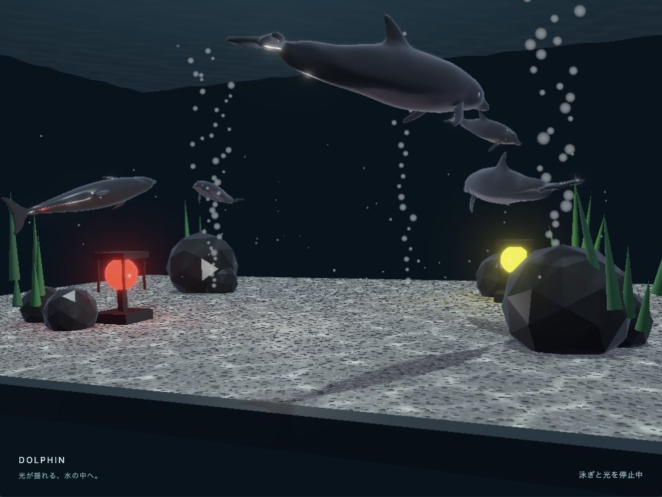

# webg 3.0

[English](README.en.md) · [GitHub](https://github.com/jun-mizutani/webg) · [サンプル一覧](samples/index.html) · [実行例とサンプルの案内](book/examples/guide.html)

JavaScriptとWebGPUで、光・材質・動きのある3Dアプリケーションを。

`webg`は、PBR、環境光、水面とコースティクス、CPU／GPUの物理シミュレーション、アニメーション、粒子、サウンドを組み合わせられる自己完結型のライブラリです。
高水準のアプリ構築から、Render Pass・Compute Pass・WGSLを直接扱う実装まで、同じシーンやモデルを使って進められます。

[](samples/aquarium/aquarium.html)

**水光のアクアリウム** — glTFモデルのアニメーション、コースティクス、水面、粒子、照明を組み合わせた情景です。
[動かして見る](samples/aquarium/aquarium.html) · [作り方とコード](samples/aquarium/index.html)

## サンプルで見るwebg

画像をクリックすると、WebGPU対応ブラウザーでサンプルを実行できます。各サンプルの説明ページから、実装と使っているAPIを確認できます。

<table>
  <tr>
    <td width="50%">
      <a href="samples/pbr_reference/pbr_reference.html"></a><br />
      <strong>PBRと環境光</strong><br />
      金属度と粗さで変わる材質の見え方。<a href="samples/pbr_reference/index.html">説明とコード</a>
    </td>
    <td width="50%">
      <a href="samples/transmission/transmission.html"></a><br />
      <strong>透明・屈折・吸収</strong><br />
      ガラスの屈折と、粗さによる背景のぼけ。<a href="samples/transmission/index.html">説明とコード</a>
    </td>
  </tr>
  <tr>
    <td width="50%">
      <a href="samples/water/water.html"></a><br />
      <strong>水面とコースティクス</strong><br />
      波による反射・屈折と、物体を選んで設定する集光。<a href="samples/water/index.html">説明とコード</a>
    </td>
    <td width="50%">
      <a href="samples/texture_catalog/texture_catalog.html"></a><br />
      <strong>手続きマテリアル</strong><br />
      木、レンガ、石、砂利などを寸法に合わせて生成。<a href="samples/texture_catalog/index.html">説明とコード</a>
    </td>
  </tr>
  <tr>
    <td width="50%">
      <a href="samples/compute_physics/compute_physics.html"></a><br />
      <strong>CPU／GPUの物理シミュレーション</strong><br />
      同じ初期条件で剛体の落下と接触を比較。<a href="samples/compute_physics/index.html">説明とコード</a>
    </td>
    <td width="50%">
      <a href="samples/fantasy/fantasy.html"></a><br />
      <strong>小さな3Dゲーム</strong><br />
      選択、移動、戦闘、アニメーション、粒子を組み合わせる。<a href="samples/fantasy/index.html">説明とコード</a>
    </td>
  </tr>
</table>

[すべてのサンプルを見る](samples/index.html)

## 主な機能

### PBR、環境光、透明表現

物理ベースレンダリング（PBR）では、基本色、金属度、粗さ、鏡面反射、発光を指定し、直接光と画像ベース照明（IBL）で材質を表現します。
高輝度範囲（HDR）の環境マップ、glTF 2.0の基本材質、手続き環境を利用できます。
不透明物の遅延描画と半透明物の前方描画は、共通のGGX反射モデルと線形HDRの色処理を使います。

透明表現には、屈折率、厚み、色の吸収、粗さによる背景ぼけを設定できます。
シャドウ、環境遮蔽（SSAO）、画面空間反射（SSR）、フォグ、被写界深度（DoF）、Bloom、トーンマッピングなどは、`ComputeEffectPipeline`で接続します。
高水準の`PbrRenderer`から、照明・環境・画面効果をまとめて構成することもできます。

### 水面とコースティクス

`WaterBody`で水域、波の混合、波長、速さ、屈折率、色の吸収を設定します。
水面の反射・屈折と、水底や物体へ届くコースティクス（波で集まる光）を、同じ波形から計算します。
受光する不透明な`Shape`や`Node`を登録し、物体ごとの強度を調整できます。

水面と集光は個別に切り替えられます。両方OFFでは水専用のGPU資源を解放し、通常のPBR処理へ戻ります。
コアの水面は有限の水平水域を上から見る用途、集光は垂直方向の光を基準面から立体へ投影する近似に対応します。
水中視点のaquariumは、サンプル側で水面の描画も組み合わせています。各表現の適用範囲は[waterの解説](samples/water/index.html)にまとめています。

### 手続きマテリアルとモデル

木、レンガ、タイル、石などのマテリアルを、メートル単位の寸法から生成します。
色・高さ・法線を分けて扱い、丸い石、石と砂利、砂利だけのプリセットも選べます。
`ProceduralMaterials`と実寸UVを組み合わせることで、物体の大きさに合う模様を作れます。

`Shape`によるメッシュ構築、`Primitive`による基本形状、glTF／GLBなどの外部モデル、モデルの複数インスタンスを利用できます。
Nodeの階層、複数マテリアル、スキニング、キーフレームアニメーションを同じシーンへ接続します。

### CPU／GPUの物理エンジン

CPU版の`PhysicsSpace`と、Compute Shaderで剛体を更新するGPU版の`ComputePhysicsSpace`を用意しています。
Box、Sphere、Capsuleと固定Planeの接触、重力、摩擦、回転、静止判定に対応し、Jointによる拘束も扱えます。

| 選ぶ基準 | CPU版 | GPU版 |
|---|---|---|
| アプリの構成 | Node操作やJavaScriptのゲーム処理へ組み込む | 多数の剛体をGPU上で更新して描画する |
| 状態の利用 | CPU上の状態から問い合わせや接触イベントを処理する | 必要な時点で明示的にGPU状態を読み戻す |
| 描画への接続 | `PhysicsNode`の位置と姿勢を使う | GPU状態の直接描画、またはNodeへの同期を選ぶ |

両者を選ぶときは、物体数、形状、更新頻度、CPU側で必要な情報を基準にします。
[samples/compute_physics](samples/compute_physics/index.html)で同じ初期条件のCPU版とGPU版を比較し、[samples/karakuri](samples/karakuri/index.html)で編集と試運転を組み合わせたアプリを確認できます。

### アニメーション、粒子、サウンド、入力

キーフレーム、補間、アニメーションの状態遷移に加え、GPU粒子や布の更新を描画へ接続できます。
マウス・タッチ・ペン、カメラ操作、クリック選択、HUD、操作パネルを共通のアプリ基盤で扱います。
Web Audio APIによる音の合成、BGM、効果音も利用できます。

## アプリケーションを作り始める

初めて使う場合は、[実行例とサンプルの案内](book/examples/guide.html)から、作りたいものに近い例を選んでください。
`book/examples/`は各章の小さな実行例、`samples/`は複数の機能を組み合わせた参照アプリです。

- **形状と動きをJavaScriptで記述する**：`WebgApp`、`Space`、`Node`、`Shape`から始めます。[high_level](samples/high_level/index.html)を参照してください。
- **配置・材質・物理をSceneYAMLで定義する**：`createWebgSceneApp()`と`SceneDefinition`を使います。[project_app](samples/project_app/index.html)を参照してください。
- **PBRの照明と画面効果を組み合わせる**：`PbrRenderer`と`ComputeEffectPipeline`を使います。[PBR統合の実行例](book/examples/32_01.html)を参照してください。
- **GPUの更新結果を同じフレームで描画する**：`ComputePass`を使い、GPU計算を描画より先に実行します。[compute_particles](samples/compute_particles/index.html)を参照してください。

`WebgApp`は、GPU初期化、シーン、カメラ、入力、UI、更新と描画のループをまとめます。
`WebgSceneApp`はSceneYAML／JSONの作品定義からモデル・材質・PBR・物理を組み立てます。
必要に応じて下位のRender API、Compute API、WGSLまでたどり、処理順やGPU資源を直接制御できます。

### ローカルで実行する

```bash
git clone https://github.com/jun-mizutani/webg.git
cd webg
python3 -m http.server 8000
```

ブラウザーで`http://localhost:8000/samples/index.html`を開きます。
ES Modulesとアセット読み込みを使うため、リポジトリのディレクトリ構成を保ち、HTTPサーバーから配信します。
ライブラリ本体は、JavaScriptの相対importで利用できます。

## bookで学ぶ

bookは、最小の表示から、アプリ構成、モデル、操作、物理、PBR、GPU処理へ順に進めます。
各章の実行例とサンプルへの案内を使い、動くコードを読みながら学べます。

- [はじめに](book/01_はじめに.md)：webgの全体像と読む順序
- [実行環境](book/02_実行環境.md)：WebGPU対応環境とローカルでの実行
- [クリック選択と衝突判定](book/15_衝突判定とクエリ.md)：レイと形状の問い合わせ
- [物理エンジン](book/27_物理エンジンを使う.md)：CPU／GPU版の利用とJoint
- [手続きテクスチャと実寸マッピング](book/29_手続きテクスチャと実寸マッピング.md)：生成仕様と材質への適用
- [PBRと環境光](book/30_物理ベースレンダリングと環境光.md)：材質、光源、HDR環境、IBL
- [PBR統合の基本実装](book/32_PBR統合の基本実装.md)：描画段階の接続
- [照明、反射、フォグ](book/35_照明、反射、フォグ.md)：水面とコースティクスを含む表現
- [API一覧](book/付録D_API一覧.md)：公開クラスと主要メソッド

人間にもコーディングAIにも、目的に合う参照例とAPIを見つけやすい構成を目指しています。
AIへ実装を依頼する場合は、[付録A「コーディングAIの皆さまへ」](book/付録A_コーディングAIの皆さまへ.md)と、目的に近いサンプルの説明・コードを渡してください。
webg 1.0／2.0からの移行は、[付録B](book/付録B_webg_1.0・2.0から3.0への移行.md)で確認できます。

## 対応環境と検証

WebGPUに対応したブラウザーとGPUを使用し、localhostまたはHTTPSから実行してください。
利用できる機能と性能は、ブラウザー、OS、GPU、ドライバーによって異なります。
GPU時間の計測には`timestamp-query`対応が必要です。

[compute_benchmark](samples/compute_benchmark/index.html)では、PBRの描画・照明・反射・透明合成などを、同じシーン条件で段階別に計測できます。
`headless_tests/`にはAPIとデータの条件を検証する自動テスト、`unittest/`にはブラウザーで表示を確認する検証アプリがあります。

```bash
node headless_tests/run_all.js
```

## ライセンス・著者

[MIT License](LICENSE) · Jun Mizutani · [著者のウェブサイト](https://www.mztn.org/)
