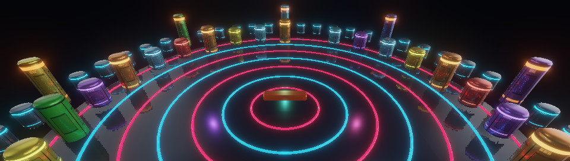

# Introduction

This chapter introduces the features available for building 3D applications with `webg` and explains how to read the book for different goals.
In webg 3.0, PBR (physically based rendering), procedural textures and materials, GPU physics, and compute-based effects share the same application structure as scenes, cameras, assets, input, UI, and diagnostics.
By the end of this chapter, you should understand how these features fit together and know which chapters to read for the application you want to build.

When starting an application, use the [Guide to Getting Started and Runnable Examples](../book/examples/guide.html) (`book/examples/guide.html`). This page helps you choose samples that match your goal. It lists a first example to run, code to read, an order for adding features, and points to check in the display and interaction. People and AI can follow the same guide to the same runnable examples. If an AI is reading the documentation, it can also use the Markdown version, [Guide to Getting Started and Runnable Examples](ExampleGuide.md).

To grow a PBR scene into a game with movement, selection, and particles, read `PBRSceneToGame.md` and `samples/fantasy/`.
The [supplementary browser guide](../book/examples/fantasy_guide.html) points to the functions to read and small experiments to try.

To add water-surface reflection, refraction, and caustics to PBR, start with Chapter 35 and `samples/water/index.html`.
For underwater lighting in a game, `samples/fantasy/` demonstrates how to apply these effects to a moving party and how to interact with the scene after switching them on and off.

To use `lib/webg.core.min.js`, start with “Load the Bundled Library” in
Chapter 2. Chapter 4 shows the import replacement for the same minimal example.
[Appendix C](Appendix_C_Bundle.md) covers sample conversion. The class and method
descriptions in this book apply to both loading methods.

## How to read this chapter

### Prerequisites

The chapter is easier to follow if you know basic JavaScript syntax and how to run an HTML page in a browser.

### What to read first

Read the overview of `webg`, the standard application structure, and the guide by development goal. First understand where the features fit; then move on to API (application programming interface) details.

### What to read when you need it

Refer to the corresponding part when you need PBR, compute shaders, the physics engine, or low-level APIs.

### What you will learn

You will understand the scope of `webg` and be able to choose where to begin: standard rendering, PBR, physics, or GPU (graphics processing unit) computation.

## Overview of webg

`webg` version 3.0 is a JavaScript library for building 3D applications in compatible browsers. Here, API means the public methods and classes an application uses to call library features.
You can start with minimal rendering and add input, audio, models, animation, UI, physics, and screen effects step by step.

In this book, a “procedural texture” is an image generated by computation rather than loaded from a file. The generator produces color, height, and normal maps. A “procedural material” combines those maps with PBR parameters and texture coordinates scaled to the object's physical dimensions. Texture coordinates, often called UVs, identify positions within a two-dimensional texture image.
We use “compute physics engine” for the version that runs physics calculations on the GPU.
The CPU (central processing unit) and compute versions share the basic meanings of bodies, colliders, and physics settings; they differ in where calculations run and how rendering state is transferred.

webg 3.0 includes PBR based on metallic and roughness values, IBL (image-based lighting) with HDR (high dynamic range) environment maps, PBR and transmission for transparent objects, procedural materials, and the compute physics engine.
For opaque objects, surface data is written to a G-buffer (screen-space surface information passed to lighting calculations) before lighting is evaluated. Translucent objects are composited in a separate forward-rendering pass to preserve their depth ordering.
Parts III and IV introduce terms such as G-buffer, IBL, GGX (a surface-normal distribution used to model specular reflection), SSR (screen-space reflections), and transmission, and explain how these rendering stages work together.

The standard forward-rendering path remains important as well.
In forward rendering, a vertex shader transforms the geometry's vertices, and a fragment shader evaluates materials and lighting while drawing the scene directly to a color target.
This evaluates lighting at a different stage from deferred rendering, which first accumulates surface data in a G-buffer.
Choose the path based on whether materials and screen-space effects need to evaluate shared data, rather than on the number of features alone.

`webg` uses JavaScript, the WebGPU API, and the Web Audio API, and supports both desktop and smartphone applications. WebGPU execution requires an available GPU (graphics processing unit).
Features include input, audio, GLB animation (the binary form of glTF, a 3D model interchange format), particles, DoF (depth of field), fog, and physics.
PBR G-buffers, SSAO (screen-space ambient occlusion), shadow maps, SSR, toon shading, edge detection, and procedural textures built with compute shaders also connect to the same design.
Check WebGPU availability using the secure-context status, `navigator.gpu`, required GPU features, and the OS/GPU combination, in addition to the browser name.

No external libraries or complex build tools are required; the implementation and detailed explanations are included in `webg` itself.
This makes it suitable both for learning and for efficient application development with AI assistance.
You can also choose the level of abstraction that fits the task, from low-level programming such as coordinate calculations and GPU control to the higher-level `WebgApp` class, which abstracts many of those features.

`webg` supports both low- and high-level development.
When you start, focus on what the library can do, which chapters match your goal, and how to use the samples and `unittest` applications to check behavior. You can look up individual methods as you need them.

This chapter describes the overall capabilities and design of `webg`, the project layout, and a learning roadmap.

## What webg offers and how it is designed

After rendering is in place, a growing WebGPU application needs supporting features such as a scene graph, asset management, camera controls, input handling, diagnostics, and audio playback.
This is especially important when working with an AI: if it is unclear where a feature is defined or what to read to understand current behavior, investigation and revision become much less efficient.

`webg` addresses this by clearly separating the layers of a 3D application within the repository and pairing sample code with explanatory documentation.
The approach emphasizes understanding and assembling the parts a project needs, rather than treating a large engine as a black box.

Compute shaders enable simulations that update state on the GPU, post-processing based on screen-space geometry, preintegration of HDR environments, and procedural materials that generate Color, Height, and Normal data.
CPU reference processing, GPU generation, and readback for comparison are separate operations, so regular rendering can follow a path that avoids unnecessary synchronization.

Input from smartphones, PCs, and pens is collected through Pointer Events.
Touch, mouse, and pen input share the same processing path.
This makes it possible to test gestures such as taps, double taps, long presses, and flicks under the same conditions in a desktop browser.
It also makes cross-device direct manipulation easier to design for 3D viewers and editing tools.

`webg` is especially useful when you want to:

* Build a 3D application while understanding its internal structure and using WebGPU
* Learn efficiently by moving between working samples and documentation
* Keep diagnostics, HUDs (heads-up displays), touch input, and audio processing in one repository
* Tune gesture-based smartphone UI while checking its behavior in a desktop browser
* Implement advanced visual effects or GPU simulations with compute shaders
* Ask an AI coding assistant to help develop a 3D application

## How this book is organized

One strength of `webg` is that the repository covers the path from 3D fundamentals to application structure. The book first helps you get started, then points to feature chapters as you expand an application, and finally explains the internals for readers who want to understand how the system works.

### Part I: Foundations for getting started

Chapter 02 explains how to set up WebGPU. Chapter 03 covers positions, rotations, parent and child coordinate systems, camera views, surface normals, and UVs. Chapters 04–07 use `WebgApp` to display a cube, control a camera, update a scene, and configure materials. Together, these chapters establish the basic application structure. Chapter 41 explains the detailed rules for matrix and quaternion calculations.

### Part II: Assembling an application

This part covers external models, scenes, animation, user interfaces (UI), input, collision detection, audio, and diagnostics. Chapters 08–11 load assets and prepare models and animations for display. Chapters 12–17 add interaction, presentation, audio, and diagnostics to develop a usable application.

### Part III: Understanding shaders and compute processing

This part examines the rendering used in Parts I and II from the shader perspective. Chapters 18–19 introduce WGSL (WebGPU Shading Language) and custom shaders. Chapters 20–22 cover the execution model of compute shaders, storage resources, workgroups, synchronization, and performance. You can also begin with the chapter for a feature you need.

### Part IV: Expanding visual expression

This part covers bloom, depth of field, transparency, particles, physics, procedural textures, PBR, and advanced screen effects. Chapters 23–26 add screen effects and lightweight effects. Chapters 27–28 use `PhysicsSpace` to work with the CPU and compute versions of the physics engine. Chapters 29–33 cover physical-scale procedural materials, environment lighting, and PBR integration. Chapters 34–36 combine individual compute passes to create advanced effects.

### Part V: Understanding the internals

This part covers low-level APIs, `Shape`, procedural geometry, skinning, shared rendering rules, and the detailed physics design. Chapters 37–40 explain how geometry and animation are assembled beneath the public API. Chapter 41 organizes the rules shared by rendering processes, including coordinates, depth, G-buffers, HDR, and tone mapping. Chapter 42 details collision detection, the contact solver, fixed steps, and stabilization in the physics engine.

You can also start from the current API documentation when migrating code built with an earlier version of webg.
Version-specific changes are summarized in `Appendix B: Migrating from webg 1.0/2.0 to 3.0`. The regular chapters describe the current depth, coordinates, PBR materials, IBL, procedural textures, camera frames, and rendering passes.

Appendix A explains how to read the project and request help from an AI coding assistant when building a webg application. For the complete API, consult `Appendix D: API List`, distributed with the release as a separate reference.

## Project layout

When exploring `webg`, begin by understanding the file layout and the role of each directory.

* `webg/` (core library): The library implementation, including `Screen`, `Space`, `Node`, `Shape`, and `WebgApp`.
* `samples/` (learning samples): Samples for checking features and demonstrating applications. Each includes JavaScript implementation and runnable HTML, along with `README.md`, `README.en.md`, and an explanation page. Samples using SceneYAML or ModelYAML also include definition files; `samples/index.html` is the catalog.
* `unittest/` (unit tests): Test applications that isolate and check individual features. They are useful for narrowing down problems and checking behavior at a minimal scale.
* `book/examples/` (book code examples): Runnable versions of code shown in this book. `index.html` lists the examples, and `guide.html` connects them with `samples/` by development goal.

## What you can build with webg

`webg` provides a comprehensive foundation for building 3D applications on WebGPU.

* Rendering foundation: `Screen`, `Shader`, `Shape`, `Space`, `Node`, `RenderTarget`
* Application entry points: `WebgApp`, `WebgSceneApp` for launching applications from SceneYAML
* Assets and loaders: `DocumentAsset`, `ModelAsset`, `ModelLoader`, `ModelBuilder`, `SceneAsset`, `SceneDefinition` for retaining SceneYAML and ModelYAML values, source text, and comments while building scenes and models
* Animation: `Animation`, `Action`, `AnimationState`, `Skeleton`
* Cameras and input: `EyeRig`, `Touch`, `InputController`
* UI and diagnostics: `Message`, `OverlayPanel`, `Diagnostics`, `DebugDock`, `DebugProbe`
* Audio: `ToneSynth`, `AudioSynth`, `GameAudioSynth`
* Post-processing: `FullscreenPass`, `BloomPass`, `DofPass`, `VignettePass`, and others
* Compute-shader effects: `GeometryBufferPass`, `SsaoPass`, `ShadowMapPass`, `SpotShadowMapPass`, `ComputeShadowPass`, `ComputeSpotShadowPass`, `ComputeSsrPass`, `TransparencyPass`, `ComputeToonPass`, `ComputeDofPass`, `ComputeBloomPass`, `ComputeEdgePass`, `ComputeEffectPipeline`
* PBR and environment lighting: `DeferredLightingPass`, `PbrForwardShader`, `PbrEnvironment`, `PbrEnvironmentCompute`, `PbrEnvironmentCache`
* Procedural materials: `ProceduralTileSpec`, `ComputeProceduralTile`, `ProceduralMaterials`
* Physics: CPU-based `PhysicsNode`, `PhysicsSpace`, and `Collider`; compute-based `ComputePhysicsSpace`; and `ScenePhysics` for applications

## Building with an AI coding assistant

This book and the `webg` repository are designed with AI coding assistants (coding agents) in mind as readers.
They aim to be readable by people and easy for AI to analyze.

To use a coding agent, load the `webg` repository as its project folder.
Then ask it to read `book.en/ExampleGuide.md` and `book.en/Appendix_A_ForAI.md`, choose an existing sample that matches your goal, and create the requested application under a folder such as `my_webg`.
Identifying the primary sources and destination helps the AI build the application efficiently.

## How to investigate problems

When developing a 3D application, it is useful to visualize and trace why a result occurred, rather than relying only on console output.
In `webg`, HUDs and panels can display information, and diagnostic reports and probes can be generated as needed.
Later chapters explain `Diagnostics` and `DebugDock`, which follow this approach of visual debugging.

## Summary

The key idea in this chapter is to view webg 3.0 as a framework for learning systematically: from low-level WebGPU rendering and the higher-level `WebgApp` structure to PBR materials, lights, HDR environments, procedural textures, and spatial effects using compute shaders.

Start with Chapter 02 to prepare your environment, Chapter 03 to learn 3D fundamentals, and Chapter 04 to render your first scene. Continue to Part II as you add application features, and explore Parts III and V when you want to understand rendering and GPU computation.
I hope this book will serve as a map for developing 3D applications with WebGPU.
