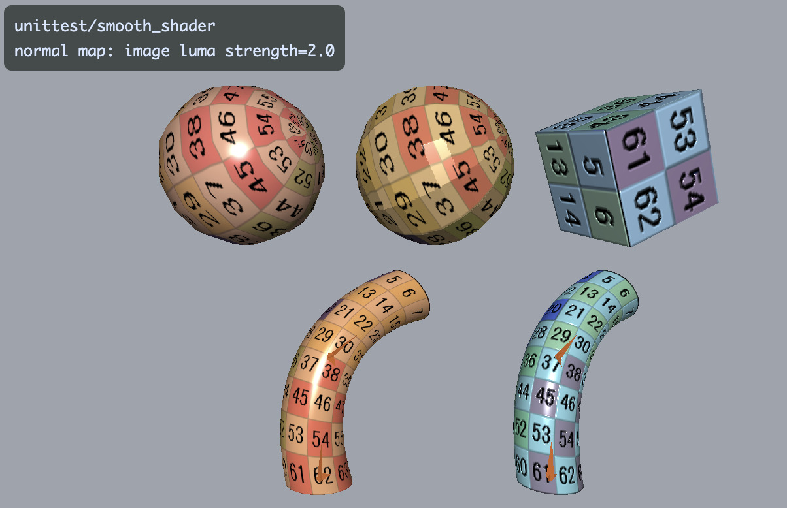
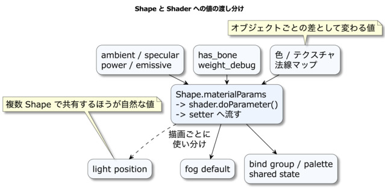

# Shaders and Materials

This chapter explains the difference between a shader, which determines how geometry is drawn, and a material, which describes the color and surface appearance of each shape.
Using the standard `SmoothShader`, configure color, gloss, textures, normal maps, and skinning for each `Shape`.
The chapter also explains where to set per-shape values and scene-wide shared values such as lights.

## How to read this chapter

### Prerequisites

The chapter is easier to follow if you know normals, UVs (two-dimensional coordinates on a texture image), and coordinate transforms from Chapter 03, and `Shape` rendering from Chapter 04.

### What to read first

Start with creating `SmoothShader`, base color, gloss, roughness, emission, and setting a material on a `Shape`.

### What to read when you need it

Refer to multiple materials, parameter storage, wireframes, and skinning when your application needs them.

### What you will learn

You will be able to assign materials to shapes and decide whether a value belongs on the `Shape` or the `Shader`.

## Set materials with SmoothShader

A shader calculates vertex positions and pixel colors; a material specifies the per-`Shape` appearance, including color, gloss, textures, and normals.
For a typical 3D object, start with `SmoothShader` and `shape.setMaterial("smooth-shader", ...)`, then set the required appearance through material parameters.

For a regular `Shape`, first choose `SmoothShader` and `shape.setMaterial("smooth-shader", ...)`.
Set shared values, such as lights and default fog settings, on the shader instance through its setters. `Shape.shaderParameter()` supplies per-shape overrides for low-level or custom parameters. Consider a custom shader when existing material parameters cannot express the effect you need.

This chapter provides criteria for choosing a shader and deciding which values to transfer, and when.

The standard starting point in `webg` is `webg/SmoothShader.js`.
This general-purpose shader covers most rendering needs with a single class, from static meshes to normal-mapped and skinned meshes.



*SmoothShader supports textures, normal maps, skinning, fog, and flat shading.*

Choose a shader for the task. `SmoothShader` is the practical standard path; the `Phong` classes provide a simpler setup for learning the basics of shading calculations.
For practical application development, use `SmoothShader` by default and use `Phong` variants to study the implementation and fundamentals.

Although `SmoothShader` integrates many features, it is optimized to keep non-skinned rendering efficient.
Static meshes, normal maps, and skinning use the same interface, while the bone-matrix palette is separated into its own WebGPU bind group, with an independent update schedule.
This preserves a simple interface while transferring large data to the GPU (graphics processing unit) only when needed.

Chapter 18, “Reading WGSL,” explains WebGPU Shading Language (WGSL). Chapter 19, “Implementing Shaders,” explains the CPU-side implementation of shader classes.

## The basic concept of SmoothShader

For a typical 3D object, first consider `SmoothShader`.
Static meshes, normal maps, and skinning all use the same entry point.

```js
shape.setMaterial("smooth-shader", {
  has_bone: 0,
  use_texture: 0,
  color: [0.25, 0.62, 1.0, 1.0],
  ambient: 0.26,
  specular: 0.86,
  roughness: 0.32,
  metallic: 0.0,
  power: 44.0,
  emissive: 0.0,
  alpha: 1.0
});
```

Flags such as `has_bone`, `use_texture`, `use_normal_map`, and `flat_shading` switch rendering behavior while keeping the same shader class.
For example, use the `flat_shading` parameter in `SmoothShader` for face-level shading instead of switching to a separate class.

By contrast, `Phong` and its variants `NormPhong`, `BonePhong`, and `BoneNormPhong` are separate classes for separate features.
They are useful when you want to trace how one feature is implemented on its own.

### How material settings work

It is important to understand how `Shape.setMaterial()` behaves.
It stores rendering parameters on the `Shape` and passes them to the shader just before drawing.



*Values passed to `setMaterial()` are stored on the `Shape` and sent to shader setters just before drawing. Shared values such as lights and fog are held by the shader instance for efficient management.*

In practice, `Shape` retains a parameter dictionary and passes its values to shader setters through `shader.doParameter()` just before drawing.
Understanding this flow clarifies where a setting is stored and when it reaches the GPU.

When calling `setMaterial("smooth-shader", {...})`, identify which values vary by object and which flags or coefficients in `SmoothShader` represent them.

Color, textures, normal maps, specular coefficients, `has_bone`, and `weight_debug` are managed by the `Shape`.
Values shared by multiple shapes using the same shader, such as light positions and default fog values, are set on the shader instance.

The fourth value in `color: [r, g, b, textureMix]` controls blending between the base-color and textured branches of `SmoothShader`. At `textureMix: 1`, the texture multiplies the RGB base color, so the base color also acts as a tint. Rendering opacity is set independently with `alpha`.
For example, `color: [1, 0, 0, 1]` and `alpha: 0.5` apply a red tint to the texture and render at 50% opacity. A fourth component of `0.5` mixes the two branches equally; it sets texture mixing rather than 50% opacity.

The rendering path first classifies materials using `alpha_mode` as `OPAQUE`, `MASK`, or `BLEND`.
For a material without `alpha_mode`, triangles are automatically classified as `OPAQUE` when `alpha === 1.0` and `BLEND` when it is less than 1.0.

In a scene using only standard `WebgApp`, translucent triangles are automatically sorted back-to-front and composited with alpha blending.
With `ComputeEffectPipeline`, transparent surfaces are kept out of the opaque G-buffer and composited after Deferred Lighting and SSR (screen-space reflections).
Lower `roughness` keeps the background sharper and the specular reflection tighter. Higher `roughness` blurs the background more and spreads and weakens the specular reflection.
When transparent surfaces are present, `ComputeEffectPipeline` connects a dedicated transparent Render Pass later in the pipeline.
Chapters 23–25 explain when to use a standalone `FrostedGlassPass` or an integrated pipeline.

### Switch rendering conditions flexibly

`SmoothShader` handles these four main rendering configurations through one interface:

* **Static mesh + texture:** `has_bone: 0`, `use_texture: 1`, `use_normal_map: 0`
* **Static mesh + texture + normal map:** `has_bone: 0`, `use_texture: 1`, `use_normal_map: 1`
* **Skinned mesh + texture:** `has_bone: 1`, `use_texture: 1`, `use_normal_map: 0`
* **Skinned mesh + texture + normal map:** `has_bone: 1`, `use_texture: 1`, `use_normal_map: 1`

Set `weight_debug: 1` to inspect the color distribution of skinning weights, or set `backface_debug` to inspect back faces.
The design makes the required conditions explicit on one shader rather than switching to a separate shader for each combination.

## Practical use of SmoothShader

Use `SmoothShader` when you want to handle a static mesh, texture, normal map, or skinning through a single material interface.
With the low-level API, set shared lights and fog yourself. With `WebgApp`, standard shader setup is provided so you can focus on material values specific to each `Shape`.

### Implementation with the low-level API

When directly using the low-level `Screen` and `Shape` APIs, create a `SmoothShader` instance and assign it to `Shape.prototype.shader`.
This is also where you set shared values such as lights and fog.

```js
import SmoothShader from "./webg/SmoothShader.js";
import Shape from "./webg/Shape.js";

const shader = new SmoothShader(gpu);
await shader.init();
Shape.prototype.shader = shader;

shader.setLightPosition([40.0, 90.0, 150.0, 1.0]);
shader.setDefaultParam("fog_color", [0.82, 0.90, 1.0, 1.0]);
shader.setDefaultParam("fog_near", 28.0);
shader.setDefaultParam("fog_far", 88.0);
shader.setDefaultParam("fog_mode", 1.0);
```

### Implementation with WebgApp

`WebgApp` uses `SmoothShader` as its standard shader, so after `app.init()` you can usually set up a shape with `Shape.setMaterial("smooth-shader", ...)`.
For face-level shading, first pass `flat_shading: 1` to the `Shape` instead of replacing the shader.
Use `shape.setShader(otherShader)` when switching to a learning-oriented `Phong` variant or a custom shader.

```js
const shape = new Shape(app.getGPU());
shape.applyPrimitiveAsset(asset);
shape.endShape();
shape.setShader(app.shader);
shape.setMaterial("smooth-shader", {
  has_bone: 0,
  use_texture: 0,
  color: [0.24, 0.64, 1.0, 1.0],
  ambient: 0.26,
  specular: 0.86,
  power: 46.0,
  emissive: 0.0
});
```

### Choose a material-setting API

Use `setMaterial()` to set the initial material, and `updateMaterial()` to change part of an existing material at runtime.
`shaderParameter()` is the low-level entry point for passing a custom shader parameter that is not covered by the material API.

`setMaterial()` sets material slot 0; `updateMaterial()` updates slot 0 as well.
Use `setMaterialAt()` and `updateMaterialAt()` for additional material slots.
Each slot's values are passed to the shader when drawing. Update slots from 1 onward with `setMaterialAt()` and `updateMaterialAt()`.

```js
shape.setMaterial("smooth-shader", {
  has_bone: 0,
  use_texture: 1,
  texture: colorTexture,
  use_normal_map: 1,
  normal_texture: normalTexture,
  normal_strength: 1.0,
  color: [1.0, 1.0, 1.0, 1.0],
  ambient: 0.24,
  specular: 0.92,
  power: 56.0,
  emissive: 0.0
});

shape.updateMaterial({
  normal_strength: 1.4,
  emissive: 0.18
});
```

## Use multiple materials on one Shape

The current `Shape` holds a sequential array of material slots starting at 0.
The existing `setMaterial()`, `getMaterial()`, and `updateMaterial()` methods operate on slot 0, so code using a single material needs no change.
The default material number when adding a triangle is also 0.

```js
shape.setMaterial("smooth-shader", {
  color: [0.90, 0.32, 0.10, 1.0],
  alpha: 1.0,
  specular: 0.55,
  roughness: 0.36,
  metallic: 0.0,
  emissive: 0.0,
  power: 48
});

shape.setMaterialAt(1, "smooth-shader", {
  color: [0.12, 0.68, 1.0, 1.0],
  alpha: 0.42,
  specular: 1.0,
  roughness: 0.12,
  metallic: 0.0,
  emissive: 0.0,
  power: 128
});

shape.addTriangle(a, b, c, 0);
shape.addTriangle(a, c, d, 1);
```

Material numbers belong to triangles, not vertices.
Adjacent triangles can therefore share vertices while using different materials.
Register slots consecutively; a skipped slot, an unknown material slot, or an `alpha` outside the range 0–1 raises an exception.
Change a triangle's material number with `setTriangleMaterial()` before `endShape()`.

Call `getMaterialCount()` to get the number of registered material slots.
Call `getMaterialAt(index)` to get a slot's material ID and parameters.
The existing `getMaterial()` works as `getMaterialAt(0)` for slot 0.

```js
const count = shape.getMaterialCount();
const glassMaterial = shape.getMaterialAt(1);

console.log(count);
console.log(glassMaterial.id);
console.log(glassMaterial.params.alpha);
```

The material object and `params` object returned by `getMaterialAt(index)` are shallow copies.
Properties such as `params.alpha` are available for inspection. To change the live material, pass updated values to `updateMaterialAt(index, params)`.
Use `updateMaterialAt(index, params)` for runtime changes, including array-valued parameters.

```js
shape.updateMaterialAt(1, {
  alpha: 0.28,
  roughness: 0.24
});

const updated = shape.getMaterialAt(1);
console.log(updated.params.alpha); // 0.28
```

Passing an unknown slot to `getMaterialAt()` or `updateMaterialAt()` raises an exception; it does not redirect the operation to slot 0.
Register extra slots consecutively from 0 and define every slot used by a triangle before `endShape()`.

When `Shape.createInstance()` shares geometry GPU resources, material slots updated through the API remain independent per instance.
Calling `updateMaterialAt()` on one instance updates only that instance's material; the source `Shape` and other instances retain their values.

## Where parameters belong

Use this guide to decide which values belong on a `Shape` and which belong on a shader instance.

### Values on Shape (per object)

These values naturally differ by object and are managed by the `Shape`:

| Parameter | Meaning | Typical values |
| :--- | :--- | :--- |
| `color` | Base color | `[1, 1, 1, 1]` |
| `use_texture` | Use a color texture | `0` or `1` |
| `texture` | Color texture | `Texture instance` |
| `use_normal_map` | Use a normal map | `0` or `1` |
| `normal_texture` | Normal map | `Texture instance` |
| `normal_strength` | Blend factor for original normals and normal map | `0.8`–`2.0` |
| `ambient` | Ambient light contribution for dark areas | `0.2`–`0.4` |
| `specular` | Strength of specular highlights | `0.3`–`1.0` |
| `roughness` | Surface roughness; on transparent objects it affects background blur and specular width | `0.04`–`1.0` |
| `metallic` | Metallic value used by deferred lighting | `0.0`–`1.0` |
| `power` | Exponent applied to the dot product of reflection direction and view direction in the Phong model | `16`–`128` |
| `emissive` | Self-illumination strength | `0.0`–`1.0` |
| `alpha` | Opacity; without `alpha_mode`, values below 1.0 are classified as `BLEND` | `0.0`–`1.0` |
| `has_bone` | Use a bone palette for skinning | `0` or `1` |
| `weight_debug` | Visualize the weight distribution | `0` or `1` |
| `backface_debug` | Debug back-face rendering | `0` or `1` |
| `backface_color` | Color for back-face debug view | `[1, 0, 1, 1]` |

### Shared values on a shader instance

Set these values on the shader instance because they are shared by every `Shape` using that shader:

| Parameter | Setter |
| :--- | :--- |
| `light` | `shader.setLightPosition(...)` |
| `fog_color` | `shader.setDefaultParam("fog_color", ...)` |
| `fog_near` | `shader.setDefaultParam("fog_near", ...)` |
| `fog_far` | `shader.setDefaultParam("fog_far", ...)` |
| `fog_density` | `shader.setDefaultParam("fog_density", ...)` |
| `fog_mode` | `shader.setDefaultParam("fog_mode", ...)` |

### Four common configurations

Here are four representative setups:

1. Static mesh with one color

```js
shape.setMaterial("smooth-shader", {
  has_bone: 0,
  use_texture: 0,
  use_normal_map: 0,
  color: [0.25, 0.62, 1.0, 1.0],
  ambient: 0.26,
  specular: 0.86,
  power: 44.0,
  emissive: 0.0
});
```

2. Static mesh with a texture

```js
shape.setMaterial("smooth-shader", {
  has_bone: 0,
  use_texture: 1,
  texture: colorTexture,
  use_normal_map: 0,
  color: [1.0, 1.0, 1.0, 1.0],
  ambient: 0.24,
  specular: 0.82,
  power: 40.0,
  emissive: 0.0
});
```

3. Static mesh with texture and normal map

```js
shape.setMaterial("smooth-shader", {
  has_bone: 0,
  use_texture: 1,
  texture: colorTexture,
  use_normal_map: 1,
  normal_texture: normalTexture,
  normal_strength: 1.0,
  color: [1.0, 1.0, 1.0, 1.0],
  ambient: 0.24,
  specular: 0.92,
  power: 56.0,
  emissive: 0.0
});
```

4. Skinned mesh with a normal map

```js
shape.setMaterial("smooth-shader", {
  has_bone: 1,
  use_texture: 1,
  texture: colorTexture,
  use_normal_map: 1,
  normal_texture: normalTexture,
  normal_strength: 1.0,
  color: [1.0, 1.0, 1.0, 1.0],
  ambient: 0.35,
  specular: 0.80,
  power: 40.0,
  emissive: 0.0,
  weight_debug: 0
});
```

The main differences among these examples are `has_bone`, `use_texture`, `use_normal_map`, and the texture assignments.
That is the convenience of the `SmoothShader` design.

## SmoothShader internals and WebGPU benefits

Although `SmoothShader` is one shader, it separates data with three distinct roles into three bind groups to optimize drawing.

* `group(0)` updates projection, model-view and normal matrices, lights, material coefficients, flags, and fog for each draw.
* `group(1)` updates the base texture, normal texture, and sampler for each combination of textures.
* `group(2)` updates the bone palette (bone matrices) for each skeleton.

### How performance is optimized

Separating WebGPU bind groups avoids unnecessary data transfers when drawing static meshes.

The per-draw uniform data in `group(0)` contains 84 floating-point values, or 336 bytes. The dynamic-offset stride is 512 bytes, a multiple of 256.
A bone palette in `group(2)` for up to 320 bones takes `320 × 12 × 4 = 15,360` bytes.

If these were mixed in the same uniform buffer, even a simple cube with `has_bone: 0` would require transferring more than 15 KB to the GPU for each draw, or retaining an oversized buffer throughout processing.

`SmoothShader` separates the paths:

* **Static mesh:** draw with `has_bone: 0`; `Shape.draw()` calls `setHasBone(0)`. `group(2)` uses a shared empty bone bind group, avoiding a large `writeBuffer` operation.
* **Skinned mesh:** call `skeleton.updateMatrixPalette()` and write the palette to a skeleton-specific buffer through `shader.setMatrixPalette(...)`. A `WeakMap` caches the bone bind group for reuse by each skeleton.

The presence of skinning support does not make every draw expensive; only skinned draws transfer the data they need.
Separating bind groups by purpose keeps the API simple while reducing CPU-to-GPU transfer cost, one of the benefits of WebGPU in `webg`.

### Wireframe and skinning

`Shape.setWireframe(true)` switches regular surface drawing to `line-list` drawing with the `Wireframe` shader.
`Wireframe` specializes in edge display and draws lines without textures, normal maps, or lighting.
Its vertex inputs and bone palette are designed to remain compatible with `SmoothShader`.

`Wireframe` receives positions, normals, UVs, bone indices, and weights. Line drawing uses positions and bone data. Accepting the same vertex-buffer layout as `SmoothShader`, including normals and UVs, lets `Shape.draw()` switch between regular and wireframe rendering in the same flow.
For a skinned mesh, the skeleton-specific bone palette is passed in `group(2)`, and the `Wireframe` vertex shader deforms positions before drawing lines using the same approach as `SmoothShader`.

`Wireframe` does not calculate textures or lighting, but it uses the same fog parameters as `SmoothShader`.
`fog_color`, `fog_near`, `fog_far`, `fog_density`, `fog_mode`, and `use_fog` have the same meanings; the line color blends toward the fog color according to camera-space distance.
When switching from a regular shader with `Shape.setWireframe(true)`, its default fog settings also apply to wireframe rendering.
This keeps wireframe geometry integrated with the distance fog in a scene.

Use `shape.setWireframe(true)` for both static and bone-deformed meshes.
To show a quadrilateral without its diagonal, retain `polygonLoops` by creating it with `Shape.addPolygon([a, b, c, d])` or `addPlane()`.
`Wireframe` uses the face loop to draw its outer edges, omitting the diagonal introduced by triangulation.
Triangle data created directly with `addTriangle()` is displayed as the input triangle mesh.

## Other shaders

The main shader classes provided by `webg` are:

| Class | Purpose | Textures / normal maps / skinning | Identifier or notes |
| --- | --- | --- | --- |
| `Shader` | Base class for derived shaders | — | — |
| `SmoothShader` | Standard 3D rendering | Supported | `"smooth-shader"` |
| `Phong` | Basic shading | Textures supported; normal maps and skinning unsupported | `"phong"` |
| `NormPhong` | Phong with normal maps | Textures and normal maps supported; skinning unsupported | `"norm-phong"` |
| `BonePhong` | Phong with skinning | Textures and skinning supported; normal maps unsupported | `"bone-phong"` |
| `BoneNormPhong` | Skinning and normal maps | Textures, normal maps, and skinning supported | `"bone-norm-phong"` |
| `Background` | Background image and rectangle | Texture supported | `new Background(gpu)` |
| `Font` | Text rendering | Texture supported | Used by `Text` and `Message` |
| `BillboardShader` | Camera-facing billboard rendering | Texture supported | Used by `Billboard` |
| `Wireframe` | Wireframe display | Skinning supported; textures and normal maps unused | `shape.setWireframe()` |
| `FullscreenPass` | Post-processing | Texture supported | — |

## Implementation notes and solutions

Here are common implementation issues and ways to investigate them:

* **Texture does not appear:** Check `use_texture: 1` and confirm that the correct `texture` instance is assigned.
* **Normal map adds no surface detail:** Check `use_normal_map: 1`, confirm that `normal_texture` is set correctly, and make sure `normal_strength` is not extremely small.
* **Skinned model does not bend:** Set `has_bone: 1`, associate the skeleton through `Shape.setSkeleton()`, and ensure `updateMatrixPalette()` produces the palette during drawing.
* **Debug rendering looks different:** `weight_debug` disables lighting and prioritizes weight colors. `backface_debug` sets `cullMode: "none"` for easier inspection, so it differs from regular rendering. Use these as dedicated debug views.

## Summary

For regular 3D rendering, `SmoothShader` is the standard starting point.
It handles static meshes, skinning, and normal maps through one interface, with flags such as `has_bone` and `use_normal_map` to select the required features.
This avoids choosing a separate shader for each scene configuration.

The simpler `Phong` family is useful for learning the fundamentals.
`SmoothShader` maintains performance despite its range of features by using WebGPU bind groups to separate data with different update rates, such as lightweight uniforms and large bone palettes.

Understanding this structure makes it easier to read samples and tests.
Refer to Chapter 18 when you need to understand WGSL and the shader's internal implementation. If you are assembling a regular application, continue to Chapter 08 for model assets.
