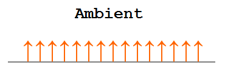
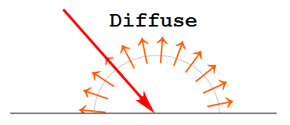
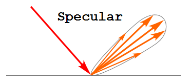
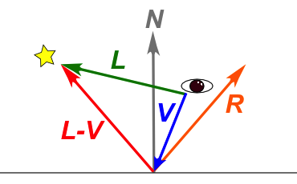

# Implementing Shaders

This chapter implements a custom shader as a complete feature: WGSL, a JavaScript class, uniform layout, bind groups, a render pipeline, and parameters received from `Shape`. Standard shader structures and progressive examples show why the CPU and GPU sides must use matching data layouts and formats. The goal is to identify all the parts that need to change when adding a material or rendering method.

## How to read this chapter

### Prerequisites

This chapter is easier to follow if you know WGSL from Chapter 18 and how to use `SmoothShader` from Chapter 7.

### What to read first

Start with the shared structure in `Shader.js`, `SmoothShader`, and the Phong lighting calculation.

### What to read when you need it

Refer to `NormPhong`, `BonePhong`, `BoneNormPhong`, `Wireframe`, and 2D or overlay shaders when extending those features.

### What you will learn

You will be able to read existing shader inputs, outputs, and parameter handling and identify where to extend them.

## Understand the Shader Classes as a Whole

Implement a shader as a coordinated set of parts: WGSL, the JavaScript class, uniform buffer, bind groups, pipeline, and parameters received from `Shape`. Building on Chapter 18, this chapter emphasizes what the CPU prepares for the GPU. It follows shared handling in `Shader.js`, incremental differences in the Phong family, and specialized shaders such as `Background.js` and `Wireframe.js`.

Read the shader examples incrementally: start with `book/examples/Phong.js`, then compare `NormPhong.js`, `BonePhong.js`, and `BoneNormPhong.js` in the same directory. Each adds a specific feature to the baseline. The runnable pages `book/examples/19_01.html` through `book/examples/19_04.html` let you compare the results without having to reproduce the complete source listings.

`Shader.js` does more than store WGSL source. Shader classes in `webg` manage pipeline creation, uniform buffers, bind-group creation, default textures, parameter application, and updates during drawing. When analyzing one, first identify the state the class holds, then follow the WGSL functions.

An important flow starts at `Shape.setMaterial()`: its parameters reach each shader's `doParameter()`, which dispatches them to setter methods and restores defaults for settings no longer specified. Understanding this flow reveals the controls a shader exposes to application code.

The four `Phong` family members make useful comparisons: `Phong` for static meshes, `NormPhong` for normal maps, `BonePhong` for skinning, and `BoneNormPhong` for both features. Start from the minimal `Phong` implementation and compare the additions step by step.

## Shared Structure in `Shader.js`

Many `webg` shaders share a common flow: receive projection and model-view matrices, update uniform buffers, group textures and samplers into bind groups, and apply them to the GPU immediately before drawing. `Shader.js` provides this shared behavior as a base class, avoiding duplicated implementations that could diverge as features and debug options are added.

Derived classes define their WGSL, uniform layout, initial parameters, bind-group layout, and setter methods that apply their own parameters.

Read `Shader.js` in this order:

1. Identify the fields initialized by the constructor.
2. Check the GPU resources created by `createResources()`.
3. Follow how `getBindGroup()` connects those resources.
4. Trace which offsets `updateUniforms()` and setters write.
5. See how derived classes extend `doParameter()` to handle their parameters.

This sequence reveals which behavior is shared and which belongs to a specific shader.

Pay particular attention to the `default` and `change` parameter tables. `default` stores the shader's initial values; `change` stores values currently overridden through `Shape.shaderParameter()`. `doParameter(param)` sends specified keys to setters and restores a previous override to its default when the key is absent from the current parameters. Applications can therefore update only the values that need to change.

Adding a shader parameter requires more than editing WGSL. Add the initial value, setter, handling in `doParameter()`, and—where needed—the interface in `setDefaultParam()`. Keep examples and documentation aligned with the implementation. A complete change covers both the WGSL and CPU-side interface and a way to verify it.

## `SmoothShader` as the Standard Shader

Chapter 7 introduces `SmoothShader` as the standard shader most applications select. The Phong family is useful for learning how the shading code is structured, while `SmoothShader` handles a broader range of production materials. It integrates static meshes, textures, fog, skinning, weight visualization, normal mapping, flat shading, and back-face debugging.

`SmoothShader` connects the shading concepts in the four Phong examples to per-`Shape` material parameters. Set `shaderClass: SmoothShader` in the application and select paths through each shape's material: ordinary geometry uses `has_bone: 0`; a skinned mesh uses `has_bone: 1`; and a shape with a normal map sets `use_normal_map: 1` and `normal_texture`. The application can keep one shader class and enable features per shape.

### Color and Surface Controls

`color` is the material's base color, from glTF base color or manual configuration.

`multiplyColor` multiplies the combined base color and texture. It can tint instances of the same GLB while preserving their original material differences. For per-character variations, it usually preserves the original surface better than replacing `color`.

`addColor` is added after the base color and texture are combined. Use it for selection highlights, damage feedback, warnings, or bright accents that should retain the original color.

With a texture enabled and `color[3]` set to 1, the conceptual color sequence is:

```text
base = color * texture
adjusted = base * multiplyColor + addColor
lit = lighting(adjusted)
```

`use_texture` and `texture` select whether to use a base texture and which texture to sample.

`ambient`, `specular`, `power`, `roughness`, `metallic`, and `emissive` configure ambient light, specular reflection, the Phong specular exponent, surface roughness, metalness, and emissive appearance. `power` is the exponent applied to the dot product of the reflection and view vectors. In transparency rendering, `roughness` also affects highlight width: a lower value produces a sharper highlight and a higher value produces a wider, weaker one. `emissive` currently ranges from 0.0 to 1.0.

### Feature Toggles and Debugging

`has_bone` selects the skinning bone palette. Set it to `1` for a skinned mesh and keep it at `0` for a static mesh.

`weight_debug` colors vertices by their skinning weights. While enabled, weight visualization takes priority over material color and lighting.

`use_normal_map`, `normal_texture`, and `normal_strength` select the normal map, its texture, and its influence. Lower `normal_strength` moves the result toward the original vertex normal; higher values emphasize the mapped details.

`flat_shading` reconstructs a face normal from fragment derivatives instead of interpolated vertex normals. Use it for low-polygon appearance or to inspect face orientation. Smooth shading interpolates vertex normals across each triangle, making even low-polygon geometry look smooth. With `flat_shading: 1`, `dpdx` and `dpdy` reconstruct the normal of each triangle, revealing the orientation of its faces.

`backface_debug` and `backface_color` render back faces in a chosen color for checking face orientation and culling. They are useful when a model appears flipped or when inspecting a double-sided material.

`fog_color`, `fog_near`, `fog_far`, `fog_density`, and `fog_mode` set distance-based fog and falloff. Fog can establish depth and reduce visual detail in the distance to improve readability.

### Example: Use `flat_shading`

Use `SmoothShader` with `flat_shading` set to `1`; this feature does not require a separate `FlatShader.js`. The flag switches the normal calculation in the same fragment shader.

```js
shape.setMaterial("smooth-shader", {
  color: [0.85, 0.72, 0.48, 1.0],
  ambient: 0.28,
  specular: 0.35,
  power: 28.0,
  flat_shading: 1
});
```

The flag changes the normal calculation at draw time without modifying mesh vertices. Compare smooth shading and visible flat faces on the same geometry.

## Compare the Phong Shaders Incrementally

Comparing the four Phong shaders in stages makes their structure clear. `NormPhong` adds normal mapping to `Phong`; `BonePhong` adds skinning; `BoneNormPhong` combines both.

The Phong shading model approximates lighting by calculating three terms and adding them together: ambient, diffuse, and specular light.

### Ambient Light

Ambient light represents light scattered throughout the environment rather than arriving directly from a single source. It approximates the combined result of reflection and diffusion. Its influence is stronger on a cloudy day and much weaker in space. When an object appears bright regardless of ambient intensity, represent that appearance with `emissive` instead.



### Diffuse Light

Diffuse light is reflected in many directions from an illuminated surface. A surface facing the light receives the strongest illumination; a tilted surface receives less, in proportion to the component perpendicular to the surface.



### Specular Reflection

Specular reflection, or a highlight, is light reflected in a particular direction from a smooth surface. Its direction and intensity depend on the incident angle and surface. A smooth surface produces a narrow highlight, while a rougher surface spreads it over a broader area. Increasing `power` narrows the reflected area and sharpens the highlight.



### Lighting Calculation

Lighting and object color are determined at each screen pixel. Let the surface point be vector \(\mathbf{V}\) and the point light be vector \(\mathbf{L}\); the incident direction from the surface to the light is \(\mathbf{L} - \mathbf{V}\). When the view point is the origin in view space, the direction from the surface to the view point is \(-\mathbf{V}\).



When surface normal \(\mathbf{N}\) and incident direction \(\mathbf{L} - \mathbf{V}\) are normalized, their dot product \(\text{dot}(\mathbf{N}, \mathbf{L} - \mathbf{V})\) gives the diffuse intensity. Specular intensity depends on the angle \(\phi\) between view direction \(-\mathbf{V}\) and reflection vector \(\mathbf{R}\). Using \(\cos \phi\) produces a directional highlight; `power` controls how sharply it changes.

### Implementation in `Phong`

`Phong` is the baseline for all comparisons. Start by identifying the fields in its `Uniforms` structure, the setters called by `doParameter()`, and how `params0` / `params1` are used in WGSL.

Its parameters are packed into `vec4f` values for efficient transfer. For example, `params0` contains `ambient`, `specular`, `power`, and `emissive`, while `params1` contains `useTexture`, `backfaceDebug`, and related flags. Map each setter to its WGSL component: `setAmbientLight()` writes `params0.x`; `setSpecular()` writes `params0.y`.

`Phong` is a practical baseline for cubes, spheres, floors, and other basic objects. It includes lighting, textures, fog, emissive color, and specular highlights for static meshes. It transforms positions and normals with the model-view matrix, calculates diffuse and specular reflection, combines the base texture, and applies fog to produce the final color.

The example below shows how a user `main.js` at the project root can connect the shader. ES module paths are resolved relative to the JavaScript file containing the import. When running `book/examples/19_*.html`, use the paths in the JavaScript loaded by that HTML as the reference. Assume `gpu`, `asset`, and `texture` are already prepared.

```js
import Phong from "./book/examples/Phong.js";
import Shape from "./webg/Shape.js";

const shader = new Phong(gpu);
await shader.init();
Shape.prototype.shader = shader;

shader.setLightPosition([40.0, 90.0, 150.0, 1.0]);

const shape = new Shape(gpu);
shape.applyPrimitiveAsset(asset);
shape.endShape();

shape.setMaterial("phong", {
  color: [1.0, 0.9, 0.7, 1.0],
  ambient: 0.28,
  specular: 0.82,
  power: 34.0,
  use_texture: 1,
  texture
});
```

The shader holds light information shared by the scene; `shape.setMaterial()` supplies each object's surface settings. Keep shared setters such as `setProjectionMatrix()` and `setModelViewMatrix()` distinct from per-shape parameters.

The canonical `book/examples/Phong.js` listing shows `vsMain` and `fsMain`. Read the vertex stage as model-to-view position and normal transforms, then trace the fragment stage through texture, ambient/diffuse/specular lighting, and fog. Browser examples `19_01.html` through `19_04.html` run the implementations side by side.

## Extend `Phong` with `NormPhong`

`NormPhong` adds per-pixel normal-map detail without increasing polygon count. It reads the normal texture and reconstructs a TBN basis from fragment derivatives, as described in Chapter 18. Its parameters include `use_normal_map`, `normal_texture`, and `normal_strength`.

When `normal_texture` is omitted, the shader explicitly uses a flat default texture to represent a material without normal mapping. This is the standard state for that feature.

## Add Vertex Deformation with `BonePhong`

In `BonePhong`, focus on the vertex shader. Instead of passing the original vertex position directly onward, it deforms the vertex with a bone palette first.

Expressions such as `let i0 = i32(input.index.x) * 3;` reflect the optimized palette layout: each bone is stored as three `vec4` values rather than a standard 4×4 matrix. This explains the purpose of `BONE_VECTOR_COUNT` and the offset calculation.

Trace the shader in this order:

1. Check that the vertex input contains bone indices and weights.
2. Locate the bone palette in the uniforms.
3. Follow how up to four bone influences are combined.
4. Check how the transformed normal is handled.
5. Follow the condition and output color for `weight_debug`.

For each vertex, `BonePhong` uses `boneIndex` and `weight` to combine matrices from the palette and deform the geometry. Subsequent lighting is similar to `Phong`. Enable `weight_debug` to visualize the weight distribution in RGB and verify skinning.

Application code sets `has_bone: 1`, and the shape contains bone indices and weights. For a skinned mesh, `Shape.endShape()` creates the dedicated buffers expected by the `BonePhong` pipeline.

The canonical `book/examples/BonePhong.js` demonstrates the differences from `Phong`: bone index and weight attributes are added, the uniform structure stores a palette, and up to four bone matrices are blended per vertex before regular lighting. Read the WGSL in that JavaScript file alongside the executable example.

## Combine Features with `BoneNormPhong`

`BoneNormPhong` combines the features of `BonePhong` and `NormPhong`. Its vertex stage follows `BonePhong`, its fragment stage follows `NormPhong`, and its parameters retain both feature sets.

It applies both vertex deformation through skinning and per-pixel normal control through a normal map. It also provides both `weight_debug` and `backface_debug` to inspect deformation and shading.

## 2D, Overlay, and Helper Shaders

Analyze shaders such as `Background`, `Font`, `BillboardShader`, `Wireframe`, and `FullscreenPass` as rendering paths rather than as 3D material definitions:

- `Background`: Full-screen or background-rectangle drawing and texture orientation such as V flipping.
- `Font`: Font-atlas sampling and color management; a foundation for `Text` and `Message`.
- `BillboardShader`: Generating a rectangle that always faces the camera.
- `Wireframe`: Drawing mesh structure for debugging.
- `FullscreenPass`: Drawing a render-target texture over the full screen.

For example, the `Font` shader reuses one pipeline instead of drawing a separate quad for every glyph. Dynamic offsets quickly switch the character index, color, and position. Understanding this helps explain the performance characteristics of a HUD or message display.

`GlassMaskShader` belongs to this family. It does not calculate lighting; it creates a mask for the dedicated `FrostedGlassPass`, writing the screen region, tint, and blur mix for a glass surface.

Transparency in `ComputeEffectPipeline` is handled by `TransparencyPass`. A `SmoothShader` variant writes material `roughness` to a roughness mask and combines medium and strong blurred backgrounds independently of alpha. A second `SmoothShader` variant then alpha-blends sorted surface color and specular from back to front. In normal use, set material `alpha` and `roughness` instead of assigning `GlassMaskShader` to a `Shape`. Follow `GlassMaskShader` when reading a custom post-process that does not use `ComputeEffectPipeline`.

### `Wireframe` in Detail

`Wireframe` draws edges using `line-list` topology instead of filling faces. Enable it with `shape.setWireframe(true)`. `Shape.draw()` then selects a `Wireframe` instance cached per GPU instead of the regular shader.

`Wireframe` is designed with vertex-buffer and bind-group layouts that can replace `SmoothShader` in the shared drawing flow, rather than as a shader that reads position alone.

It receives position, normal, and UV in slot 0 and bone indices and weights in slot 1. Line drawing does not use normals or UVs, but matching the `SmoothShader` input layout lets `Shape.draw()` configure both through the same path. Static meshes receive a zero-filled dummy buffer in slot 1; skinned meshes use the index and weight buffer created by `Shape`.

The bind groups follow the same shared-layout idea:

- `group(0)` contains per-draw uniforms for projection, model-view, line color, the `has_bone` flag, fog color, and fog parameters.
- `group(1)` is an empty bind group retained to match the texture-group index and shared pipeline layout of `SmoothShader`.
- `group(2)` contains the bone palette, cached by skeleton in a `WeakMap` as in `SmoothShader`.

The vertex shader uses an identity matrix when `has_bone` is zero and blends up to four bone influences from `input.index` and `input.weight` when it is one. Each bone is stored as three `vec4` values, so an offset such as `i32(input.index.x) * 3` locates its three rows.

```wgsl
let worldPos = uniforms.modelView * skinMat * vec4f(input.position, 1.0);
output.position = uniforms.proj * worldPos;
output.vPosition = worldPos.xyz;
```

The fragment shader uses the same `fog_color`, `fog_near`, `fog_far`, `fog_density`, and `fog_mode` as `SmoothShader`, blending the line color with fog. Since `Wireframe` has no lighting or texture, the fog input is the line color specified by `color`. Distance uses `vPosition` after the model-view transform, preserving a comparable distance basis when switching between filled and wireframe drawing.

The same `Shape.setWireframe(true)` API works for static and skinned meshes. Wireframe edges follow the deformed pose of skinned meshes, and `Shape.draw()` copies the cached `Wireframe` instance's fog settings from the regular shader so scene-wide fog remains consistent.

`Shape._buildWireIndexBuffer()` creates the edge list. When `polygonLoops` is available, it uses original face-loop boundaries rather than triangulated draw indices. A quad created with `Shape.addPolygon([a, b, c, d])` or `addPlane()` therefore shows its outside edges without the internal diagonal.

## Keep Extensions Consistent Across CPU and GPU

When changing a shader, plan the complete feature rather than updating only WGSL. Adding a parameter requires matching changes in these places:

1. **WGSL**: Add the field to the `Uniforms` structure.
2. **JavaScript**: Update the size and offsets in `uniformData`.
3. **Resource management**: If bindings change, update the bind-group layout and `getBindGroup()`.
4. **Initial settings**: Set constructor options or initial parameters that keep existing use cases working.
5. **Verification**: Provide a test or sample that demonstrates the change.

If `doParameter()` does not apply the new value, `Shape.setMaterial()` can accept the parameter without affecting rendering. This is visually subtle and can take time to diagnose. A `webg` shader works as one path from CPU class design through uniform updates and bind groups to GPU drawing.

## Checklist for AI-Assisted Shader Work

When asking an AI coding assistant to modify or extend a shader, ask it to check the complete integration along with the WGSL:

- **Memory layout**: If `Uniforms` gains a field, are the `uniformData` size and JavaScript offsets updated?
- **Bindings**: Do the bind-group layout and `getBindGroup()` match the changed binding count?
- **Parameter management**: Do new debug options have defaults in the constructor or initial parameters?
- **Language constraints**: Is `textureSample()` placed consistently with WGSL rules for non-uniform control flow?
- **Verifiability**: Is there a test or sample that makes the result observable?

Correct WGSL alone does not show users or developers where to confirm the behavior. Explain which parameter to adjust and the visual change it should produce.

## Recommended Reading Order and Related Chapters

To inspect shader implementations for the first time:

1. Read Chapter 7, “Shaders and Materials,” for purpose and interfaces.
2. Read Chapter 18, “Reading WGSL,” for the language basics.
3. Read `Shader.js` for shared structure and the base class.
4. Compare `Phong` → `NormPhong` → `BonePhong` → `BoneNormPhong`.
5. Inspect specialized shaders such as `Background`, `Font`, and `FullscreenPass` as needed.

For further detail, see:

- Application-level use: Chapter 5, “Application Structure with `WebgApp`.”
- Model and scene integration: Chapters 8 and 9, “Model Assets and Runtime” and “Scene Composition and SceneYAML.”
- Low-level `Screen`, `Shader`, `Node`, and `Matrix`: Chapter 37, “Low-Level API Fundamentals.”
- `Shape` and mesh construction: Chapter 38, “Building Meshes with `Shape`.”
- Procedural geometry: Chapter 39, “Creating Procedural Shapes.”

## Summary

Treat a shader as an integrated implementation that spans the CPU-side class, uniform updates, bind groups, and final drawing—not as a fragment of WGSL alone.

`Shader.js` abstracts shared structure, `doParameter()` organizes the user-facing parameter interface, and the four Phong shaders show progressive feature stages. Understanding these roles makes shader customization and debugging more direct.
