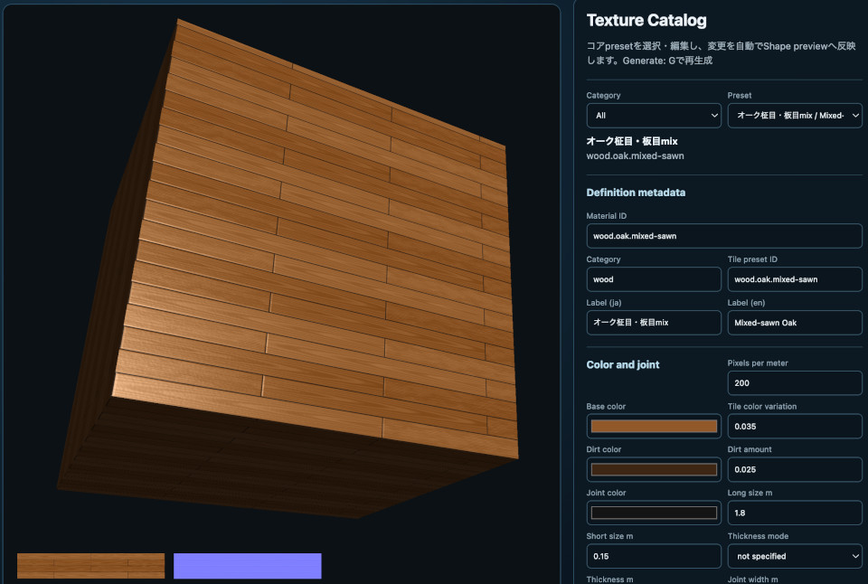

# Procedural Textures and Real-Scale Mapping

This chapter explains how to generate reusable procedural textures by specifying material dimensions, color, grout, patterns, and surface relief. It describes the Color, Height, and Normal maps produced by the generator and how to connect them to PBR materials. It then shows how to derive UVs from shape dimensions and repeating a texture at real scale across cuboids and planes.

1. Choose a registered preset.
2. Change only the required `tile` and `appearance` values.
3. Create meter-based UVs with `Primitive.mapRealCuboid()`.
4. Register the textures and PBR values on a Shape with `ProceduralMaterial.applyTo()`.
5. Finalize the Shape for the GPU with `Shape.endShape()`.

Run `book/examples/29_01.html` to apply different presets to two cuboids. To browse presets, edit values, inspect generated maps, and save a definition, use `samples/texture_catalog/texture_catalog.html`. The catalog is an interactive workspace for finding a surface and producing its definition, as well as a preset index.

## How to read this chapter

### Prerequisites

This chapter is easier to follow if you know the materials in Chapter 7 and `Primitive`, `ModelAsset`, and `Shape` from Chapter 8.

### What to read first

Begin with presets, Color/Height/Normal maps, the basic parameters, and material application.

### What to read when you need it

Refer to real-scale UVs, `mapRealCuboid()`, definition saving, and CPU/Compute generation when working with physical dimensions.

### What you will learn

You can connect generated maps to a physically based rendering (PBR) material and set texture density to match the dimensions of a shape.

## Three Things to Learn First

Procedural texturing separates the material definition, the images generated on the GPU, and the PBR values registered on a Shape.

```text
ProceduralTileSpec
  ├─ Color map
  ├─ Height map
  └─ Normal map

ProceduralMaterial
  ├─ Color map and Normal map
  ├─ roughness, specular, metallic
  └─ real-world repeat scale applied to a Shape
```

`ProceduralMaterials` handles preset selection, value overrides, and GPU texture generation. Instead of generating images on the CPU and then uploading them, `ComputeProceduralTile` generates Color, Height, and Normal maps on the GPU and passes them directly to rendering.

The three APIs to learn first are:

| API | Purpose |
|---|---|
| `ProceduralMaterials.createPreset()` | Generate maps from a registered preset |
| `ProceduralMaterials.create()` | Generate maps from a complete definition, such as JSON |
| `ProceduralMaterial.applyTo()` | Register generated maps and PBR values on a Shape |

## Try Settings in `texture_catalog`

Before guessing values in code, inspect a preset and its variations in `texture_catalog`. The page displays a preview cube, Color map, Height map, Normal map, and generated definition together. The cube shows the material under lighting; the Color map shows color; the Height map shows the height distribution; and the Normal map shows the direction and strength of surface relief.



Start an HTTP server from the repository root and open the catalog:

```sh
python3 -m http.server 8000
```

```text
http://localhost:8000/samples/texture_catalog/texture_catalog.html
```

Use the page in this order:

1. Select a material group in `Category`, then choose a starting preset in `Preset`.
2. Compare the cube with the Color and Normal maps to distinguish color variation from relief.
3. Change dimensions, grout, `Pattern`, `Surface detail`, and PBR values.
4. Commit the input values and inspect the regenerated GPU textures.
5. Save the definition with `Copy Code`, `Download JS`, or `Download JSON`.
6. Optionally save the generated maps with `Download Color` and `Download Normal`.

Numeric fields generate automatically after input is committed. The Generate button and `G` key explicitly regenerate the current definition. For text fields such as Material ID and Label, finish editing before generating. In text fields and text areas, `G` remains ordinary text input; in other controls and on the Canvas, it activates the Generate shortcut. This lets users finish entering decimal values such as `0.01` before GPU generation.

When a value falls outside the HTML `step`, `min`, or `max`, or cannot meet the integer-pixel requirement at the selected resolution, the catalog rounds it to a nearby valid value and reports the adjustment in the info area. This makes input adjustments visible and invalid definitions produce an error that can be investigated.

Use `Download JS` or `Download JSON` to save the definition. The JavaScript output is an ES module that can be passed to `ProceduralMaterials.create()`:

```js
import ProceduralMaterials from "../../webg/ProceduralMaterials.js";
import definition from "./fiber_cement_white.js";

const materials = new ProceduralMaterials(app.getGPU());
const material = await materials.create(definition);
material.applyTo(shape);
```

The catalog creates output definitions. Save a definition made through the UI as a file. To add a preset to Core, inspect the output and then explicitly register it. A new material can be based on an existing preset by changing its Material ID, Category, Japanese and English Labels, and `tile.presetId`.

## Choose and Display a Preset

Pass a preset ID to `createPreset()` to generate Color, Height, and Normal maps from its defaults. When `scale` is omitted, an existing Shape UV mapping is used as-is.

```js
import ProceduralMaterials from "../../webg/ProceduralMaterials.js";

const materials = new ProceduralMaterials(app.getGPU());
const oak = await materials.createPreset("wood.oak.plank");

// Prepare shape as a Shape with UVs
oak.applyTo(shape);
```

One `ProceduralMaterial` can be applied to several Shapes. A material with `scale`, however, transforms UVs for each Shape, so apply it only once to each Shape. Release generated GPU resources together when leaving the page:

```js
window.addEventListener("pagehide", () => {
  materials.destroy();
}, { once: true });
```

## The 23 Available Presets

Preset IDs select generation specifications rather than pre-rendered image files. Retrieve IDs with `ProceduralMaterials.listPresetIds()` and names/default values with `ProceduralMaterials.listPresetDefinitions()`. The catalog below lists the tiled-surface presets; the three pebble and gravel presets follow in the next section. In the PBR column, the values are `roughness`, `specular`, and `normalStrength`, in that order.

| Preset ID | Material / tile | Pattern and key dimensions | PBR |
|---|---|---|---|
| `wood.oak.plank` | Oak, 0.15 × 1.80 m, running bond, offset 1/2, variation 2 × 4 | quarter-sawn grain, 0.010 m; color 0.075; height 0.00020 m | roughness 0.56, specular 0.50, normalStrength 1.12 |
| `wood.oak.flat-sawn` | Oak, 0.15 × 1.80 m, running bond, offset 1/2, variation 2 × 4 | flat-sawn grain, 0.010 m; color 0.090; height 0.00024 m | 0.58, 0.48, 1.18 |
| `wood.oak.mixed-sawn` | Oak, 0.15 × 1.80 m, running bond, offset 1/2, variation 2 × 4 | mixed-sawn grain, 0.010 m; color 0.085; height 0.00022 m | 0.57, 0.49, 1.15 |
| `wood.walnut.plank` | Walnut, 0.15 × 1.80 m, running bond, offset 1/3, variation 2 × 6 | longitudinal grain, 0.010 m; color 0.038; height 0.00018 m | 0.54, 0.50, 1.16 |
| `wood.walnut.flat-sawn` | Walnut, 0.15 × 1.80 m, running bond, offset 1/3, variation 2 × 6 | flat-sawn grain, 0.010 m; color 0.060; height 0.00016 m | 0.54, 0.50, 1.12 |
| `wood.walnut.mixed-sawn` | Walnut, 0.15 × 1.80 m, running bond, offset 1/3, variation 2 × 6 | mixed-sawn grain, 0.010 m; color 0.055; height 0.00016 m | 0.54, 0.50, 1.14 |
| `wood.cedar.deck` | Cedar, 0.15 × 1.80 m, running bond, offset 1/4, variation 2 × 4 | longitudinal grain, 0.010 m; color 0.055; height 0.00028 m | 0.66, 0.42, 1.28 |
| `wood.cedar.flat-sawn` | Cedar, 0.15 × 1.80 m, running bond, offset 1/4, variation 2 × 4 | flat-sawn grain, 0.010 m; color 0.080; height 0.00024 m | 0.64, 0.44, 1.20 |
| `wood.cedar.mixed-sawn` | Cedar, 0.15 × 1.80 m, running bond, offset 1/4, variation 2 × 4 | mixed-sawn grain, 0.010 m; color 0.072; height 0.00024 m | 0.65, 0.43, 1.24 |
| `concrete.slab.light` | Light concrete, 0.90 × 1.80 × 0.010 m, 200 px/m, stacked | mottle, 0.075 m; surface 0.0125 m / 0.00025 m height | 0.90, 0.22, 1.35 |
| `concrete.block.gray` | Gray block, 0.19 × 0.39 × 0.10 m, 200 px/m, running bond 1/2, variation 2 × 4 | mottle, 0.060 m; surface 0.010 m / 0.00030 m height | 0.94, 0.18, 1.50 |
| `fiber.cement.white` | White fiber cement, 0.05 × 0.25 m, 200 px/m, running bond 1/4, variation 4 × 8 | speckle, 0.010 m; surface 0.015 m / 0.00010 m height | 0.56, 0.50, 1.10 |
| `fiber.cement.gray` | Gray fiber cement, 0.05 × 1.00 m, 200 px/m, stacked, variation 1 × 5 | speckle, 0.010 m; surface 0.015 m / 0.00010 m height | 0.56, 0.50, 1.10 |
| `brick.running.red` | Red brick, 0.10 × 0.21 × 0.06 m, running bond 1/2, variation 4 × 8 | speckle, 0.015 m; color 0.050; height 0.00035 m | 0.90, 0.20, 1.35 |
| `vinyl.tile.marble` | Marble vinyl, 0.30 × 0.30 m, stacked, variation 4 × 4 | veined, 0.0375 m; color 0.100; height 0.000030 m | 0.28, 0.68, 1.00 |
| `ceramic.white.square` | White ceramic, 0.20 × 0.20 × 0.008 m, stacked, variation 4 × 4 | none, 0.025 m; no color or height variation | 0.16, 0.76, 0.82 |
| `resin.mosaic.voronoi` | Resin, 0.30 × 0.30 m, stacked, variation 4 × 4 | voronoi, 0.050 m; color 0.140; height 0.00010 m | 0.80, 0.70, 1.00 |
| `vinyl.cloudy.blue` | Blue cloudy vinyl, 0.45 × 0.45 m, stacked, variation 2 × 2 | cloudy, 0.055 m; color 0.095; height 0.000025 m | 0.34, 0.60, 0.90 |
| `vinyl.linen.beige` | Beige linen vinyl, 0.30 × 0.60 m, running bond 1/2, variation 2 × 4 | linen, 0.015 m; color 0.085; height 0.00010 m | 0.42, 0.52, 1.05 |
| `stone.terrazzo.gray` | Gray terrazzo, 0.40 × 0.40 × 0.012 m, stacked, variation 3 × 3 | terrazzo, 0.028 m; color 0.160; height 0.00030 m | 0.62, 0.42, 1.30 |

The walnut presets use a `variationCell.rowCount` of six to close the one-third row-offset cycle. `mixed-sawn-grain` selects either quarter-sawn or flat-sawn grain per variation unit; it does not mix both patterns inside one board.

### Rounded Pebbles and Gravel

The `pebbles` pattern generates color variation and rounded height profiles independently. Dark pebbles can have raised centers, and reducing color variation leaves Height and Normal unchanged. Pebble colors vary continuously from dark through mid-tone to light.

- `stone.pebbles.gray`: pebbles only, with maximum height 0.040 m.
- `stone.pebbles-gravel.gray`: pebbles and gravel, with gravel height up to 0.006 m in the gaps.
- `stone.gravel.gray`: gravel only, with maximum height 0.006 m.

All three presets use a seamless two-meter square with no grout. The placement scales are 0.12 m for large stones and 0.065 m for small gravel. Each particle's radius and orientation vary by seed. `Pattern scale m` controls the placement scale rather than enforcing one uniform diameter.

```js
const material = await materials.createPreset("stone.pebbles-gravel.gray", {
  tile: {
    pattern: {
      colorAmount: 0.10,
      heightMeters: 0.040,
      pebbles: {
        roundness: 1,
        gravelAmount: 1,
        gravelHeightMeters: 0.006
      }
    }
  }
});
material.applyTo(shape);
```

`pattern.pebbles` applies to `mode: "pebbles"`. Its defaults are:

| Option | Default | Meaning |
|---|---:|---|
| `density` | 0.95 | Probability of placing a pebble, 0–1 |
| `packing` | 0 | Packing amount; larger stones leave smaller gaps, 0–1 |
| `irregularity` | 0.8 | Variation in position, radius, and aspect ratio, 0–1 |
| `roundness` | 1 | Top profile from flat (0) to rounded (1), 0–1 |
| `gravelAmount` | 0 | Amount of gravel in the gaps, 0–1 |
| `gravelScaleMeters` | 0.065 | Placement scale for small gravel, greater than 0 |
| `gravelHeightMeters` | 0.006 | Maximum small-gravel height, 0 or greater |
| `gravelColorAmount` | 0.10 | Gravel color variation, 0–0.25 |

For stones only, set `density: 1` and `packing: 1` to reduce gaps. Set `irregularity: 1` to vary positions, sizes, and aspect ratios. `packing` affects large stones; the density and roundness of small gravel are shared with the larger particles. Changing roundness leaves Color unchanged.

Color uses an independent variation value. Height uses a rounded elliptical surface raised at the center. Overlapping tops combine using their maximum height. Smooth edges connect each stone to the base, and small gravel height and color fill spaces between the large stones.

Choose a preset from the `stone` category in `samples/texture_catalog/texture_catalog.html` and compare Color, Height, and Normal. Decode the Height image using `heightRangeMeters`. A Normal map changes shading after application to a Shape but does not displace its silhouette. To direct light onto real relief, decode Height and use it in an application-side height-field intersection.

The PBR integration example for a pebbled water bed is `samples/water/water.html`. It compares caustics on and off using the same normal and material, so the floor remains horizontal and uses the pebble Color map. It does not use vertex displacement or the generated Height-derived Normal. Core caustics in Chapter 35 also project illumination onto a horizontal reference plane; stone-height light intersections are a separate operation. Inspect material pattern, surface normal, geometric shape, and caustic illumination as distinct inputs.

## Parameters You Can Change

Pass `tile`, `appearance`, and `scale` as the second argument to `createPreset()`. Unspecified values retain the selected preset's defaults.

```js
const material = await materials.createPreset("wood.oak.plank", {
  tile: {
    pattern: {
      scaleMeters: 0.016
    }
  },
  appearance: {
    roughness: 0.62
  },
  scale: 1.5
});
```

### `tile` Settings

| Group | Property | Meaning and input range |
|---|---|---|
| `resolution` | `pixelsPerMeter` | Pixels per meter; integer from 1 to 2048 |
| `unit` | `shortSizeMeters` | Short side of a material unit; greater than 0 |
| `unit` | `longSizeMeters` | Long side; at least the short side |
| `unit` | `thicknessMeters` | Material thickness; `null` or greater than 0 |
| `unit` | `longAxis` | Long direction, `u` or `v` |
| `layout` | `mode` | `stack` or `running-bond` |
| `layout` | `rowOffsetRatio` | `0`, `1/2`, `1/3`, or `1/4`; use `0` for `stack` |
| `variationCell` | `longUnitCount` | Horizontal variation count; integer from 1 to 64 |
| `variationCell` | `rowCount` | Vertical variation count; integer from 1 to 64 |
| `joint` | `widthMeters` | Grout width, 0 or greater; 0 omits grout |
| `joint` | `color` | Grout RGB values from 0 to 1 |
| `joint` | `depthMeters` | Grout depression, 0 or greater; 0 creates no depression |
| `joint` | `edgeRoundMeters` | Rounding around grout edges, 0 or greater |
| `color` | `base` | Base RGB values, each from 0 to 1 |
| `color` | `unitVariation` | Per-unit color variation, 0–0.25 |
| `color` | `dirtColor` | Dirt RGB values, each from 0 to 1 |
| `color` | `dirtAmount` | Dirt amount, 0–1 |
| `pattern` | `mode` | Choose from 13 pattern types |
| `pattern` | `scaleMeters` | Pattern scale in meters; greater than 0 |
| `pattern` | `colorAmount` | Pattern color variation, 0–0.25 |
| `pattern` | `heightMeters` | Pattern relief, 0 or greater |
| `surface` | `detailScaleMeters` | Scale of common surface detail; greater than 0 |
| `surface` | `heightNoiseMeters` | Fine relief height, 0 or greater |
| `random` | `seed` | Integer seed for reproducibility, 0–2147483647 |

`thicknessMeters` records the reference dimensions of the material unit as short side × long side × thickness. Current procedural generation creates Color and Normal maps for the surface and derives image size, grout, and pattern periods from `shortSizeMeters` and `longSizeMeters`. Specify the cuboid's depth in shape construction, for example with `Primitive.mapRealCuboid(width, height, depth)`. Use `null` when there is no meaningful surface-material thickness to record.

Pattern modes describe generated patterns rather than material names. For example, changing the color and height amplitudes of `mottle` can produce either subtle color variation or a raised concrete surface.

| Mode | Appearance and use |
|---|---|
| `none` | Use only common surface detail, without a material-specific pattern |
| `longitudinal-grain` | General wood grain running along the board |
| `quarter-sawn-grain` | Straight quarter-sawn grain with short medullary-ray flecks |
| `flat-sawn-grain` | Arched grain opening along the board |
| `mixed-sawn-grain` | Choose quarter-sawn or flat-sawn per variation unit |
| `mottle` | Large concrete mottling and gradual color variation |
| `speckle` | Granular color variation for brick or fiber cement, combining large and fine grains |
| `veined` | Fine vein-like color variation in marble |
| `voronoi` | Polygonal cells and boundaries for mosaic or crack-like patterns |
| `cloudy` | Cloud-shaped color variation at multiple scales |
| `linen` | Fabric-like surface with crossing long and short fibers |
| `terrazzo` | Deterministically placed chips for terrazzo or aggregate resin |
| `pebbles` | Separately generated color variation and rounded pebble Height |

### Generating Color and Normals from a Pattern

The generator calculates material-specific `pattern` and shared `surface detail` separately. Existing pattern scalar values and surface-detail scalar values each contribute to the Color map and physical Height. The `pebbles` pattern uses separate fields for pebble color and curved Height.

```text
pattern.mode + pattern.scaleMeters
  ├─ pattern.colorAmount → Color map variation
  └─ pattern.heightMeters → pattern relief

surface.detailScaleMeters + surface.heightNoiseMeters
  ├─ surface detail × dirtAmount → mix in dirt color
  └─ surface detail × heightNoiseMeters → fine Height variation

physical Height
  = grout depth
  + relief from pattern.heightMeters
  + relief from surface.heightNoiseMeters
      ↓ central differences between neighboring pixels
  Normal map
```

`Pattern scale m` sets a material-specific pattern period in meters. A value of 0.060 m gives mottling with an approximate 6 cm scale. Smaller values create finer mottles or grain; larger values create coarser ones. Scale changes the shared locations of pattern color and relief, so adjust `Pattern color amount`, rather than the scale, to soften only the color.

`Color amount` controls how much the pattern scalar changes the base color. Conceptually:

```text
patternedColor = baseColor
  + unitRandom × unitVariation
  + patternValue × colorAmount
```

A value of zero removes the main pattern's influence on the Color map while preserving its relief. Gravel in the gaps has a separate `gravelColorAmount`. Higher values increase contrast; values that exceed the base-color range can look unnatural, so begin around 0.02–0.12. The valid range is 0–0.25.

`Pattern height m` sets the physical amplitude of the pattern. For `pebbles`, it is the upper bound of the rise above the base. A value of 0.00020 m is 0.20 mm. Increasing it changes the Height map and the slopes in the Normal map derived from neighboring heights. It can change lighting response while leaving `Color amount` unchanged.

`Surface detail scale m` sets the base scale of fine Perlin detail applied across the surface, separately from mottle or grain. Use it to vary sand-like grain, fine relief, or coating texture while preserving the material-specific pattern. Very small detail may exceed the sampling resolution and appear blurred or as coarse periodic variation.

`Surface noise height m` is the physical height of surface detail. It primarily affects Height and Normal maps rather than directly amplifying the Color pattern. Increase it gradually for a sand-like roughness, then judge the fine shading on a lit cube instead of relying on the Normal map's grayscale appearance.

### Setting a Sandy Roughness

`concrete.slab.light` and `concrete.block.gray` use `mottle` for broad color variation and surface detail for fine, sand-like relief. This separates concrete color variation from fine surface roughness instead of turning the whole concrete color into fine speckles.

```js
const roughConcrete = await materials.createPreset("concrete.slab.light", {
  tile: {
    pattern: {
      mode: "mottle",
      scaleMeters: 0.075,
      colorAmount: 0.075,
      heightMeters: 0.00020
    },
    surface: {
      detailScaleMeters: 0.0125,
      heightNoiseMeters: 0.00025
    }
  },
  appearance: {
    roughness: 0.94,
    specular: 0.20,
    normalStrength: 1.35
  }
});
```

Here, the 75 mm `mottle` period creates gradual concrete color variation; surface detail with a 12.5 mm period and 0.25 mm height creates finer relief. To make only the relief finer, reduce `Surface detail scale m` while keeping `Pattern scale m`. To reduce excessive relief, lower `Surface noise height m`.

`concrete.block.gray` defaults to 10 mm surface detail and 0.30 mm height. This refines the surface while preserving block and grout dimensions. `roughness` controls the spread of reflected light, `specular` controls its strength, and `normalStrength` scales the generated Normal map. All three differ from surface frequency and physical height.

### What `pixelsPerMeter` Changes

`pixelsPerMeter` sets the pixel count used to represent one meter. A higher value records fine detail with more pixels. Physical relief is defined in meters by Height values, while Normal maps are generated from adjacent physical-height differences and `pixelsPerMeter`. Keeping the same meter-scale height and pattern scale preserves physical surface size when resolution increases.

As a guide, `scaleMeters × pixelsPerMeter` gives the approximate pixel width of a detail. At 200 pixels/m, a 0.0125 m detail spans about 2.5 pixels; at 100 pixels/m, it spans about 1.25 pixels. The former makes fine patterns easier to inspect, while the latter may undersample them. Start at 200 pixels/m and move to 400 only when close views lose detail. Higher resolution also increases GPU generation time, memory use, and image-download size, so choose it for the expected viewing distance.

Dimension values are generated at integer-pixel sizes after multiplication by `pixelsPerMeter`. For example, at 200 pixels/m, `joint.widthMeters: 0.005` is one pixel, while 0.006 m is 1.2 pixels and is rounded. Check the resolution together with dimensions when editing values.

### `appearance` Settings

| Property | Meaning and input range |
|---|---|
| `roughness` | Surface roughness: 0 is smooth, 1 is rough; 0–1 |
| `specular` | Specular reflection strength; 0–1 |
| `metallic` | Metalness; typically 0 for wood, stone, and tile; 0–1 |
| `normalStrength` | Normal-map influence; 0–8 |

Changing `tile` regenerates Color, Height, and Normal. Changing only `appearance` updates the values registered on the Shape without regenerating the images.

## Applying a Material to a Cuboid with `mapRealCuboid()`

Real-scale texturing also needs meter-based UVs on the object. `Primitive.mapRealCuboid(width, height, depth)` assigns each face UV coordinates using that face's edge lengths.

```js
import Primitive from "../../webg/Primitive.js";
import ProceduralMaterials from "../../webg/ProceduralMaterials.js";
import Shape from "../../webg/Shape.js";

const materials = new ProceduralMaterials(app.getGPU());
const concrete = await materials.createPreset("concrete.slab.light", {
  tile: {
    pattern: {
      colorAmount: 0.06,
      heightMeters: 0.00020
    },
    surface: {
      detailScaleMeters: 0.010,
      heightNoiseMeters: 0.00025
    }
  },
  appearance: {
    roughness: 0.94,
    specular: 0.20,
    normalStrength: 1.35
  }
});

const shape = new Shape(app.getGPU());
shape.setShader(app.shader);
shape.applyPrimitiveAsset(
  Primitive.mapRealCuboid(2.0, 3.0, 4.0)
);

// mapRealCuboid() uses meter-based UVs, so texture repeats preserve material-unit size
concrete.applyTo(shape);
shape.endShape();

const node = app.space.addNode(null, "brick-cuboid");
node.addShape(shape);

window.addEventListener("pagehide", () => {
  materials.destroy();
}, { once: true });
```

This cuboid is 2 m wide, 3 m high, and 4 m deep. Its top and bottom use 2 × 4 m UV ranges, front and back use 2 × 3 m, and the sides use 4 × 3 m. The generated texture period is derived from the preset's material dimensions and variation cell.

`Primitive.mapCube()` maps each face into the 0–1 UV range and suits ordinary cubes or atlases. `Primitive.mapRealCuboid()` expresses each face's edge lengths in meters and suits real-scale tiles, lumber, and bricks.

`scale` multiplies the generated texture period. At `scale: 2.0`, the period doubles and half as many material units fit on a face. At `scale: 0.5`, the period halves and twice as many units fit.

## Setting Repeat UVs on a Custom Plane

For a custom plane that does not use `mapRealCuboid()`, derive the repeat count from the generated `tileSizeMeters`:

```js
const oak = await materials.createPreset("wood.oak.plank");
const surfaceWidthMeters = 6.0;
const surfaceHeightMeters = 4.0;

const repeatU = surfaceWidthMeters / oak.tileSizeMeters[0];
const repeatV = surfaceHeightMeters / oak.tileSizeMeters[1];

const shape = new Shape(app.getGPU());
shape.setTextureMappingMode(1);
shape.setAutoCalcNormals(true);

const vertices = [
  shape.addVertexUV(0, 0, 0, 0, 0) - 1,
  shape.addVertexUV(surfaceWidthMeters, 0, 0, repeatU, 0) - 1,
  shape.addVertexUV(surfaceWidthMeters, surfaceHeightMeters, 0, repeatU, repeatV) - 1,
  shape.addVertexUV(0, surfaceHeightMeters, 0, 0, repeatV) - 1
];
shape.addPlane(vertices, 0);
shape.endShape();
oak.applyTo(shape);
```

Because this example omits `scale`, `applyTo()` can run after UV creation and `endShape()`. When using `scale`, apply the material before `endShape()`, as in the cuboid example.

UVs fixed to 0–1 stretch one texture period across the entire plane. To preserve the material-unit dimensions on a floor or wall, divide the surface dimensions by `tileSizeMeters` to calculate repeat UVs.

## Changing Per-Shape PBR Values with `applyTo()`

The same Color and Normal maps can be used with different PBR values on each Shape:

```js
brick.applyTo(shape, {
  roughness: 0.68,
  specular: 0.35,
  normalStrength: 1.2
});
```

The options have distinct roles:

- `createPreset(..., { appearance })` changes the generated material's default PBR values.
- `applyTo(shape, options)` overrides PBR values only while registering the material on that Shape.
- `createPreset(..., { tile })` regenerates Color, Height, and Normal maps.

`applyTo()` accepts `slot`, `materialId`, `roughness`, `specular`, `metallic`, `normalStrength`, `alpha`, `ambient`, `power`, `emissive`, and `flatShading`. An unknown property raises an error, helping identify misspelled options.

## Saving and Reusing a Definition

Save a complete definition containing all values, rather than only preset overrides, then pass that definition to `create()` to generate the material. The catalog's `Copy Code` and `Download JS` commands produce this format.

```js
const definition = {
  id: "custom.red-brick-wall",
  schemaVersion: 1,
  category: "brick",
  label: {
    ja: "カスタム赤レンガ",
    en: "Custom Red Brick"
  },
  tile: {
    resolution: { pixelsPerMeter: 200 },
    unit: {
      shortSizeMeters: 0.10,
      longSizeMeters: 0.21,
      thicknessMeters: 0.06,
      longAxis: "u"
    },
    layout: { mode: "running-bond", rowOffsetRatio: 0.5 },
    variationCell: { longUnitCount: 4, rowCount: 8 },
    joint: {
      widthMeters: 0.005,
      color: [0.42, 0.42, 0.42],
      depthMeters: 0.008,
      edgeRoundMeters: 0.005
    },
    color: {
      base: [0.48, 0.17, 0.10],
      unitVariation: 0.06,
      dirtColor: [0.19, 0.075, 0.045],
      dirtAmount: 0.08
    },
    pattern: {
      mode: "speckle",
      scaleMeters: 0.012,
      colorAmount: 0.07,
      heightMeters: 0.00035
    },
    surface: {
      detailScaleMeters: 0.010,
      heightNoiseMeters: 0.00055
    },
    random: { seed: 2026081410 }
  },
  appearance: {
    roughness: 0.78,
    specular: 0.25,
    metallic: 0.0,
    normalStrength: 1.5
  }
};

const customBrick = await materials.create(definition, { scale: 1.2 });
customBrick.applyTo(shape);
```

Saving the full definition reproduces the material even if preset defaults change later. Keep `id`, `schemaVersion`, `label`, `tile`, and `appearance` in the saved definition.

## Validating Inputs and Handling Errors

`ProceduralTileSpec` validates input before generation and preserves the requested values for inspection. It checks that:

- Preset IDs and fields are recognized.
- Dimensions, colors, patterns, and appearance values are in range.
- A `stack` layout has a zero row offset.
- A `running-bond` row offset and `rowCount` form a matching cycle.
- Dimensions and grout width convert to integer pixels.
- `mixed-sawn-grain` has multiple variation units.
- The Shape has vertices and UVs.
- A material with `scale` is applied before `endShape()`.

Invalid definitions raise an error so the caller can correct the input. If the displayed result differs from the intended material, check the preset ID, the `tile` hierarchy, `pixelsPerMeter`, and the UV setup order first.

## CPU Reference and Compute Generation

Normal rendering uses the Compute-generated result directly. The CPU implementation is a reference for the expected Color, Height, and Normal maps derived from the same generation specification. GPU results are read back to the CPU only when comparison or saving requires synchronization.

```text
ProceduralTileSpec
  ├─ CPU reference: comparison baseline for values and images
  ├─ ComputeProceduralTile: GPU generation of Color / Height / Normal
  └─ ProceduralMaterial: texture and PBR registration on a Shape
```

The same `random.seed` and tile settings reproduce unit variation, Perlin noise, Voronoi points, and Terrazzo particles. Matching the random-input order and 32-bit hash rules between CPU and Compute allows display differences to be investigated numerically.

## Order for Reviewing the Examples

In `book/examples/29_01.html`, follow this sequence:

```text
Initialize WebgApp
  → create ProceduralMaterials
  → generate ceramic.white.square and vinyl.cloudy.blue
  → mapRealCuboid(2, 3, 4)
  → applyTo()
  → endShape()
  → add to Node
  → destroy() on pagehide
```

Inspecting the top, front, and side shows how the UV range follows each face's dimensions instead of stretching the material across the face. In `samples/texture_catalog/texture_catalog.html`, inspect all 23 presets, edit the main tile and PBR values, compare Color/Height/Normal previews, export JavaScript or JSON, and save the generated Color, Height, or Normal maps.

## Summary

Start with a preset and change only the required `tile` or `appearance` values. Use `mapRealCuboid()` for cuboids and apply a material with `scale` before `endShape()`. For a custom plane, calculate repeat UVs from `tileSizeMeters`.

This workflow makes it possible to inspect material dimensions, pattern scale, PBR appearance, and GPU resource creation and release independently. Chapter 30 connects the resulting Color and Normal maps to direct lighting, IBL, metal reflections, roughness, and exposure.
