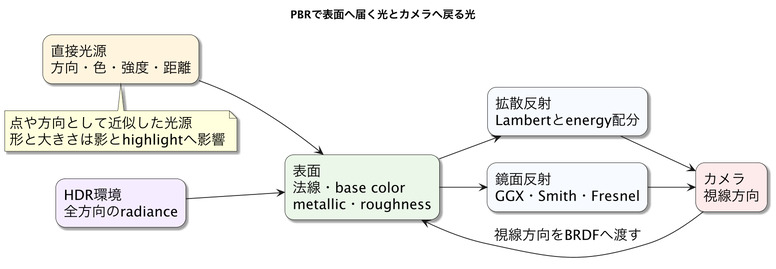
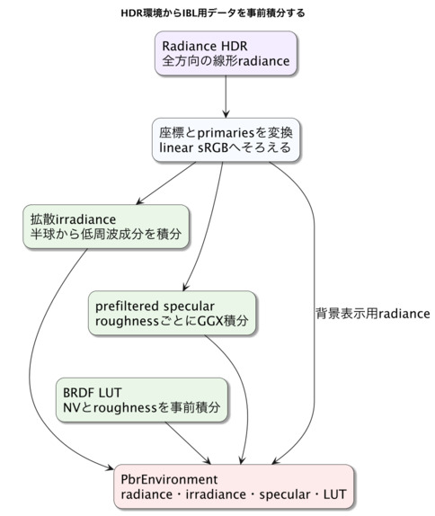

# Physically Based Rendering and Environment Lighting

This chapter explains how physically based rendering (PBR) combines materials, lights, environment lighting, and the camera to determine brightness and reflections. It covers more than metallic and roughness values: light direction, distance, size, high-dynamic-range environments, image-based lighting, pre-integration, and exposure all affect the final image. The goal is to reason about where light comes from, how a surface reflects it, and how the result is displayed rather than memorizing isolated settings.

A PBR material alone does not determine the appearance. The light that reaches the surface matters just as much. A small bright source creates a sharp highlight on the same metal sphere that reflects a broad, soft environment under an overcast sky.

This chapter uses three runnable examples:

- [`30_01.html`](../book/examples/30_01.html) compares materials with different metallic and roughness values.
- [`30_02.html`](../book/examples/30_02.html) shows direct lighting, an environment background, and diffuse and specular environment lighting.
- [`33_01.html`](../book/examples/33_01.html) integrates PBR, procedural materials, screen-space reflections (SSR), transparency, fog, and bloom.

Chapter 30 explains the inputs to PBR and environment lighting. Chapters 31–33 show how those inputs connect to the G-buffer, SSR, transparent rendering, and post-processing.

## How to read this chapter

### Prerequisites

Chapter 7 introduces materials. Familiarity with the basic path from incoming light to surface reflection is useful.

### What to read first

Start with base color, metallic, roughness, lights, HDR (High Dynamic Range), and environment lighting.

### What to read when you need it

Refer to GGX, Fresnel, and pre-integration and caching for image-based lighting (IBL) when investigating reflections or environment lighting in detail. Chapters 31–33 cover render integration; Chapter 41 covers storage formats and color-space rules.

### What you will learn

You will be able to set material, direct-light, environment-light, and HDR intensity values according to their meaning.

## Begin by Changing Roughness and Metallic

Open the [material comparison](../book/examples/30_01.html) and compare surfaces on the same shape. Lower roughness sharpens the reflected image and highlight; higher roughness broadens them. Increasing metallic makes the base color contribute more strongly to the specular reflection.

This partial example assigns a material to a `shape` in a PBR rendering path. Chapter 32 explains pipeline creation and display.

```js
shape.setMaterial("smooth-shader", {
  color: [0.85, 0.87, 0.90, 1.0],
  specular: 0.5,
  roughness: 0.18,
  metallic: 1.0,
  occlusion: 1.0,
  emissive_factor: [0.0, 0.0, 0.0]
});
```

The values describe a silver metal. First change only `roughness` from 0.18 to 0.6, then change only `metallic` from 1.0 to 0.0. Keeping the light and camera fixed makes the material differences easier to identify. If reflections are difficult to see, inspect the bright regions around the object: environment lighting supplies incoming light and also provides the information reflected by a metal.

## What PBR Makes Consistent

PBR is a way to keep material values and lighting calculations consistent within the information and time available to real-time rendering. It combines useful approximations rather than tracing every path of light in the physical world.

webg's core PBR uses the metallic-roughness workflow. Opaque surfaces use a PBR G-buffer and deferred lighting; transparent surfaces use PBR forward rendering. Both share the GGX calculation in `PbrBrdf.js`. A BRDF (Bidirectional Reflectance Distribution Function) describes how much incoming light a surface reflects toward the viewer.

The current feature set includes:

- GGX direct lighting
- IBL from photographic HDR environments
- Base-color, normal, metallic-roughness, ambient-occlusion, and emissive textures
- glTF 2.0 core PBR materials
- Shared GGX forward rendering for transparent surfaces
- Lights with relative or photometric units
- PBR specular IBL integrated with SSR
- Screen-space transmission and volume absorption

“PBR support” describes the implemented material features. Clearcoat, sheen, anisotropic reflection, area lights, local reflection probes, and layered transparency are separate features whose support should be stated specifically.

## Follow the Flow of Light

The surface color depends on its material response and on light from a source or environment reflected toward the camera.



Direct lighting evaluates light from a particular direction. IBL evaluates light from all directions around the surface using an environment map. In both cases, the normal, viewing direction, light direction, and material determine the reflected amount.

Conceptually, the linear HDR result is:

```text
linear HDR color
  = direct diffuse
  + direct specular
  + environment diffuse
  + environment specular
  + emission
```

Ambient occlusion (AO) and shadows act as visibility terms. AO mainly controls how much environment light reaches a surface; shadows control how much direct light reaches it. Apply each to the corresponding lighting term.

## Base Color Means Different Things for Metals

Base color has different roles for dielectrics and metals. For a dielectric, it primarily describes the color of light that enters the surface, scatters, and exits. Its normal-incidence specular reflectance, F0, is usually a small nearly neutral value.

For a metal, diffuse reflection from inside the material is small, and base color supplies the color of specular reflection. Gold appears yellow because its specular reflectance varies by wavelength. webg computes F0 conceptually as:

```text
dielectric F0 = 0.04 × specular
F0 = mix(dielectric F0, base color, metallic)
```

`metallic: 0` represents a dielectric and `metallic: 1` a metal. Intermediate values are useful for texels that average materials or for boundaries; for a single pure material they describe a blend.

## Roughness Describes the Distribution of Microscopic Facets

`roughness` describes how widely microscopic surface facets vary around the average normal. This distribution controls the width of a specular highlight. Aligned facets on a smooth surface reflect strongly in a narrow direction; a rough surface spreads that reflection across a wider region. Consider the total reflected energy separately from its distribution.

webg gives roughness a minimum greater than zero. A value of exactly zero creates a singular GGX distribution and unstable numerical calculations. The shared `PBR_MIN_ROUGHNESS` and input validation check the range and report an out-of-range value as a configuration error.

## Preserve Light in Linear HDR

Lighting calculations use linear colors, where addition and multiplication represent light correctly. Convert display sRGB values to linear before calculations, then encode the result back to sRGB for display.

HDR preserves values above 1.0 during rendering. The sun, lamps, specular highlights, and emissive surfaces can be far brighter than white paper. Keep this range available to bloom and tone mapping, then compress it immediately before display.

webg stores the lit scene in `rgba16float`. Tone mapping is applied once at the end to fit the result to display range and convert to sRGB.

The inputs to PBR appearance can be considered as direct light, IBL, material, and emission. The following sections connect them to webg's APIs.

### 1. Directional Light

A directional light approximates a distant source such as the sun. It reaches every position from the same direction, so its distance attenuation is treated as 1. Set its color and intensity in `lighting` when constructing `ComputeEffectPipeline`, and specify the travel direction with the top-level `lightDirection`.

```js
const pipeline = new ComputeEffectPipeline(gpu, {
  lightDirection: [0.46, -0.82, 0.34],
  lightTarget: [0, -0.7, -4.0],
  lighting: {
    ambient: 0.0,
    directionalColor: [1.0, 0.92, 0.82],
    directionalIntensity: 1.55
  },
  shadow: { type: "directional" }
});
```

`lightDirection` points in the direction the light travels. For light traveling straight down, use `[0.0, -1.0, 0.0]`. `lightTarget` centers the directional shadow map, separating its coverage from the light direction.

`shadow.type` selects a shadow method. To render shadows, pass the same `shadowEnabled: true` to both `renderScene()` and `pipeline.encode()`. `lightDistance`, `lightHalfWidth`, `lightHalfHeight`, `lightNear`, and `lightFar` configure the region covered by the directional shadow map.

The core defaults differ from the values in `book/examples/33_01.html`. That example uses `lightDirection: [0.04, -0.30, -0.95]` and `lightTarget: [5.5, -1.0, -6.8]` to illuminate the cube's front face and send a specular highlight toward the camera.

| Directional-light setting | Core default |
| --- | --- |
| `lightDirection` | `[0.46, -0.82, 0.34]` |
| `lightTarget` | `[0, -0.7, -4.0]` |
| `lightDistance` | `34` |
| `lightHalfWidth` / `lightHalfHeight` | `19` / `17` |
| `lightNear` / `lightFar` | `1` / `72` |
| `directionalColor` | `[1.0, 1.0, 1.0]` |
| `directionalIntensity` | `1.0` |
| `shadow.type` | `directional` |

### 2. Point and Cone Lights

A point light approximates light emitted in every direction from one point. A cone light emits from a point in a preferred direction. Both are local lights with distance attenuation and a direction that varies by surface point. The `lights` array defaults to empty; pass its contents to `pipeline.encode()` each frame.

For a cone light, `direction` is the travel direction, and `innerAngle` and `outerAngle` are in degrees. The core derives `innerCos` and `outerCos` for its internal calculations.

```js
const lights = [
  {
    type: "point", position: [-5.0, 3.0, -1.0],
    color: [1.0, 0.9, 0.8], radius: 10.0, intensity: 2.4
  },
  {
    type: "cone", position: [2.0, 5.0, 1.0],
    direction: [0.0, -1.0, -0.2], color: [1.0, 0.7, 0.4],
    radius: 15.0, intensity: 3.0, innerAngle: 25.0, outerAngle: 50.0
  }
];

pipeline.encode(commandEncoder, { cameraFrame, lights });
```

`book/examples/33_01.html` defines two point lights in `LOCAL_LIGHTS`. Point and cone lights provide local illumination. A cone-shaped key light with a shadow map is configured separately with `shadow.type: "spot"` and `shadow.spot`.

### 3. IBL Environment Light

Pass the resources from `PbrEnvironment` through `lighting.environment`:

```js
lighting: {
  ambient: 0.0,
  environment: pbrEnvironment.getResources(),
  environmentIntensity: 0.70,
  environmentBackground: false
}
```

When IBL supplies environment diffuse lighting, `ambient: 0.0` keeps the environment contribution distinct from a fixed ambient value. `book/examples/33_01.html` uses this setting.

### 4. Material Reflection

The appearance of specular reflection depends on the light as well as `specular` and `roughness` on the material:

```js
shape.setMaterial("smooth-shader", {
  specular: 1.0,
  roughness: 0.1,
  metallic: 0.0
});
```

- Increase `specular` to strengthen specular reflection.
- Decrease `roughness` to sharpen the reflection.
- Increase `metallic` to use more base color in the specular reflection and reduce diffuse reflection.

`emissive` makes a surface appear self-lit. A source that illuminates other objects is configured separately as direct light or environment light.

The common lighting defaults are `lighting.ambient: 0.035`, `lighting.spotColor: [1.0, 1.0, 1.0]`, and `lighting.spotIntensity: 1.0`. The spot values apply to the key spot light selected with `shadow.type: "spot"`; point and cone lights use each entry's `color` and `intensity`.

## Compute Specular Reflection with GGX

The GGX specular BRDF has three main terms:

- **Normal distribution D** describes the density of microfacet normals facing the halfway direction between light and view. Lower roughness narrows the distribution and sharpens the highlight.
- **Geometry attenuation G** approximates microfacets hiding light or view directions from one another. Smith geometry combines visibility from the light and camera sides.
- **Fresnel F** uses the Schlick approximation to vary reflectance from normal-incidence F0 toward stronger reflection at grazing angles. Dielectrics such as water, glass, and paint also reflect more strongly at grazing angles.

`PbrBrdf.js` evaluates direct lighting in this conceptual form:

```wgsl
let f0 = pbrEvaluateF0(baseColor, metallic, dielectricF0);
let fresnel = pbrFresnelSchlick(vDotH, f0);
let distribution = pbrDistributionGgx(nDotH, roughness);
let geometry = pbrGeometrySmith(nDotV, nDotL, roughness);
let specular = distribution * geometry * fresnel
  / max(4.0 * nDotV * nDotL, PBR_EPSILON);
let diffuse = (1.0 - fresnel) * (1.0 - metallic)
  * baseColor / PI;
```

Fresnel reflectance determines the specular share of the light. The remaining diffuse share is reduced by `metallic`, reaching zero for a fully metallic surface.

## Choose Relative or Photometric Units

webg explicitly supports relative units (`relative`) and photometric units (`photometric`). Relative units use convenient strengths and finite-radius attenuation without mapping values to real-world units. Photometric units use lux for directional light and candela for point, cone, and spot lights, with inverse-square distance attenuation:

```text
illuminance ∝ luminous intensity / distance²
```

Doubling the distance reduces illuminance on the same facing surface to one quarter. Since the equation diverges at zero distance, photometric lights require `minimumDistance`. It defines the near-field limit of a source with finite size. Photometric units also require tone-mapping `exposureEv100`; physical light values alone do not determine display brightness without camera exposure.

## Consider the Shape and Size of a Light

Real sources have area. Their size affects the distribution of light directions, highlight shape, and softness of shadows. A small source produces a small sharp highlight; a larger source spreads the highlight according to its shape and produces a broader penumbra.

webg's point, cone, spot, and directional lights are idealized for real-time calculations. Integrating all directions from an area light is a separate lighting model. Roughness broadens highlights, while an area light is appropriate when a rectangular source itself should appear in the reflection.

An HDR environment can contain the apparent shape and size of windows, the sky, and lamps. Bright regions in the environment influence IBL specular highlights, which is a key difference from a fixed single-color ambient value.

## Use an HDR Environment as a Light Source

HDR images store a wider range of intensities than display images. Radiance HDR uses RGBE to encode very bright values. Each environment-map pixel represents radiance arriving from one direction, so the image can contain blue sky, ground reflection, a bright window, and sunlight together.

An image with a clipped white sun may look like an HDR sun on screen, but their illumination and metal reflections differ greatly when integrated. An IBL environment is lighting and reflection data, not only a background image.

Radiance HDR uses standard primaries that differ from webg's linear sRGB. Decode RGBE and convert explicitly to linear sRGB when preparing IBL resources, so environment colors remain consistent.

## Evaluate Incoming Light from Every Direction with IBL

IBL uses an environment image as a light source in every direction. Sampling all directions at every pixel would be expensive, so webg pre-integrates reusable parts of the environment and BRDF.



`PbrEnvironment` groups the main resources:

- **Radiance:** the original intensity environment for the HDR background and incoming light.
- **Irradiance:** low-frequency environment lighting integrated over the hemisphere for diffuse reflection.
- **Prefiltered specular environment:** GGX-integrated reflections stored for different roughness values.
- **BRDF lookup table (LUT):** the BRDF integral indexed by view angle and roughness.
- **Sampler and mip count:** sampling state and the number of specular-environment levels.

### Precompute Irradiance for Diffuse Reflection

For a fully diffuse surface, integrate the incoming hemisphere weighted by the cosine of the angle from the surface normal. Fine environment detail averages into low-frequency directional lighting. This result, the irradiance map, can be sampled once at runtime using the surface normal instead of evaluating the full hemisphere.

### Integrate the Specular Environment by Roughness

Specular reflection integrates around the reflection direction using the GGX distribution. Smooth surfaces use a narrow range; rough surfaces use a broader environment. webg stores results for different roughness values in mip levels and selects a level at runtime:

```wgsl
let maxLod = max(specularMipCount - 1.0, 0.0);
let lod = roughness * maxLod;
let prefiltered = textureSampleLevel(
  prefilteredSpecular, environmentSampler, reflectionUv, lod
).rgb;
```

This reads one pre-integrated mip rather than sampling many environment directions per pixel.

### Share the Remaining Integral with a BRDF LUT

The prefiltered environment handles the environment-side integral. A two-dimensional BRDF LUT stores the Fresnel and geometry terms that depend on view angle and roughness. Its axes are generally `NdotV` and `roughness`. F0 is applied at runtime, so the same LUT serves metals and dielectrics:

```text
specular IBL
  = prefiltered environment × specular weight from the BRDF LUT
```

Pre-integration separates the shared integral into reusable environment and BRDF data.

### Capture Bright Regions with Importance Sampling

Uniformly sampling an environment can miss a small, very bright sun or lamp. webg's IBL preprocessing combines Hammersley sequences, GGX importance sampling, sampling based on environment luminance, and multiple importance sampling (MIS).

Hammersley points reduce sampling gaps compared with random points. GGX sampling focuses on directions with a large BRDF contribution. Environment sampling selects bright pixels more often. MIS weights and combines these strategies so a small sample set estimates the important parts of the integral efficiently.

### Cache Pre-Integrated Results

High-quality IBL preprocessing can take time depending on environment resolution, mip count, and sample count. Save and reuse radiance, irradiance, prefiltered specular, and the BRDF LUT to begin later launches with resource loading.

webg stores generated resources in `.webgpbr`. The cache records the source identifier, algorithm and format versions, resolution, mip levels, and sampling configuration so matching conditions can be reused. Compare CPU and compute-shader preprocessing during development, then distribute a prepared environment asset. At runtime, load it into `PbrEnvironment` and share the GPU resources between opaque deferred rendering and transparent forward rendering.

## Align the Environment Light and Background

Use the same rotation for environment lighting and background so that a visible window and the corresponding object highlight point in the same direction. `environmentRotationDegrees` applies the same Y-axis rotation to radiance background, diffuse irradiance, and prefiltered specular environment. Deferred lighting converts view-space normals and reflection directions back to world space before applying the environment rotation.

When environment lighting is enabled, use `lighting.ambient: 0` to avoid counting a fixed ambient term on top of the diffuse and specular environment. Low-level drawing can accept both inputs, while the `WebgSceneApp` PBR configuration validates that `ambient` is zero when the environment is enabled.

## Compensate for IBL Energy Loss

Standard GGX evaluates single scattering. On rough surfaces, the first microfacet reflection is more likely to hit another microfacet; omitting that additional bounce can make rough metals too dark. webg estimates directional albedo from the BRDF LUT and approximately compensates for the missing specular energy:

```text
energyCompensation
  = 1 + F0 × (1 / directionalAlbedo - 1)
```

This real-time multiple-scattering approximation applies to IBL specular reflection. Diffuse irradiance, AO, emission, and direct light remain separate terms.

## Pass Surface Data to the Rendering Pipeline

Base color, metallic, roughness, emission, and environment lighting are shared inputs to rendering. Opaque surfaces store per-pixel surface information in a G-buffer for later lighting. Transparent surfaces use the same reflection model while compositing with the background.

Chapter 31 explains the order of lighting, reflections, transparency, and post-processing; Chapter 32 provides the connection code. Chapter 41 collects G-buffer channels, texture color spaces, SSR and environment reflections, and transparent refraction internals.

## A Practical PBR Tuning Order

Change one class of inputs at a time:

1. Check base color, metallic, and roughness.
2. Check the normal texture and TBN basis.
3. Use direct light alone to check direction, intensity, and distance attenuation.
4. Check the environment background direction and bright regions.
5. Display irradiance alone to check diffuse environment lighting.
6. Check specular-environment mips and the BRDF LUT.
7. Combine direct light and IBL in full PBR lighting.
8. Enable SSR and check its replacement of IBL.
9. Add transparent PBR and transmission.
10. Adjust exposure, tone mapping, and bloom last.

Diagnostic views can show base color, normal, roughness, metallic, AO, emission, irradiance, specular-environment mip levels, and the BRDF LUT. Compare these intermediate values with the final image to isolate a stage.

## Inspect the Integrated Example from Chapters 31–33

[`33_01.html`](../book/examples/33_01.html) brings the PBR pipeline together with procedural floor and wall materials, a metal sphere, an emissive object, and transparent surfaces. It shows `PbrEnvironment` creation, `ambient: 0`, `composer.mode: "pbr-ssr"`, PBR and procedural materials, shadows, SSAO, SSR, transparent PBR, transmission, fog, bloom, tone mapping, and GPU-resource disposal.

The example makes it clear where each effect is enabled. Add effects in stages and inspect appearance and cost as you go.

## PBR Materials on Shapes Created Directly

The `part()` helper in `samples/fantasy/visuals.js` assigns PBR materials to generated shapes. `Shape.setMaterial()` receives a four-component `color` and `specular`, `roughness`, and `metallic` values. Add the fourth component for texture mixing when a palette stores RGB; use `alpha` to set opacity. Emission is named `emissiveFactor` in a scene declaration and `emissive_factor` on a directly configured shape.

For the `WebgSceneApp` PBR configuration in this sample, `renderer.pipeline.lighting.ambient` must be zero when environment lighting is enabled; validation rejects nonzero values. This is a high-level contract and is distinct from low-level drawing configuration. For the workflow that connects materials to gameplay, continue to [PBR Scene to a Small Game](PBRSceneToGame.md).

## Summary

PBR appearance combines material, light sources, environment, and display conversion. Base color, metallic, roughness, and normal define surface response. Direct lights define direction, distance, intensity, and beam angle. HDR environments define incoming light from all directions and the shape of bright sources. Tone mapping converts the HDR result for display.

IBL precomputes diffuse irradiance, roughness-dependent specular environments, and a BRDF LUT. At runtime, these provide efficient approximations with a consistent physical interpretation. webg shares GGX between opaque deferred PBR and transparent forward PBR, and connects procedural textures, glTF materials, HDR environments, SSR, and transmission to linear HDR rendering. Chapters 34–36 use the same data in SSAO, shadows, SSR, fog, depth of field (DoF), bloom, and other passes.
