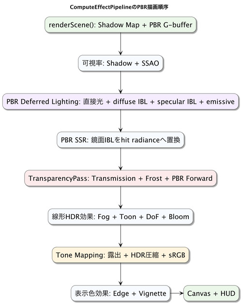

# PBR Integration Concepts

This chapter combines the PBR lighting from Chapter 30 with the screen effects from Chapters 23–25 into one image through `ComputeEffectPipeline`. G-buffer generation, shadows, SSAO, deferred lighting, SSR, transparency and refraction, fog, DoF, bloom, and tone mapping use the same camera frame and intermediate images in a consistent order. Their color, depth, and coordinate meanings remain aligned, while one configuration manages GPU resource creation, resize, and release. Applications that need only standard forward rendering can use the default `WebgApp` and `SmoothShader` setup.

## How to read this chapter

### Prerequisites

This chapter is easier to follow if you know PBR from Chapter 30, post-processing from Chapter 23, and the connection methods in Chapter 21.

### What to read first

Start with the choice between standard forward rendering, individual passes, and PBR integration, then follow the rendering order from G-buffer—the screen-space surface data used by lighting—to final display.

### What to read when you need it

Refer to HDR, transparency, Transmission, SSR, tone mapping, and HUD ordering when combining multiple effects.

### What you will learn

You can select a rendering path for the effects you need and explain what color, depth, and camera information means at each stage.

## Three Inputs Used by Integration

Before combining screen effects, separate surface data, light energy, and camera information. The G-buffer is a set of images holding the base color, normal, material values, and depth of the surface visible at each screen pixel. Lighting reads this data and computes light in linear HDR, which represents a wide brightness range. Immediately before display, tone mapping converts it into colors that fit on screen.

A camera frame groups the view, projection, and depth information used for one render. Passing the same information to geometry and later effects ensures that positions reconstructed from depth use the view that produced that image.

This chapter explains why the effects are ordered; Chapter 32 shows the connection code. Chapters 34–36 explain each effect's calculation and tuning, and Chapter 41 documents formats and depth rules in detail. First understand the whole path to the final image, then continue to the relevant implementation details.

## Choose a Rendering Configuration First

Even when using the same PBR material, choose the entry point according to the screen effects required. For a screen centered on PBR lighting, the standard forward path can be combined with a PBR shader.

| Configuration | Suited to | Entry point |
|---|---|---|
| Standard forward rendering | Color-focused screens that directly light Shapes | `WebgApp` default rendering and `SmoothShader` |
| Manual connection of individual passes | Screens that need one or a few effects with a custom order | Render and Compute Passes in Parts III and IV |
| PBR integration pipeline | Screens sharing a G-buffer, deferred lighting, SSR, transparency/refraction, and several screen effects | `ComputeEffectPipeline` |

Begin with the smallest configuration and move to the next one as required inputs and effects grow.

## Combine Individual Effects into One Rendering Pipeline

An integrated pipeline centralizes intermediate-texture ownership, execution order, and shared camera information for applications that use several effects together. SSAO, shadows, SSR, DoF, and bloom can each run by themselves. When connected manually, however, separate systems may manage duplicate targets for the same screen size, reconstruct one frame's depth using another camera configuration, or apply tone mapping twice. Integration lets the application add effects without reimplementing the shared color and depth rules.

One object manages GPU resources and passes from creation and per-frame reuse through resize, ordered execution, and release. Assigning one manager to this work prevents duplicate textures for the same purpose and keeps one pass from releasing resources used by another.

`ComputeEffectPipeline` is the integrated API for resource management and execution order. The application provides the scene, camera frame, and effect settings. The pipeline validates the formats and camera-state consistency from the G-buffer through the presentation texture.

Choose the integrated pipeline when an application combines a G-buffer, screen-space effects, and several post-processing stages. Use standard forward rendering as the entry point for simpler displays. When `WebgApp` draws a `Space` directly with the standard shader, camera Reverse-Z and camera-relative rendering are applied internally. The deferred integrated pipeline is useful when the application shares a G-buffer, deferred lighting, and multiple screen-space effects.

The standard PBR integration example is `book/examples/33_01.html`. The first two code examples in Chapters 31–33 explain comparison and connection points; `33_01.html` presents the whole working example in one file, including environment lighting, procedural materials, and transparency/refraction. IBL supplies lighting and reflections, while a separate blue-gray clear color is used for the screen background.

[Run the PBR integration example](../book/examples/33_01.html)

## Build Scene Believability from Spatial Relationships

In addition to complex models and high-resolution textures, a 3D scene gains depth when it reflects spatial relationships: contact between the floor and an object, a gap between a wall and a pillar, an occluder and its shadow, or a smooth surface and its reflection. SSAO represents occlusion of environment light by nearby surfaces; shadows represent occlusion between a light and a surface; SSR adds reflection targets visible from the camera.

Fog represents the thickness of air with distance from the camera. DoF selects which depth range appears in focus. Bloom makes light above the display range visible as a glow. These effects reflect relationships among objects, camera, and light as well as material properties. Vignette guides attention by adjusting the edges of the completed display color without re-evaluating 3D relationships.

Integration selects the visual cues needed in a scene and generates them consistently from shared geometry and lighting information. A wide outdoor scene may use shadows and tone mapping; a small room may use SSAO and reflections; a stylized image may use toon shading and edge detection.

## Order Passes by the Meaning of Their Output

The rendering order preserves visibility, retains HDR light energy for the effects that need it, and performs display conversion once. Sharing this order keeps a setting from interpreting the same input with a different meaning when effects are enabled, disabled, or adjusted.



```text
Shadow map (light view / conventional Z)
             \
Camera frame -> G-buffer (camera view / Reverse-Z)
                     |
                     +-> Shadow visibility
                     +-> SSAO visibility
                     |
                     v
              PBR deferred lighting (direct light + IBL / HDR)
                     |
                     +-> SSR reflection -> replaces specular IBL where it hits
                     |
                     v
              Transmission / background blur / transparent PBR
                     |
                     v
                   Fog (HDR)
                     |
                     v
             Toon -> DoF -> Bloom (HDR)
                     |
                     v
              Tone mapping (display color)
                     |
                     v
              Edge detection -> Vignette
                     |
                     v
          Final display -> Heads-up display (HUD)
```

Shadow maps use conventional Z in light space; the G-buffer uses Reverse-Z in camera space. Ambient occlusion and shadows return visibility—the fraction of light reaching a surface—and deferred lighting applies each to the corresponding environment or direct-light contribution. SSR creates a reflection contribution and composites it into the HDR scene. Transparency composites over this result, then fog is applied once to the image after transparent composition. Toon shading, DoF, bloom, and tone mapping then process opaque and transparent content together. Edge detection and vignette operate on display color before presentation and before the HUD.

This order follows the meaning of each pass's output. For example, after tone mapping, bright pixels have been compressed into display color, so effects that need linear HDR energy belong earlier. Multiplying color by SSAO before deferred lighting would darken direct light as well as environment light. Applying vignette after the HUD would darken the controls along with the scene. Pass order follows each output's meaning and the image elements it should affect.

### Provide HDR Environments to PBR Lighting

To use image-based lighting (IBL) from a real HDR image, create `PbrEnvironment` once during initialization and pass `getResources()` to `lighting.environment` in `ComputeEffectPipeline`. The same environment resources are shared by deferred lighting for opaque objects, PBR SSR, and forward lighting for transparent objects.

```js
const pbrEnvironment = new PbrEnvironment(gpu, environmentData);

const pipeline = new ComputeEffectPipeline(gpu, {
  width,
  height,
  lighting: {
    ambient: 0.0,
    // Pass only the public lighting resources, not the instance GPU or disposal state
    environment: pbrEnvironment.getResources(),
    environmentIntensity: 1.0,
    environmentBackground: true,
    environmentRotationDegrees: 0.0
  },
  composer: {
    mode: "pbr-ssr"
  }
});
```

Setting `ambient` to a nonzero value while environment lighting is enabled raises an error because the fixed ambient and IBL would duplicate environment illumination. `environmentRotationDegrees` applies the same Y rotation to the radiance background, diffuse irradiance, and prefiltered specular environment so their directions remain aligned.

`composer.mode: "pbr-ssr"` replaces the specular reflection from deferred lighting with screen-space radiance where an SSR hit is found. Where the ray misses, the original environment reflection remains, combining screen-space information with IBL.

### Connect Transparent PBR and Transmission

On frames with transparent triangles, `TransparencyPass` runs after PBR deferred lighting and SSR. Its sequence is to generate Transmission entry/exit surface data, refract the background, blur that background according to roughness, and forward-render transparent PBR.

```js
const finalColor = pipeline.encode(gpu.commandEncoder, {
  cameraFrame,
  ssrEnabled: true,
  transparency: {
    transmissionEnabled: true,
    transmissionStrength: 1.0,
    transmissionDistance: 80.0,
    transmissionHitThickness: 0.35,
    transmissionSteps: 48,
    transmissionRayMissFallback: "auto"
  }
});
```

Transmission searches screen space for an exit surface inside the transparent object and a background surface in the opaque G-buffer. It calculates refraction through the entry and exit surfaces using Snell's law twice, applies Beer–Lambert absorption along the internal path, then composites the transparent surface's own GGX reflection using source-over blending.

`transmissionRayMissFallback` distinguishes the inputs required by a setting from the output used when the ray search does not find a background intersection:

| Value | Required input at configuration | With an outward direction but no background hit |
|---|---|---|
| `"auto"` | None | Environment color when radiance is available; otherwise clear color |
| `"environment"` | Environment radiance | Environment color in the outward direction |
| `"clear"` | `renderScene()` clear color | Clear color |
| `"constant"` | `transmissionRayMissColor` | The specified constant color |

Provide environment radiance for `"environment"` and a constant color for `"constant"`. Missing required input raises an error so the selected mode's prerequisites remain clear.

Even when inputs are valid, the internal boundary may be missing, or a second boundary may totally reflect and fail to provide an outward direction. In either case there is no direction for sampling the environment. Only `"constant"` then uses its configured color; other modes use the clear color. This is a ray-search result, distinct from missing environment radiance.

```js
transparency: {
  transmissionEnabled: true,
  transmissionRayMissFallback: "constant",
  transmissionRayMissColor: [0.04, 0.06, 0.10, 1.0]
}
```

The clear color and `transmissionRayMissColor` are display-space sRGB colors. Supplying `transmissionRayMissColor` to another mode raises an error rather than accepting an unused value.

When no transparent geometry is present, the pipeline skips the `TransparencyPass` mask, ray traversal, frosted-glass blur, and forward rendering. Disabling Transmission leaves alpha transparency and frosted glass as separate features, so transparent triangles still run only the processing they require.

### Preserve Color Meaning Through Display

Keeping color stages distinct lets each effect operate on the right meaning: material base color, light energy after illumination, or display color. G-buffer albedo is the base color before lighting. Deferred lighting combines materials, normals, visibility, and lights into a linear HDR scene that can exceed 1.0. SSR, toon, DoF, and bloom read that HDR value and pass it forward as `rgba16float`, preserving its light-energy meaning.

`ComputeEffectComposer` combines lighting and SSR. `mix` interpolates scene and reflection color according to reflection alpha, helping preserve material color. `add` adds reflection color and suits emissive emphasis, but can look white when many reflective surfaces are present. `ComputeFogPass` also mixes the scene and fog colors in linear HDR after transparent composition.

G-buffer `color` and color textures use the same sRGB values users choose for colors. The albedo attachment uses `rgba8unorm-srgb`: values are stored in sRGB encoding and decoded to linear when read in a shader. Albedo passed to deferred lighting is linear so that illumination operates on light values. The G-buffer path performs the sRGB-to-linear conversion; pass base colors in sRGB and let that path handle the conversion before lighting. Decoding sRGB a second time makes it too dark; lighting directly in display-space values makes midtones appear too white.

Tone mapping moves linear HDR values into the display range. `exposure` determines light energy before tone mapping, and `mode` chooses the highlight compression: `reinhard` smoothly compresses with `color / (color + 1)`, while `linear` clamps into 0–1. The exact sRGB transfer function, including its linear dark section, then encodes display color, and `saturation` adjusts its colorfulness.

`gamma` adjusts visible brightness after the accurate sRGB conversion by applying `pow(srgbColor, 2.2 / gamma)`. Its default, `gamma: 2.2`, gives an exponent of 1 and preserves the accurate sRGB result. Performing gamma conversion in earlier light-energy passes or encoding again through an sRGB attachment would double-convert the result; `ComputeEffectToneMapPass` performs the display conversion once.

| Stage | Format | Meaning |
|---|---|---|
| G-buffer albedo | `rgba8unorm-srgb` | Base color before lighting, stored in sRGB and decoded to linear on read |
| G-buffer material | `rgba8unorm` | `specular`, `roughness`, `metallic`, `occlusion` |
| G-buffer emission | `rgba16float` | Linear HDR emissive color |
| Deferred lighting through fog and bloom | `rgba16float` | Linear HDR light energy |
| After tone mapping | `rgba8unorm` | Display color encoded with the sRGB transfer function |
| Edge detection and vignette | `rgba8unorm` | Completed display color prepared for presentation |
| Final display | Swap-chain format | Final image presented to the Canvas |

Background follows the same color and depth flow as geometry. The `clearColor` passed to `renderScene()` is a display-space sRGB color and is converted to linear color for the G-buffer albedo clear. Background Reverse-Z depth is zero, so deferred lighting passes that clear color to its HDR output without evaluating a position or light. The background receives the same tone mapping as geometry; under `reinhard`, it is compressed too. For a custom sky or gradient, the application draws or composites the background rather than relying on deferred lighting's fixed color.

Edge detection belongs in the display-color stage of this table. `ComputeEdgePass` accepts scene color in `rgba8unorm` or `bgra8unorm` and outputs `rgba8unorm`. Passing HDR `rgba16float` is a format error because edge detection compares display brightness. The integrated pipeline places edge detection after tone mapping; manually connected passes should use the same order.

Vignette receives the `rgba8unorm` display color that includes edge detection and returns the same format. It uses the completed color and screen dimensions, independently of depth and `cameraFrame`. Keeping it separate from pre-tone-mapping light calculations and between the final image and HUD makes its affected area explicit: it adjusts the scene while leaving HUD elements drawn afterward unchanged.

## Summary

PBR integration orders the G-buffer, lighting, reflections, transparency, fog, screen effects, and display conversion according to the meaning of their inputs. Keep display color, HDR light energy, and positions reconstructed from depth distinct. Next, Chapter 32 builds the minimal implementation that connects this order through `ComputeEffectPipeline`.
