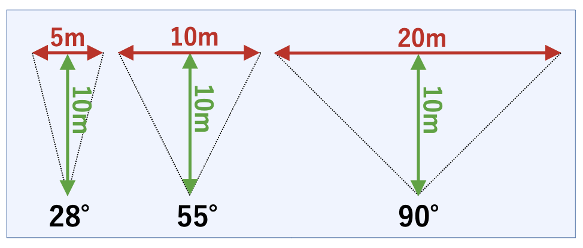
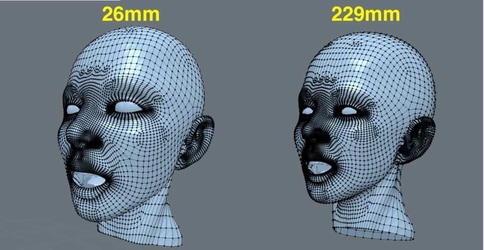
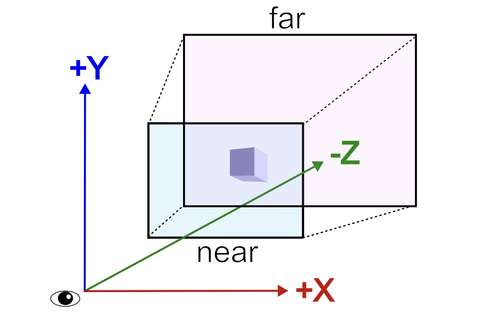
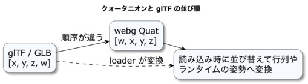
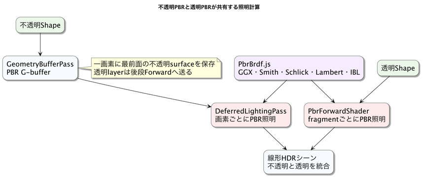

# Shared Rules Inside the Rendering Pipeline

This chapter details matrix layout, projection and orientation, depth, G-buffers, and the color spaces of PBR textures. It connects the positions and appearance described in Chapter 3 and the materials and lighting from Chapter 30 to the values passed to the GPU and the calculations performed there.

## How to read this chapter

### Prerequisites

This chapter assumes the coordinate transforms from Chapter 3, WGSL (WebGPU Shading Language) from Chapter 18, and PBR (Physically Based Rendering) fundamentals from Chapter 30.

### What to read first

Start with coordinate spaces, projection and view matrices, the camera frame, and the meaning of depth.

### What to read when you need it

Refer to Reverse-Z, G-buffer data, linear HDR, sRGB, tone mapping, and opaque/transparent draw order when connecting rendering passes.

### What you will learn

You will be able to describe the coordinate, depth, and color data that rendering passes share or transform.

## Matrix and Vector Conventions

Understanding matrix and vector conventions keeps transform composition consistent with the order in which values are passed to the GPU. `webg`'s `Matrix` class uses 4×4 matrices stored in column-major order in `mat[16]`. `set(row, column, value)` uses the index `column * 4 + row`, producing this memory layout:

```text
| m[0]  m[4]  m[8]  m[12] |
| m[1]  m[5]  m[9]  m[13] |
| m[2]  m[6]  m[10] m[14] |
| m[3]  m[7]  m[11] m[15] |
```

Translation occupies the last column: `m[12] = tx`, `m[13] = ty`, and `m[14] = tz`. The upper-left 3×3 section is primarily the rotation basis. `CoordinateSystem` rebuilds a local matrix from position, quaternion, and uniform scale. Non-uniform scale, with a different factor on each axis, is outside the library's supported transform model.

Vectors are column vectors on the right:

```text
v' = M * v
```

In homogeneous coordinates:

```text
|x'|   | m00 m01 m02 tx |   |x|
|y'| = | m10 m11 m12 ty | * |y|
|z'|   | m20 m21 m22 tz |   |z|
|w'|   |  0   0   0   1 |   |1|
```

`Matrix.mulVector([x, y, z])` applies the matrix to a point with `w = 1`, including translation. In composition, `Matrix.mul(mb)` sets `this = this * mb`; `Matrix.lmul(mb)` sets `this = mb * this`. For affine transforms made from rotation, translation, and uniform scale, these methods preserve the expected affine-transform form in the fourth row. A perspective projection matrix uses its fourth row for perspective division, so use `Matrix.mul_()` to multiply projection and view matrices across all 16 elements. `mul()` and `mul_()` have the same multiplication order but retain different matrix element ranges.

For a parent-child hierarchy, `world = parent * local`. Since vectors are columns, the transform on the right acts first: in `parent * local * v`, `local` acts on `v`, then `parent` acts on the result.

## Coordinate-Space Transform Flow

The meaning of a value depends on its coordinate space. The same `[1, 2, 3]` can be local, world, or camera-relative. Vertices move through this sequence:

```text
local -> world -> view -> clip -> NDC -> screen
```

Local coordinates are relative to a shape or node. Vertices registered with `Shape` begin in this space. World coordinates include the node's position, rotation, scale, and parent hierarchy. Moving a parent changes its children's world positions while each child's local coordinates remain relative to the parent.

View coordinates are measured from the camera. Conceptually, the inverse camera transform is applied to the scene. `webg` derives a view matrix from the view node's world matrix and transforms world positions into view space.

Clip coordinates are the homogeneous `[x, y, z, w]` values immediately after the projection matrix. The GPU clips geometry outside the view frustum, then perspective division and viewport mapping produce screen coordinates.

Normalized Device Coordinates (NDC) result from dividing clip coordinates by `w`. The horizontal and vertical ranges are conceptually -1 to +1; WebGPU depth `z` is 0 to 1. The viewport transform maps NDC to Canvas pixels, whose origin is generally at the upper left and whose `y` increases downward. This differs from the common 3D and NDC convention where positive Y points up.

Thinking in these stages makes debugging concrete: determine whether a vertex is wrong in the shape, after the node's world transform, after the view transform, or after projection and clipping. The same sequence projects a 3D point to a 2D overlay, selection marker, or screen rectangle.

## Homogeneous Coordinates and the Role of `w`

Positions use four components, `[x, y, z, w]`, so that rotation, scale, and translation can be represented in one 4×4 transform. A point uses `w = 1`:

```text
point = [x, y, z, 1]
```

A direction uses `w = 0`:

```text
direction = [x, y, z, 0]
```

Translation affects a point and leaves a direction unchanged. Light directions and normals are directions; moving a camera or model does not translate their orientation. With `w = 0`, the matrix translation terms do not contribute.

After projection, clip coordinates remain `[x, y, z, w]`; the GPU computes `x / w`, `y / w`, and `z / w`. This perspective divide makes farther points appear smaller and closer to the image center. In shader code, read `vec4(position, 1.0)` as a point and `vec4(direction, 0.0)` as a direction.

## Perspective Projection and Field of View

The perspective projection matrix determines the visible range in addition to camera position and orientation. `Matrix.makeProjectionMatrix(near, far, vfov, ratio)` creates it. FOV (Field of View) is the angular extent visible at once.



A smaller FOV shows a narrower range with a telephoto appearance; a larger FOV shows a wider range with a wide-angle appearance.

```js
makeProjectionMatrix(near, far, vfov, ratio) {
  const h = 1.0 / Math.tan(vfov * 0.5 * Math.PI / 180.0);
  const w = h / ratio;

  this.makeUnit();
  this.mat[0] = w;
  this.mat[5] = h;
  this.mat[10] = near / (far - near);
  this.mat[11] = -1.0;
  this.mat[14] = far * near / (far - near);
  this.mat[15] = 0.0;
}
```

This excerpt is the finite-`far` Reverse-Z projection used by the ordinary camera: the near plane maps to depth 1 and the far plane to depth 0. The implementation also validates the near plane, far plane, FOV, and aspect ratio, and supports `far: Infinity`. Shadow maps use a different projection: pass `SHADOW_STANDARD_Z` as the fifth argument so near maps to 0 and far to 1.

`vfov` is the vertical field of view. Since `h = 1 / tan(vfov / 2)`, reducing FOV increases `h` and narrows the visible range, much like using a longer camera lens. Increasing FOV widens the view and strengthens wide-angle perspective.

For a full-frame equivalent, using a 24 mm short sensor dimension gives:

```text
focalLengthMm = 24 / (2 * tan(fovShort / 2))
```

`fovShort` is the short-side FOV. On a landscape display the vertical direction is the short side; on a portrait display the horizontal direction is. Representative full-frame values are:

| Focal length | Horizontal FOV | Vertical FOV |
| ---: | ---: | ---: |
| 8 mm | 132.1° | 112.6° |
| 12 mm | 112.6° | 90.0° |
| 16 mm | 96.7° | 73.7° |
| 24 mm | 73.7° | 53.1° |
| 35 mm | 54.4° | 37.9° |
| 50 mm | 39.6° | 27.0° |
| 85 mm | 23.9° | 16.0° |
| 135 mm | 15.2° | 10.1° |
| 200 mm | 10.3° | 6.9° |



At the same subject size, wide-angle views make near objects look larger and far objects smaller; telephoto views compress apparent depth. `viewAngle` approximates a physical lens FOV and helps a viewer or modeler communicate the intended lens feel.

Choose application FOV for its subject: modeling tools often benefit from a narrower view that makes proportions easy to inspect, while broad landscapes and racing games may use a wider view for context and motion, with more distortion near the edges.

The aspect ratio is `width / height`; for example, a 16:9 display is about 1.78, a square is 1.0, and a portrait phone can be around 0.5. With a fixed vertical FOV, changing the aspect ratio changes horizontal coverage; vertical coverage stays the same. `Screen.getRecommendedFov(base)` treats `base` as the short-side FOV and derives a vertical FOV for portrait layouts so that the short-side view remains similar. Chapter 6 explains its formula.

`near` and `far` define the clipping planes and affect depth precision. Reverse-Z with `depth32float` improves precision farther from the camera. Choose `near` for the actual scene scale and avoid unnecessarily tiny values. Moving the camera closer increases perspective differences; narrowing FOV restricts the visible range while keeping the camera in place. These produce different views and are distinct controls for `EyeRig` design.

## Depth Buffer and Draw Order

The depth buffer stores the nearest depth recorded at each pixel. A fragment passes the depth test when it is nearer than the stored value, and fails when it is farther away. This lets most opaque objects preserve their front-to-back relationship regardless of submission order.

The current ordinary camera uses `depth32float`, clear value 0, and comparison `greater`: nearer fragments have larger depth. Directional and spot shadow maps use Standard-Z with clear value 1 and comparison `less`. The depth formats match, but the numeric directions and reconstruction equations differ; pass each depth texture to the matching consumer.

Selection surfaces, vertex markers, wireframes, and translucent overlays depend on the combination of draw order, depth testing, depth writes, and alpha blending. An overlay that writes depth can hide markers drawn afterward, while an overlay that ignores depth can appear in front even when it is behind scene geometry.

The current renderer draws `OPAQUE` and `MASK` triangles first with depth writes enabled, then gathers `BLEND` triangles across all Shapes. If `alpha_mode` is omitted, a material with alpha 1.0 is treated as `OPAQUE`; a lower alpha is treated as `BLEND`. Transparent triangles are sorted back to front by view-space centroid depth and drawn with depth testing, no depth writes, and alpha blending. Intersecting triangles and cyclic depth relationships need additional geometry splitting or explicit ordering. Depth and draw order together establish the visible front-to-back structure.

## View Direction and the View Matrix

`webg` defines world axes as `+X = right`, `+Y = up`, and `+Z = forward`. A view node looks along its local `-Z`, with local `+X` to its right and local `+Y` up when unrotated. The distinction between world “forward” and camera view direction is common in 3D graphics: place the camera at world `z = 20` and it faces the origin along `-Z`.



The view frustum is a truncated pyramid extending along `-Z`, bounded by `near` and `far`. `vfov` sets its vertical opening. Increasing `vfov` widens the frustum; decreasing it narrows the view.

The low-level path in `Space.draw(eye_node)` and `Matrix.makeView()` follows directly from this model. First update the view node's world matrix, then invert it to obtain the view matrix:

```js
eye_node.setWorldMatrix();
const view_matrix = new Matrix();
view_matrix.makeView(eye_node.worldMatrix);
```

```js
makeView(worldMatrix) {
  this.copyFrom(worldMatrix);
  this.inverse();
}
```

Instead of moving the camera itself, this transforms the whole scene into camera-relative coordinates. Moving the view node right by five units has the same view effect as moving the scene left by five. The sequence is local → world → view → perspective projection → screen. Parent hierarchies and bone transforms ultimately contribute to world coordinates before view and projection.

## Represent Rotation with Quaternions

A quaternion represents a 3D rotation with four values. `webg`'s `Quat` stores them as `[w, x, y, z]`, with `w` as the real component. The identity orientation is `[1, 0, 0, 0]`.

```js
this.q = [1.0, 0.0, 0.0, 0.0];
```

Quaternions avoid Euler-angle gimbal lock and support stable composition and spherical linear interpolation (Slerp). When an application accepts Euler angles, singularity handling and pitch limits belong to its input design. `CoordinateSystem` stores its internal orientation as a quaternion; `setAttitude()` and `rotate()` convert input into `Quat` values.

At runtime, `CoordinateSystem.setMatrix()` converts a `Quat` to the 3×3 rotation part of a `Matrix` with `Matrix.setByQuat()`, then adds translation. `CoordinateSystem.setByMatrix(matrix)` recovers a quaternion with `Quat.matrixToQuat(matrix)`.

For an axis `(ax, ay, az)` and angle `theta`, the conceptual quaternion is:

```text
q = [ cos(theta / 2),
      ax * sin(theta / 2),
      ay * sin(theta / 2),
      az * sin(theta / 2) ]
```

`setRotateX()`, `setRotateY()`, and `setRotateZ()` specialize this for each axis. A valid rotation uses a unit quaternion. Normalize with `Quat.normalize()` to correct accumulated rounding error; `Quat.slerp()` also normalizes its result. Mathematically, rotating vector `v` is `v' = q * v * q^-1`; the ordinary `webg` path converts the quaternion to a rotation matrix.

## Match glTF and GLB Conventions

Quaternion ordering differs between `webg` and glTF/GLB. `webg` uses `[w, x, y, z]`; glTF uses `[x, y, z, w]`.



`SceneLoader` and `ModelBuilder` reorder glTF values when loading them into a `webg` `Quat`. Assigning glTF values directly to `Quat.q` would produce a different rotation. glTF translation, rotation, and scale (TRS) are also loaded into the `Node`/`CoordinateSystem` hierarchy. Uniform scale fits this representation; non-uniform scale is outside the supported model.

## Share Coordinates and Depth Between Rendering and Compute

Compute effects that use depth or reconstruct 3D positions need the same coordinates, camera state, and projection as rendering. `WebgApp` assembles these for its standard rendering. This section is useful when connecting G-buffers, depth-reading effects, or a custom rendering pipeline.

### JavaScript World Coordinates and GPU Precision

JavaScript `Number` uses 64-bit floating point. WGSL `f32`, vertex buffers, and typical uniform matrices use 32-bit floating point, whose representable spacing increases for large values. Passing positions far from the origin directly to the GPU can therefore lose small differences between nearby objects.

`webg` stores world positions for Nodes, physics bodies, and raycasts in JavaScript `Number`. Mesh vertices and bone palettes remain model-local. Keeping world placement in the `Node` transform lets one shape be placed at different locations without baking its world position into every vertex.

### Convert to Camera-Relative Coordinates Before GPU Upload

If large world coordinates are converted to 32-bit values before subtracting the camera position, precision may already be lost. `webg` first computes in JavaScript:

```text
camera-relative position = object world position - camera world position
```

It then converts the small result to GPU `f32` and combines it with the object's world rotation and scale to form the model-view transform. Camera-relative coordinates are a rendering representation. They do not change the coordinate systems used by Nodes, animation, physics, audio, or collision queries. Keep application state in world coordinates and convert only immediately before data enters the GPU path.

### Freeze Rendering State in a Camera Frame

`CameraFrame` is an immutable snapshot of the camera state shared by one render. It contains the camera world matrix and position, view rotation, near and far planes, vertical FOV, aspect ratio, depth convention, and projection matrix. `WebgApp` creates it immediately before drawing, after input and `onUpdate` have updated state.

G-buffer generation, depth reconstruction, SSAO, SSR, fog, and DoF should share the same frame. This prevents reading depth made from one camera view with projection data from another. In the simple forward path using `Space.draw(eye)`, `WebgApp` creates an internal camera snapshot without projection data. The full `CameraFrame` is shared for G-buffer and depth-dependent effects.

`renderFrameToken` identifies that operations belong to the same render frame without exposing the complete `CameraFrame` through a public callback. Pass the same token to offscreen scene setup, `Space.draw()`, and later passes that read its depth. Color-only operations and ordinary single-pass rendering use their input textures and current draw state. The token associates an offscreen scene and its later effects with one frame.

### Use Reverse-Z for the Main Camera

Ordinary camera depth uses Reverse-Z to make floating-point precision useful farther from the camera. `CAMERA_REVERSE_Z` groups the depth convention into an immutable rule object:

| Use | Format | Near depth | Far depth | Clear | Compare |
| --- | --- | ---: | ---: | ---: | --- |
| Main camera | `depth32float` | 1 | 0 | 0 | `greater` |
| Shadow map | `depth32float` | 0 | 1 | 1 | `less` |

For the main camera, clear value 0 represents the unrendered background, and a larger incoming depth is nearer. Shadow maps use Standard-Z from the light's view. Their near/far mapping, clear value, and comparison have the opposite meaning even though the format is identical.

Opaque camera surfaces use `CAMERA_REVERSE_Z.compare` (`"greater"`). Wireframes and overlays that include equal-depth surfaces use `CAMERA_REVERSE_Z.compareEqual` (`"greater-equal"`). Screen-fixed displays that need no depth relationship can use a pass without a depth attachment, or explicitly use `"always"` in a depth-enabled pass.

Pass the public rule object itself at API boundaries. `CAMERA_REVERSE_Z` and `SHADOW_STANDARD_Z` keep format, clear value, comparison, and near/far meaning together. Validating the object identity ensures a partly modified custom rule does not enter a later pass under the same depth format.

### Reconstruct Distance and Position from Depth

Fog, DoF, SSAO, and SSR convert the normalized depth texture back to camera distance or view-space position. For a finite far plane and Reverse-Z depth `d`, positive view-space distance `z` is:

```text
z = near * far / (near + d * (far - near))
```

For an infinite far plane:

```text
z = near / d
```

Background depth is the clear value 0 and is handled separately from object distance. Check for background before reconstruction, then use the pass-appropriate behavior: no occlusion for SSAO, no reflection for SSR, the original scene color for DoF, and unchanged input scene color for fog. Keep the background case explicit instead of adding an epsilon to the denominator and assigning it a large invented distance.

To reconstruct a 3D position from depth, use the FOV, aspect ratio, near, and far values from the same `CameraFrame` that rendered that depth. Obtain projection data from the shared frame.

## Store Materials in the PBR G-buffer

Opaque surfaces first store unlit surface data in a G-buffer. The current attachments are:

- Base color: `rgba8unorm-srgb`
- View-space normal: `rgba8unorm`
- Material: `rgba8unorm` with R=`specular`, G=`roughness`, B=`metallic`, A=`occlusion`
- Emission: `rgba16float`
- Camera depth: `depth32float` using Reverse-Z

Emission has its own HDR attachment instead of an 8-bit material channel, preserving strong colored emission until tone mapping. Transparent surfaces are rendered separately with PBR forward rendering because several surfaces can overlap at one pixel. Opaque lighting and SSR run first, then transparent surfaces are composited.



## Distinguish PBR Texture Roles

The glTF 2.0 core workflow uses five texture roles:

### Base-Color Texture

This is a display-space sRGB color. Convert it correctly before linear-light calculations. `alphaMode` also classifies the material as opaque, masked, or blended.

### Normal Texture

This stores a tangent-space normal. Transform it into the rendering space with the TBN (Tangent, Bitangent, Normal) basis. `normalScale` adjusts bump strength.

### Metallic-Roughness Texture

glTF stores roughness in the G channel and metallic in the B channel. Multiply each sampled value by its corresponding factor.

### Occlusion Texture

This represents details where environment light is less available. `occlusionStrength` adjusts its effect. Direct lighting uses its own light and shadow visibility.

### Emissive Texture

This represents self-emission. Linearize its sRGB values, multiply by `emissiveFactor`, and store the result in the separate HDR attachment.

Base color and emission are color textures converted from sRGB to linear. Normal, metallic-roughness, and occlusion are numeric data textures.

## Load glTF Materials with the Same Meaning

`GltfShape` maps glTF 2.0 core `baseColorFactor`, `metallicFactor`, `roughnessFactor`, all five texture roles, `normalScale`, `occlusionStrength`, `emissiveFactor`, `alphaMode`, `alphaCutoff`, and `doubleSided` to runtime `Shape` values.

The PBR G-buffer and PBR forward pass interpret these values consistently. Metallic and roughness retain their PBR meaning and are managed separately from the Phong `power` parameter.

glTF Transmission extensions are separate from core material inputs. Connecting them to screen-space transmission requires explicit handling of extension energy allocation and alpha value 1.

## Integrate SSR with Environment Reflections

IBL supplies environment reflection, including directions outside the screen. SSR adds reflections from opaque surfaces visible in the current frame, such as moving objects and nearby walls.

Simply adding SSR to IBL counts the same specular energy twice. In `pbr-ssr` mode, deferred lighting writes IBL specular to a separate target. Where an SSR ray hits, the hit radiance replaces that IBL contribution according to confidence:

```text
output
  = base HDR color
    + (SSR specular - IBL specular) × confidence
```

If a ray misses or reaches the screen edge, confidence approaches zero and IBL remains. This makes the contribution of environment and screen-space information explicit.

## Light Transparent Surfaces with the Same BRDF

Transparent objects use PBR forward rendering rather than the opaque G-buffer, while sharing the same PBR meanings. `PbrForwardShader` uses `PbrBrdf.js` for direct and local lights, shadows, IBL, and emission.

The opaque deferred and transparent forward paths differ in ordering. Transparency adds back-to-front compositing, background blur, and transmission. The surface's own GGX reflection uses the same calculation.

## Handle Refraction and Absorption with Transmission

Transmission samples the HDR scene behind a transparent surface at a refracted location. The current screen-space method traces refraction twice:

```text
entering surface
  -> refract from air into the medium
  -> trace through the object
  -> find exit surface and normal
  -> refract from the medium into air
  -> trace against the opaque G-buffer
  -> sample background HDR
  -> apply Beer-Lambert absorption
  -> composite the transparent PBR surface
```

Beer-Lambert absorption uses the traveled path length and attenuation distance. A thicker part absorbs more of the light's color.

Screen-space methods can sample information visible on screen. Off-screen information, unseen back faces, overlapping volumes, layered transparency, and internal reflection during total internal reflection are approximations. `transmissionRayMissFallback` explicitly chooses a source for rays that do not reach a background intersection:

- **`"auto"`**
  - Required input: none
  - Ray-miss result: outward-ray environment color when radiance exists; otherwise clear color
- **`"environment"`**
  - Required input: environment radiance
  - Ray-miss result: outward-ray environment color
- **`"clear"`**
  - Required input: `renderScene()` clear color
  - Ray-miss result: clear color
- **`"constant"`**
  - Required input: `transmissionRayMissColor`
  - Ray-miss result: specified constant color

`"auto"` uses HDR environment radiance if available, otherwise clear color. `"environment"` requires radiance and throws if it is absent. `"clear"` always uses the clear color; `"constant"` uses `transmissionRayMissColor` and throws if that color is missing. Clear and constant colors are specified in display sRGB, then converted to linear HDR before compositing. If an internal boundary cannot be found, or total internal reflection at a later boundary leaves no outward direction, `"constant"` uses its configured color and the other modes use clear color. Environment lookup requires an outward direction.

## Convert the Result for Display with Tone Mapping

PBR lighting remains linear HDR until tone mapping compresses it to display range. In photometric mode, first apply exposure using EV100, then tone-map with an operator such as Reinhard, and finally apply the exact sRGB transfer function.

Increasing exposure brightens direct diffuse, specular, emission, and environment background together with the light sources. If a dark material is hidden by exposure alone, other materials and the background can become clipped. Tune light, material, environment, then exposure according to their separate roles.

## Check Inputs and Outputs Between Passes

When inspecting rendering internals, trace the coordinate space, depth convention, and color representation read and written at each stage. The G-buffer stores pre-lighting surface information; lighting, reflection, and transparency composite linear HDR values; tone-mapped output is display color. Sharing one camera frame keeps reconstructed positions aligned with the view used to draw depth.

Chapter 31 explains the overall ordering and its purpose, Chapter 32 shows JavaScript connections, and Chapter 33 shows how to diagnose each stage. Use this chapter to verify that values retain the same meaning across those passes.

## Summary

Composed rendering passes need consistent coordinate spaces, camera frames, depth rules, color formats, and display conversion. Keeping camera Reverse-Z separate from shadow Standard-Z, linear HDR separate from display color, and G-buffer data separate from the final image makes each pass's inputs and outputs traceable. For internal contact testing and physics stabilization, continue to Chapter 42, “Physics Engine Internals.”
