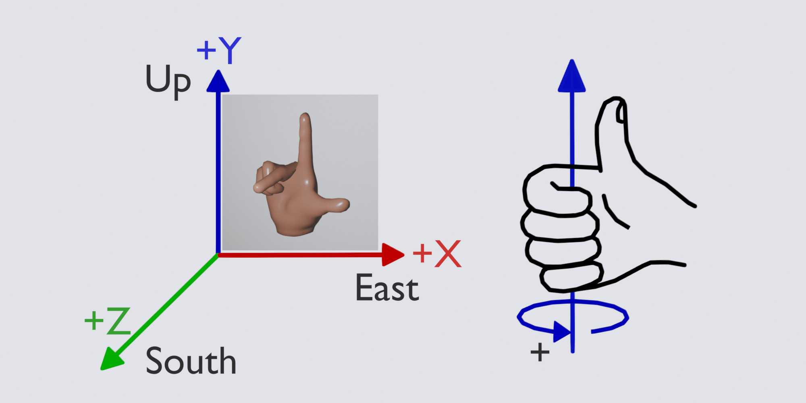
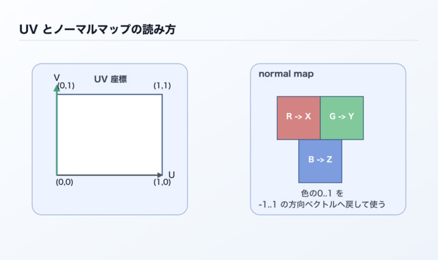

# 3D空間の基礎

3Dの画面を作るときは、物体の位置と向き、それを見るカメラの位置を決めます。本章では、立方体を置き、回し、親子関係を付ける操作を通して、後の章で共通に使う座標の考え方を学びます。

まずは「どの値を変えると、画面のどこが変わるか」を理解しましょう。行列の配列配置や投影式は、描画の内部処理を調べる41章で詳しく扱います。

## この章の読み方

### この章を読む前に必要な知識

JavaScriptの配列と、正負の数で位置を表す考え方があると読みやすくなります。コードは04章のアプリケーションへ追加する短い例として示します。

### 初回に読む範囲

座標の三つの軸、位置と回転、ローカル座標とワールド座標、カメラと画角、表面の法線とUVを順に読んでください。

### 必要になったときに読む範囲

後半の天体と関節の例は、複数の物体をまとめて動かすときに参照します。面を手作りする際の頂点順・法線・UVは38章、行列・投影・クォータニオンの計算規則は41章で確認できます。

### この章を終えた時点でできること

物体を指定した位置へ置き、向きを変え、親子関係を使ってまとめて動かせます。また、カメラの距離と画角が画面の見え方へ与える影響を説明できます。

## 座標の三つの軸を知る

位置はX、Y、Zの三つの数で表します。標準の視点から原点を見る場合、Xの正方向が右、Yの正方向が上です。カメラは自身のローカル座標の-Z方向を向きます。物体やカメラを回すと画面上の方向も変わるため、まずは原点付近に物体を置いた状態で確認します。

ワールド座標は右手系のEUS（East-Up-South）で、東を+X、上を+Y、南を+Zとして扱います。この共通の基準に対し、各物体とカメラは自分のローカル座標を持ちます。



位置`[0, 0, 0]`は原点です。`[2, 0, 0]`ならX方向へ2、`[0, 3, 0]`ならY方向へ3離れた位置を表します。本書の物理や実寸テクスチャの例では、長さの1を1メートルとして揃えます。

次のコードは、すでに用意した`Space`に配置用の`Node`を追加する部分例です。`Node`は位置と向きを持ち、表示する形状は04章で追加します。

```js
const box = space.addNode(null, "box");
box.setPosition(2.0, 1.0, 0.0);
```

ここでは親を`null`にしているので、位置の基準はシーン全体の原点です。次にYの値を2へ変えると、箱の中心が1だけ上へ移ります。物体の中心と底面は異なる位置です。高さ2の箱の底をY=0へ合わせる場合は、中心をY=1へ置きます。

## 向きを変える

回転は、左右へ向きを変える`yaw`、上下へ傾ける`pitch`、横へ傾ける`roll`で指定します。`setAttitude(yaw, pitch, roll)`の角度は度数です。

| 指定 | 回転軸 | 確認する動き |
| --- | --- | --- |
| `yaw` | Y軸 | 左右へ向きを変える |
| `pitch` | X軸 | 上下へ傾ける |
| `roll` | Z軸 | 横へ傾ける |

```js
box.setAttitude(30.0, 0.0, 0.0);
box.rotateY(10.0);
```

`setAttitude()`は姿勢を指定し、`rotateY()`は現在の姿勢へ回転を加えます。この例では、Y軸まわりに30度向けた後、さらに10度回転させます。連続回転では、04・05章のように毎秒の角度へ経過秒数を掛けます。

回転の正方向は右手の親指を軸の正方向へ向けたとき、残りの指が曲がる方向です。軸の正方向側から原点を見ると反時計回りになります。複数軸の回転は`yaw(Y) → pitch(X) → roll(Z)`の規則で指定します。内部ではクォータニオンという四つの数で姿勢を保持し、描画時に行列へ変換します。計算方法は41章で確認します。

## ローカル座標とワールド座標を使い分ける

ワールド座標はシーン全体の原点を基準にした位置です。ローカル座標は親の`Node`を基準にした位置です。親を動かすと、その子も一緒に動きます。この仕組みを使うと、車体と車輪、腕と手、モデルと付属品をまとめて配置できます。

```js
const vehicle = space.addNode(null, "vehicle");
vehicle.setPosition(4.0, 0.0, 0.0);

const lamp = space.addNode(vehicle, "lamp");
lamp.setPosition(0.0, 2.0, 0.0);
```

親の回転と倍率が初期値なら、ランプのワールド位置は`[4, 2, 0]`です。親の車両をX方向へ1動かすと、ランプもX方向へ1動きます。ランプのローカル位置`[0, 2, 0]`はそのまま保たれます。

親を回転させた場合は、子のローカル位置も親の向きに合わせて回ります。例えば、車両の右側へ付けた部品は、車両が向きを変えた後も同じ側に付きます。`setPosition()`へ渡す数を読むときは、その`Node`の親を一緒に確認しましょう。

## カメラの距離と画角で見え方を決める

カメラは物体を見る位置と向きを持ちます。04章では、指定した目標の周囲を回れる周回カメラを使います。物体が小さく見える場合はカメラを近づけ、大きく見える場合は離します。

画角は、カメラから見える角度の広さです。FOV（Field of View：視野角）とも呼びます。webgの`viewAngle`は縦方向の角度を度数で指定します。同じ距離では、画角を広げると広い範囲が入り、物体は小さく見えます。画角を狭めると、狭い範囲が大きく見えます。横方向の範囲はキャンバスの縦横比にも依存します。

透視投影では、手前の物体ほど大きく、遠くの物体ほど小さく映ります。カメラから物体までの距離と画角を分けて調整すると、構図を決めやすくなります。`near`と`far`は描画する奥行きの範囲です。カメラの操作と設定は06章、投影式と深度の精度は41章で詳しく扱います。

## 法線とUVで表面を表す

形状の頂点は表面の位置を表します。法線は表面が向く方向で、光がどの角度から当たるかを計算するために使います。平らな面では法線を揃え、滑らかな曲面では頂点ごとに法線を変えることで、連続した陰影を作れます。

UVは画像上の位置を表す二つの数です。頂点へUVを付けると、表面のどこへ画像のどの部分を貼るかが決まります。通常の画像全体は0から1の範囲で対応付け、繰り返し模様ではその範囲を広げて使います。実寸に合わせた模様は29章で扱います。



ノーマルマップは、表面の細かな向きを画像で指定する方法です。頂点数を保ったまま細かな凹凸の陰影を追加できます。`Primitive`で用意した形状には描画に必要な頂点・法線・UVが含まれるため、最初の表示では生成結果をそのまま使えます。独自の面を作る際は、38章で頂点順、面の表裏、法線、UVの対応を確認します。

## 親子構造を天体と関節へ広げる

`Node` やボーンを使い始めたときに混乱を招きやすいのが、「位置や回転はどの座標系で指定しているのか」という点です。
`webg`では、`Node`もボーンも、親から子へと連なる階層構造として扱います。
各要素は「親から見た自分の位置と向き」を持ちます。これがローカル座標系です。

ここを曖昧にしたままコードを書くと、「地球を回転させた際、月だけでなく太陽まで一緒に動いてしまう」といった、意図しない挙動に直面しやすくなります。
逆に、親子構造とローカル座標系の意味がつかめると、`Node` の配置、カメラリグ、ボーン階層、アニメーションのどれも同じ考え方で理解できるようになります。

### 天体の階層構造による理解

親子構造を最も直感的に理解しやすい題材が、太陽、地球、月の関係です。
太陽はそれ自体が自転し、地球は太陽の周りを公転しながら自転し、月は地球の周りを公転しながら自転します。
このとき「月の位置」は、地球のワールド位置と、地球から見た月のローカル位置を合成して決まります。

`Node` で書くと、次のような親子関係になります。

```text
sun
└── earthOrbit
    └── earth
        └── moonOrbit
            └── moon
```

ここで `earth` のローカル位置を `[3.5, 0, 0]` に設定すると、「`earthOrbit` という親ノードから見て、地球本体がX方向へ3.5離れている」という意味になります。
`earthOrbit` 自体を回転させれば、その子である `earth` は半径3.5の円を描いて公転して見えます。

行列として書くと、月のワールド行列は次のように合成されます。

```text
sunWorld = sunLocal
earthOrbitWorld = sunWorld * earthOrbitLocal
earthWorld = earthOrbitWorld * earthLocal
moonOrbitWorld = earthWorld * moonOrbitLocal
moonWorld = moonOrbitWorld * moonLocal
```

列ベクトル形式では右側の変換から先に作用するため、`moonWorld * v` を計算するとき、まず月自身のローカル形状 `v` に `moonLocal` が作用し、その後に地球まわりの公転、地球自身の配置、太陽系全体の向きが順番に重なります。
「子は親の変換結果の上に積み重なる」と考えると理解しやすくなります。

実際のコードでは、回転のためのpivotと見た目の本体を分けると構造的に整理されます。

```js
const sun = app.space.addNode(null, "sun");

const earthOrbit = app.space.addNode(sun, "earthOrbit");
const earth = app.space.addNode(earthOrbit, "earth");
earth.setPosition(3.5, 0.0, 0.0);

const moonOrbit = app.space.addNode(earth, "moonOrbit");
const moon = app.space.addNode(moonOrbit, "moon");
moon.setPosition(1.2, 0.0, 0.0);

app.start({
  onUpdate({ deltaSec }) {
    sun.rotateY(0.2 * deltaSec);        // 太陽の自転
    earthOrbit.rotateY(0.8 * deltaSec); // 地球の公転
    earth.rotateY(2.5 * deltaSec);      // 地球の自転
    moonOrbit.rotateY(2.2 * deltaSec);  // 月の公転
    moon.rotateY(1.6 * deltaSec);       // 月の自転
  }
});
```

この構造では、`earthOrbit` の回転はその子孫である地球と月へ伝わり、太陽自身の位置と姿勢はそのまま保たれます。
逆に `sun` を動かせば、その子孫である地球と月はまとめて影響を受けます。
これは「親の変換は子へ伝わるが、子の変換は親へ戻らない」という階層構造の基本です。

### 人体関節への応用と座標伝播

同じ原理は人体の関節でもそのまま使えます。
腰が動けば肩も腕も手も一緒に動きます。
肩を回せば上腕、前腕、手が動きます。
肘を曲げると前腕と手が動き、肩や腰は親側の基準としてその位置を保ちます。
この関係は、まさに親子構造そのものです。

例えば右腕を単純化すると、次のような階層になります。

```text
waist
└── torso
    └── shoulder
        └── upperArm
            └── foreArm
                └── hand
```

`hand`の位置は、「前腕の先端からどれだけ離れているか」という親を基準にした座標で定義します。
そうしておくと、腰の移動、胴体のひねり、肩の回転、肘の曲げがすべて自然に手先へ伝わります。

```js
const waist = app.space.addNode(null, "waist");
waist.setPosition(0.0, 0.0, 0.0);

const torso = app.space.addNode(waist, "torso");
torso.setPosition(0.0, 1.8, 0.0);

const shoulder = app.space.addNode(torso, "shoulder");
shoulder.setPosition(0.9, 0.9, 0.0);

const upperArm = app.space.addNode(shoulder, "upperArm");
upperArm.setPosition(1.2, 0.0, 0.0);

const foreArm = app.space.addNode(upperArm, "foreArm");
foreArm.setPosition(1.1, 0.0, 0.0);

const hand = app.space.addNode(foreArm, "hand");
hand.setPosition(0.6, 0.0, 0.0);
```

この状態で `shoulder.rotateZ(...)` を呼べば、上腕、前腕、手はまとめて円弧を描いて動きます。
さらに `foreArm.rotateZ(...)` を呼べば、肘から先だけが追加で曲がります。
これは「手のワールド行列」が、腰から手までのすべてのローカル行列を掛け合わせた結果だからです。

```text
handWorld
  = waistWorld
  * torsoLocal
  * shoulderLocal
  * upperArmLocal
  * foreArmLocal
  * handLocal
```

この見方に慣れておくと、見た目が崩れたときにも「手のローカル値が悪いのか」「肩の回転が想定より大きいのか」「腰の向きまで含めた合成結果が問題なのか」という切り分けが容易になります。

### ボーン階層における座標変換

ボーンは特別な仕組みに見えますが、階層構造という意味では `Node` と同じです。
スキニングで使うボーンも、「親ボーンから見た子ボーンの位置と向き」をローカル座標で持ち、親の変換を受け継いでワールド姿勢を作ります。

```js
const skeleton = new Skeleton();

const waistBone = skeleton.addBone(null, "waistBone");
const spineBone = skeleton.addBone(waistBone, "spineBone");
const shoulderBone = skeleton.addBone(spineBone, "shoulderBone");
const upperArmBone = skeleton.addBone(shoulderBone, "upperArmBone");
const foreArmBone = skeleton.addBone(upperArmBone, "foreArmBone");
const handBone = skeleton.addBone(foreArmBone, "handBone");

waistBone.setRestPosition(0.0, 0.0, 0.0);
spineBone.setRestPosition(0.0, 1.2, 0.0);
shoulderBone.setRestPosition(0.9, 0.8, 0.0);
upperArmBone.setRestPosition(1.1, 0.0, 0.0);
foreArmBone.setRestPosition(1.0, 0.0, 0.0);
handBone.setRestPosition(0.6, 0.0, 0.0);
```

ボーン階層は、頂点ごとのウェイトと組み合わせてメッシュを変形するために使います。Node階層による配置と同じ親子座標の考え方を、形状の変形へ広げています。
しかし、「親の回転が子へ伝わる」「ワールド姿勢は親と自分のローカル変換の積で決まる」という原理は同一です。
40章のスキニングでは、この階層に逆バインド行列と頂点ウェイトが加わることで、メッシュが関節に追従して曲がる仕組みを扱います。

### 階層構造を読み解くポイント

親子構造でコードを読むときは、次の3点を先に確認すると整理しやすくなります。

1. そのノードやボーンの `setPosition()` は「親から見た距離」を置いているのか
2. 回しているノードは「見た目の本体」なのか、それとも「公転や関節回転のpivot」なのか
3. いま知りたい値はローカル座標なのか、`getWorldPosition()` などで得るワールド座標なのか

`webg` のサンプルやコアを読むときも、この区別を意識すると理解が速くなります。
例えば `WebgApp` のカメラでは `cameraRig -> cameraRod -> eye` という親子構造を使って軌道を実現していますし、スキニングではルートボーンから子ボーンへ姿勢が伝わります。
見た目は違っても、座標変換の仕組みは共通です。

本文の内容を実際に動かして確認したい場合は `examples/03_01.html` を参照してください。
このページでは、左側に太陽・地球・月、右側に腰・肩・腕・手の階層を置き、同じ「親の変換が子へ伝わる」という原理が別の題材でも同様に成立することを確認できます。
さらに、ボーン階層の実際の変形は40章の `examples/40_01.html` と `40_02.html` で確認できます。


## まとめ

位置を指定するときは座標の基準、回転を指定するときは軸と角度、親子構造を作るときは親から見た位置を確認します。カメラの距離と画角を調整すれば、同じシーンを異なる構図で表示できます。

次の04章では、これらの基準を使って立方体を表示します。面を自作する段階で38章へ、変換の計算を詳しく調べる段階で41章へ進めます。
