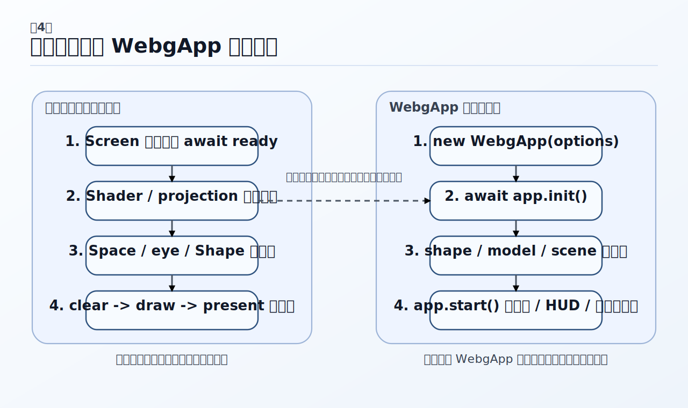

# WebGPUとwebgの最小描画

この章では、`webg` で最初の 3D アプリを動かすまでの流れをたどります。`webg` を使い始めたとき、最初に大切なのは API を網羅的に覚えることではなく、最初の 1 本をどの順序で組み立てればよいかを理解することです。そのため本章では、まず描画の骨格を自分の手で確かめ、そのあとで `WebgApp` を使った標準的なアプリ構成へ進む、という順で説明します。ローレベルの最小構成と `WebgApp` の構成を分けて考えることで、どこまでが描画の土台で、どこからがアプリとしての補助機能なのかが見えやすくなります。 

実際にサンプルを起動する前に、リポジトリの配置やローカルサーバーの立て方を確認したい場合は、第2章「インストールと実行環境」を先に読んでください。本章は、その準備が整ったあとに、「最初のアプリをどう組むか」に集中するための章です。 

この章で最初に押さえておきたいのは、`webg` では最初からローレベルと `WebgApp` を混ぜて考えないほうが理解しやすい、ということです。描画の土台を理解したいなら `Screen + Space + Shape` から始めます。サンプルや小規模アプリを早く作りたいなら `WebgApp` から始めるほうが自然です。また、最初の段階で特に外しやすいのが `await screen.ready` と `shape.endShape()` です。この 2 つを落とすと、描画が出ない、GPU バッファが確定しない、といった初歩的な失敗につながります。さらに、`webg` ではカメラ、HUD、診断情報、入力を「後から付け足すもの」とは考えません。見た目の表示だけでなく、操作説明、状態表示、調査用レポートまでをアプリの一部として扱う考え方を取っています。 

## 最初のアプリを組むときの見方

3D アプリの初期実装では、描画の土台、カメラ、入力、HUD、診断情報、アセット読み込みを一度に始めてしまいがちです。しかし、最初の段階で要素が混ざると、何が原因で動かないのかを切り分けにくくなります。そのため `webg` では、最初の 1 本を組む手順を、描画の土台からアプリの標準構成まで段階的に説明しています。まずコアの最小構成を押さえ、そのあとで `WebgApp` を使った標準構成へ進むと、どこまでがコアで、どこからが補助機能かを読み分けやすくなります。 

本章の目標は、メソッド名を暗記することではありません。描画が出るまでに最低限必要な流れをつかみ、そのうえで HUD、診断情報、タッチ入力、音声などをどの段階で足していけばよいかの基準を持つことです。クラスやメソッドを逆引きしたい場面では付録「API一覧」を参照してください。この章は、あくまで標準手順をそろえるための章です。 

最初の段階で特に外しやすいのは、`await screen.ready` を待たずに初期化を進めること、`shape.endShape()` を忘れること、resize 後に projection を更新しないこと、操作方法を画面に出さずコード内の前提だけで進めること、調査時に `console.log()` だけに寄って診断情報レポートを残さないこと、サンプルを `main.js` だけ読んで `*.txt` を見ないことです。本章では、こうした失敗を避けるための標準手順を先に示します。 

## 最初のアプリを組む標準フロー



*図4-1 最初は `Screen`、`Shader`、`Space`、`Shape`、描画ループの骨格を押さえ、そのあとで `WebgApp` の標準構成へ進むと、補助機能の位置づけが見えやすくなります。*

`webg` で最初のアプリを組むときは、次の順で進めると組み立てやすくなります。まず `Screen` を作って `await screen.ready` を待ち、次にシェーダーと projection を初期化し、そのあと `Space` と視点ノードを用意します。続いて `Shape` を作り、`endShape()` で確定し、最後に `clear -> draw -> present` のループを組みます。必要に応じて、そのあとで `WebgApp` へ移し、HUD、カメラ、タッチ入力、診断情報を加えていく、という順です。 

ここでのポイントは、標準フローが大きく二段階に分かれていることです。最初の段階では、ローレベルで描画の骨格を理解します。`Screen`、シェーダー、projection、`Space`、`Shape`、描画ループの関係を押さえることが目的です。次の段階では、`WebgApp` を使ってアプリとしての標準構成に乗せます。カメラ、HUD、タッチ入力、診断情報、デバッグドックを組み込みたいなら、こちらの流れのほうが自然です。 

## ローレベルの最小例

まずは、最小構成で立方体を 1 つ描画する例を見ます。この例の目的は、「`webg` で描画を出すまでに本当に必要な骨格は何か」を確認することです。 

```js
import Screen from "./webg/Screen.js";
import Space from "./webg/Space.js";
import Primitive from "./webg/Primitive.js";
import Shape from "./webg/Shape.js";
import Matrix from "./webg/Matrix.js";
import SmoothShader from "./webg/SmoothShader.js";

const screen = new Screen(document);
await screen.ready;
screen.setClearColor([0.1, 0.15, 0.1, 1.0]);

const shader = new SmoothShader(screen.getGL());
await shader.init();
Shape.prototype.shader = shader;

const projection = new Matrix();
const applyViewportLayout = () => {
  screen.resize(
    Math.max(1, Math.floor(window.innerWidth)),
    Math.max(1, Math.floor(window.innerHeight))
  );
  projection.makeProjectionMatrix(
    0.1,
    1000.0,
    screen.getRecommendedFov(55.0),
    screen.getAspect()
  );
  shader.setProjectionMatrix(projection);
};
applyViewportLayout();
window.addEventListener("resize", applyViewportLayout);
window.addEventListener("orientationchange", applyViewportLayout);

shader.setLightPosition([120.0, 180.0, 140.0, 1.0]);

const space = new Space();
const eye = space.addNode(null, "eye");
eye.setPosition(0.0, 0.0, 28.0);

const shape = new Shape(screen.getGL());
shape.applyPrimitiveAsset(Primitive.cube(8.0, shape.getPrimitiveOptions()));
shape.endShape();
shape.setMaterial("smooth-shader", {
  has_bone: 0,
  use_texture: 0,
  color: [1.0, 0.5, 0.3, 1.0]
});

const node = space.addNode(null, "obj");
node.addShape(shape);

const loop = () => {
  node.rotateY(0.8);
  node.rotateX(0.4);
  screen.clear();
  space.draw(eye);
  screen.present();
  requestAnimationFrame(loop);
};
loop();
```

この例では、次の順番を意識して読むと分かりやすくなります。まず `Screen` とシェーダーを初期化し、次にビューポートと projection を同期させ、そのあと `Space` と `eye` を作ります。続いて `Shape` を作り、`endShape()` で GPU バッファを確定し、最後に `clear -> draw -> present` の順で毎フレーム描画します。この順序が見えると、後で `WebgApp` を読むときに、何が自動化されているかを切り分けやすくなります。逆に、この骨格を知らないまま `WebgApp` だけを見ると、どこまでが最小限の描画処理で、どこからが補助機能なのかが見えにくくなります。 

## `WebgApp` の標準例

次に、同じ考え方を `WebgApp` で書いた例を見ます。この例の目的は、ローレベルで理解した骨格が、実際のアプリ構成ではどのように整理されるかを知ることです。 

```js
import WebgApp from "./webg/WebgApp.js";
import Shape from "./webg/Shape.js";
import Primitive from "./webg/Primitive.js";
import EyeRig from "./webg/EyeRig.js";

const CAMERA_CONFIG = {
  target: [0.0, 0.0, 0.0],
  distance: 8.0,
  yaw: 0.0,
  pitch: 0.0,
  bank: 0.0
};

const app = new WebgApp({
  document,
  messageFontTexture: "./webg/font512.png",
  clearColor: [0.1, 0.15, 0.1, 1.0],
  camera: CAMERA_CONFIG
});

await app.init();

const shape = new Shape(app.getGL());
shape.applyPrimitiveAsset(Primitive.cube(2.0, shape.getPrimitiveOptions()));
shape.endShape();
shape.setMaterial("smooth-shader", {
  has_bone: 0,
  use_texture: 0,
  color: [1.0, 0.5, 0.3, 1.0]
});

const obj = app.space.addNode(null, "obj");
obj.addShape(shape);

const orbit = new EyeRig(app.cameraRig, app.cameraRod, app.eye, {
  document,
  element: app.screen.canvas,
  input: app.input,
  type: "orbit",
  orbit: {
    target: CAMERA_CONFIG.target,
    distance: CAMERA_CONFIG.distance,
    yaw: CAMERA_CONFIG.yaw,
    pitch: CAMERA_CONFIG.pitch,
    minDistance: 4.0,
    maxDistance: 18.0,
    wheelZoomStep: 1.0
  }
});
orbit.attachPointer();

app.setGuideLines([
  "Drag: orbit",
  "2-finger drag: pan",
  "Pinch / wheel: zoom"
], {
  anchor: "bottom-left",
  x: 0,
  y: -2
});

app.setStatusLines([
  "Manual example",
  "WebgApp + EyeRig"
], {
  anchor: "top-left",
  x: 0,
  y: 0
});

app.start({
  onUpdate: ({ deltaSec }) => {
    orbit.update(deltaSec);
    obj.rotateY(0.8);
    obj.rotateX(0.4);
  }
});
```

この例では、ローレベルの例に対して、`Screen`、`Space`、カメラリグ、入力、HUD の土台が `WebgApp` 側へ移ります。また、ガイドとステータスをすぐ画面へ出せること、`EyeRig` を足すだけでマウスやタッチによる視点操作を確認しやすいこと、`start({ onUpdate })` で標準ループに乗れることが大きな違いです。サンプルを標準構成で組むなら、この形を土台にするのが自然です。ローレベルの例は「描画の骨格」を理解するためのもの、`WebgApp` の例は「アプリの標準構成」を理解するためのもの、と分けて読むと迷いにくくなります。 

## 最小描画のあとに何を足していくか

`webg` では、HUD や診断情報を後から無理に付け足すより、初期段階からアプリの構造に含めておくほうが扱いやすくなります。短い操作説明や状態表示には `Message`、`setGuideLines()`、`setStatusLines()` を使い、長文の説明や失敗理由には `FixedFormatPanel` を使います。調査用レポートには `Diagnostics` と `DebugProbe` を使い、シーン上に重ねる UI には `DialogueOverlay` や `UIPanel` を使います。ここでは細部の使い方まで覚える必要はありませんが、`webg` では表示まわりも描画と同じくらい構造の一部として扱う、という考え方を押さえておくと後の章が読みやすくなります。 

入力については、キーボード比較名を小文字にそろえることが基本です。タッチ入力まで含めて統一したい場合は `Touch` と `InputController` を使います。カメラ操作を標準のヘルパーで組みたい場合は `EyeRig` が最初の入口になります。モデル読み込み、シーンの JSON 化、アニメーション、音声、ポストプロセスへと進めたいなら、その順に層を足していくほうが自然です。全部を同時に始めるより、描画、入力、アセット、アニメーション、音声の順に積んでいくほうが、問題を切り分けやすくなります。 

## サンプルはどう読めばよいか

サンプルを読むときは、まず `webg/samples/index.html` で全体像を見て、そのあと対応する `webg/samples/*/*.txt` を読んで目的を知り、最後に `main.js` を初期化、入力、更新、描画、HUD の順で追う、という順番が分かりやすくなります。最初に読むサンプルとしては、`low_level`、`high_level`、`scene`、`shapes`、`gltf_loader`、`sound` が入りやすくなります。`main.js` だけを見るのではなく、`*.txt` とセットで読むことで、「何を示すサンプルなのか」と「どう実装しているのか」がつながりやすくなります。 

## よくあるミスと次に読む章

最初の段階でよくあるミスは、`await screen.ready` を忘れること、`shape.endShape()` を忘れること、resize 後に projection を更新しないこと、`event.key` を小文字化せずに比較すること、操作説明を画面に出さないこと、診断情報レポートを残さずに `console.log()` だけで追うこと、`webg/samples/*/*.txt` を読まずに `main.js` だけで判断することです。本章は、こうした失敗を避けるための最初の基準をそろえる役割を持っています。 

この章の次に読むものとしては、第5章「WebgAppによるアプリ構成」がもっとも自然です。ここで扱った `WebgApp` の標準例を、次章ではより立体的に整理し、3D シーンの考え方と結び付けて見ていきます。カメラ制御を先に詳しく知りたい場合は、第6章「カメラ制御とEyeRig」へ進んでも構いません。 

## まとめ

この章で最も大事なのは、「最初の描画を出すための骨格」と、「そこから標準的なアプリ構成へ移る流れ」を分けて理解することです。ローレベルの最小例では、`Screen`、シェーダー、projection、`Space`、`Shape`、`clear -> draw -> present` の順序が土台になります。一方で `WebgApp` は、その土台の上にカメラ、入力、HUD、診断情報といったアプリとしての標準構成をまとめて与えてくれます。ここが見えると、以後の章で扱うモデル、シーン、UI、入力、診断情報も、ばらばらの機能ではなく、一つのアプリを構成する層として読みやすくなります。 
