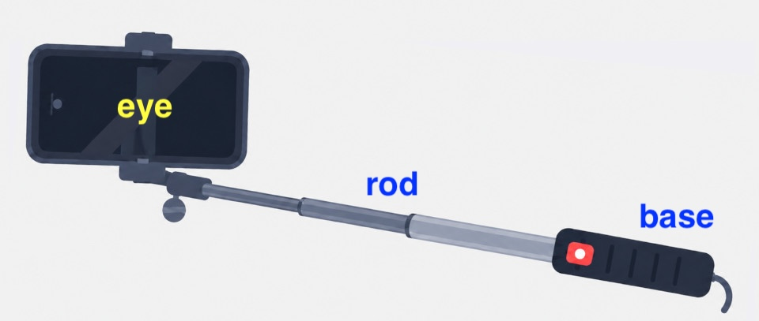
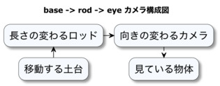

# カメラ制御とEyeRig

本章では、注視点、カメラまでの距離、ヨー角、ピッチ角から視点の位置と姿勢を作り、マウス、タッチ、キーによる操作へ結び付けます。
これらの状態を`EyeRig`でまとめて扱うことで、行列を直接変更せずに、軌道回転、追従、ズームを組み合わせられます。
入力と描画が同じカメラ状態を参照するための更新方法も確認します。

## この章の読み方

### この章を読む前に必要な知識

03章の座標変換と05章のWebgApp更新処理を知っていると読みやすくなります。

### 初回に読む範囲

投影行列、EyeRigの基本構成、軌道視点、ロール補正、パン操作を先に読んでください。

### 必要になったときに読む範囲

一人称、追従、モード切り替え、姿勢補間、補助メソッドは、視点方式が決まったときに参照してください。

### この章を終えた時点でできること

軌道・一人称・追従などの視点を選び、位置・視線・上方向・入力を分けて実装できます。

## 用途に応じて視点の動かし方を選ぶ

`EyeRig`は、対象の周囲を回る軌道視点、自分の目で世界を見る一人称視点、移動する対象を追う追従視点を、共通の構成で扱うための機能です。
本章では、視点の位置、向き、距離、注視対象をどのように設定し、アプリケーションの目的に合う操作へ接続するかを説明します。

> **この章の読み方:** まず下表で用途を選び、該当モードの節を読んでください。視野角、親ノード、上方向の基準、補間は、構図や追従に問題が出たときの確認項目です。

- **軌道モード**
  - `base`：注視中心
  - `rod`と`eye`：距離と視線
  - ローカル前方：カメラは`-Z`を見る
- **一人称モード**
  - `base`：身体または取付位置
  - `rod`と`eye`：目の高さと独立視線
  - ローカル前方：移動と視線とも`-Z`基準
- **追従モード**
  - `base`：カメラの取付位置
  - `rod`と`eye`：対象への自動姿勢と距離
  - ローカル前方：カメラは`-Z`を見る

3Dアプリケーションで最初に考えるべきことの一つは、「ユーザーに世界をどう見せるか」です。
同じ3D空間でも、展示物を見るアプリ、建物の中を歩くアプリ、キャラクターや乗り物を操作するアプリでは、気持ちよく感じるカメラの動きがまったく異なります。

展示物を見るなら、対象を中心に回転する軌道カメラが使いやすくなります。
建物の中を移動するなら、自分の目で見ているような一人称カメラが自然です。
移動する対象を見失わないようにするなら、対象の後ろから追いかける追従カメラが必要になります。

カメラ制御を選ぶときには、視点の動かし方だけでなく視野角も重要です。
人間は周辺視野まで含めると、水平に180度前後の広い範囲を感じ取れます。
一方、特定の物体を詳しく見る中心視野は、それよりずっと狭くなります。
モデルビューアでは、30度から40度程度の画角が自然に感じられることがあります。

建物内を歩く一人称の用途では、狭すぎる視野角は操作しにくさにつながります。
たとえば幅0.8 mから0.9 mのドアを1 m手前から見ると、全体を収めるには40度を超える水平画角が必要です。
視野角が狭いと、壁、入口、曲がり角の位置関係をつかみにくくなります。

したがって、カメラのモードと視野角は、アプリの目的に合わせて決めます。
対象物の観察には狭めの画角、ウォークスルーや追従には少し広めの画角が適しています。

以上のように、カメラ制御はアプリケーションの目的と強く結びついています。
`EyeRig`は、その違いを `cameraRig`、`cameraRod`、`eye` という3段構造に整理して扱うための仕組みです。



本章では、`webg/EyeRig.js` と `webg/WebgApp.js` をベースに、各ノードの役割や3段構成を採用している理由、そして利用者側で制御すべきポイントについて詳述します。
05章で解説した `WebgApp` の標準リグの上に、どのように視点操作を実装するかを順に紐解いていきましょう。

まず理解しておくべき重要な点は、視点の本体は `EyeRig` クラスそのものではなく、`Space.setEye(node)` によって指定された `eye` ノードであるということです。
`EyeRig` はカメラを描画するクラスではなく、`cameraRig`、`cameraRod`、`eye` という3つの `Node` に対して、一定の規則に基づいた位置と回転を与えるための支援的な役割を担います。
最終的に画面に何が映るかを決定しているのは、あくまで `eye` ノードです。

また、`base -> rod -> eye` という階層構造は、回転と距離の役割を分離しやすくするための設計です。
軌道視点では注視点、追従視点では追従対象、一人称視点では身体の向きと視線の向きを個別に制御したい場面が多くあります。
ここで重要になるのが、`setAngles()` と `setLookAngles()` の使い分けです。
`setAngles()` は `base` や `rod` の向きを変更し、視点の土台そのものを動かす操作です。
対して `setLookAngles()` は `eye` 側の独立した視線を制御するもので、進行方向とは異なる方向を向かせるための補助的な操作となります。

さらに、`new EyeRig(...)` で直接構成する場合は、`attachPointer()`で入力インターフェースを接続し、`update(deltaSec)`で視点制御を進めます。
`attachPointer()`はマウス、タッチ、ペンなどを受け付ける入口で、モード切り替え、追従対象への追随、キーボード操作の反映は毎フレームの`update(deltaSec)`が担当します。
一方、標準の軌道モードで `WebgApp.createOrbitEyeRig()` を使う場合は、ポインター入力の接続と毎フレームの `update(deltaSec)` が `WebgApp` によって管理されます。
この標準構成では、`WebgApp`が毎フレームの更新を一つの入口として管理します。アプリケーション側は手動`update()`を重ねず、二重更新を防ぎます。

## 視点制御の基盤となる3段構成の設計思想

`base`、`rod`、`eye`の3段構成は、注視点の移動、周囲を回る回転、カメラまでの距離、独立した視線を別々に操作するために使います。
役割を`Node`ごとに分けることで、軌道、一人称、追従を切り替えても同じ値を相互に上書きせず、入力処理を再利用できます。



EyeRigは `base`、`rod`、`eye`の3段に分けることで、水平回転、高低角、最終視点を独立して扱いやすくしています。

3Dアプリケーションでは、「どこを見るか」だけでなく、「どこを中心に回転するか」「誰を追跡するか」「身体の向きと視線の向きを分けるか」といった要求を場面に応じて切り替える必要があります。
視点を単一の座標のみで管理すると、軌道視点と一人称視点を共存させた際に制御概念が混在し、設計が複雑になります。
`webg` が `base -> rod -> eye` という3段構成を採用しているのは、これらの役割分担を明確に保つためです。

カメラ全体の基準位置を `base`、そこからの回転や構図を `rod`、そして最終的な位置と独立視線を `eye` に割り当てることで、モードが切り替わっても一貫した考え方で制御が可能になります。
`WebgApp.createCameraRig()` もこの設計思想に基づいて標準のカメラノードを作成します。

```js
createCameraRig() {
  this.cameraRig = this.space.addNode(null, this.camera.rigName);
  this.cameraRig.setPosition(...this.camera.target);
  this.cameraRig.setAttitude(this.camera.yaw, this.camera.pitch, this.camera.roll);
  this.cameraRod = this.space.addNode(this.cameraRig, this.camera.rodName);
  this.cameraRod.setPosition(0.0, 0.0, 0.0);
  this.cameraRod.setAttitude(0.0, 0.0, 0.0);
  this.eye = this.space.addNode(this.cameraRod, this.camera.eyeName);
  this.eye.setPosition(0.0, 0.0, this.camera.distance);
  this.eye.setAttitude(0.0, 0.0, 0.0);
  this.space.setEye(this.eye);
}
```

ここで重要なのは、`EyeRig` がなければ視点を作成できないわけではないということです。
`EyeRig` は、既存の3段構成に対して軌道 / 一人称 / 追従という意味付けを与えるヘルパーであり、必要に応じて合焦対象を表す設定も保持します。
`WebgApp.init()` は標準の `cameraRig`、`cameraRod`、`eye` を作成し、`space.setEye(this.eye)` までを完了させるため、利用者はその構造の上に `EyeRig` を適用させるだけで十分です。

モードごとの役割分担を整理すると以下のようになります。
- 軌道視点では、`base`が注視点、`rod`がヨー角とピッチ角、`eye`が距離を担います。
- 一人称視点では、`base`が身体の位置とヨー角、`rod`が目の高さ、`eye`が独立した視線を担います。
- 追従視点では、`base`がカメラ側の基準位置、`rod`が比較的安定した基準構図、`eye`が距離と対象を向く動的な追跡姿勢を担います。

このように共通構造を持つことで、「全景を俯瞰する」「主人公の視点で歩く」「対象を後方から追う」といった異なる視点操作を、同一の型で効率的に扱うことができます。

ここで、`base` の親子関係は `EyeRig` が決めるものではない点に注意してください。
移動・回転する乗り物の動きをそのまま継承したい場合は、`base` を乗り物または取り付け用ノードの子にします。
同じ位置へ移動しても乗り物の自転やロールを継承したくない場合は、乗り物とは独立した回転しないノードを用意し、必要な位置だけをアプリケーション側で反映します。

各ノードへ設定される位置と姿勢は、その親を基準とするローカル変換です。
したがって、最終的なワールド位置とワールド姿勢は、アプリケーションが構成した親子階層と、`EyeRig` が設定するローカル変換を合成した結果になります。
`EyeRig` はカメラ側のローカル変換を更新し、対象オブジェクトの移動とカメラの親子関係はアプリケーションが管理します。

アプリケーションと `EyeRig` の役割を分けると、次のようになります。

* アプリケーション
  - `base` の親、継承する移動と回転、対象オブジェクトの移動、モード切り替え、入力の割り当て
* `EyeRig`
  - モードごとの状態、`base`、`rod`、`eye`へのローカル変換、入力値の変換、追従モードの注視姿勢と補間、DoFへ渡す合焦距離の解決

`EyeRig`が持つ合焦設定は、「どのNodeまたはどの距離へ焦点を合わせるか」をカメラ側で表します。`WebgApp`がその結果を現在の`CameraFrame`へ記録し、ぼかし処理は後段のDoFへ渡します。
DoFの有効状態、`focusRange`、ぼかし半径などは、後段の`DofPass`または`ComputeEffectPipeline`が管理します。

## 視野角と投影行列の管理

カメラを理解する上で注意すべき点は、`EyeRig` が制御するのは「位置と姿勢」と「合焦対象」までであり、「どれくらい広く写すか（画角）」や「どの程度ぼかすか」は別の制御領域であるということです。
`webg` では `WebgApp` が `viewAngle`、`projectionNear`、`projectionFar` を保持し、`updateProjection()` メソッドを通じて現在のシェーダーへ投影行列を転送します。

```js
updateProjection(viewAngle = this.viewAngle) {
  const proj = new Matrix();
  const vfov = this.screen.getRecommendedFov(viewAngle);
  proj.makeProjectionMatrix(
    this.projectionNear,
    this.projectionFar,
    vfov,
    this.screen.getAspect()
  );
  this.projectionMatrix = proj;
  if (this.shader?.setProjectionMatrix) {
    this.shader.setProjectionMatrix(proj);
  }
  return proj;
}
```

ここで `viewAngle` は、短辺方向の見え方を決める基準視野角です。
投影行列そのものは縦方向のFOV (`vfov`) を受け取りますが、現代の画面はPCの横長画面とスマートフォンの縦長画面でアスペクト比が大きく異なります。
同じ `viewAngle` の体感的なズーム量を揃えるには、画面の短辺を基準に縦FOVを調整します。固定した縦FOVでは、横長画面と縦長画面で見える範囲が変わります。

この4引数の`makeProjectionMatrix()`は、通常カメラ用のReverse-Z投影を作ります。
near planeは深度1、far planeと未描画背景は深度0へ対応します。
シャドウマップ用の通常Z正射影は別の処理で`SHADOW_STANDARD_Z`を明示します。そのため、カメラ投影の方式はReverse-Zのまま保ち、シャドウ用投影だけをStandard-Zとして管理します。

`webg` ではこの差を抑えるため、`Screen.getRecommendedFov(base)` が `base` を「短辺方向のFOV」として解釈し、現在のアスペクト比から投影行列へ渡す縦FOVを計算します。
アスペクト比は次のように定義されます。

```text
aspect = width / height
```

`aspect >= 1.0` の横長または正方形の画面では、短辺は縦方向です。
この場合、短辺方向のFOVと縦FOVは同じなので、実際に使う `vfov` はそのまま `base` になります。

```text
vfov = base
```

一方、`aspect < 1.0` の縦長画面では、短辺は横方向です。
この場合、横方向のFOV (`hfov`) が `base` になるように、縦FOVを逆算します。
透視投影では、距離 `d` における半分の見える幅または高さは `d * tan(fov / 2)` で表せます。
横FOVと縦FOVの関係は次の式になります。

```text
tan(hfov / 2) = aspect * tan(vfov / 2)
```

縦長画面で `hfov = base` を保ちたいので、`vfov` は次の式で求めます。

```text
vfov = 2 * atan(tan(base / 2) / aspect)
```

これにより、例えば `base = 50°` のとき、PCの横長画面で `aspect = 1.8` なら `vfov = 50°` のままです。
一方、スマートフォンの縦長画面で `aspect = 0.5` なら `vfov` は約 `86°` になります。
この値だけを見ると広角化しているように見えますが、横方向のFOVは `50°` に保たれます。
つまり、画面の短辺方向で見える範囲を維持するために、縦長画面では縦方向を大きく広げている、ということです。

この設計は、短辺方向の見える範囲を「ズーム1段階程度の調整で収まる範囲」に保つためのものです。
画面の長辺方向は端末によって広くなったり長くなったりしますが、短辺方向が大きく変わらなければ、対象が極端に窮屈になったり、逆に小さくなりすぎたりする問題を避けやすくなります。
特に、モバイル縦画面とPC横画面の両方で同じサンプルを動かす場合、この基準は構図の安定に大きく効きます。

したがって、カメラの運用においては、「どこに配置し、どちらを向かせるか」は `EyeRig` や `Node` で制御し、「どれくらい広く写すか」「遠近感をどのように表現するか」は `viewAngle` と投影行列側で制御するという切り分けを明確にすることが肝要です。
最も基本的な設定方法は、`WebgApp` の生成時に `viewAngle` および `projectionNear`、`projectionFar` を指定することです。

```js
const app = new WebgApp({
  document,
  messageFontTexture: "./webg/font512.png",
  viewAngle: 54.0,
  projectionNear: 0.1,
  projectionFar: 160.0,
  camera: {
    target: [0.0, 6.0, 0.0],
    distance: 46.0,
    yaw: 28.0,
    pitch: -18.0
  }
});
await app.init();
```

このとき、`camera.distance` はカメラの物理的な位置を決定し、`viewAngle` は短辺方向におけるレンズの広さに相当します。
同じ `distance` であっても、`viewAngle` を小さくすれば望遠的な視覚効果となり、大きくすれば広角的な視覚効果となります。
ズーム演出などの実装では、実行中に `viewAngle` を変更して `updateProjection()` を呼び出す手法が有効です。

```js
app.viewAngle = 40.0;
app.updateProjection();
```

`updateProjection()` は、現在の `viewAngle` から投影行列を作り直す処理です。
したがって、以後のリサイズやレイアウト更新後も同じ画角を保ちたい場合は、上のように `app.viewAngle` を更新してから呼び出します。

```js
app.updateProjection(40.0);
```

引数付きの `updateProjection(40.0)` は、その呼び出しで使う基準FOVを直接渡す形です。
引数付きの呼び出しは投影行列だけを一時的に作り直し、継続的なズーム状態は`app.viewAngle`へ保持します。この二つを分けると、画角の状態と一時的な再計算を安全に扱えます。

この操作はカメラの位置を保ったまま、望遠または広角の見え方へ切り替えます。
一方で、対象に実際に近づいた感覚を出したい場合は、`EyeRig` 側の `distance` や `position` を変更するのが自然です。
また、`projectionNear` と `projectionFar` は可視範囲そのものを決めます。
カメラ用Reverse-Zは遠方のfloat深度精度を改善します。`near`と`far`はシーンの実寸に合わせた必要な範囲へ設定し、描画範囲と精度を両立します。
視錐台カリング、シャドウマップの追従範囲、DoF（Depth of Field：被写界深度）やSSR（Screen Space Reflections：画面空間反射）の探索距離も含め、シーンに必要な範囲を設定します。
`projectionFar: Infinity`を使う場合も、無限farに対応すると明記されたカメラ用Reverse-Z経路に限ります。

短辺FOVは、フルサイズカメラの焦点距離に換算して表示することもできます。
フルサイズセンサーの短辺を `24mm` とすると、短辺FOV `fovShort` に対応する焦点距離は次の式で求められます。

```text
focalLengthMm = 24 / (2 * tan(fovShort / 2))
```

この換算は、編集用ビューアやモデラーのように、見え方の違いを利用者へ短い言葉で伝えたい場面で特に役立ちます。
`50°` や `24°` といった角度表示よりも、`26mm`、`56mm`、`114mm` のようなレンズ相当表示の方が、広角、標準、望遠の感覚を共有しやすいためです。
これは実在するカメラレンズの光学特性を再現する値ではなく、`viewAngle`が作る見え方を写真でよく使われる焦点距離の言葉へ置き換える目安です。

## 軌道視点の実装とパン操作

まずは、最も基本的な軌道視点から解説します。
注視点と距離を定義し、ドラッグやホイール操作で視点を回転させることで、シーン全体の空間的な位置関係を容易に確認できます。
`samples/high_level`でもこの構成が最小例として採用されています。

```js
import WebgApp from "./webg/WebgApp.js";

const app = new WebgApp({
  document,
  messageFontTexture: "./webg/font512.png",
  clearColor: [0.1, 0.15, 0.1, 1.0],
  camera: {
    target: [0.0, 0.0, 0.0],
    distance: 8.0,
    yaw: 0.0,
    pitch: 0.0,
    roll: 0.0
  }
});
await app.init();

const orbit = app.createOrbitEyeRig({
  target: [0.0, 0.0, 0.0],
  distance: 8.0,
  yaw: 24.0,
  pitch: -12.0,
  minDistance: 4.0,
  maxDistance: 18.0,
  wheelZoomStep: 1.0
});

app.start();
```

この例では、`WebgApp`が生成した`cameraRig`、`cameraRod`、`eye`の上に、`createOrbitEyeRig()`で軌道用の`EyeRig`を作成しています。
`createOrbitEyeRig()`は、ポインター入力の接続、毎フレームの`update(deltaSec)`、`EyeRig`の軌道状態と`WebgApp`のカメラ状態の同期をまとめて扱います。
これにより、サンプル側で`orbit.update(deltaSec)`や`app.camera.target`への手動コピーを書く必要がなくなり、パン操作が`app.camera.target`で上書きされる事故を避けやすくなります。

返される `orbit` は通常の `EyeRig` なので、必要に応じて `setTarget()`、`setAngles()`、`setDistance()` などもそのまま使えます。
`target` が `base` の位置に、`yaw / pitch` が `rod` の向きに、`distance` が `eye` のZ軸位置にそれぞれ反映されます。

### 視点のロールを補正する

軌道視点では、対象の周囲を回るヨー角と高低を変えるピッチ角に加えて、視点の前方軸を中心に画面をひねるロール角を扱えます。
ロールは注視点やカメラまでの距離を変更せず、画面内の水平線や垂直線の傾きだけを調整するために使います。
建物や展示物を正面から見たいとき、回転やPANの後に画面の上下方向を整えたいときに便利です。

`WebgApp.createOrbitEyeRig()`では、Alt / Optionを標準のロール修飾キーとして使用します。
Alt / Optionを押しながらカメラドラッグを行うと、横方向の移動量がロール角へ変換されます。
この操作は横方向の移動量だけをロールへ使うため、ロール中のピッチを独立して保てます。
キーボードでは、Alt / Optionを押しながら`ArrowLeft`または`ArrowRight`を押し続けると、一定速度でロールします。
Alt / Optionと上下矢印の組み合わせは別の移動操作に使い、ロールはAlt / Optionと左右入力で行います。

```js
const orbit = app.createOrbitEyeRig({
  target: [0.0, 0.0, 0.0],
  distance: 8.0,
  yaw: 24.0,
  pitch: -12.0,
  orbit: {
    keyRollSpeed: 45.0,
    dragRollSpeed: 0.18
  }
});
```

`keyRollSpeed`はAlt / Option＋左右矢印の角速度を度毎秒で指定し、`dragRollSpeed`は横方向のポインター移動量からロール角へ変換する係数を指定します。
どちらも省略すると、通常の回転と同じ`72.0`度毎秒、`0.28`度毎ピクセルが使われます。
ロール処理は現在の視点前方軸を基準にしたQuaternion回転として実行されるため、ヨー角やピッチ角を変更した後でも画面の見た目に対して一貫した補正になります。

ここで重要なのは、軌道視点が回転とズームだけのカメラではないという点です。
実際のモデルビューアや編集ツールでは、見たい対象を画面の中央へ寄せ直したい場面が頻繁にあります。
たとえば、キャラクター全体を確認した後に手元だけを拡大する場合です。
建物全景から一部の窓へ視線を移す場合も、回転だけでは目的の箇所を中央へ持ってきにくいことがあります。
このような場面のために、`EyeRig`の軌道モードにはパンが実装されています。

パンは、カメラ自体を別の場所へ瞬間移動させるのではなく、`orbit.target`を視線に直交する画面平面へ沿って平行移動する操作です。
これにより、現在のヨー角、ピッチ角、距離を大きく崩さず、見ている中心だけを横や上へずらせます。

設計上は、右方向と上方向を`eye`のワールド行列から取り出し、ドラッグ量からワールド空間の移動量を求めます。
ただし、`orbit.target`は`base`の親を基準とするローカル座標です。
`base`に回転した親がある場合、ワールド空間で求めた移動量を親のローカル座標へ逆変換してから`target`へ加えます。

ワールド方向をそのままローカル座標へ加えると、親の回転が後からもう一度適用され、画面上の操作方向と実際の移動方向がずれます。
ワールド方向とローカル状態を明示的に変換することで、乗り物や惑星の子にカメラを置いた場合でも、画面上の左右上下とパンの見え方を一致させています。

`EyeRig`のポインター操作では、軌道モードで`Shift`を押しながらドラッグするとパン操作が有効になります。
タッチ操作では2本指操作の中心移動、キーボード操作では`Shift + Arrow`が同じ平行移動に割り当てられています。
`createOrbitEyeRig()`を使うと、この入力処理と`WebgApp`のカメラ状態への同期が標準で接続されるため、サンプルごとに個別の実装を行わず軌道カメラの挙動を共通化できます。

パンは、操作性だけでなく構図の決定にも役立ちます。
詳細部へ寄ったときにターゲットが対象の中心から外れていると、少し回転させただけで見たい箇所が画面外へ出やすくなります。
パンで関心点を中央へ戻してから回転やズームを続けると、ビューア、アセット検証、照明確認を効率よく行えます。
`gltf_loader`、`collada_loader`、`json_loader`などのローダーサンプルで`Shift + Arrow`と`Shift + Drag`を有効にしたのも、この用途を想定しているためです。

`createOrbitEyeRig()` の利点は、視点位置の初期化だけでなく、キーバインディングの管理にもあります。
キーマップの既定値は `WebgApp` 側で管理されるため、利用者は「すべてのキー設定を書き直す」のではなく、「既定値に対して差分だけを指定する」という形で調整が可能です。

たとえば、回転キーだけを `W / A / S / D` へ変更し、ズームキーは既定値のままにする場合は次のように記述します。

```js
const orbit = app.createOrbitEyeRig({
  target: [0.0, 0.0, 0.0],
  distance: 8.0,
  yaw: 24.0,
  pitch: -12.0,
  orbitKeyMap: {
    left: "a",
    right: "d",
    up: "w",
    down: "s"
  }
});
```

この場合、`zoomIn`と`zoomOut`は既定の`[`と`]`がそのまま使われます。
パンに使用する修飾キーは`panModifierKey`で変更できます。
Alt / Optionは既定でロールに割り当てられているため、パンへ別の修飾キーを割り当てる例を示します。
たとえば`Control + Drag`と`Control + W / A / S / D`をパンにしたい場合は、次のように指定します。

```js
const orbit = app.createOrbitEyeRig({
  target: [0.0, 0.0, 0.0],
  distance: 8.0,
  yaw: 24.0,
  pitch: -12.0,
  orbitKeyMap: {
    left: "a",
    right: "d",
    up: "w",
    down: "s"
  },
  panModifierKey: "control",
  rollModifierKey: "alt"
});
```

`panModifierKey` を変更すると、キーボードのパン判定とポインタドラッグのパン判定の両方が同時に更新されます。
`rollModifierKey`はAlt / Option＋ロールに使う修飾キーを指定します。
`rollModifierKey`、`panModifierKey`、`dragZoomModifierKey`には役割ごとに異なるキーを割り当てます。同じ修飾キーへ複数の意味を割り当てると操作を一意に決められないため、`EyeRig`の生成時に設定エラーとして通知されます。
指定可能な修飾キーは以下の通りです。

| 役割 | 指定できる名称 |
| :--- | :--- |
| Shift | `shift` |
| Control | `control`、`ctrl` |
| Alt / Option | `alt`、`option` |
| Meta / Command | `meta`、`command`、`cmd` |

この一覧は16章の特殊キー一覧と一致しています。

### ドラッグボタンと代替入力の調整

ビューアのみを構築する場合は、左ドラッグを軌道回転に割り当てる構成を採用できます。
しかし、モデラーやエディタでは、左ドラッグを矩形選択や頂点移動などのツール操作に割り当てたいため、カメラ操作を別のボタンへ移す必要があります。
`EyeRig` はこの用途のために、カメラドラッグを開始する `dragButton` を設定できます。

`dragButton` はポインターイベントの `button` 値を使用します（左: `0`、中: `1`、右: `2`）。
エディタ等で中ボタンに変更すると、左ボタンを編集操作に開放できます。

```js
const orbit = app.createOrbitEyeRig({
  target: [0.0, 0.0, 0.0],
  distance: 8.0,
  yaw: 24.0,
  pitch: -12.0,
  dragButton: 1
});
```

さらに、Blenderのような操作感を実現したい場合は、`dragZoomModifierKey` を指定することで、ホイールとは別のドラッグによるズーム操作を実装できます。

```js
const orbit = app.createOrbitEyeRig({
  target: [0.0, 0.0, 0.0],
  distance: 8.0,
  yaw: 24.0,
  pitch: -12.0,
  dragButton: 1,
  panModifierKey: "shift",
  dragZoomModifierKey: "control",
  dragZoomSpeed: 0.04
});
```

この設定では、中ボタンドラッグが回転、`Shift + 中ボタンドラッグ`がパン、`Ctrl + 中ボタンドラッグ`がドラッグズームとなります。

一方で、macOSのトラックパッド環境などでは中ボタンドラッグがブラウザに届かない場合があります。
これを補完するため、`EyeRig` には修飾キー付きの代替ドラッグ開始条件を指定できる `alternateDragButton` と `alternateDragModifierKey` が用意されています。

```js
const orbit = app.createOrbitEyeRig({
  target: [0.0, 0.0, 0.0],
  distance: 8.0,
  yaw: 24.0,
  pitch: -12.0,
  dragButton: 1,
  panModifierKey: "shift",
  rollModifierKey: "meta",
  dragZoomModifierKey: "control",
  dragZoomSpeed: 0.04,
  alternateDragButton: 0,
  alternateDragModifierKey: "alt"
});
```

この設定では、通常の中ボタンドラッグに加えて、`Option + 左ドラッグ` もカメラドラッグとして認識されます。
`alternateDragModifierKey` が押されているときのみ代替入力として扱うため、左ドラッグ単体での選択操作と衝突させずに導入可能です。
この例では`rollModifierKey`を`meta`へ変更しているため、Option + 左ドラッグはロールではなく通常のカメラ回転になります。
左ドラッグを選択に使い、macOSではOption + 左ドラッグを中ボタン相当の回転に使う編集系アプリケーションに適した構成です。
標準設定のまま`rollModifierKey`を変更しなければ、Option + 左ドラッグは横方向の移動量をロールへ変換します。

なお、現在の標準設定を確認したい場合は `getDefaultOrbitEyeRigBindings()` を使用してください。

```js
const defaults = app.getDefaultOrbitEyeRigBindings();

console.log(defaults.keyMap.left);       // "arrowleft"
console.log(defaults.panModifierKey);    // "shift"
console.log(defaults.rollModifierKey);   // "alt"
console.log(defaults.alternateDragButton); // null
```

また、生成後の `EyeRig` インスタンスに対しても動的に設定を変更することが可能です。
修飾キーを動的に変更する場合も、`rollModifierKey`、`panModifierKey`、`dragZoomModifierKey`へ同じキーを割り当てないようにします。

```js
orbit.orbit.keyMap.left = "j";
orbit.orbit.keyMap.right = "l";
orbit.orbit.keyMap.up = "i";
orbit.orbit.keyMap.down = "k";
orbit.orbit.panModifierKey = "control";
```

このように、`createOrbitEyeRig()` は単なるヘルパーではなく、入力設定を既定値付きで管理するエントリーポイントとして機能します。

コード上で注視点を明示的に変更したい場合は、`setTarget()` を使用します。
たとえば、モデルのバウンディングボックスに基づいて初期表示を決めた後、特定の部位を中央に寄せたい場合に有効です。

```js
orbit.setTarget(
  orbit.orbit.target[0] + 0.4,
  orbit.orbit.target[1] + 0.8,
  orbit.orbit.target[2]
);
```

画面平面に沿った自然なパンは、`createOrbitEyeRig()`が標準操作として提供します。
`createOrbitEyeRig()`を使う標準構成では、ポインター接続、毎フレーム更新、カメラ状態の同期を`WebgApp`が管理します。
`new EyeRig(...)`で直接構成する場合は、`attachPointer()`と`update(deltaSec)`を適切に呼び出すことで、ポインター、タッチ、キーボードのすべての経路で統一されたパン挙動が得られます。

## 一人称視点：身体の向きと視線の方向の独立制御

一人称（一人称）視点は、移動可能な `base` と、進行方向から独立した最終視線を持つカメラを構成するモードです。
名称は一人称モードですが、キャラクターの目の位置に加えて、少し後方、少し上方、または少し右側にカメラを置く肩越し視点にも利用できます。キャラクターと同じ方向へ進みながら周囲を見る構成です。

ここでの設計上の要点は、身体または親オブジェクトの進行方向と、利用者が見ている方向を別々の状態として扱うことです。
`EyeRig` では、`base` に身体の位置と姿勢、`rod` に目の高さ、`eye` に独立した視線を配置します。

```text
base.position    = firstPerson.position
base.attitude    = body yaw / pitch / roll
rod.position     = [0, eyeHeight, 0]
rod.attitude     = identity
eye.position     = [0, 0, 0]
eye.attitude     = look yaw / pitch / roll
```

### bodyYawは何を表すか

`bodyYaw` は「カメラが現在見ている方角」そのものではなく、`base` が持つ身体基準をローカルY軸まわりに回す角度です。
`EyeRig` のカメラ前方はローカル `-Z`、右方はローカル `+X` です。
したがって、`bodyYaw` は身体基準のローカル `-Z` を水平面内のどちらへ向けるかを決めます。

```text
body forward = rotateY(bodyYaw) * [0, 0, -1]
body right   = rotateY(bodyYaw) * [1, 0, 0]
```

基準となる向きは次のようになります。
ここで示す方向は `base` の親を基準とするローカル方向です。
親ノード自体が回転している場合は、その親姿勢がさらに合成されて最終的なワールド方向になります。

| bodyYaw | 身体の前方 | 身体の右方 |
|---:|---|---|
| `0°` | `-Z` | `+X` |
| `90°` | `-X` | `-Z` |
| `180°` | `+Z` | `-X` |
| `-90°` | `+X` | `+Z` |

この対応を理解すると、`bodyYaw: 180.0` の意味も明確になります。
たとえば、キャラクターや車両のモデルがローカル `+Z` を前方として作られている場合、カメラ身体の前方であるローカル `-Z` とは初期状態で逆を向きます。
そこで `bodyYaw` に180度を与えると、カメラ身体の前方を親モデルの `+Z` 前方へ一致させられます。
モデルもローカル `-Z` を前方としているなら、同じ軸合わせに180度は必要なく、`bodyYaw: 0.0` が基準になります。

つまり、`bodyYaw` の初期値は親モデルの前方軸に合わせて選びます。親モデルがどのローカル軸を前方としているかを確認し、その前方とカメラ身体のローカル `-Z` を一致させる角度を設定します。
実行中に身体を左右へ旋回させる場合は、この初期軸合わせを基準として `bodyYaw` を増減させます。

```js
const eyeRig = new EyeRig(app.cameraRig, app.cameraRod, app.eye, {
  document,
  element: app.screen.canvas,
  input: app.input,
  type: "first-person",
  firstPerson: {
    position: [1.0, 2.2, -4.0],
    bodyYaw: 180.0,
    bodyPitch: 0.0,
    bodyRoll: 0.0,
    lookYaw: 0.0,
    lookPitch: -8.0,
    lookRoll: 0.0,
    eyeHeight: 0.0,
    moveSpeed: 12.0,
    runMultiplier: 2.2
  }
});
eyeRig.attachPointer();

app.start({
  onUpdate: ({ deltaSec }) => {
    eyeRig.update(deltaSec);
  }
});
```

`firstPerson.position` は `base` の親を基準とするローカル位置です。
キャラクターや乗り物の子に `base` を置いた場合、この値は取り付け位置のオフセットになります。
上の例は親モデルがローカル `+Z` を前方としている想定で、`position: [1.0, 2.2, -4.0]` によって右、上、後方へ取り付け位置をずらし、`bodyYaw: 180.0` によってカメラ身体のローカル `-Z` 前方を親の `+Z` 前方へそろえています。

`bodyYaw / bodyPitch / bodyRoll` は `base` に適用され、身体または取り付け部の基準方向を表します。
`lookYaw / lookPitch / lookRoll` は `eye` に適用され、身体方向から独立した最終視線を表します。

標準のポインター操作では、水平ドラッグを `lookYaw`、垂直ドラッグを `lookPitch` へ反映します。
`lookYaw` は `bodyYaw` で決まった身体基準に対する追加の見回し角です。移動方向は`bodyYaw`で決まるため、「上を見ながら前進する」「身体の進行方向を維持したまま横を見る」といった動きを実現できます。

アプリケーションがキャラクターの移動と方向転換を管理する場合は、親オブジェクトをアプリケーション側で移動・回転させます。`EyeRig`にはローカルな取り付け位置と見回しを担当させる構成を選べます。

一方、自由移動カメラとして使用する場合は、`W / A / S / D / Q / E` によって `firstPerson.position` を更新できます。
`W` は `bodyYaw` で回転したボディのローカル `-Z`、`S` はその反対、`D` はボディのローカル `+X`、`A` はその反対へ進みます。
`Q / E` は上下移動です。
標準のWASD移動は水平面上で計算し、`bodyPitch / bodyRoll` と独立視線の `lookYaw / lookPitch / lookRoll` を移動方向から分離します。
`Shift` に割り当てられたrun入力を使うと、`runMultiplier` に従って移動速度が増加します。

コードから明示的に姿勢を変更したい場合は、`setPosition()`、`setAngles()`、`setLookAngles()` を使用します。

```js
eyeRig.setType("first-person");
eyeRig.setPosition(0.0, 0.0, 12.0);
eyeRig.setAngles(180.0, 0.0, 0.0);
eyeRig.setLookAngles(0.0, -10.0, 0.0);
```

ここでの `setAngles()` は身体（ボディ）側の向きを、`setLookAngles()` は視点（eye）側の向きを制御します。
キャラクターの方向転換と利用者の見回しを別の入力へ割り当てたい場合は、この二つを明確に分けて更新します。

`samples/eye_rig` では、青いカメラ車両の後方、上方、右側へ `base` を配置し、水平ドラッグ前後の `bodyYaw` と `lookYaw` をHUD（Head-Up Display：画面上へ重ねる情報表示）へ表示します。
ドラッグ後も `bodyYaw` が変わらず、`lookYaw` だけが変化することで、身体方向と独立視線が分離されていることを確認できます。

## 追従視点：追従対象と挙動の分離

追従視点は、カメラの基準位置とは独立して移動する対象を、滑らかな視線変化で見続けるためのモードです。

典型例は、ジェットコースターのような乗り物にカメラを取り付け、前方を走る別の車両を追跡する場面です。
カメラを載せた車両と対象車両が急カーブ、上り下り、ジャンプを行っても、カメラは対象を見失わず、急激に不自然な角度へ切り替わらないように追跡します。

ここで最も重要なのは、追従モードが対象位置へカメラを移動する機能ではないことです。
カメラの基準位置は、アプリケーションが `base` の親子階層、`basePosition`、`baseAttitude` によって決定します。
追従モードが毎フレーム動的に変更する主対象は、対象を見るための `eye` のローカル姿勢です。

ノードの分担は次のようになります。

```text
base.position    = アプリケーションが決める基準位置
base.attitude    = アプリケーションが決める基準姿勢
rod.position     = [0, 0, 0]
rod.attitude     = アプリケーションが決める基準構図
eye.position     = [0, 0, distance]
eye.attitude     = 対象追跡姿勢 * 手動 look 補正
```

軌道モードと同様に、`eye` の基準位置は `rod` のローカル `+Z` 方向へ `distance` だけ離れた位置です。
カメラが映す方向は `eye` のローカル `-Z` です。
`rod` は、前方、斜め前方、側方、見下ろしなど、アプリケーションが意図する比較的安定した基本構図を保持します。

```js
const followRig = new EyeRig(app.cameraRig, app.cameraRod, app.eye, {
  document,
  element: app.screen.canvas,
  input: app.input,
  type: "follow",
  follow: {
    targetNode: targetVehicle,
    targetOffset: [0.0, 2.3, 0.0],
    basePosition: [0.0, 2.2, -2.0],
    baseAttitude: [0.0, 0.0, 0.0],
    distance: 16.0,
    yaw: 0.0,
    pitch: -12.0,
    roll: 0.0,
    minDistance: 6.0,
    maxDistance: 40.0,
    response: 6.0,
    maxAngularSpeed: 240.0,
    upReference: "base"
  }
});
followRig.attachPointer();

app.start({
  onUpdate: ({ deltaSec }) => {
    followRig.update(deltaSec);
  }
});
```

### 対象位置と`targetOffset`

追跡対象は `targetNode` で指定します。
対象の注視位置は、`targetOffset`を対象ノードのローカル座標として扱い、対象のワールド行列で変換して求めます。原点からの高さや横方向のずれも、対象の姿勢に従って移動します。

たとえば車両の中心ではなく運転席、キャラクターの足元ではなく胸や頭を見る場合に使用します。
対象ノードが回転した場合、ローカルオフセットも対象の姿勢に従うため、車体上の同じ位置を追跡できます。

```js
followRig.setTargetOffset(0.0, 1.8, 0.0);
followRig.setTargetNode(nextTarget);
```

`setTargetNode()` または `setTargetOffset()` を呼ぶと、追跡状態は初期化されます。
次の `update(deltaSec)` で新しい対象方向から初期姿勢を計算し、その後のフレームで滑らかな追跡を続けます。

追従モードは対象の実際のワールド位置を毎フレーム取得し、目標視線方向を求めます。`base`はカメラ側の基準位置として保持します。

### 追跡姿勢を求める処理

追従モードの目標姿勢は、次の順序で求めます。

1. `targetNode` のワールド行列で `targetOffset` を変換し、注視点のワールド位置を求める
2. `rod` のワールド行列を逆変換し、注視点を `rod` のローカル座標へ移す
3. `eye` のローカル位置から注視点へ向かう `forward` を求める
4. 選択した上方向を同じ `rod` ローカル座標へ変換する
5. `forward`と上方向から`right`、`cameraUp`、`back`の直交基底を作る
6. 直交基底を、`eye` に設定するローカルクォータニオンへ変換する
7. 現在の追跡クォータニオンから目標クォータニオンへ球面線形補間する

対象と `eye` が同じ位置にある場合は視線方向の長さが0になるため、追跡方向を定義できず、`EyeRig`が例外として知らせます。
この状態を任意の単位ベクトルで補うと、設定誤りを隠してしまいます。
そのため `EyeRig` はゼロ長の追跡方向を例外として検出します。

### 上方向とロール

視線方向を軸とするロールには、対象方向に加えて基準となる`up`方向が必要です。
急な上り下りやbankを含む乗り物では、どの方向をカメラの上とするかを明示する必要があります。
`upReference` はこの基準を指定します。

```text
upReference = "base"   base のワールド上方向を使用
upReference = "rod"    rod のワールド上方向を使用
upReference = "world"  ワールド +Y を使用
```

`"base"` はカメラを載せた乗り物の傾きを基準にします。
乗り物がbankすれば、その傾きを含む上方向で対象を追います。
`"rod"` はアプリケーションが決めた基準構図を上方向へ含めたい場合に使用します。
`"world"` は乗り物のロールから離れ、ワールドの水平線を基準にしたい場合に使用します。

追跡方向を`forward`、基準上方向を`up`とすると、カメラの右軸`right`は概念的に次の外積から求めます。

```text
right = normalize(cross(forward, up))
cameraUp = cross(-forward, right)
```

`forward` と `up` が平行またはほぼ平行な場合は外積がゼロベクトルになるため、ロール計算へ入る前に別の基準`up`を選びます。
これはオイラー角のジンバルロックとは異なり、目標クォータニオンを作る前のlook-at直交基底が一意に定まらない特異条件です。

初期姿勢でこの条件が発生した場合、`EyeRig` は例外にします。
初期状態にはロールを引き継ぐ直前姿勢がないため、別の上方向または初期配置をアプリケーションが明示する必要があります。

追跡開始後に一時的に`forward`と`up`がほぼ平行になった場合は、直前の追跡姿勢が持つ右軸を新しい視線平面へ直交投影します。
これにより直前のロールを連続的に維持し、補助となる上方向を突然切り替えてカメラが90度回転する不連続を避けます。
連続追跡では、直前の追跡姿勢を正規の状態として使い、ロールの連続性を保ちます。初期姿勢の特異条件は例外として明示します。

### フレームレートに依存しない姿勢補間

追跡の滑らかさは、対象位置を遅らせるのではなく、視線姿勢の補間によって実現します。
標準方式では対象位置をそのまま注視点へ使い、急カーブやジャンプでも実際の対象を見続けます。平滑化した仮想注視点は、必要なアプリケーションで追加します。

現在姿勢から目標姿勢への補間にはクォータニオンの球面線形補間を使用します。
補間係数は次の式で求めます。

```text
t = 1 - exp(-response * deltaSec)
```

`response` が大きいほど対象へ素早く向き、小さいほどゆっくり収束します。
この式は `deltaSec` を含むため、フレームレートが変化しても追跡速度の体感が大きく変化しにくくなります。

急激な方向転換で視線が過度に速く回転しないよう、`maxAngularSpeed` は1秒あたりの最大回転角を制限します。
`response` は目標への収束速度、`maxAngularSpeed` は瞬間的な回転速度の上限であり、役割が異なります。

初回の `update()` では対象を即座に向いて有効な初期姿勢を確定し、2フレーム目以降を滑らかに追跡します。
対象またはモードを切り替えた後に初期追跡をやり直す場合は、`resetFollowTracking()` を使用できます。

### 基準構図と手動視線補正

アプリケーションが決める、あまり動かない基本構図は`rod`のヨー角、ピッチ角、ロール角として保持します。
追従モードによる動的な追跡姿勢は、`eye`の追跡用クォータニオンとして保持します。

この分担により、アプリケーションは `rod` を使って「通常は前方を見る」「少し右側から見る」「やや見下ろす」といった構図を制御でき、追従モードはその構図から対象を向くために必要な `eye` のローカル姿勢を計算できます。

`setLookAngles()`で与える視線角は、自動追跡用クォータニオンとは別の補正として保持され、最終的な`eye`の姿勢へ合成されます。
自動追跡結果と手動入力を別の補正として保持し、最終的な`eye`姿勢へ合成するため、次フレームの追跡計算と競合しない構成になります。

### 追従モードの入力と含めない機能

標準入力では、ドラッグと矢印キーが`rod`の基準ヨー角とピッチ角を変更し、ホイール、ピンチ、`[`、`]`が`eye`の基準距離を変更します。
この距離は`rod`から`eye`までの取り付け距離です。注視対象とのワールド距離は、対象位置とカメラ位置から別に求めます。

追従モードは対象を画面中心付近へ保つ設計で、パン量は軌道モードに割り当てます。
パンによって`targetOffset`や`base`の位置を動かすと、注視姿勢の追跡とカメラ位置の追従という役割が混ざるためです。
対象の後方へカメラ位置そのものを移動したい場合は、アプリケーションが`base`の親または取り付けノードを移動します。

同じ理由から、追従モードは対象のヨー角を`base`へコピーせず、対象位置へ追従します。対象位置を中心とした軌道動作は軌道モードが担当します。
これらが必要な場合は、アプリケーション側の階層構造または位置追従処理と組み合わせます。

### WebgAppの位置追従との違い

`WebgApp.followNode()`、`lockOn()`、`clearCameraTarget()` にも「追従」に関係する補助機能があります。
ただし、これらは `WebgApp` のカメラの注視対象と `cameraRig` の基準位置を対象へ追従させる機能です。

`EyeRig`の追従機能は、独立したカメラ基準位置から対象を見続けるための姿勢追跡です。
`WebgApp.followNode()` は位置を更新し、`EyeRig`の追従機能は姿勢を更新します。
両者を組み合わせる場合も、どの処理が位置を決め、どの処理が視線を決めるかを分けて設計してください。

`samples/eye_rig`では、青いカメラ車両へ`base`を取り付け、別に動くオレンジ色のターゲット車両を追跡します。
HUDの`follow dot`は、`eye`のワールド前方とターゲット方向の内積です。
1に近いほど正確に対象を見ています。
`U`キーでは`base`、`rod`、`world`の上方向基準を切り替え、バンク時のロールの違いを確認できます。

## 合焦対象とDoFを接続する

実世界のカメラでは、視点の位置や向きと、レンズが合焦する距離は同じ撮影状態から決まります。
3Dアプリケーションでも、カメラをズームした後に固定値の`focusDistance`を使い続けると、表示対象と合焦面がずれます。
そこで`EyeRig`には、DoFが参照する合焦対象を指定する`focus`設定を用意しています。

`focus`は次の二つの層に分かれています。

* `EyeRig.focus`は、合焦対象の選択と現在の視点空間距離の計算を担当します
* `DofPass`または`ComputeEffectPipeline`は、受け取った距離を使ってぼかしを計算します

この分離により、カメラ入力とDoFのアルゴリズムを同じクラスへ混ぜずに、Orbit、Follow、FPSで同じ接続方法を使えます。
`EyeRig`はDoFを勝手に有効にせず、`focus.enabled`が合焦距離を提供するかどうかだけを決めます。

### Orbitの注視対象をそのまま合焦対象にする

展示物やモデルビューアでは、Orbitの中心へ焦点を合わせる構成が自然です。
`camera-target`を指定すると、Orbitの現在の注視点が合焦対象になります。

```js
const orbit = app.createOrbitEyeRig({
  target: [0.0, 1.5, 0.0],
  distance: 10.0,
  yaw: 24.0,
  pitch: -12.0,
  focus: {
    enabled: true,
    mode: "camera-target"
  }
});
```

Orbitのパンで`target`が変わった場合も、`WebgApp`はその値を現在のワールド位置へ変換してから合焦距離を求めます。
ズームや回転でカメラと対象の距離が変わると、次の`CameraFrame`に新しい距離が入ります。

### 動くNodeへ焦点を合わせる

カメラの注視点とは別に、動く球やキャラクターへ焦点を合わせたい場合は`mode: "node"`を使います。
`targetOffset`は対象Nodeのローカル座標なので、Nodeが移動・回転しても対象内部の同じ場所を指します。

```js
const orbit = app.createOrbitEyeRig({
  target: [0.0, 1.5, 0.0],
  distance: 18.0,
  focus: {
    enabled: true,
    mode: "node",
    targetNode: ballNode,
    targetOffset: [0.0, 0.0, 0.0]
  }
});
```

この例では、Orbitの中心は展示台に置いたまま、合焦面だけを動く`ballNode`へ追従させています。
Nodeがまだ用意されていない状態や、`targetNode`へ`getWorldMatrix()`がない状態は、設定誤りとしてEyeRigの生成時に例外になります。

### Followと一人称での距離指定

Followでは`camera-target`を選ぶと、`follow.targetNode`の現在の注視点へ焦点が合います。
FPSでは画面中央の正面にある距離を指定するのが扱いやすいため、`camera-forward`を使います。
たとえばカメラから1 m先へ焦点を置く設定は次のようになります。

```js
const firstPerson = new EyeRig(app.cameraRig, app.cameraRod, app.eye, {
  document,
  element: app.screen.canvas,
  input: app.input,
  type: "first-person",
  focus: {
    enabled: true,
    mode: "camera-forward",
    distance: 1.0
  }
});
```

`world-point`を使う場合は、`targetPoint`へワールド座標を指定します。
このモードは、カメラの注視点やNodeとは独立した、固定された展示物や標識へ焦点を合わせるときに使います。
`view-distance`は、対象のワールド位置を使わず、現在のカメラから指定距離の面へ焦点を合わせるモードです。

### CameraFrameからDoFへ渡る値

`WebgApp`は、EyeRigの更新後に`CameraFrame`を作成し、その時点のカメラ姿勢で`EyeRig.getFocusDistance(cameraFrame)`を呼びます。
返される値は、カメラ前方を正とする視点空間の距離です。
その値は`cameraFrame.focusDistance`へ保存され、同じフレームの`context.cameraFocusDistance`からも確認できます。
合焦を無効にした場合は`null`を返し、DoF側ではこの状態を無効状態として扱います。固定値へ戻す場合はアプリケーションが明示します。

Compute統合経路でカメラ連動を使う場合は、DoF設定の`focusSource`へ`"camera"`を指定します。
`"explicit"`が既定値で、従来どおりDoF側の数値`focusDistance`を使います。
`"camera"`を指定しているのに`CameraFrame.focusDistance`がない場合は、設定の不足を隠さず例外になります。

```js
import ComputeEffectPipeline from "./webg/ComputeEffectPipeline.js";

const pipeline = new ComputeEffectPipeline(app.getGPU(), {
  dof: {
    enabled: true,
    focusSource: "camera",
    focusRange: 5.8
  }
});
```

`focusRange`や`blurRadius`はDoFの設定として管理します。この分担により、カメラは合焦面を決め、DoFはその面の周囲をどの程度鮮明にするかを決めます。

## モード切り替えと状態の扱い

軌道モード、一人称モード、追従モードは、それぞれ独立した状態を保持します。
`setType()` は有効なモードを切り替えて、そのモードの状態を `base / rod / eye` へ反映します。
各モードの状態はモード固有の意味で保持し、切り替え時は明示した状態だけを`base / rod / eye`へ反映します。

```js
eyeRig.setType("orbit");
eyeRig.setType("first-person");
eyeRig.setType("follow");
```

モードごとに3ノードの役割が異なるため、切り替え時のワールド位置・姿勢を連続させる場合は、アプリケーションが切り替え前のワールド変換を読み、切り替え先のローカル状態へ変換します。
たとえば軌道モードの `target` と一人称モードの `position` は、どちらも `base.position` へ反映されますが、前者は注視中心、後者は身体または取り付け位置という異なる意味を持ちます。

切り替え時の見た目を連続させたい場合は、アプリケーションが切り替え前のワールド変換を読み、切り替え先のローカル状態へ明示的に変換します。
値の意味が異なる状態を自動的にコピーすると、親階層が異なる場合や、追従モードの自動姿勢を含む場合に不具合を隠しやすいためです。

追従モードへ切り替えた直後は、対象を即座に向いて有効な初期姿勢を確定し、その後のフレームを滑らかに追跡します。
対象を変更したときも同じ初期化が行われます。

## サンプルとテストでの確認

`samples/eye_rig`は、軌道、一人称、追従の各モードを同じ3Dコース上で比較するサンプルです。
モードを切り替えるだけでなく、アプリケーションが作る親子階層と`EyeRig`のローカル状態が、最終的なワールド視点へどのように合成されるかを確認できます。

- 軌道モードでは、`H`によってカメラ車両の回転を継承する階層と、位置だけを共有する独立したカメラのアンカーノードを切り替えます
- 一人称モードでは、水平ドラッグ後も `bodyYaw` が維持され、`lookYaw` だけが変化することをHUDで確認できます
- 追従モードでは、カメラ車両に取り付けたbaseがターゲット位置へ移動せず、`follow dot` が1へ近づくことを確認できます
- `U`によって`base`、`rod`、`world`の`upReference`を切り替え、バンクに対するロール基準の違いを確認できます

描画を使わない数値条件は、`headless_tests/core/eye_rig/headless_probe.js`で確認できます。
このテストは、追従モードで`base`が独立することと、`targetOffset`のローカル変換を検証します。
一人称モードで身体方向と視線方向を分離できることや、複数の`bodyYaw`におけるW/D移動も対象です。
さらに、回転する親の下での軌道モードのパンと、追従モードの初期特異姿勢に対する例外を確認します。

## EyeRigの補助メソッド

`EyeRig` はモードの切り替え以外に、運用に便利な補助メソッドを提供しています。

- `setType(type)`: `"orbit"`、`"first-person"`、`"follow"` の間でモードを切り替えます。
- `setDistance(distance)` / `setRodLength(length)`: 軌道モードまたは追従モードの `eye` 取り付け距離を変更します。許容範囲外の値は設定誤りとして例外になります。
- `setTarget(x, y, z)`: 軌道モードの中心となる `base` のローカル位置を設定します。
- `setTargetNode(node)` / `setTargetOffset(x, y, z)`: 追従モードの注視対象と、対象ノード内のローカル注視位置を設定します。
- `setAngles(...)`: `base` や `rod` の向きを変更し、視点の土台を制御します。
- `setLookAngles(...)`: `eye` の独立視線、または追従モードの自動追跡へ合成するlook補正を変更します。
- `resetFollowTracking()`: 追従モードの追跡クォータニオンと診断値を初期化し、次の更新で初期姿勢を再計算します。
- `getFollowTargetWorldPosition()`: `targetNode` とローカル `targetOffset` から現在のワールド注視点を返します。
- `getFocusReference()`: `focus`設定から、現在のワールド合焦点または正面距離を返します。無効時は`null`です。
- `getFocusDistance(cameraFrame)`: 合焦対象を現在の`CameraFrame`の視点空間距離へ変換します。DoFへ渡す正の距離、または無効時の`null`を返します。

軌道モードの `setTarget()` と追従モードの `setTargetOffset()` は、似た名前でも意味が異なります。
`setTarget()` は軌道モードの `base` 位置を変更します。
`setTargetOffset()` は追従モード対象の内部で「どの場所を見るか」を変更し、カメラbaseをカメラ側のアンカーとして保ちます。軌道モードのパンはターゲット位置を入力操作で変更する機能なので、モードごとの目的に応じて使い分けます。

## 実装上の留意点

`EyeRig` を利用する際は、特に以下のポイントに留意してください。

1. `new EyeRig(...)` で直接構成する場合は、`attachPointer()` の呼び出しだけでなく、毎フレーム `update(deltaSec)` を実行すること。標準の軌道モードでは `WebgApp.createOrbitEyeRig()` がこの更新を管理します。
2. `EyeRig`には位置、姿勢、必要に応じた合焦対象を担当させ、投影行列は`WebgApp`、DoFのぼかし処理はDoFパスへ担当させること。
3. 軌道視点の標準利用では `WebgApp.createOrbitEyeRig()` を使い、入力更新とカメラ状態同期を `WebgApp` 側に任せること。
4. 一人称モードでは、親モデルの前方軸とボディのローカル `-Z` の関係を確認して `bodyYaw` の基準値を決めること。
5. `setAngles()`は基準構図、`setLookAngles()`は独立した視線補正という役割で使い分けること。
6. 詳細部を追いたい場合は、回転だけで解決しようとせず、パンによるターゲット調整を併用すること。
7. エディタで左ドラッグを選択操作に使う場合は、`dragButton: 1` などでカメラドラッグを別ボタンへ移し、macOS向けには `alternateDragButton` と `alternateDragModifierKey` による代替操作を用意すること。標準の`Alt` / `Option`はロールに使われるため、代替入力で通常の回転を行う場合は`rollModifierKey`に別の修飾キーを指定すること。
8. 視野角や `near / far` を変更したい場合は、`WebgApp.viewAngle` および `updateProjection()` を使用すること。
9. `base` の親が回転する場合、軌道モードのターゲットやパン量をローカル座標で扱い、ワールド座標への変換は親子行列に任せます。
10. 追従モードではカメラbaseとターゲットを独立させ、位置追従が必要ならアプリケーション側の取り付けノードまたは `WebgApp.followNode()` と役割を分けること。
11. 追従モードの初期配置で追跡方向と `upReference` が平行にならないことを確認すること。

`EyeRig` は「視点をどこに置き、どちらに向かせるか」を担当し、「どのように写すか」は投影と表示のレイヤーが担当します。
この分離を意識することで、カメラ制御に関する原因の切り分けを迅速に行うことが可能になります。

また、`WebgApp.init()` は標準の `cameraRig`、`cameraRod`、`eye` を自動的に作成します。
ルート直下の標準的な軌道モードでは、この階層をそのまま利用できます。
一方、乗り物の回転を継承する構成や、位置だけを共有して回転を継承しない構成では、アプリケーションが `base` の親を目的に合わせて選びます。
独自階層が必要かどうかは、どの移動と回転をカメラへ継承したいかで判断してください。

## まとめ

本章で最も重要なのは、`EyeRig` を「カメラそのもの」として捉えないことです。
視点の本体は `Space.setEye(node)` で指定された `eye` ノードであり、`EyeRig` は `cameraRig`、`cameraRod`、`eye` という3段構成に対して、意味的な制御を与えるヘルパーです。
この階層構造があるため、注視点中心の回転、身体と視線を分けた一人称視点、対象を追う追従視点を、共通の概念で扱うことが可能になります。

また、`EyeRig` が管理するのは「位置と姿勢」と、DoFへ渡す「何へ焦点を合わせるか」です。
視野角や投影行列は `WebgApp` 側の `viewAngle`、`projectionNear`、`projectionFar` および `updateProjection()` が管理し、実際のぼかしはDoF passが管理します。
つまり、「どこに置くか」「何へ焦点を合わせるか」「どのように写すか」は、それぞれ別の層として分離されています。
この設計思想を理解しておくことで、今後の複雑なシーン構築においても、カメラ制御の問題を的確に切り分けることができるでしょう。

続く07章では、視点操作の上に乗る視覚的な層として、シェーダーとマテリアルの考え方について解説します。
