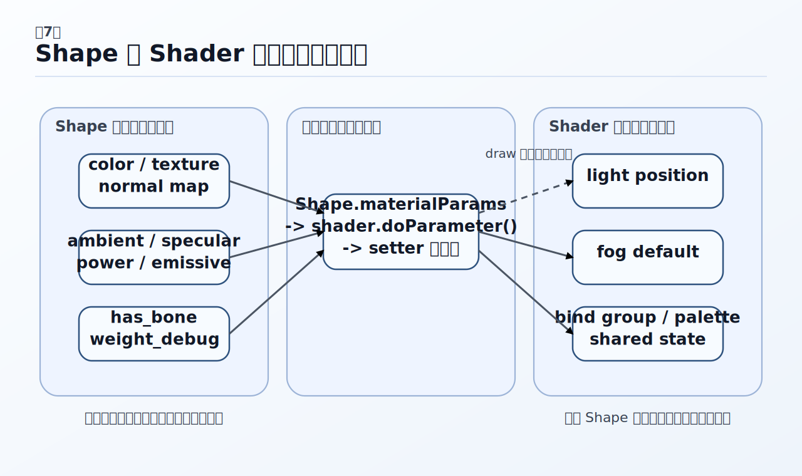

# シェーダーとマテリアル

この章では、`webg` で 3D オブジェクトを描画するときに、「どのシェーダーを選び、どの値をどこへ渡せばよいか」を判断しやすくすることを目的とします。通常の 3D 描画で標準的な入口となるのは `webg/SmoothShader.js` です。静的メッシュ、ノーマルマップ付きメッシュ、スキニング付きメッシュを、基本的にはこのシェーダーを中心に扱えます。 

ただし、常に `SmoothShader` だけで学ぶ必要があるわけではありません。`Phong` クラスは小さく基本的なシェーダーであり、教材として陰影計算の基本を追いたいときにも使いやすくなっています。つまり、実際のアプリを組むときの標準入口は `SmoothShader` ですが、学習の入口としては `Phong` を使う意義もあります。この章では、その使い分けが分かるように整理していきます。 

また、`SmoothShader` は機能を一つに集約しつつも、非スキニング描画まで重くしない設計になっています。`SmoothShader` は static mesh、normal map、skinning を同じ API で扱えますが、骨行列パレットを描画ごとの uniform に混在させず、WebGPU の bind group を分離して更新タイミングも切り分けています。これにより、「利用側の API は単純であること」と、「内部では必要なときだけ大きなデータを GPU に送ること」を両立しています。ここは、`webg` が WebGPU を使う大きな利点の一つです。WGSL 自体の読み方を詳しく追いたい場合は第8章「WGSLの読み方」を、シェーダークラスの CPU 側実装を詳しく追いたい場合は第9章「シェーダーの実装」を続けて読むと理解をつなげやすくなります。

## 最初に押さえること

### 通常の 3D オブジェクトは `SmoothShader` から始める

現在の `webg` では、通常の 3D オブジェクトを描画するときは、まず `SmoothShader` を選びます。静的メッシュでも、ノーマルマップ付きメッシュでも、スキニング付きメッシュでも、入口は同じです。 

```js
shape.setMaterial("smooth-shader", {
  has_bone: 0,
  use_texture: 0,
  color: [0.25, 0.62, 1.0, 1.0],
  ambient: 0.26,
  specular: 0.86,
  power: 44.0,
  emissive: 0.0
});
```

ここでは、`has_bone`、`use_texture`、`use_normal_map` を切り替えるだけで、同じシェーダークラスのまま描画経路を変えられます。`FlatShader` は、面単位の陰影を見せたいときに用いる専用シェーダーです。 

一方、`Phong` は小さく基本的なシェーダーであり、教材として陰影計算の基本を確認したいときにも向いています。`NormPhong`、`BonePhong`、`BoneNormPhong` は、機能ごとに分かれた形で実装や役割を追いたい場合に読みやすいクラスです。したがって、通常のアプリ開発では `SmoothShader` を標準入口とし、学習や実装理解では `Phong` や他のクラスを必要に応じて使い分ける、と考えると整理しやすくなります。 

### `Shape.setMaterial()` は「独立したマテリアル管理 API」ではない



*図7-1 `setMaterial()` で渡す値はまず `Shape` 側へ保持され、描画直前にシェーダーの setter へ流れます。一方、ライトや fog のような共有値はシェーダーインスタンス側で持つほうが整理しやすくなります。*

`webg` の `setMaterial()` は、独立したマテリアル管理層へ値を送るための API ではありません。実際には、`Shape` がパラメータ辞書を保持し、描画直前に `shader.doParameter()` を通してシェーダーのセッターへ流し込みます。ここを先に押さえておくと、「マテリアルを設定する」と言っても、実際にはどこへ何が保存され、どの段階で GPU 側へ反映されるのかが見えやすくなります。

そのため、`setMaterial("smooth-shader", {...})` と書いたときに考えるべきことは二つです。ひとつは、その値がオブジェクトごとの差として持たせるべきものかどうか。もうひとつは、その値が `SmoothShader` のどのフラグや係数に入るかです。色、テクスチャ、ノーマルマップ、鏡面反射係数、`has_bone`、`weight_debug` は `Shape` 側へ渡します。一方で、光源位置やフォグの既定値のように、同じシェーダーを使う複数の Shape で共有したい値は、シェーダーインスタンス側へ渡します。 

### `SmoothShader` は 1 本の入口で複数の描画条件を扱える

`SmoothShader` では、代表的には次の 4 つの描画条件を扱えます。 

| 経路                             | 主なパラメータ                                              |
| ------------------------------ | ---------------------------------------------------- |
| static + texture               | `has_bone: 0`, `use_texture: 1`, `use_normal_map: 0` |
| static + texture + normal map  | `has_bone: 0`, `use_texture: 1`, `use_normal_map: 1` |
| skinned + texture              | `has_bone: 1`, `use_texture: 1`, `use_normal_map: 0` |
| skinned + texture + normal map | `has_bone: 1`, `use_texture: 1`, `use_normal_map: 1` |

さらに `weight_debug: 1` を指定すれば、スキニングウェイトの色分布確認も同じシェーダーで行えます。`backface_debug` も同様です。つまり `SmoothShader` は、「別のシェーダーへ切り替える」のではなく、「同じシェーダーに対して必要な条件を明示する」使い方に整理されています。ここが、実装を使う側にとって最も分かりやすい点です。 

### WebGPU の bind group 分離が `SmoothShader` の使いやすさを支えている

`SmoothShader` は一つのシェーダーですが、内部では役割の異なるデータを 3 つの bind group に分けています。

| group      | 中身                                              | 更新の主な単位          |
| ---------- | ----------------------------------------------- | ---------------- |
| `group(0)` | 射影行列、model-view、normal 行列、ライト、マテリアル係数、flags、fog | draw ごと          |
| `group(1)` | ベーステクスチャ、ノーマルテクスチャ、sampler                      | texture の組み合わせごと |
| `group(2)` | bone palette                                    | skeleton ごと      |

この分離があるため、static mesh を描画するときに大きな bone palette を毎回書き戻す必要がありません。もし骨行列を `group(0)` に混在させていたなら、`has_bone: 0` の cube を描画するだけでも、skinning 用の大きな uniform を抱えたままになります。`SmoothShader` はその無駄を避けています。

### `SmoothShader` がスキニング対応でも非スキニング描画を重くしにくい理由

`SmoothShader` の描画ごとの uniform は 84 floats、つまり 336 bytes です。dynamic offset 用の stride は、256 バイト境界にそろえて 512 bytes です。一方、bone palette は `DEFAULT_MAX_SKIN_BONES = 320`、1 ボーンあたり 12 floats なので、320 × 12 × 4 = 15,360 bytes あります。 

この差は大きいため、もし両者を毎 draw 同じ uniform buffer に詰めていたら、static mesh の描画まで重くなってしまいます。`SmoothShader` は、ここを次のように分けています。static mesh は `has_bone: 0` で描き、`Shape.draw()` は static mesh のとき `setHasBone(0)` だけを行い、shared の空 bone bind group を使います。skinned mesh のときだけ `skeleton.updateMatrixPalette()` と `shader.setMatrixPalette(...)` を呼び、bone palette 用 buffer と bind group は skeleton ごとに `WeakMap` で再利用します。つまり、大きなデータを GPU に送るのは「skinning を使う Shape を描画するときだけ」です。static mesh は小さな uniform だけで処理が進みます。

この設計は、WebGPU の利点をよく活かしています。buffer と bind group を用途ごとに分けることで、CPU から GPU への転送単位を意図的に分離しやすくなり、API を単純に保ちながら内部の更新コストを抑えられます。利用者は `setMaterial("smooth-shader", ...)` という一つの入口だけを覚えればよく、内部では更新の大きさと頻度を適切に分けています。

## `SmoothShader` の基本的な使い方

### ローレベル API で自分でシェーダーを作る場合

`Screen` や `Shape` を直接使うローレベル API の例では、自分で `SmoothShader` を生成し、`Shape.prototype.shader` に設定します。ここでは、シェーダーインスタンス全体で共有する値を設定します。代表的なのはライトとフォグです。 

```js
import SmoothShader from "./webg/SmoothShader.js";
import Shape from "./webg/Shape.js";

const shader = new SmoothShader(gpu);
await shader.init();
Shape.prototype.shader = shader;

shader.setLightPosition([40.0, 90.0, 150.0, 1.0]);
shader.setDefaultParam("fog_color", [0.82, 0.90, 1.0, 1.0]);
shader.setDefaultParam("fog_near", 28.0);
shader.setDefaultParam("fog_far", 88.0);
shader.setDefaultParam("fog_mode", 1.0);
```

### `WebgApp` を使う場合

`WebgApp` は既定で `SmoothShader` を使います。そのため、通常は `app.init()` のあとに `Shape.setMaterial("smooth-shader", ...)` を書けば十分です。`FlatShader` のように別のシェーダーへ差し替えたい場合にだけ、`shape.setShader(otherShader)` を使います。 

```js
const shape = new Shape(app.getGL());
shape.applyPrimitiveAsset(asset);
shape.endShape();
shape.setShader(app.shader);
shape.setMaterial("smooth-shader", {
  has_bone: 0,
  use_texture: 0,
  color: [0.24, 0.64, 1.0, 1.0],
  ambient: 0.26,
  specular: 0.86,
  power: 46.0,
  emissive: 0.0
});
```

### `shape.setMaterial()` と `shape.shaderParameter()` の使い分け

初期状態をまとめて設定するときは `setMaterial()` を使います。実行中に一部だけ差し替えるときは `shaderParameter()` を使います。`setMaterial()` は「現在その Shape が持つ材質条件の一式」をまとめて設定する API であり、`shaderParameter()` はその一部だけを差分更新する API です。ここを分けて考えると、初期化コードと実行中の調整コードが読みやすくなります。 

```js
shape.setMaterial("smooth-shader", {
  has_bone: 0,
  use_texture: 1,
  texture: colorTexture,
  use_normal_map: 1,
  normal_texture: normalTexture,
  normal_strength: 1.0,
  color: [1.0, 1.0, 1.0, 1.0],
  ambient: 0.24,
  specular: 0.92,
  power: 56.0,
  emissive: 0.0
});

shape.shaderParameter("normal_strength", 1.4);
shape.shaderParameter("emissive", 0.18);
```

## どのパラメータをどこへ渡すか

### `Shape` 側へ渡す値

次の値は、オブジェクトごとの差として扱うのが自然です。 

| parameter         | 意味                | 典型値                |
| ----------------- | ----------------- | ------------------ |
| `color`           | ベースカラー            | `[1, 1, 1, 1]`     |
| `use_texture`     | カラーテクスチャを使うか      | `0` or `1`         |
| `texture`         | カラーテクスチャ          | `Texture instance` |
| `use_normal_map`  | ノーマルマップを使うか       | `0` or `1`         |
| `normal_texture`  | ノーマルマップ           | `Texture instance` |
| `normal_strength` | 元法線とノーマルマップの混合比   | `0.8` から `2.0`     |
| `ambient`         | 暗い面に残す明るさ         | `0.2` から `0.4`     |
| `specular`        | ハイライト強度           | `0.3` から `1.0`     |
| `power`           | ハイライトの鋭さ          | `16` から `96`       |
| `emissive`        | 発光寄りに見せるか         | `0.0` から `1.0`     |
| `has_bone`        | bone palette を使うか | `0` or `1`         |
| `weight_debug`    | ウェイト色を表示するか       | `0` or `1`         |
| `backface_debug`  | 裏面をデバッグ色で表示するか    | `0` or `1`         |
| `backface_color`  | 裏面デバッグ色           | `[1, 0, 1, 1]`     |

### シェーダーインスタンス側へ渡す値

次の値は、一つのシェーダーを共有する複数の Shape で共通にしたいことが多いため、シェーダーインスタンス側に置きます。 

| parameter     | 標準の渡し先                                       |
| ------------- | -------------------------------------------- |
| `light`       | `shader.setLightPosition(...)`               |
| `fog_color`   | `shader.setDefaultParam("fog_color", ...)`   |
| `fog_near`    | `shader.setDefaultParam("fog_near", ...)`    |
| `fog_far`     | `shader.setDefaultParam("fog_far", ...)`     |
| `fog_density` | `shader.setDefaultParam("fog_density", ...)` |
| `fog_mode`    | `shader.setDefaultParam("fog_mode", ...)`    |

### 4 つの代表パターン

まず単色の static mesh です。 

```js
shape.setMaterial("smooth-shader", {
  has_bone: 0,
  use_texture: 0,
  use_normal_map: 0,
  color: [0.25, 0.62, 1.0, 1.0],
  ambient: 0.26,
  specular: 0.86,
  power: 44.0,
  emissive: 0.0
});
```

次にテクスチャ付き static mesh です。 

```js
shape.setMaterial("smooth-shader", {
  has_bone: 0,
  use_texture: 1,
  texture: colorTexture,
  use_normal_map: 0,
  color: [1.0, 1.0, 1.0, 1.0],
  ambient: 0.24,
  specular: 0.82,
  power: 40.0,
  emissive: 0.0
});
```

次にテクスチャと normal map を併用する static mesh です。 

```js
shape.setMaterial("smooth-shader", {
  has_bone: 0,
  use_texture: 1,
  texture: colorTexture,
  use_normal_map: 1,
  normal_texture: normalTexture,
  normal_strength: 1.0,
  color: [1.0, 1.0, 1.0, 1.0],
  ambient: 0.24,
  specular: 0.92,
  power: 56.0,
  emissive: 0.0
});
```

最後に、スキニングと normal map を両方使う場合です。 

```js
shape.setMaterial("smooth-shader", {
  has_bone: 1,
  use_texture: 1,
  texture: colorTexture,
  use_normal_map: 1,
  normal_texture: normalTexture,
  normal_strength: 1.0,
  color: [1.0, 1.0, 1.0, 1.0],
  ambient: 0.35,
  specular: 0.80,
  power: 40.0,
  emissive: 0.0,
  weight_debug: 0
});
```

見比べると、違いは主に `has_bone`、`use_texture`、`use_normal_map`、`normal_texture` です。ここが `SmoothShader` の使いやすさです。 

## `SmoothShader` が内部で何をしているか

### `group(0)` は描画ごとの小さな uniform

`SmoothShader` の `group(0)` には、射影行列、model-view 行列、normal 行列、ライト、色、材質係数、flags、fog、デバッグ色が入ります。これらは draw ごとに変わるため、dynamic offset で切り替えています。描画時には、`Shape.draw()` が `allocUniformIndex()` で draw slot を確保し、`setModelViewMatrix()`、`setNormalMatrix()`、`setHasBone()`、`doParameter()` が現在の slot に小さな uniform を書き込み、`pass.setBindGroup(0, ..., [bindGroup0Offset])` でその draw 用オフセットを指定します。つまり `SmoothShader` は、同じパイプラインを共有しながら draw ごとに小さな uniform だけを切り替える構成になっています。 

### `group(1)` はテクスチャの組み合わせ単位で再利用する

`group(1)` は sampler、ベーステクスチャ、ノーマルテクスチャです。`SmoothShader` は、base texture と normal texture の組み合わせごとに bind group をキャッシュします。そのため、同じ texture の組を使う Shape が多い場面でも、毎回 bind group を作り直す必要がありません。`use_texture: 0` かつ `use_normal_map: 0` のときは shared の既定 bind group をそのまま使うので、ここでも static mesh の軽さが保たれます。 

### `group(2)` は skeleton ごとの bone palette

`group(2)` は bone palette 専用です。ここが `SmoothShader` の大きな特徴です。static mesh のときは、`Shape.draw()` は `setHasBone(0)` を呼び、`getBindGroup2()` は shared の空 bone bind group を返し、bone palette 用の `writeBuffer()` は発生しません。一方、skinned mesh のときは、`Shape.draw()` は `skeleton.updateMatrixPalette()` を呼び、`shader.setMatrixPalette(matrixPalette, skeleton)` でその skeleton 専用 buffer に palette を書き、`getBindGroup2(skeleton)` が `WeakMap` にキャッシュ済みの bind group を返します。つまり `SmoothShader` は、「スキニング対応だから毎 draw 重い」のではなく、「スキニングを使う draw に対してだけ、skeleton ごとの大きなデータを送る」構造になっています。

### ここが WebGPU を使う `webg` の大きなメリット

この設計は、JavaScript 側から見ると次の利点を持ちます。利用者は `setMaterial("smooth-shader", ...)` だけを覚えればよく、描画処理側は `group(0)` と `group(2)` の更新頻度を分離でき、非スキニング経路は 512 bytes stride の小さな uniform だけで回せます。スキニング経路だけ 15,360 bytes の bone palette を使い、しかも skeleton ごとに buffer と bind group を再利用できます。WebGPU は bind group を明示的に分けられるため、このような「役割ごとにデータの更新単位を分ける」設計と相性がよくなります。`webg` の `SmoothShader` は、その利点を使って API の単純さと内部性能の両方を確保しています。

## 確認用のコードと実行例

`book/examples/07_01.html` は、`setMaterial()` と `shaderParameter()`、そして fog の既定値を 1 ページで確認するための例です。静的メッシュの材質条件をどのように設定し、シェーダーインスタンス側のフォグをどのように変えるかを確認するのに向いています。`book/examples/07_02.html` は、`SmoothShader` 一つで static + texture、static + texture + normal map、skinned + texture、skinned + texture + normal map の 4 つを並べて比較する例です。同じ `SmoothShader` に対して `has_bone` と `use_normal_map` を切り替えるだけで描画条件が変わることを確認できます。さらに `unittest/smooth_shader/main.js` は、`SmoothShader` の代表的な経路を最小構成で継続確認するための実装検証用テストです。書籍の読者には `book/examples/07_02.html` のほうが読みやすいですが、実装変更後の回帰確認ではこちらが役立ちます。

## そのほかのシェーダー

`webg` で出てくる主なシェーダークラスは次のように整理できます。通常の 3D 描画の標準入口は `SmoothShader` ですが、`FlatShader`、`Phong` 系、背景や文字描画、fullscreen pass など、それぞれ用途が異なります。 

| class             | 主な用途                                 | texture | normal map | skinning | 備考                                       |
| ----------------- | ------------------------------------ | ------: | ---------: | -------: | ------------------------------------------- |
| `Shader`          | 基底クラス                                |       - |          - |        - | 派生クラスが継承                                    |
| `SmoothShader`    | 通常の 3D 描画の標準入口                       |     Yes |        Yes |      Yes | `Shape.setMaterial("smooth-shader", ...)`   |
| `FlatShader`      | 面単位の陰影を見せる                           |     Yes |        Yes |      Yes | `Shape.setMaterial("flat-shader", ...)`     |
| `Phong`           | 小さく基本的な陰影シェーダー。教材目的にも使いやすい           |     Yes |         No |       No | `Shape.setMaterial("phong", ...)`           |
| `NormPhong`       | normal map 付きの陰影を追加したクラス       |     Yes |        Yes |       No | `Shape.setMaterial("norm-phong", ...)`      |
| `BonePhong`       | skinning 付きの陰影を追加したクラス         |     Yes |         No |      Yes | `Shape.setMaterial("bone-phong", ...)`      |
| `BoneNormPhong`   | skinning + normal map を追加したクラス |     Yes |        Yes |      Yes | `Shape.setMaterial("bone-norm-phong", ...)` |
| `Background`      | 背景画像 / 背景矩形                          |     Yes |         No |       No | `new Background(gpu)`                       |
| `Font`            | 文字描画                                 |     Yes |         No |       No | `Text` / `Message` の内部                      |
| `BillboardShader` | カメラ追従 billboard                      |     Yes |         No |       No | `Billboard` の内部                             |
| `Wireframe`       | 線表示                                  |      No |         No |       No | `shape.setWireframe(true)`                  |
| `FullscreenPass`  | フルスクリーン後処理                           |     Yes |         No |       No | postprocess 用                               |

## よくある混乱

`use_texture: 1` にしたのに変わらない場合は、`texture` を実際に渡しているかを確認してください。`SmoothShader` は `use_texture: 1` なのに `texture` がない場合、そのままでは正しい描画条件になりません。`use_normal_map: 1` にしたのに凹凸が出ない場合は、`normal_texture` と `normal_strength` を確認してください。`normal_texture` を渡していなければ normal map の経路は成立せず、`normal_strength` が小さすぎると見え方の差も小さくなります。 

`has_bone: 1` にしたのに曲がらない場合は、Shape に skeleton が関連付いているかを確認してください。`has_bone: 1` を指定しただけでは曲がりません。`Shape.setSkeleton()` でスケルトンを持ち、描画時に `updateMatrixPalette()` を生成できる状態が必要です。`weight_debug` を入れるとライティングが見えなくなるのは仕様です。これはライティング確認ではなく、ウェイト分布確認のためのモードで、ウェイト色が優先して表示されます。`backface_debug` を入れると見え方が変わるのも仕様で、`SmoothShader` は `backfaceDebug: true` のコンストラクターオプションを使うと、観察しやすさを優先して `cullMode: "none"` を使います。そのため、通常描画時の状態と完全に同じにはなりません。デバッグ表示として切り分けて確認してください。

## まとめ

この章で最も重要なのは、通常の 3D 描画ではまず `SmoothShader` を標準入口として考えることです。静的メッシュ、スキニング、ノーマルマップを含めて入口は一つであり、切り替えるのは `has_bone`、`use_texture`、`use_normal_map`、`weight_debug` です。ここが見えると、サンプルごとに別々のシェーダーを覚える必要がなくなります。 

一方で、`Phong` は小さく基本的なシェーダーであり、教材として陰影計算の基本を追うには今でも有効です。また、`SmoothShader` が一つにまとまっていても性能を犠牲にしていない理由は、WebGPU の bind group を使って描画ごとの小さな uniform と bone palette を分離し、必要なときだけ大きなデータを GPU へ送る構造にあります。この考え方を押さえておくと、この先の章でもサンプルコード、テストコード、実行例の読み分けで迷いにくくなります。続く第8章では、こうしたシェーダーを実際に読むために必要な WGSL の見方を整理していきます。
