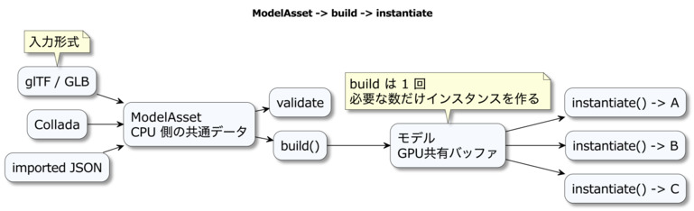
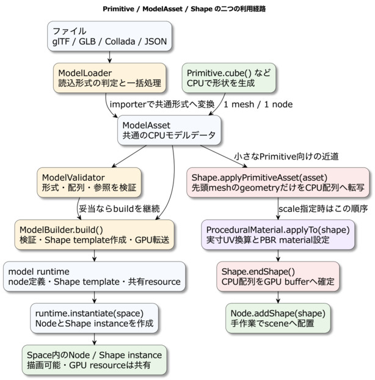

# モデルアセットとランタイム

モデルをファイルへ保存しておくと、形や材質をアプリケーションの処理から分けて編集でき、同じモデルを複数の場所で使えます。本章では、ModelYAMLを読み込み、描画用データを構築し、シーンへ2個配置するところから始めます。

保存されたモデルデータを`ModelAsset`、描画用に構築した共有リソースを含むオブジェクトをランタイム、シーンへ配置した個々のモデルをインスタンスと呼びます。まずこの三つを使う基本例を確認し、その後で文書の保存、外部形式の読み込み、形状の直接構築へ広げます。

## この章の読み方

### この章を読む前に必要な知識

04・05章の`WebgApp`、03章の親子座標、07章の材質を確認してください。配列やオブジェクトの書き方は、次に示すModelYAMLと対応付けて読みます。

### 初回に読む範囲

ModelYAMLの読み込みと2個の配置、モデルデータ・構築結果・配置の関係、ModelYAMLの構造を順に読んでください。

### 必要になったときに読む範囲

glTFなどの読み込み、Primitiveからの生成、個別配置と共有リソースの破棄、内部の構築処理は、使う機能に合わせて参照してください。実寸UVと手続き材質の詳しい設定は29章へ進みます。

### この章を終えた時点でできること

ModelYAMLからモデルを表示し、構築結果を共有しながら複数配置できます。保存用の文書と、画面上で動かす個別の配置も区別できます。

## ModelYAMLを読み込んで2個配置する

まずはアニメーションを持たない三角形を使います。次節のYAMLを`user/model_intro/triangle.model.yaml`へ保存し、04章のHTMLのmodule scriptを次のコードへ置き換えて、`user/model_intro/model_intro.html`として保存してください。どちらもリポジトリから二階層下に置くので、ライブラリの相対パスは`../../webg/`です。

この例は、文書を1回読み、`build()`を1回実行し、`instantiate()`を2回呼びます。画面では同じ色と形の三角形が左右に並びます。

```js
import WebgApp from "../../webg/WebgApp.js";
import ModelAsset from "../../webg/ModelAsset.js";

const app = new WebgApp({ document, useMessage: false });
await app.init();
app.createOrbitEyeRig({
  target: [0, 0, 0], distance: 7, yaw: 0, pitch: 0,
  minDistance: 3, maxDistance: 15, wheelZoomStep: 0.5
});

// 保存されたモデルデータを読み込み、参照や配列の整合性を確認する
const asset = await ModelAsset.load("./triangle.model.yaml");
asset.assertValid();

// GPUの描画用データを一度構築し、同じ結果から2個の配置を作る
const runtime = asset.build(app.getGPU());
const left = runtime.instantiate(app.space);
const right = runtime.instantiate(app.space);

// YAMLのNode IDを各配置から取得し、左右の位置を個別に指定する
left.nodeMap.get("node0").setPosition(-1.5, 0, 0);
right.nodeMap.get("node0").setPosition(1.5, 0, 0);
app.start();
```

`asset`には頂点、面、材質、Nodeの定義が入ります。`runtime`にはその定義から作った共有リソースが入り、`left`と`right`はそれぞれ独立したNodeを持ちます。片方の位置を変えても、もう片方はその位置を保ちます。`nodeMap`のキー`"node0"`は、次節のYAMLにあるNodeの`id`です。モデルを差し替える際は、そのモデルが持つIDへ合わせます。

同じ仕組みを使う`samples/model_yaml/index.html`では、複数の結晶モデルを配置し、回転とコメント付きYAMLの保存も確認できます。

## データ、構築結果、配置を分ける理由

`ModelAsset`は、形状、材質、階層、アニメーションを保存する共通データです。ModelYAMLとModel JSONは、この同じデータを保存する記法です。人が説明を添えて編集する場合は、コメントを書けるModelYAMLを使います。

`build()`は、共通データから描画に使うGPUリソースと配置用の定義を作ります。`instantiate()`は、その構築結果を使って`Space`へNodeを配置します。形状の構築を1回にまとめると、同じモデルを何個置いても、共有できるメッシュの描画データを再利用できます。

`ModelAsset`は`DocumentAsset`を継承し、読み込み元、原文、コメントを保持します。モデル内の参照は`ModelValidator`が検証し、描画用の構築は`ModelBuilder`が行います。通常の表示では`asset.assertValid()`と`asset.build()`を入口に使い、詳しい処理を調べる際に各クラスへ進めます。



## ModelYAMLでモデルを保存する

ModelYAMLは、`ModelAsset`が保持するモデルデータをYAMLで保存する形式です。Model JSONと共通の`type`、`version`、`materials`、`meshes`、`skeletons`、`animations`、`nodes`をYAMLの記法で表します。読み込み後はModelYAMLとModel JSONを区別せず、同じ`ModelAsset`として検証、構築、配置します。

人がモデルの階層や編集用の面情報を確認するときは、次のようにコメントを付けたModelYAMLを使えます。

```yaml
# ModelAssetの最小三角形モデルです。
type: webg-model-asset
version: "1.0"
meta:
  name: triangle

materials:
  - id: mat0
    shaderParams:
      color: [0.4, 0.8, 1.0, 1.0]
      ambient: 0.3
      specular: 0.4
      power: 24.0

meshes:
  - id: mesh0
    name: triangle
    material: mat0
    geometry:
      vertexCount: 3
      polygonCount: 1
      positions: [-1, -1, 0, 1, -1, 0, 0, 1, 0]
      normals: [0, 0, 1, 0, 0, 1, 0, 0, 1]
      uvs: [0, 0, 1, 0, 0.5, 1]
      indices: [0, 1, 2]

nodes:
  - id: node0
    name: triangleNode
    parent: null
    mesh: mesh0
    transform:
      translation: [0, 0, 0]
      rotation: [0, 0, 0, 1]
      scale: [1, 1, 1]
```

`ModelAsset.fromYAML(text)`は文書を解析し、`ModelAsset.load(url)`は`.yaml`、`.yml`、`.json`と、それぞれのgzip形式を拡張子から選びます。実際の描画へ進める手順は、JSONから読み込んだ場合と同じです。

```js
const asset = await ModelAsset.load("./triangle.model.yaml");
asset.assertValid();

const source = asset.getSourceDocument();
console.log(source.format, source.comments.length);

const runtime = asset.build(app.getGPU());
runtime.instantiate(app.space);
```

YAMLを読み込んだ`ModelAsset`は、原文、コメント、読み込み元URLも保持します。値を変更していない場合の`toYAMLText()`は原文をそのまま返すため、コメント、空白、キー順を維持できます。値だけをJavaScriptで変更してコメント付きYAMLを再生成する場合は、コメントと値の対応を安全に判断できないため例外で停止します。コメントを失うJSON変換も、`allowCommentLoss: true`を明示した場合だけ実行します。

```js
const yamlText = asset.toYAMLText();
asset.downloadYAML("triangle.model.yaml");
await asset.downloadYAMLGz("triangle.model.yaml.gz");

// JSONはコメントを表現できないため、変換時に明示的に許可する
const jsonText = asset.toJSONText(2, { allowCommentLoss: true });
```

コメントを含むモデルを編集ツールから保存する場合は、値だけの再シリアライズでコメントを削除せず、更新済みのYAML文書を編集対象として扱います。ModelYAMLのコメントは、材質の意図、座標系、面情報の用途を伝える制作情報として保存します。

## Primitive、ModelAsset、Shapeの位置を先に知る

`Primitive`、`ModelAsset`、`Shape`は、形状を扱う段階ごとのオブジェクトです。`Primitive`はCPU上で頂点と面を生成し、`ModelAsset`はその形状をファイルから読み込んだモデルと共通のデータとして保持します。`Shape`はGPUバッファとマテリアルを結び付け、実際の描画へ渡します。

この間には、共通データを検査する`ModelValidator`、描画用の共有リソースとランタイムを作る`ModelBuilder`、外部ファイルの形式判定から構築までをまとめる`ModelLoader`があります。六つのクラスを処理の段階に並べると、次のように整理できます。

| 名前 | 主に扱うもの | 次の段階へ渡すもの |
| --- | --- | --- |
| `Primitive` | 基本形状の生成 | 単一meshの`ModelAsset` |
| `ModelAsset` | モデルの全定義 | YAML/JSON共通のデータ |
| `ModelValidator` | 配列長、有限数、index、id参照 | 検査結果または例外 |
| `ModelBuilder` | 検査済みモデルとGPU | model runtimeと共有リソース |
| `ModelLoader` | URL、形式判定、import、構築 | asset、runtime、任意のinstance |
| `Shape` | geometry、material、GPUバッファ | Nodeへ追加できる描画形状 |

`ShapeResource`も、この関係を理解するうえで重要です。positions、normals、UV、indicesから作られたGPUバッファは`ShapeResource`にまとめられます。`Shape.createInstance()`はGPUバッファを複製せず、同じ`ShapeResource`を参照する別のShapeを作ります。位置と姿勢はNodeごとに分かれ、マテリアル値やアニメーション状態も個々のinstance側で管理できます。

## Primitiveが返すものを確認する

次のコードで`asset`へ入るのは、描画前の共通モデルデータを持つ`ModelAsset`です。`asset.build(gpu)`を経て、GPUリソースと描画用ランタイムへ接続します。

```js
const asset = Primitive.cube(2.0);
```

`Primitive.cube()`は`Primitive.cuboid()`を使って、一辺2 mの立方体を表すpositions、UV、indices、polygonLoopsを生成します。その結果を一つのmeshと一つのnodeを持つ小さな`ModelAsset`へ包んで返します。概念上は次の構造になります。

```text
ModelAsset
├─ materials: []
├─ meshes
│  └─ cuboid_mesh
│     └─ geometry
│        ├─ positions
│        ├─ uvs
│        ├─ indices
│        └─ polygonLoops
├─ nodes
│  └─ cuboid_node -> cuboid_mesh
├─ skeletons: []
└─ animations: []
```

直方体は六面を別々の頂点として持ち、各面に4頂点、全体で24頂点と12三角形を作ります。角の位置が同じでも面ごとに頂点を分けるため、面ごとに異なる法線とUVを持たせられます。

ModelAssetとして返す理由は、手続き生成した形状もファイルから読み込んだ形状も、検査、GPUリソース構築、instance生成という同じ仕組みへ渡せるようにするためです。ただし、単純なPrimitiveを一つのShapeへ取り込む場合には、後述する短い経路も選べます。

## 二つの利用経路を目的で選ぶ

Primitiveが返したModelAssetには、二つの使い方があります。一つはModelAsset全体を`build()`してから`instantiate()`する一般経路です。もう一つは、先頭meshのgeometryだけを既存Shapeへコピーする`Shape.applyPrimitiveAsset()`の経路です。



一般経路は、ModelAssetの検査、node階層、複数mesh、skeleton、animation、共有GPUリソースをまとめて扱います。Shape経路は、単純なPrimitiveへ呼び出し側でマテリアルを設定し、Nodeへ追加したい場合に適しています。Shape経路は、Primitiveが生成した先頭メッシュの形状データを取り込み、材質と配置を呼び出し側で設定する方法です。階層やアニメーションを含むモデルは、前者の構築・配置の経路で扱います。

| 使う場面 | 選ぶ処理 | 選ぶ理由 |
| --- | --- | --- |
| 外部モデルを読む | `ModelLoader.load()` | 読込から構築までをまとめる |
| 階層や複数meshを使う | build、instantiate | 全体を再現する |
| 同じモデルを多数置く | build後に複数instantiate | GPU形状を共有する |
| 単純形状を一つ置く | `applyPrimitiveAsset()` | マテリアルとNodeを直接決める |
| 実寸の手続きマテリアル | applyTo後に`endShape()` | 転送前にUVを換算する |

## buildとinstantiateでモデル全体を使う

Primitiveを一般のModelAssetと同じように扱う場合は、次の順序になります。

```js
const asset = Primitive.cube(2.0);

// エラー内容を表示したい場合は、build前に検査結果を取得する
const report = asset.validate();
if (!report.ok) {
  throw new Error(JSON.stringify(report.errors, null, 2));
}

// ModelAsset全体から共有GPUリソースとランタイムを構築する
const runtime = asset.build(app.getGPU());

// ここで初めてSpace内へNodeとShape instanceを作る
const first = runtime.instantiate(app.space);
const second = runtime.instantiate(app.space);
```

`asset.build(gpu)`は内部で`ModelBuilder.build()`を呼び、最初に`ModelValidator.assertValid()`でデータを検査します。事前の`validate()`は、エラー一覧を画面へ表示したい場合や、構築前に警告を確認したい場合に使います。

実装上も、ModelAssetとModelBuilderの接続は次の短い処理です。

```js
// ModelAsset.js
build(gpu) {
  const builder = new ModelBuilder(gpu);
  return builder.build(this.data);
}

// ModelBuilder.js
build(asset) {
  this.validator.assertValid(asset);
  // mesh、material、nodeからShape templateとruntimeを組み立てる
}
```

検査後、ModelBuilderはmeshごとのShape templateを作り、必要な法線とマテリアルを設定し、`Shape.endShape()`でGPUバッファを確定します。同じ形状を参照するnodeが複数ある場合は、`ShapeResource`を共有できるように構築します。

`build()`の戻り値であるmodel runtimeは、node定義、Shape template、共有ShapeResource、skeleton定義、animation定義を保持します。`instantiate(space)`を呼ぶと、この構築結果からSpaceへ配置を作れます。

`runtime.instantiate(space)`を呼ぶと、node定義からSpace内のNode階層を作り、Shape templateのinstanceを各Nodeへ追加します。skeletonとanimationがある場合は、現在の姿勢や再生位置を配置ごとに分けます。したがって、同じモデルを複数配置するときは、buildを一度だけ行い、必要な数だけinstantiateするのが基本です。

## ModelLoaderで外部形式を同じ経路へ入れる

`ModelLoader`は、glTF、GLB、Collada、ModelAsset JSONなどの外部形式をURLから読み込むための高水準な入口です。ModelYAMLを直接読み込む入口は`ModelAsset.load()`です。ModelLoaderで外部モデルをModelAssetへ正規化した後は、YAMLまたはJSONへ保存できます。処理は概ね次の順序になります。

```text
形式判定 -> fetch/import -> ModelAsset化 -> validate
         -> buildAsync -> importer固有material反映 -> instantiate
```

利用者は`WebgApp.loadModel()`または`ModelLoader.load()`からこの処理を使えます。戻り値からruntimeを保持しておけば、同じモデルを再度fetchせずに複数配置できます。

一方、`Primitive.cube()`はすでにメモリ上のModelAssetです。ファイル形式判定とfetchを省けるため、通常はModelLoaderを経由せず、`asset.build(gpu)`を直接呼びます。

## ShapeへPrimitiveのgeometryだけを取り込む

一つのPrimitiveへマテリアルを直接設定する場合は、Shapeを先に作り、`applyPrimitiveAsset()`でgeometryを取り込みます。

```js
const shape = new Shape(app.getGPU());
shape.setShader(app.shader);

const asset = Primitive.cube(2.0);
shape.applyPrimitiveAsset(asset);

shape.setMaterial("smooth-shader", {
  color: [0.8, 0.2, 0.1, 1.0],
  roughness: 0.45,
  metallic: 0.0
});

shape.endShape();

const node = app.space.addNode(null, "cube");
node.addShape(shape);
```

`Shape.applyPrimitiveAsset(asset)`は、`asset.getData().meshes[0].geometry`からpositions、indices、UV、normals、polygonLoops、altVerticesなどを新しい配列へコピーします。法線がなければ三角形の面法線を頂点へ加算し、後続の`endShape()`で正規化できる状態にします。bounding boxもコピーした頂点から計算します。

先頭meshだけを選ぶことは、現在の実装にも明示されています。

```js
// Shape.js
const data = asset.getData();
const mesh = data?.meshes?.[0];
const geometry = mesh?.geometry;
if (!geometry) {
  throw new Error("Primitive asset does not contain geometry");
}
```

このメソッドは先頭meshのgeometryを取り込みます。ModelAsset全体を扱う処理は、次の項目を`ModelLoader`、`ModelBuilder`、`instantiate()`の経路へ分担します。

- ModelAsset全体の検査
- 二つ目以降のmeshの取り込み
- node階層とtransformの復元
- ModelAsset内のmaterial定義の適用
- skeletonとanimationの構築
- GPUバッファの生成
- SpaceへのNode追加

したがって、`applyPrimitiveAsset()`はPrimitiveが返す単純なModelAssetから形状だけを取り込み、マテリアル、GPU転送、配置を呼び出し側で決める場合に使います。複数meshや階層を持つ一般の読み込みモデルは、ModelLoaderのbuild／instantiate経路へ送ります。

## 実寸UVと手続き材質を追加する

画像の模様を実際の寸法に合わせる場合は、形状へUVを登録する段階を追加します。UVは画像上の位置を表す座標です。`Primitive.mapRealCuboid()`でメートル単位のUVを作り、`ProceduralMaterial.applyTo()`で材質を登録してから`endShape()`で描画用データを確定します。

この用途は、既存の`Shape`へ形状を取り込む経路で扱うと、UVと材質の設定順を追いやすくなります。29章では、プリセットの選び方、模様の大きさ、Color・Height・Normalの役割、形状へ適用するコードをまとめて説明します。

## ランタイムとinstantiationの寿命管理

`ModelAsset` を構築し、`runtime.instantiate()` で `Space` へ配置した後は、リソースの寿命管理（いつ片付けるか）について意識する必要があります。
モデルの読み込みは容易ですが、不要になったリソースを適切に破棄しないと、画面遷移やモデル差し替えのたびに不要なNodeやGPUリソースが蓄積し、メモリリークの原因となります。

ここで重要なのは、`runtime` と `instantiate()` の結果は異なる役割を持つという点です。
- `runtime`: 構築済みの共有資源を持つ基盤層です。メッシュ、共有 `ShapeResource`、Node定義、スケルトン定義、アニメーション定義を再利用可能な形で保持します。
- `instantiate()` の結果: `runtime` を現在の `Space` に実体化したものです。個別の `Node`、`Shape`のインスタンス、`Skeleton`、`Animation` を持つシーン上の実体です。

この違いにより、寿命管理の単位を明確に分けることができます。

```js
const result = await app.loadModel("./robot.glb", {
  instantiate: false
});

const runtime = result.runtime;
const instantiated = runtime.instantiate(app.space);

runtime.startAllAnimations();

// シーン上のこの実体だけを片付けたい場合
instantiated.destroy();

// runtime 自体も今後使わない場合
runtime.destroy();
```

`instantiated.destroy()` は、現在の `Space` に配置されたNode群とShapeインスタンスを破棄します。
同じ `runtime` から複数体を生成している場合でも、このAPIを使えば特定の実体のみを削除できます。

対して `runtime.destroy()` は、ランタイムが保持していた共有リソースを含めてすべてを終了させます。
「このモデル定義自体を今後一切使用しない」と判断した際に呼び出します。
例えば、モデルビューアのように読み込んだモデルを次々と入れ替える用途や、ステージ全体を切り替えて旧ステージのリソースを一括で破棄する場合に有効です。

GPUバッファのようなGPU側リソースは、JavaScriptのガベージコレクションだけでは即座に解放されないため、`webg` では `destroy()` による明示的な寿命管理を基本としてください。

## 実践的な活用例

ここでは、ModelAssetを一度だけ構築して再利用する方法、外部データを検証する方法、モデル全体を安全にスケールする方法を、目的別に確認します。
これらの例では、共有GPUリソース、形式の検証、アニメーションも含めた倍率調整を、具体的な利用場面へ対応付けます。

### glTFを読み込み、同じモデルを複数配置する
同一のglTFモデルを複数配置する場合、一度`loadModel()`で読み込んで `runtime.instantiate()` を複数回呼び出す手法が効率的です。

```js
const result = await app.loadModel("./hand.glb", {
  instantiate: false,
  validate: true
});

const player = result.runtime.instantiate(app.space);
const cpu = result.runtime.instantiate(app.space);

const playerNode = player.nodeMap.get("HandRoot");
const cpuNode = cpu.nodeMap.get("HandRoot");

playerNode.setPosition(-1.2, 0.0, 0.0);
cpuNode.setPosition( 1.2, 0.0, 0.0);

player.startAllAnimations();
cpu.startAllAnimations();
```

この実装では、ジオメトリやGPUバッファは構築側で共有されます。
`player` と `cpu` は別々のインスタンスとして、アニメーションの再生位置や一時停止状態などのランタイム状態を独立して保持します。

### 構築前にモデル資産を検証する
手書きのModelYAMLやModel JSON、エクスポーターの出力を利用する場合、描画前に `validate()` を実行することで、不整合によるランタイムエラーを未然に防ぐことができます。

```js
const asset = await ModelAsset.load("./modelasset.yaml");
const report = asset.validate();

if (!report.ok) {
  console.error(report.errors);
  throw new Error("Invalid ModelAsset");
}

const runtime = asset.build(app.getGPU());
runtime.instantiate(app.space);
```

`validate()` は `{ ok, errors, warnings }` 形式のレポートを返します。
エラーが検出された場合に `build()` を中断させることで、id参照ミスや行列データの不足を早期に発見できます。

### インポート済みモデル全体へ一定倍率を焼き込む
アセット全体のサイズを調整したい場合は、ジオメトリだけでなくスキンとアニメーションも含めて同一の規則でスケールさせる必要があります。
`scaleUniform()` はそのための専用ヘルパーです。

```js
const asset = await ModelAsset.load("./human.json");
asset.assertValid();

const scaledAsset = ModelAsset.fromData(
  asset.cloneJSONValue(asset.getData())
);

scaledAsset.scaleUniform(0.70);

const runtime = scaledAsset.build(app.getGPU());
runtime.instantiate(app.space);
```

`scaleUniform(0.70)` は、メッシュ頂点、`Node` の平行移動、`Skeleton` のジョイント行列、`Animation` のポーズの平行移動を一括して0.70倍します。
スキニングモデルにおいてジオメトリのみを縮小させるとポーズが崩れるため、アセット全体に同一倍率を適用する手法が最も安全です。

### クリップ一覧を確認し、要約情報を取得する
複数のアニメーションを含むモデルを扱う際は、事前にクリップ名や長さを把握しておくことで、実装をスムーズに進めることができます。

```js
const result = await app.loadModel("./robot.glb", {
  instantiate: false
});

for (const clipName of result.getClipNames()) {
  const info = result.getClipInfo(clipName);
  console.log(clipName, info.durationMs, info.trackCount);
}
```

`getClipInfo()` は `id`、`targetSkeleton`、`keyCount`、`trackCount`、`durationMs` を返します。
ランタイムをシーンに配置する前でもこれらの情報を取得できるため、UI（User Interface：利用者との操作・表示の接点）への表示やドキュメント作成に活用できます。

### インポート結果を保存する
glTFやColladaインポーターが内部的にどのようにデータを処理したかを確認したい場合は、`downloadYAML()`または`downloadJSON()`を使用して`ModelAsset`をファイルとして保存できます。コメントを付けて人が確認する場合はYAML、既存ツールとの交換にはJSONを選びます。

```js
const result = await app.loadModel("./vehicle.glb", {
  instantiate: false
});

result.asset.downloadYAML("vehicle.modelasset.yaml");
```

`app.loadModel()`の戻り値が持つ`asset`から、DocumentAssetのYAML保存APIを呼び出します。保存されたModelYAMLを解析することで、インポート後のメッシュ、スケルトン、アニメーション、`Node`がどのように正規化されたかを確認できます。変換前後のモデルを比較すると、マテリアル、階層、アニメーションのどの段階で差が生じたかを切り分けられます。

YAMLのコメントを維持したままサイズを小さくしたい場合は`downloadYAMLGz()`、JSON互換のまま圧縮したい場合は`downloadJSONGz()`を使います。

```js
const result = await app.loadModel("./vehicle.glb", {
  instantiate: false
});

await result.asset.downloadYAMLGz("vehicle.modelasset.yaml.gz");
```

`.yaml.gz`はModelYAML原文をgzip圧縮したものであり、復元すればコメントを含む元のYAMLへ戻せます。`.json.gz`はJSON文字列をgzip圧縮したもので、コメントは持ちません。

ここでGLB/glTF形式との重要な違いについて触れます。
glTFのメッシュプリミティブは三角形を基本単位として扱うため、四角面を含むモデルをGLBとして書き出すと、強制的に三角形に分割されます。
一方、ModelYAMLとModel JSONでは、描画用の三角形 `indices` に加えて、編集用の面ループを `geometry.polygonLoops` として保持できます。
これにより、webgの編集データやBlenderなどのDCCツールとの間で、四角面を維持したままデータをやり取りできます。

したがって、外部ビューアや一般的なglTFツールチェーンと連携する場合はGLBが向いており、webg側の編集情報とコメントを保持したまま往復させたい場合は`.yaml`または`.yaml.gz`を、人間が編集しない機械交換には`.json`または`.json.gz`を使用します。

### BlenderとのModelAsset受け渡し
Blenderとwebgの`ModelAsset`は、専用のBlenderアドオンを用意することで相互変換できます。現行アドオンの主な入出力はJSONですが、webg側では読み込んだModelAssetをModelYAMLへ保存できます。
アドオン側ではFile > Import / Exportに`Webg ModelAsset JSON`のような項目を追加し、`.json`および`.json.gz`の読み書きを扱います。

本アドオンは主にメッシュジオメトリの相互変換を目的としています。
Import時には `positions`、`indices`、`polygonLoops`、`uvs` などを読み取り、BlenderのMeshオブジェクトを作成します。
この際、`nodes` の階層構造にあるトランスフォームは頂点位置へベイク（固定化）されるため、Blender上では編集しやすい単一のメッシュとして扱えます。

Export時には、選択したメッシュを `ModelAsset` として出力します。
この際もワールド変換は頂点へベイクされます。
なお、複雑なリグやアニメーションを完全に保持したい場合は、glTF / GLB形式を `ModelLoader` で読み込む経路を利用してください。

また、Blender（Z-up）とModelAsset（Y-up）では上方向の軸が異なるため、アドオン内部で座標軸の変換を自動的に行います。

```text
Import : ModelAsset (X, Y, Z) -> Blender    (X, -Z, Y)
Export : Blender    (X, Y, Z) -> ModelAsset (X,  Z, -Y)
```

### `Shape.createInstance()`でジオメトリを共有
`ModelAsset` を介さない低水準な実装であっても、「ジオメトリは一度だけ構築し、色や位置、スケールのみを変更したインスタンスを複数配置する」構成にすることで、GPUバッファの重複生成を回避できます。

`samples/dof` では、半径1.0のユニットスフィアを一度だけ作成し、`Shape.createInstance()` と `node.setScale(radius)` を組み合わせて異なるサイズの球体を表現しています。

```js
const sphereSource = new Shape(app.getGPU());
sphereSource.applyPrimitiveAsset(
  Primitive.sphere(1.0, 28, 20, sphereSource.getPrimitiveOptions())
);
sphereSource.endShape();

function addSphere(name, options) {
  const shape = sphereSource.createInstance();
  shape.setMaterial("smooth-shader", {
    use_texture: 0,
    color: options.color,
    ambient: 0.70,
    specular: 1.10,
    power: 58.0
  });

  const node = app.space.addNode(null, name);
  node.setPosition(options.x, options.y, options.z);
  node.setScale(options.radius);
  node.addShape(shape);
  return node;
}
```

この手法により、見た目の差分（マテリアルやスケール）のみをインスタンス側に持たせ、負荷の高いメッシュ構築とGPUバッファを共有側に集約できます。
複数インスタンスが同じジオメトリリソースを参照するため、CPU側の構築処理とGPUメモリの重複を減らせます。
各インスタンスは別の変換で描画されるため、CPU構築とGPUメモリは共有しつつ、画面上の頂点処理数や描画呼び出し数はインスタンス数に応じて発生します。

## `build()` の結果と `ModelAsset` の内部構造

`ModelAsset.build(gpu)` の戻り値である `runtime` オブジェクトは、以下の3層構造で構成されています。

1. アセット由来の定義: `runtime.nodes` および `runtime.nodeMap` に格納される、アセットから変換されたNode定義。
2. 構築済みの共有リソース: `runtime.shapeResources` に格納される、複数のNodeで共有される描画リソース群。
3. `instantiate()`後のランタイムインスタンス: `runtime.instantiate(space)` によって生成される、個別の `Node`、`Shape`のインスタンス、`Skeleton`、`Animation`。

この構造により、`build()` の結果をキャッシュし、必要なタイミングで `instantiate()` を呼び出す効率的な運用が可能になります。

`ModelAsset` の共通データ構造は、主に以下の項目で構成されています。この値をModelYAMLまたはModel JSONへ保存します。

```json
{
  "version": "1.0",
  "type": "webg-model-asset",
  "meta": {},
  "materials": [],
  "meshes": [],
  "skeletons": [],
  "animations": [],
  "nodes": []
}
```

- `materials`: メッシュが参照するマテリアル定義。`shaderParams` で色や光沢などを指定します。
- `meshes`: ジオメトリ、マテリアル参照、スキン情報を保持します。`positions` と `indices` が必須です。
- `skeletons`: ジョイント階層、レストポーズ、Inverse Bind Matrixを定義し、スキニングメッシュの骨格となります。
- `animations`: 特定のスケルトンを動作させるためのクリップ定義です。
- `nodes`: モデル内の配置単位。使用するメッシュ、結び付けるスケルトン、およびローカル変換を定義し、親子関係を構築します。

`validate()` は、これらのデータ構造におけるidの重複や参照整合性、配列長などを検証し、`{ ok, errors, warnings }` 形式の結果を返します。
`errors` は `build()` の実行を妨げる致命的な不整合であり、`warnings` は確認が推奨される項目です。

最終的に `instantiate()` が呼ばれた時点で、初めて `Space.addNode()` が実行され、個別の `Skeleton` と `Animation` が生成されます。
これにより、同一の構築結果から生成された複数のインスタンスであっても、それぞれが独立したアニメーション再生状態を保持できます。

## 例を通して確かめる

`ModelAsset` の役割を具体的に確認するには、以下のサンプルおよびテストケースの参照が有効です。

- `samples/gltf_loader`: glTFのインポート、クリップ情報の取得、およびJSON保存の動作を確認できます。
- `samples/collada_loader`: Collada形式から `ModelAsset` へ正規化されるフローを確認できます。
- `samples/json_loader`: Model JSONを `ModelAsset` として直接読み込む例です。
- `samples/mmodeler`: ModelAsset JSON / `.json.gz` の読み書きと、編集用 `polygonLoops` を持つジオメトリの保存を確認できます。ModelYAMLの入出力は`ModelAsset` APIで確認できます。
- `samples/janken`: 同一の構築済みランタイムから複数の `instantiate()` を行い、アニメーション状態を独立して制御する実例です。
- `unittest/primitive_modelasset`: `Primitive` $\rightarrow$ `ModelAsset` $\rightarrow$ `validate` $\rightarrow$ `build` という最小構成のパイプラインを確認できます。
- `unittest/compression`: Compression Streams APIによるgzip圧縮・復元および`.json.gz`の読み戻しを確認できます。YAML gzipは同じ圧縮経路でコメント付き原文を扱います。

## モデル形式を拡張するときの確認範囲

独自のmesh属性やanimation情報をModelAssetへ加える場合は、保存項目、共通データの検査、GPUリソースの構築、instanceごとの状態生成を一つの仕様として揃えます。保存した情報を描画へ届けるには、各段階が同じ意味でその項目を扱うことが必要です。

- スキーマ変更時: `ModelValidator` および `ModelBuilder` の修正が必要です。
- メッシュ・スキン変更時: ジオメトリ処理およびスキニング反映ロジックを確認してください。
- スケルトン変更時: レストポーズ、Inverse Bind Matrix、およびアニメーションの結び付け処理を確認してください。
- アニメーション変更時: トラックの整合性検証およびランタイムのクリップ生成ロジックを確認してください。
- 高水準API変更時: `ModelLoader` および各サンプルの実装への影響を確認してください。
- 保存形式変更時: `.yaml`、`.yaml.gz`、`.json`、`.json.gz`の各経路で`ModelAsset.load()`、`downloadYAML()`、`downloadYAMLGz()`、`downloadJSON()`、`downloadJSONGz()`、`unittest/compression`を確認してください。ModelLoaderの形式判定は外部ModelAsset JSONの経路として別に確認します。

特に、「`build()` 結果で共有すべきリソース」と「`instantiate()` ごとに独立させるべき状態」の分離を厳格に維持することが重要です。
GPUバッファやジオメトリは共有側に集約し、アニメーション再生状態やスケルトンの現在ポーズ、マテリアルの個別差分などは必ずインスタンス側で独立して保持させてください。

## 関連文書と09章へのつながり

本章の内容は、以下の文書と密接に関連しています。
- 01章「はじめに」
- 03章「3D空間の基礎」
- 04章「最小描画」
- 10章「アニメーション」
- 11章「アニメーションとアセット」
- 29章「手続きテクスチャと実寸マッピング」
- `book/付録D_API一覧.md`（書籍とは別に配布する参照資料）
- `samples/index.html`
- `unittest/index.html`
- `webg/ModelAsset.js`
- `webg/ModelValidator.js`
- `webg/ModelBuilder.js`
- `webg/ModelLoader.js`
- `unittest/compression`

本章で解説した `ModelAsset` は、単一のモデルを共通形式として扱うためのレイヤーです。
しかし、実際のアプリケーション開発では、カメラ、HUD（Head-Up Display：画面上へ重ねる情報表示）、入力設定、プリミティブ、タイルマップなどを含めた「シーン全体の初期状態」を定義する必要があります。
続く09章では、そのための仕組みである`SceneAsset`とSceneYAMLについて解説します。SceneYAMLは作品全体を、ModelYAMLは個別のモデルを保存する形式です。

## まとめ

`ModelAsset` は、入力形式の違いを共通データへ変換するために使います。
GPUリソースを一度構築し、複数のインスタンスから共有できます。
アセット、ランタイム、インスタンスを分けると、ジオメトリの重複を避けられます。
配置とアニメーションも個別に管理できます。

まず最小のモデルを検証し、構築後に必要な数だけ実体化します。
不要になった実体と共有リソースは、それぞれを生成して管理しているオブジェクトから破棄します。
この流れを保てば、形式固有の処理をシーンの制御へ持ち込まずに済みます。
