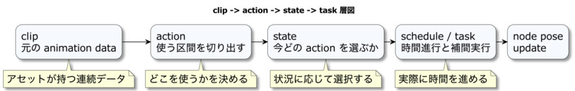

# アニメーション

本章では、アニメーションクリップの補間と時間更新を土台に、再生区間、アクション名、状態に応じたクリップ選択を段階的に追加します。
一つのクリップを再生するだけなら下位のAPI（Application Programming Interface：プログラムから機能を呼び出す接続方法）を使い、入力や状態に応じて切り替える場合は上位の層を組み合わせます。
必要以上に複雑な構成を選ばず、再生条件とボーン姿勢の計算を分けて扱えるようにします。

## この章の読み方

### この章を読む前に必要な知識

08章のモデルアセットと、JavaScriptの時間・イベント処理を知っていると読みやすくなります。

### 初回に読む範囲

一つのクリップの基本再生、Actionによる区間の再利用、AnimationStateによる選択を順に読んでください。

### 必要になったときに読む範囲

Schedule、Task、補間、状態切り替え、アセット条件は再生を細かく制御するときに参照してください。

### この章を終えた時点でできること

クリップを直接再生する方法と、区間や状態を選んで再生する方法を使い分けられます。

## まず一つのクリップを再生する

クリップは、モデルに保存された一続きの動きです。08章で読み込んだモデルにクリップが含まれていれば、その名前を選んで再生できます。まず全体の動きを確認し、その後で使いたい区間へ名前を付け、入力や状態から選ぶ方法を追加します。

### 基本再生をアプリケーションへ接続する

`Animation.js` は、最下層の `clip` を再生するためのオブジェクトです。
名称からは汎用的なアニメーションマネージャーのように見えますが、実際には「1本の `clip` をスケルトンに適用して進行させる」ことに特化しています。
`setTimes(times)` と `setBonePoses(bonePoses)` でキー情報を保持し、`setData(skeleton, bindShapeMatrix)` でランタイム再生に必要な内部タスクを生成し、`start()` や `play()` で進行させます。
つまり `Animation` は、「アニメーション列を時間軸に沿ってどう進めるか」を担当する層です。

ローダーサンプルなどで `clip` 全体の正しさを確認したい場合は、この層を直接利用するのが最もシンプルです。

```js
// ローダーサンプル：clip 全体を確認するための基本的な使い方
const model = await app.loadModel("model.dae", {
  format: "collada",
  instantiate: true,
  startAnimations: false
});

const clipId = model.asset.getClipNames()[0];
const runtime = model.runtime;

runtime.restartAnimation(clipId);

app.start({
  onUpdate: () => {
    // 毎フレーム呼び出して、クリップの内部時刻とボーン姿勢を進める
    runtime.playAnimation(clipId);
  }
});
```

`restartAnimation()`は再生位置を先頭へ戻して開始し、`playAnimation()`は`WebgApp`の更新処理から毎フレーム呼び出します。
この例の`playAnimation()`はランタイム内部の時刻で進むため、呼出側は`deltaSec`を管理せずにクリップを再生できます。

この手法は、アセット側のアニメーションが正しく作成されているかを確認したい場合や、`Action` や `AnimationState` による制御を加える前に、インポーターの結果を純粋に確かめたい場面に適しています。
つまり、「まず `clip` が正しいか」を確認するための入り口が `Animation.js` です。


再生例の`app`は初期化済みの`WebgApp`です。`model.dae`はアニメーションを含むモデルを用意し、URLをその配置へ合わせます。まず`getClipNames()`で名前を確認し、希望する名前を`clipId`へ指定すると、複数クリップを持つモデルでも再生対象が明確になります。

同じフレームで再生を進める呼び出しは一つへ揃えます。下位のクリップを直接再生する例では`runtime.playAnimation()`、後述の状態管理を使う例では`AnimationState.update()`を更新処理へ接続します。

## アニメーションを役割ごとの層に分ける

`webg`のアニメーションは、キーフレーム列を持つ`Animation`、再生区間をまとめる`Action`、再生対象を選ぶ`AnimationState`、時間に沿った実行を管理する`Schedule`と`Task`に分かれています。
本章では、何を再生するかを選ぶ制御と、選ばれた動きをいつNodeやボーンへ適用するかという実行を分けて理解します。

本章には二つの流れがあります。
`clip -> pattern -> action -> state` は「何を再生するか」を選ぶ制御層、`Animation -> Schedule -> Task -> CoordinateSystem` は「選ばれた動きをいつ、どのノード / ボーンへ適用するか」を実行する層です。
この二つを混同せずに読み進めてください。

## 各層の役割を分けて考える

アニメーションを複数の層に分ける目的は、ボーン値を補間する処理、クリップの一部へ名前を付ける処理、現在の状態から再生対象を選ぶ処理を独立して変更できるようにすることです。
必要な層だけを使えば、単純なループへ状態機械を持ち込まず、複雑な遷移でも低レベルの補間コードを重複させずに済みます。



*クリップ、アクション、状態、taskは似て見えますが、それぞれ役割が異なります。
アニメーションに関する問題を解決する際は、まずどの層の話であるかを確定させることが重要です。
*

まず `clip` は、1本の連続したアニメーションを指します。
ランタイムでは `Animation.js` のオブジェクトがこれに相当します。
特定のスケルトンに対して、「どの時刻に、どのボーンが、どの姿勢を取るか」というデータ列をまとめて保持しています。
DCCツール側で `Idle`、`Walk`、`Jump` を別々に出力した場合、通常はそれぞれが別々の `clip` となります。
`clip` は最下層のデータであるため、「再生する」「停止する」「特定のキー区間へ移行する」といった低水準な役割を担います。ゲームの状態に応じて`Walk`を選ぶ判断は、上位の`Action`やアプリケーション側が担当します。
`clip`は再生対象としてのデータに集中しています。

`pattern` は、その `clip` の内部にある特定の区間を指します。
`Action.js` では、特定のキー範囲を以下のような形式で登録します。

```js
// 特定のキー区間を定義し、ランタイムでの入り込み時間を指定
{
  id: "step_left",
  fromKey: 2,
  toKey: 5,
  entryDurationMs: 120
}
```

ここで重要なのは、`pattern` が既存の `clip` の使用範囲を宣言する仕組みだということです。
`fromKey` は開始キー、`toKey` は終了キーであり、`entryDurationMs` は現在の姿勢からその開始地点へ何ミリ秒で遷移するかをランタイム側で決定する値です。
したがって、`pattern` は「区間の選択」と「遷移時間」を定義し、キーフレーム列は元の`clip`が保持します。

`action` は、利用者やサンプル側で扱いやすい単位にするため、`pattern` を束ねたものです。
たとえば、「左足の区間」と「右足の区間」を `walk_loop` という名前でまとめておけば、サンプル側は詳細な区間名を意識せず、`walk_loop` という動作名だけで制御できます。

```js
// 複数の pattern を束ねて、ループ設定を含めて定義
{
  id: "walk_loop",
  patterns: ["step_left", "step_right"],
  loop: true
}
```

`Action.js` は、この `action` を再生しながら現在の `pattern` を管理し、終端に達した際に「次へ進むか」「先頭に戻るか」「停止するか」を制御します。
つまり `action` は、「どの区間を、どのような順番で見せるか」を定義する層です。

`state` は、「今どの `action` または `clip` を使用すべきか」を決定する高水準な制御層です。
`AnimationState.js` では、状態名と遷移条件を持つオブジェクトとして管理します。

```js
// 状態名、使用する action、遷移条件を定義
{
  id: "walk",
  action: "walk_loop",
  transitions: [
    { to: "idle", test: (ctx) => ctx.moveSpeed <= 0.1 },
    { to: "jump", test: (ctx) => ctx.jumpPressed }
  ]
}
```

ここでの `state` は、アニメーションデータを参照しながら、「この状態のときに何を再生するか」と「どのような条件で次の状態へ移るか」を管理します。
このように、`action` は「再生対象のまとまり」であり、`state` は「再生対象を選択する判断単位」であるという明確な役割の違いがあります。

## `Action.js` はクリップの中を切り出して使いやすくする層

`Action.js` は、1本の `Animation` を参照し、その内部区間を `pattern` や `action` として再利用しやすくするためのランタイムコントローラーです。
クリップの一部分へ分かりやすい名前を付け、必要な区間を繰り返し使うために設けています。
特に、ハンドポーズのように1本の `clip` 内に複数のポーズが格納されているアセットでは、この層が不可欠になります。

```js
// Action を初期化し、pattern と action を定義
const action = new Action(animation);

action.addPattern({
  id: "step_left",
  fromKey: 2,
  toKey: 5,
  entryDurationMs: 120
});

action.addPattern({
  id: "step_right",
  fromKey: 6,
  toKey: 9,
  entryDurationMs: 120
});

// action を定義して再生
action.addAction("walk_loop", ["step_left", "step_right"]);
action.start("walk_loop");
```

再生時は、毎フレーム `play()` を呼び出して進行させます。

```js
// 毎フレーム呼び出して進行させる
action.play();
```

`Action`は、元のクリップを参照しながら、再生する区間と順序を管理します。
既存の `clip` の中から「左足」「右足」「グー」「チョキ」といった区間を切り出し、利用者が扱いやすい名前で管理できるようにしているだけです。
`Action` 層があることで、サンプル側のコードで毎回キーフレーム番号を意識する必要がなくなります。

## `AnimationState.js` は再生対象の選択を分離する層

`AnimationState.js` は、現在どの `action` または `clip` を再生すべきかを決定する上位制御層です。
その役割は、「再生対象の選択ロジックを、サンプル側のメイン処理から切り離すこと」にあります。
条件分岐が増えると、サンプルコードの中で「どの状態で何を始めるか」という判断と、「実際に再生を進める処理」が混在し、可読性が低下します。
そこで `AnimationState` を導入することで、「何を再生するか」という判断のみを独立させることができます。

最小限のステート定義は、以下のようになります。

```js
// state の基本定義：id、action、遷移条件
{
  id: "idle",
  action: "idle",
  transitions: [
    { to: "walk", test: (ctx) => ctx.moveSpeed > 0.1 }
  ]
}
```

また、遷移定義には優先度やクールダウン時間を設定することも可能です。

```js
// transition の詳細設定：優先度、クールダウン時間
{
  to: "jump",
  test: (ctx) => ctx.jumpPressed,
  priority: 10,
  cooldownMs: 80
}
```

ここでの`state`は「再生対象の選択ルール」を表します。アニメーションデータは参照先のクリップに保持します。
同じ `action` を複数の `state` から参照することも可能ですし、`state` が直接 `clip` を指すこともできます。

標準的な導入手順としては、まず `Action` または `clip` 再生側の仕組みを用意し、その上に `AnimationState` を構築します。

```js
// Action で区間を切り、それを state で参照
const clipId = model.asset.getClipNames()[0];
const animation = model.runtime.getAnimation(clipId);
const action = new Action(animation);

action.addPattern({ id: "pose0", fromKey: 2, toKey: 3, entryDurationMs: 220 });
action.addPattern({ id: "pose1", fromKey: 4, toKey: 5, entryDurationMs: 220 });
action.addAction("pose0", ["pose0"]);
action.addAction("pose1", ["pose1"]);

const sm = new AnimationState(action, {
  initialState: "pose0"
});

sm.addState({ id: "pose0", action: "pose0" });
sm.addState({ id: "pose1", action: "pose1" });
```

更新時は、毎フレーム `update(context)` を呼び出します。

```js
// 毎フレームコンテキストを渡して更新
sm.update({
  moveSpeed,
  jumpPressed,
  grounded,
  nowMs
});
```

`AnimationState` には大きく分けて2つの利用形態があります。
1つは、上記のように毎フレーム `update(context)` を呼び出し、条件に基づいて遷移先を決定する「条件評価型」です。
もう1つは、入力イベントやゲームイベントが発生した瞬間に `setState()` を直接呼び出す「コマンド型」です。
`samples/animation_state` は前者の、`samples/janken` は後者の代表例です。

たとえば `janken` のように、ユーザー入力があった瞬間に特定のポーズを出したい場合は、以下のような実装が自然です。

```js
// 入力イベントに応じて状態を切り替える
function onJankenInput(choiceId) {
  handState.setState(choiceId, {
    startOptions: {
      entryDurationMs: 250
    },
    force: true
  });
}
```

この形式では、毎フレーム状態を計算する必要がなく、入力イベントを高水準なコマンドとして扱えます。
また、`force: true` を指定することで、現在と同じ `state` であっても再始動させることが可能です。
これが条件評価型との大きな違いです。

## `Schedule.js` と `Task.js` は補間実行を担当する層

`AnimationState` や `Action` が再生対象を決定した後、実際の移動と回転の処理はさらに下層へと流れます。
ここを担当するのが `Schedule.js` と `Task.js` です。
構造的に見ると、`AnimationState` は「何を再生するか」を決め、補間式やボーンの座標値は下層の`Schedule.js`と`Task.js`が扱います。
下層では、選択された区間が時間付きのコマンド列に変換され、それが各ボーンへ実行されます。

処理の流れを追うと、以下のようになります。
まず `AnimationState.update()` が遷移を決定し、`Action.start()` が現在の `pattern` を選択します。
次に、`transitionToKey(entryDurationMs, fromKey, toKey)` が `Animation.startTimeFromTo()` を呼び出します。
`Animation.setData()` は、ボーンごとの `Task` を組み立てます。

`Schedule.directExecution()` は、組み立てたコマンド列を各 `Task` へ流します。
最終的に `Task.execute(delta_msec)` が、`putRotTransByMatrix` や `doRotTrans` を対象ボーンへ適用します。
実際にボーンを動かすのは、最下層の `Task` です。

この分離構造があるため、ステートマシン（状態管理）と補間実行（物理的な計算）を混在させずに済みます。
`AnimationState` は「今どの動きを見せたいか」という意図のみを管理し、`Task` は「その命令を時間でどう刻むか」という実行に集中できます。
これにより、入力条件やゲームルールが変更されても、補間処理のコードを修正せずに済む堅牢な設計となっています。

## どの層を使うべきか

実装において、どの層までを利用すべきかの判断基準を整理します。

- `Animation` のみで十分な場合
  `clip` 全体を1本再生できれば十分なときです。ローダーサンプルのように、インポーターが復元した `clip` の見え方そのものを確認したい場面がこれに当たります。
- `Action` まで利用すべき場合
  `clip` の内部キー区間を明示的に再利用したいときです。指のポーズや歩行のステップのように、短い区間を分かりやすい名前でまとめたい場合や、サンプル側で `action` の再生を直接制御しても複雑にならない規模の場合に適しています。
- `AnimationState` まで利用すべき場合
  状態名（State）を定義して管理したいとき、あるいは入力やゲームプレイの条件をアニメーション再生ロジックから完全に分離したいときに導入します。また、HUD（Head-Up Display：画面上へ重ねる情報表示）や診断情報に現在の `state` 情報を共通形式で表示したい場合や、入力イベントを高水準コマンドとして扱いたい場合にも有効です。

判断の目安は、「条件分岐がどれだけ増えたか」と「再生対象の選択ロジックを別層に切り出したほうがコードの可読性が向上するか」という点にあります。

## 再生対象と滑らかさを分けて調整する

`AnimationState`は、条件や入力に応じて再生対象を選びます。動きの滑らかさは、アセットのキー配置、`Action`の`fromKey / toKey`、`entryDurationMs`、`Animation`の補間設定を合わせて調整します。選択する動きと、その動き方を分けて確認すると、変更する値を判断しやすくなります。

小さな構成では`Action`を直接開始できます。条件分岐が増えた段階で`AnimationState`へ判断をまとめると、入力と再生区間を個別に管理できます。`action`は再生する区間の並び、`state`はその並びを選ぶ判断単位です。同じアクションを複数の状態から選ぶ構成も作れます。

状態の選択には、毎フレーム条件を評価する方法と、入力の瞬間に`setState()`を呼ぶ方法があります。11章では、前者を`animation_state`、後者を`janken`で具体的に確認します。

## アセット側の条件を確認する

ローダーサンプルは、インポーターが復元した`clip`全体を再生してキーフレーム列を確認します。
一方、`hand`、`janken`、`animation_state`などのポーズ切り替えサンプルは、`Action`で`clip`の一部を切り出すため、`fromKey / toKey`とアセット側のキー配置に強く依存します。
具体的なキー区間は続く11章で確認します。

アセット作成時は、座標軸と補間方式をランタイムの対応範囲に合わせます。
Blenderからエクスポートするアセットは`Y-up`を前提とし、`webg`側ではその軸をそのまま読み込みます。
Colladaをキーフレームベースで利用する場合は、`Sampling`間隔を大きくし、`Keep Keyframes`を有効にします。

glTF（GL Transmission Format：3Dシーン交換形式）またはGLB（glTFのバイナリ形式）では、`Sampling`を無効にし、補間を`LINEAR`に設定して出力するのが安全です。
現在の`webg/GltfShape.js`は`CUBICSPLINE`の前後の接線値を除き、中央値を`LINEAR`のキー列として近似するため、厳密な曲線再生が必要な場合は注意してください。

## まとめ

本章では、クリップの基本再生から始め、`clip` $\rightarrow$ `pattern` $\rightarrow$ `action` $\rightarrow$ `state` という階層構造で理解することです。

- `clip`: インポーターが取り込んだキーフレーム列。
- `Action`: 内部区間を切り出して再利用しやすくする層。
- `AnimationState`: 現在どの `action` または `clip` を使うかを決定する上位制御層。
- `Animation` $\rightarrow$ `Schedule` $\rightarrow$ `Task`: 実際の補間計算とボーンへの反映を担当する低水準層。

この構造を把握することで、問題が発生した際にそれが「アセット側の問題」なのか、「アクション区間の設定問題」なのか、あるいは「状態遷移のロジック問題」なのかを迅速に切り分けることができます。

本章では、ローダーサンプルとポーズ切り替えサンプルの違い、`fromKey / toKey` と `entryDurationMs` の役割、エクスポート時の設定条件、そして `AnimationState` の2つの運用形態について整理しました。
続く11章では、これらの層を実際のサンプル（`animation_state`、`janken`）でどのように活用し、アセットのキー区間をどう判断するかを実践的に見ていきます。
