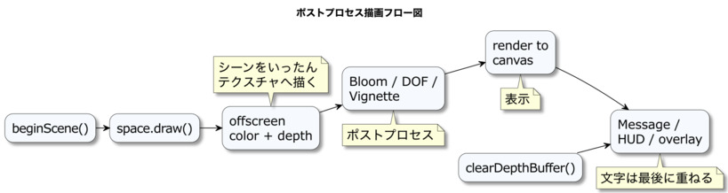

# ポストプロセスの基本

本章では、標準のForward描画で作った画面をオフスクリーンテクスチャへ保存し、レンダーシェーダー版のポストプロセスを手動で接続します。
完成した3D画像へビネットを適用し、その結果をキャンバスへ表示します。
コンピュートシェーダーや31〜33章の統合パイプラインを使わず、個別の効果を接続する基本的な処理順を理解することが本章の目的です。

この方法は、標準Forward描画へ一つの効果だけを追加したい場合や、レンダーパスとテクスチャの関係を小さな構成で学ぶ場合に現在も有効です。また、最初の描画で得た色や深度を後段の処理へ渡す考え方は、複数のG-bufferへ表面情報を保存し、照明と画面空間の効果を後から評価する遅延レンダリングの基礎にもなります。

webg 2.0以降では、20〜22章で説明するコンピュートシェーダーを使い、画像処理をコンピュートパスとして構成する、より洗練された方法を利用できます。さらに、PBRを使うアプリケーションでは、31〜33章の`ComputeEffectPipeline`が線形HDR上の照明、透明表面、画面空間の効果、最終表示を一つの処理順で管理します。本章はそれらを置き換える推奨構成ではなく、そこへ至る描画処理の分離と手動接続を理解するための章です。

## この章の読み方

### この章を読む前に必要な知識

04章の描画先と05章のフレーム処理を知っていると読みやすくなります。

### 初回に読む範囲

描画済み画像、Forward描画との分離、autoDrawScene、基本サイクルを先に読んでください。

### 必要になったときに読む範囲

HUDの重ね合わせ、深度の再初期化、個別パスとComputeEffectPipelineは実装時に参照してください。

### この章を終えた時点でできること

シーン描画と画面全体の後処理を分け、画像の入出力と順序を意識して接続できます。

## 描画済みの画像へ効果を加える

ポストプロセスは、一度描画したシーンをテクスチャとして受け取り、画面全体へ新しい見え方を加える処理です。
本章では、画面周辺を暗くして中央へ視線を集めるビネットを題材に、オフスクリーン描画と全画面パスの基本を学びます。ブルーム、被写界深度、曇りガラスは、それぞれ専用の中間画像や深度情報が必要になるため、24章と25章でこの基本フローを拡張して扱います。

ブルームや被写界深度、曇りガラスのような視覚効果は、シーン全体をオフスクリーン（画面外）のバッファへ描き、後段の全画面パスで加工してからキャンバスへ出力します。
個別のオブジェクトへシェーダーを追加する効果と、画面全体を入力にする効果を描画経路で分けます。

本章では、`RenderTarget`と`VignettePass`の導入手順を軸に、レンダーシェーダー版ポストプロセスの設計思想と実装方法を解説します。BloomとDoFは24章、透明効果は25章で、同じ接続方法をより複雑な入力へ広げます。

## Forward描画から後段処理を分離する

通常のForward描画では、各Shapeの頂点を頂点シェーダーでクリップ座標へ変換し、ラスタライズで画素候補を作り、フラグメントシェーダーで照明済みの色を求めます。その色をキャンバスへ直接書けば、1回の描画で表示まで完了します。

ポストプロセスを加える場合は、フラグメントシェーダーの出力先をキャンバスから`RenderTarget`へ変えます。後段のレンダーパスは、そこに保存された画像をテクスチャとして読み、画面全体を覆う三角形を描いて新しい画像を作ります。

```text
Shapeの頂点
  -> 頂点シェーダー
  -> ラスタライズ
  -> フラグメントシェーダー
  -> オフスクリーンの色・深度テクスチャ
  -> 全画面用の頂点・フラグメントシェーダー
  -> キャンバス
```

この構成では、前半のフラグメントシェーダーが各Shapeの色を完成させ、後半のフラグメントシェーダーが完成画像を加工します。後段処理は個々の三角形やマテリアルを直接見るのではなく、色テクスチャ、深度テクスチャ、必要に応じて用意したマスクを画面上のデータとして読みます。

遅延レンダリングも、最初の描画結果をテクスチャへ保存し、後段で利用する点は同じです。ただし、ポストプロセスが照明済みの完成色を加工するのに対し、遅延レンダリングでは基本色、法線、粗さ、金属度、深度などの照明前の情報をG-bufferへ分けて保存し、後段でPBR照明を計算します。本章ではポストプロセスの構成を通じて、レンダーパス間でテクスチャを受け渡し、処理順と入力を明示する考え方を先に理解できます。

### webgで選べる三つの構成

目的に応じて、次の構成を選びます。

**構成：標準Forward描画とレンダーシェーダー版の手動合成**

主な用途：単純な画面へ個別効果を追加する、オフスクリーン描画を学ぶ

参照先：本章

**構成：個別のコンピュートパス**

主な用途：画像処理をCompute Shaderで実装し、複数のGPU（Graphics Processing Unit：画像処理装置）処理を効率よく接続する

参照先：20〜22章、34〜36章

**構成：PBR統合レンダリング**

主な用途：G-buffer、PBR照明、IBL、透明表面、複数の画面空間の効果を共有する

参照先：30章、31〜33章

本章の`VignettePass`はレンダーシェーダー版です。PBR統合レンダリングでは、`ComputeVignettePass`をTone Mapping後の表示色へ適用します。効果名が同じでも、手動接続版と統合版では入力形式と管理方法が異なることに注意してください。BloomとDoFの入力段階は24章で扱います。

## ポストプロセスの概念と描画フロー

ポストプロセスとは、シーン内の個々のオブジェクトのシェーダーを書き換える手法ではなく、描画が完了した後の「画面全体」に対して後処理をかけるアプローチです。
まず3Dシーンをオフスクリーンターゲットへ描き出し、得られたカラーテクスチャや深度テクスチャをフルスクリーンパスで読み取って加工します。

このフローを理解せずに導入すると、「ブルームを実装したが画面に変化がない」「DoFを導入したが深度情報が読み取れない」といった問題に直面しやすくなります。
そのため、まずは共通の描画フローを確立させましょう。



*ポストプロセスでは、シーンを一度オフスクリーンへ描き出し、その結果に後処理を適用した後でHUDを重ねる*

### 描画フローの制御：`autoDrawScene: false`

`WebgApp` の標準設定では、シーンが直接キャンバスへ出力されます。
しかし、ポストプロセスを適用するには、キャンバスに描画される前に処理を挟む必要があるため、`WebgApp` の設定で `autoDrawScene: false` に指定します。
これにより、描画のタイミングを完全に制御できるようになります。

### 基本的な実装サイクル

ポストプロセスの多くは、以下の3つのステップで構成されるサイクルを1フレームの中で完結させる必要があります。

1. `beginScene()`: 描画先をオフスクリーンターゲットに切り替え、シーン描画の準備を行う。
2. `app.space.draw(app.eye)`: 色だけを参照するパスでは通常どおりシーンを描画する。深度を後段と共有するDoFでは、同じコールバックの`renderFrameToken`を渡す。
3. `render()`: 描き出されたテクスチャを加工し、最終的な結果をキャンバスへ出力する。

この流れを具体的に実装すると、以下のようになります。

```js
import WebgApp from "./webg/WebgApp.js";
import Shape from "./webg/Shape.js";
import SmoothShader from "./webg/SmoothShader.js";
import { FULLSCREEN_SOURCE_FORMAT } from "./webg/FullscreenPass.js";
import VignettePass from "./webg/VignettePass.js";

const app = new WebgApp({
  document,
  messageFontTexture: "./webg/font512.png",
  autoDrawScene: false
});
await app.init();

// VignettePassの入力形式へ3D描画の色形式もそろえる
const sceneShader = new SmoothShader(app.getGPU(), {
  colorFormat: FULLSCREEN_SOURCE_FORMAT
});
await sceneShader.init();
app.shader = sceneShader;
Shape.prototype.shader = sceneShader;
sceneShader.setLightPosition(app.lightPosition);
sceneShader.setProjectionMatrix(app.projectionMatrix);

// VignettePassの入力はrgba8unormの表示色なので、scene targetの形式を明示する
const sceneTarget = app.screen.createRenderTarget({
  label: "my-scene",
  format: FULLSCREEN_SOURCE_FORMAT,
  hasDepth: true
});
await sceneTarget.ready;

const vignette = new VignettePass(app.getGPU(), {
  centerX: 0.5,
  centerY: 0.5,
  radius: 0.60,
  softness: 0.30,
  strength: 0.70,
  tint: [0.0, 0.0, 0.0, 1.0]
});
await vignette.init();

app.start({
  onUpdate: ({ screen }) => {
    sceneTarget.resizeToScreen(screen);
  },
  onBeforeDraw: () => {
    // ステップ1: 3Dシーンを色・深度RenderTargetへ描く
    app.screen.clear(sceneTarget);
    // ステップ2: 通常のSpace描画を画面外のRenderTargetへ行う
    app.space.draw(app.eye);
  },
  onAfterDraw3d: () => {
    // ステップ3: シーン画像へVignetteを適用してキャンバスへ出力する
    vignette.render(app.screen, {
      source: sceneTarget,
      clearColor: app.clearColor
    });

    // HUDを正しく重ねるため、画面外シーンの深度をキャンバス側へ残さない
    app.screen.clearDepthBuffer();
  }
});
```

ここで重要なのは、3Dシーンのdraw callは引き続き`app.space.draw(app.eye)`が発行し、`VignettePass`などの後段パスは描画済みのテクスチャを入力として効果を加える点です。

### HUDの重ね合わせ

ポストプロセス適用後も `Message` やデバッグオーバーレイを正しく表示させたい場合は、最終パスの後に `app.screen.clearDepthBuffer()` を呼び出す必要があります。
これは、ポストプロセス処理で書き込まれた深度情報が残っていると、後から描画するHUDが深度テストによって棄却されてしまうためです。
これはエフェクト自体の機能ではなく、描画フローを適切に制御するための必須処理となります。

## VignettePassの実装と活用

`VignettePass`は、画面周辺を暗くして中央へ視線を集めたいときに使います。1枚の表示色テクスチャを読み、画面中心からの距離に応じて周辺へ`tint`を混ぜます。BloomやDoFが複数の中間ターゲットを使うのに対し、Vignetteは一枚の入力で構成できます。

### 役割と仕組み

`VignettePass`は色テクスチャを受け取り、画面周辺の色を調整するパスです。利用者が`RenderTarget`へシーンを描き、その色テクスチャを`render({ source })`へ渡します。シーンの深度は前段の3D描画で使い、Vignetteは色だけを読みます。

`radius`は周辺減衰が始まる外側の距離、`softness`は中心側から外周までの変化幅、`strength`は`tint`を混ぜる強さです。値を大きくしすぎると作品の端だけでなく中央付近まで暗くなるため、作品の主要部品が残る範囲で調整します。

### 色形式に関する注意

`VignettePass`の入力は`rgba8unorm`の表示色です。Canvasの形式と同じとは限らないため、`sceneTarget`には`format: FULLSCREEN_SOURCE_FORMAT`を指定します。さらに、`sceneTarget`へ描く`SmoothShader`にも同じ色形式を指定します。3D描画側と後段パス側の形式が異なると、RenderPipelineの作成や描画時の検証で停止します。表示形式の違いを自動変換で隠さず、描画するシェーダー、RenderTarget、後段パスの形式を接続時点でそろえることが重要です。

### 次の章との関係

本章で作った「RenderTargetへ描く -> 全画面パスで加工する -> キャンバスへ出力する」という処理フローは、24章のBloomとDoFでも共通です。Bloomは明るい部分の抽出とぼかし用ターゲットを追加し、DoFは色に加えてReverse-Z深度と同じ`renderFrameToken`を必要とします。25章では、さらに透明面のマスクと背後の画像を加えます。

## まとめ

ポストプロセスは、完成した3Dシーンをいったんテクスチャへ保存し、その画像へ効果を順番に適用して表示する仕組みです。各パスの入力形式と出力形式を確認し、最後にキャンバスへ転送して、必要なら深度を再初期化してHUDを描きます。
色だけを扱う`VignettePass`で基本フローを確認した後、24章でBloomとDoF、25章で透明効果と画面の仕上げへ進みます。
