# 手続きテクスチャと実寸マッピング

本章では、部材の寸法、色、目地、模様、凹凸を数値で指定し、繰り返し利用できる手続きテクスチャを生成する方法を説明します。
生成したColor map、Height map、Normal mapがそれぞれ何を表すかを確認し、PBRマテリアルへ接続します。
さらに、形状の寸法からUVを設定し、直方体や平面へ実寸を保って繰り返し表示するまでの処理を組み立てます。

1. 登録済みのプリセットを選ぶ
2. 必要な`tile`と`appearance`だけを変更する
3. `Primitive.mapRealCuboid()`でメートル単位のUVを作る
4. `ProceduralMaterial.applyTo()`でShapeへテクスチャとPBR値を登録する
5. `Shape.endShape()`でGPUへ確定する

実際に二つの直方体へ異なるプリセットを適用する例は、`examples/29_01.html`で実行できます。複数のプリセットを一覧から選び、数値を変更し、生成画像を確認し、設定を保存する場合は、`samples/texture_catalog/texture_catalog.html`を使用します。後者は単なる一覧ではなく、利用者が目的の表面を探してdefinitionを作るための実験環境です。

## この章の読み方

### この章を読む前に必要な知識

07章のマテリアルと08章のPrimitive・ModelAsset・Shapeを知っていると読みやすくなります。

### 初回に読む範囲

プリセット、Color・Height・Normal、基本パラメーター、マテリアルへの適用を先に読んでください。

### 必要になったときに読む範囲

実寸UV（テクスチャ座標）、mapRealCuboid、定義の保存、CPU（中央処理装置）版とCompute版は物理寸法を扱うときに参照してください。

### この章を終えた時点でできること

計算で生成した画像を物理ベースレンダリング（PBR）マテリアルへ接続し、形状寸法に合うテクスチャ密度を設定できます。

## 最初に覚える三つの情報

手続きテクスチャでは、生成する表面の値、GPUで生成した画像、Shapeへ登録するPBR値を分けて扱います。

```text
ProceduralTileSpec
  ├─ Color map
  ├─ Height map
  └─ Normal map

ProceduralMaterial
  ├─ Color mapとNormal map
  ├─ roughness、specular、metallic
  └─ Shapeへ適用する実寸周期
```

`ProceduralMaterials`は、登録済みプリセットの選択、値の上書き、GPUテクスチャの生成をまとめて行います。通常はCPUで画像を作ってからGPUへ転送するのではなく、`ComputeProceduralTile`がGPU上でColor、Height、Normalを生成し、そのまま描画へ渡します。

利用側が最初に知っておくAPIは次の三つです。

| API | 用途 |
|---|---|
| `ProceduralMaterials.createPreset()` | 登録済みプリセットからテクスチャを生成する |
| `ProceduralMaterials.create()` | JSONなどで用意した完全なdefinitionから生成する |
| `ProceduralMaterial.applyTo()` | 生成済みテクスチャとPBR値をShapeへ登録する |

## texture_catalogで設定を試す

コードを先に書いて値を推測するより、まず`texture_catalog`でプリセットの初期状態と変更結果を確認すると、どのパラメータを動かすべきかを判断しやすくなります。画面には立方体の表示、Color map、Height map、Normal map、生成されたdefinitionが同時に表示されます。立方体では光源との関係を、Color mapでは色の変化を、Height mapでは高さの分布を、Normal mapでは凹凸の方向と強さを個別に確認できます。


リポジトリのルートでHTTP serverを起動し、次のページを開きます。

```sh
python3 -m http.server 8000
```

```text
http://localhost:8000/samples/texture_catalog/texture_catalog.html
```

利用者が行う作業は次の順序です。

1. `Category`で材質分類を選び、`Preset`で初期状態を選ぶ
2. 立方体、Color map、Normal mapを見比べ、色の差と凹凸の差を分けて確認する
3. 寸法、目地、`Pattern`、`Surface detail`、PBR値を変更する
4. 入力値を確定し、GPU textureの再生成結果を確認する
5. `Copy Code`、`Download JS`、`Download JSON`のいずれかで完成definitionを保存する
6. 必要であれば`Download Color`と`Download Normal`で生成画像を保存する

通常の数値欄は入力を確定した時点で自動生成されます。Generateボタンと`G`キーは同じdefinitionを明示的に再生成する操作です。Material IDやLabelのような文字列欄では、入力が完成してから生成を開始します。`G`は文字列入力欄とtextareaでは文字として入力され、それ以外のcontrolとCanvasではGenerate shortcutとして動作します。小数入力を完了してからGPU生成へ進むため、`0.01`のような値も最後まで入力できます。

数値がHTMLのstep、min、max、または解像度で表現できる整数pixel条件から外れた場合、texture_catalogは入力可能な近い値へ丸め、その内容をinfo欄へ表示します。変更内容を確定時に利用者へ知らせ、生成できないdefinitionはエラーとして扱うことで、指定ミスを確認できるようにします。

設定を保存する場合は`Download JS`または`Download JSON`を使用します。JavaScriptは次のようなES moduleとして出力され、保存した値を`ProceduralMaterials.create()`へ渡せます。

```js
import ProceduralMaterials from "../../webg/ProceduralMaterials.js";
import definition from "./fiber_cement_white.js";

const materials = new ProceduralMaterials(app.getGPU());
const material = await materials.create(definition);
material.applyTo(shape);
```

`texture_catalog`は出力definitionを作成するためのツールです。画面操作で作ったdefinitionはファイルへ保存し、コアへプリセットとして登録する場合は、出力内容を確認してからコアのregistryへ明示的に反映します。既存presetを元にMaterial ID、Category、日英Label、`tile.presetId`を変更すれば、新しい部材を既存の生成仕様から定義できます。

## プリセットを選んで表示する

`createPreset()`へプリセットIDを渡すと、プリセットの初期値でColor、Height、Normalが生成されます。`scale`を省略した場合、Shapeにはすでに作成済みのUVがそのまま使われます。

```js
import ProceduralMaterials from "../../webg/ProceduralMaterials.js";

const materials = new ProceduralMaterials(app.getGPU());
const oak = await materials.createPreset("wood.oak.plank");

// shapeはUVを持つShapeとして、あらかじめ作成しておく
oak.applyTo(shape);
```

同じ`ProceduralMaterial`は複数のShapeへ適用できます。ただし、`scale`を指定したマテリアルはShapeごとにUVを変換するため、各Shapeへ一回だけ適用します。ページを終了するときは、生成したGPU resourceをまとめて解放します。

```js
window.addEventListener("pagehide", () => {
  materials.destroy();
}, { once: true });
```

## 利用できる23プリセット

プリセットIDは、完成画像のファイル名ではなく、生成仕様を選ぶ名前です。IDは`ProceduralMaterials.listPresetIds()`、表示名や初期値は`ProceduralMaterials.listPresetDefinitions()`から取得できます。以下の表では、横に広がる比較表を避けるため、プリセットごとに項目と値を示します。

### オーク柾目

プリセット識別子は`wood.oak.plank`です。

| 項目 | 値 |
|---|---|
| 分類 | 木材 |
| 部材寸法 | 短辺0.15 m、長辺1.80 m、厚さなし |
| 配置 | `running-bond`、行ずらし`1/2` |
| variation cell | 2列×4行 |
| pattern | `quarter-sawn-grain`、周期0.010 m、色変化0.075、凹凸0.00020 m |
| PBR | roughness 0.56、specular 0.50、normalStrength 1.12 |

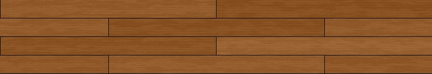

### オーク板目

プリセット識別子は`wood.oak.flat-sawn`です。

| 項目 | 値 |
|---|---|
| 分類 | 木材 |
| 部材寸法 | 短辺0.15 m、長辺1.80 m、厚さなし |
| 配置 | `running-bond`、行ずらし`1/2` |
| variation cell | 2列×4行 |
| pattern | `flat-sawn-grain`、周期0.010 m、色変化0.090、凹凸0.00024 m |
| PBR | roughness 0.58、specular 0.48、normalStrength 1.18 |

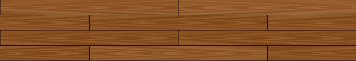

### オーク混合木目

プリセット識別子は`wood.oak.mixed-sawn`です。

| 項目 | 値 |
|---|---|
| 分類 | 木材 |
| 部材寸法 | 短辺0.15 m、長辺1.80 m、厚さなし |
| 配置 | `running-bond`、行ずらし`1/2` |
| variation cell | 2列×4行 |
| pattern | `mixed-sawn-grain`、周期0.010 m、色変化0.085、凹凸0.00022 m |
| PBR | roughness 0.57、specular 0.49、normalStrength 1.15 |

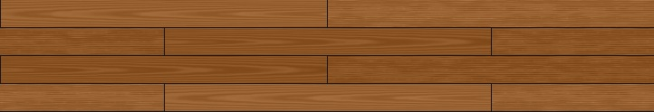

### ウォールナット

プリセット識別子は`wood.walnut.plank`です。

| 項目 | 値 |
|---|---|
| 分類 | 木材 |
| 部材寸法 | 短辺0.15 m、長辺1.80 m、厚さなし |
| 配置 | `running-bond`、行ずらし`1/3` |
| variation cell | 2列×6行 |
| pattern | `longitudinal-grain`、周期0.010 m、色変化0.038、凹凸0.00018 m |
| PBR | roughness 0.54、specular 0.50、normalStrength 1.16 |

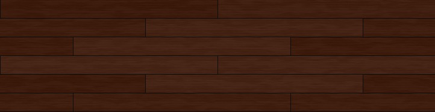

### ウォールナット板目

プリセット識別子は`wood.walnut.flat-sawn`です。

| 項目 | 値 |
|---|---|
| 分類 | 木材 |
| 部材寸法 | 短辺0.15 m、長辺1.80 m、厚さなし |
| 配置 | `running-bond`、行ずらし`1/3` |
| variation cell | 2列×6行 |
| pattern | `flat-sawn-grain`、周期0.010 m、色変化0.060、凹凸0.00016 m |
| PBR | roughness 0.54、specular 0.50、normalStrength 1.12 |

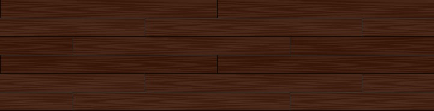

### ウォールナット混合木目

プリセット識別子は`wood.walnut.mixed-sawn`です。

| 項目 | 値 |
|---|---|
| 分類 | 木材 |
| 部材寸法 | 短辺0.15 m、長辺1.80 m、厚さなし |
| 配置 | `running-bond`、行ずらし`1/3` |
| variation cell | 2列×6行 |
| pattern | `mixed-sawn-grain`、周期0.010 m、色変化0.055、凹凸0.00016 m |
| PBR | roughness 0.54、specular 0.50、normalStrength 1.14 |

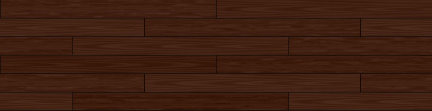

### シダー

プリセット識別子は`wood.cedar.deck`です。

| 項目 | 値 |
|---|---|
| 分類 | 木材 |
| 部材寸法 | 短辺0.15 m、長辺1.80 m、厚さなし |
| 配置 | `running-bond`、行ずらし`1/4` |
| variation cell | 2列×4行 |
| pattern | `longitudinal-grain`、周期0.010 m、色変化0.055、凹凸0.00028 m |
| PBR | roughness 0.66、specular 0.42、normalStrength 1.28 |

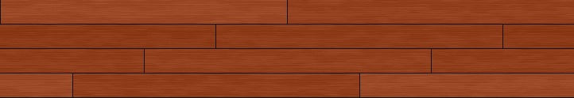

### シダー板目

プリセット識別子は`wood.cedar.flat-sawn`です。

| 項目 | 値 |
|---|---|
| 分類 | 木材 |
| 部材寸法 | 短辺0.15 m、長辺1.80 m、厚さなし |
| 配置 | `running-bond`、行ずらし`1/4` |
| variation cell | 2列×4行 |
| pattern | `flat-sawn-grain`、周期0.010 m、色変化0.080、凹凸0.00024 m |
| PBR | roughness 0.64、specular 0.44、normalStrength 1.20 |

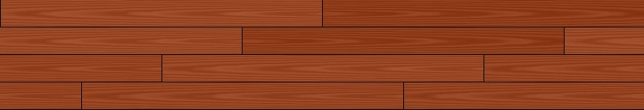

### シダー混合木目

プリセット識別子は`wood.cedar.mixed-sawn`です。

| 項目 | 値 |
|---|---|
| 分類 | 木材 |
| 部材寸法 | 短辺0.15 m、長辺1.80 m、厚さなし |
| 配置 | `running-bond`、行ずらし`1/4` |
| variation cell | 2列×4行 |
| pattern | `mixed-sawn-grain`、周期0.010 m、色変化0.072、凹凸0.00024 m |
| PBR | roughness 0.65、specular 0.43、normalStrength 1.24 |

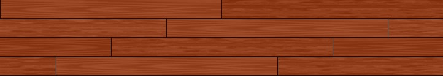

### ライトコンクリート

プリセット識別子は`concrete.slab.light`です。

| 項目 | 値 |
|---|---|
| 分類 | コンクリート |
| 部材寸法 | 短辺0.90 m、長辺1.80 m、厚さ0.010 m |
| 解像度 | 200 pixels/m |
| 配置 | `stack`、行ずらし`0` |
| variation cell | 1列×1行 |
| pattern | `mottle`、周期0.075 m、色変化0.075、凹凸0.00030 m |
| surface | 周期0.0125 m、凹凸0.00025 m。砂による細かなざらつき |
| PBR | roughness 0.90、specular 0.22、normalStrength 1.35 |

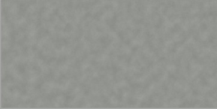

### コンクリートブロック

プリセット識別子は`concrete.block.gray`です。

| 項目 | 値 |
|---|---|
| 分類 | コンクリート |
| 部材寸法 | 短辺0.19 m、長辺0.39 m、厚さ0.10 m |
| 解像度 | 200 pixels/m |
| 配置 | `running-bond`、行ずらし`1/2` |
| variation cell | 2列×4行 |
| pattern | `mottle`、周期0.060 m、色変化0.070、凹凸0.00045 m |
| surface | 周期0.010 m、凹凸0.00030 m。砂による細かなざらつき |
| PBR | roughness 0.94、specular 0.18、normalStrength 1.50 |

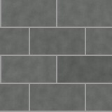

### 窯業系 白

プリセット識別子は`fiber.cement.white`です。

| 項目 | 値 |
|---|---|
| 分類 | セメント |
| 部材寸法 | 短辺0.05 m、長辺0.25 m、厚さなし |
| 解像度 | 200 pixels/m |
| 配置 | `running-bond`、行ずらし`1/4` |
| variation cell | 4列×8行 |
| pattern | `speckle`、周期0.010 m、色変化0、凹凸0.00020 m |
| surface | 周期0.015 m、凹凸0.00010 m |
| PBR | roughness 0.56、specular 0.50、normalStrength 1.10 |

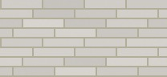

### 窯業系 グレー

プリセット識別子は`fiber.cement.gray`です。

| 項目 | 値 |
|---|---|
| 分類 | セメント |
| 部材寸法 | 短辺0.05 m、長辺1.00 m、厚さなし |
| 解像度 | 200 pixels/m |
| 配置 | `stack`、行ずらし`0` |
| variation cell | 1列×5行 |
| pattern | `speckle`、周期0.010 m、色変化0、凹凸0.00020 m |
| surface | 周期0.015 m、凹凸0.00010 m |
| PBR | roughness 0.56、specular 0.50、normalStrength 1.10 |

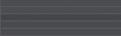

### 赤レンガ

プリセット識別子は`brick.running.red`です。

| 項目 | 値 |
|---|---|
| 分類 | レンガ |
| 部材寸法 | 短辺0.10 m、長辺0.21 m、厚さ0.06 m |
| 配置 | `running-bond`、行ずらし`1/2` |
| variation cell | 4列×8行 |
| pattern | `speckle`、周期0.015 m、色変化0.050、凹凸0.00035 m |
| PBR | roughness 0.90、specular 0.20、normalStrength 1.35 |

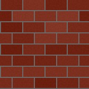

### マーブルビニール

プリセット識別子は`vinyl.tile.marble`です。

| 項目 | 値 |
|---|---|
| 分類 | ビニール |
| 部材寸法 | 短辺0.30 m、長辺0.30 m、厚さなし |
| 配置 | `stack`、行ずらし`0` |
| variation cell | 4列×4行 |
| pattern | `veined`、周期0.0375 m、色変化0.100、凹凸0.000030 m |
| PBR | roughness 0.28、specular 0.68、normalStrength 1.00 |

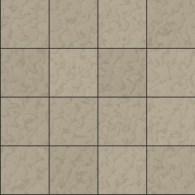

### 白タイル

プリセット識別子は`ceramic.white.square`です。

| 項目 | 値 |
|---|---|
| 分類 | セラミック |
| 部材寸法 | 短辺0.20 m、長辺0.20 m、厚さ0.008 m |
| 配置 | `stack`、行ずらし`0` |
| variation cell | 4列×4行 |
| pattern | `none`、周期0.025 m、色変化0、凹凸0 |
| PBR | roughness 0.16、specular 0.76、normalStrength 0.82 |

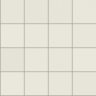

### 樹脂モザイク

プリセット識別子は`resin.mosaic.voronoi`です。

| 項目 | 値 |
|---|---|
| 分類 | 樹脂 |
| 部材寸法 | 短辺0.30 m、長辺0.30 m、厚さなし |
| 配置 | `stack`、行ずらし`0` |
| variation cell | 4列×4行 |
| pattern | `voronoi`、周期0.050 m、色変化0.140、凹凸0.00010 m |
| PBR | roughness 0.80、specular 0.70、normalStrength 1.00 |

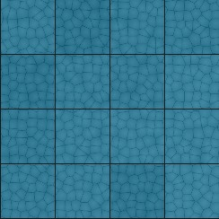

### クラウディブルー

プリセット識別子は`vinyl.cloudy.blue`です。

| 項目 | 値 |
|---|---|
| 分類 | ビニール |
| 部材寸法 | 短辺0.45 m、長辺0.45 m、厚さなし |
| 配置 | `stack`、行ずらし`0` |
| variation cell | 2列×2行 |
| pattern | `cloudy`、周期0.055 m、色変化0.095、凹凸0.000025 m |
| PBR | roughness 0.34、specular 0.60、normalStrength 0.90 |

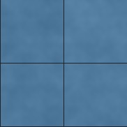

### リネンベージュ

プリセット識別子は`vinyl.linen.beige`です。

| 項目 | 値 |
|---|---|
| 分類 | ビニール |
| 部材寸法 | 短辺0.30 m、長辺0.60 m、厚さなし |
| 配置 | `running-bond`、行ずらし`1/2` |
| variation cell | 2列×4行 |
| pattern | `linen`、周期0.015 m、色変化0.085、凹凸0.00010 m |
| PBR | roughness 0.42、specular 0.52、normalStrength 1.05 |

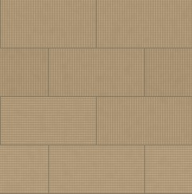

### グレーテラゾー

プリセット識別子は`stone.terrazzo.gray`です。

| 項目 | 値 |
|---|---|
| 分類 | 石材 |
| 部材寸法 | 短辺0.40 m、長辺0.40 m、厚さ0.012 m |
| 配置 | `stack`、行ずらし`0` |
| variation cell | 3列×3行 |
| pattern | `terrazzo`、周期0.028 m、色変化0.160、凹凸0.00030 m |
| PBR | roughness 0.62、specular 0.42、normalStrength 1.30 |

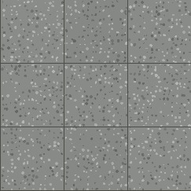

Walnutは`1/3`の行周期を閉じるため、`variationCell.rowCount`が6です。`mixed-sawn-grain`は一枚の板の中で二つの模様を混ぜるのではなく、variation単位で柾目または板目を選びます。

### 丸い石粒と砂利

`pebbles`は、粒の色の濃淡と丸いHeightを別々に生成するpatternです。
暗い石も上向きに盛り上がり、色を薄くしてもHeightやNormalは変わりません。
各粒の色は暗色から中間色、明色まで連続した濃淡から選びます。

- `stone.pebbles.gray`：石だけ。高さ上界0.040m。
- `stone.pebbles-gravel.gray`：石と砂利。隙間の砂利は高さ上界0.006m。
- `stone.gravel.gray`：砂利だけ。高さ上界0.006m。

いずれも目地なし、2m四方の周期面です。
粒の配置尺度は大粒0.12m、小粒0.065mで、粒ごとの半径や向きはseedで変わります。
`Pattern scale m`は配置の尺度であり、全粒の直径を揃える指定ではありません。

```js
const material = await materials.createPreset("stone.pebbles-gravel.gray", {
  tile: {
    pattern: {
      colorAmount: 0.10,
      heightMeters: 0.040,
      pebbles: {
        roundness: 1,
        gravelAmount: 1,
        gravelHeightMeters: 0.006
      }
    }
  }
});
material.applyTo(shape);
```

`pattern.pebbles`は`mode: "pebbles"`だけで使えます。省略値は次のとおりです。

| 項目 | 省略値 | 内容 |
|---|---|---|
| `density` | 0.95 | 粒を置く確率。0〜1 |
| `packing` | 0 | 敷き詰め。粒を大きくして隙間を狭める。0〜1 |
| `irregularity` | 0.8 | 位置・粒径・縦横比のばらつき。0〜1 |
| `roundness` | 1 | 0は平頂、1は丸い上面。0〜1 |
| `gravelAmount` | 0 | 隙間の砂利の量。0〜1 |
| `gravelScaleMeters` | 0.065 | 小粒の配置尺度。0より大きい値 |
| `gravelHeightMeters` | 0.006 | 小粒の高さ上界。0以上 |
| `gravelColorAmount` | 0.10 | 小粒の色の濃淡。0〜0.25 |

「石だけ」は`density: 1`、`packing: 1`で隙間を狭めます。
`irregularity: 1`で配置を乱し、大小と縦横比の異なる粒を混ぜます。
`packing`は大粒だけに作用し、小粒の密度と丸みは大粒と共通です。丸みを変えてもColorは変わりません。
色は別の濃淡値、高さは中心が高い楕円形の曲面から作り、重なる粒の上面は最大値で合成します。
粒の縁は滑らかに底へつなぎ、大粒の隙間へ小粒の高さと色を合成します。

`samples/texture_catalog/texture_catalog.html`の`stone`分類から選び、
Color・Height・Normalを見比べてください。Height画像は`heightRangeMeters`で復号します。
NormalをShapeへ設定しただけでは輪郭は変位しません。
実際の起伏へ光線を当てる場合はHeightを復号し、アプリ側の高さ場交差へ使います。

石砂利を水底へ使うPBR統合例は`samples/water/water.html`です。
この例は集光のON/OFFを同じ法線・材質で比較するため、底面を水平にし、
石粒のColor mapを使います。生成したHeightによる頂点変位やNormalは使いません。
35章のコア集光も水平基準面の照度を投影する近似なので、
石のHeightへ光線を当てる処理が自動で追加されるわけではありません。
材質の模様、表面法線、実際の幾何形状、集光の照度を分けて確認してください。

## 変更できるパラメータ

`createPreset()`の第2引数には、`tile`、`appearance`、`scale`を指定できます。指定しなかった値は、選択したプリセットの値を使います。

```js
const material = await materials.createPreset("wood.oak.plank", {
  tile: {
    pattern: {
      scaleMeters: 0.016
    }
  },
  appearance: {
    roughness: 0.62
  },
  scale: 1.5
});
```

### `tile`の設定

| 階層 | 項目 | 内容と入力条件 |
|---|---|---|
| `resolution` | `pixelsPerMeter` | 1 mあたりの画素数。整数、1〜2048 |
| `unit` | `shortSizeMeters` | 部材の短辺。0より大きい値 |
| `unit` | `longSizeMeters` | 部材の長辺。短辺以上の値 |
| `unit` | `thicknessMeters` | 部材厚。`null`または0より大きい値 |
| `unit` | `longAxis` | 長手方向。`u`または`v` |
| `layout` | `mode` | `stack`または`running-bond` |
| `layout` | `rowOffsetRatio` | `0`、`1/2`、`1/3`、`1/4`。`stack`では`0` |
| `variationCell` | `longUnitCount` | 横方向のvariation数。整数、1〜64 |
| `variationCell` | `rowCount` | 縦方向のvariation数。整数、1〜64 |
| `joint` | `widthMeters` | 目地幅。0以上。0なら目地を生成しない |
| `joint` | `color` | 目地のRGB値。各値は0〜1 |
| `joint` | `depthMeters` | 目地の凹み。0以上。0なら目地の凹みを生成しない |
| `joint` | `edgeRoundMeters` | 目地周辺の丸み。0以上 |
| `color` | `base` | 部材の基準RGB値。各値は0〜1 |
| `color` | `unitVariation` | 部材単位の色変化量。0〜0.25 |
| `color` | `dirtColor` | 汚れのRGB値。各値は0〜1 |
| `color` | `dirtAmount` | 汚れ量。0〜1 |
| `pattern` | `mode` | 13種類から選択 |
| `pattern` | `scaleMeters` | patternの基準周期。0より大きい値 |
| `pattern` | `colorAmount` | patternの色変化量。0〜0.25 |
| `pattern` | `heightMeters` | patternによる凹凸。0以上 |
| `surface` | `detailScaleMeters` | 共通surface detailの周期。0より大きい値 |
| `surface` | `heightNoiseMeters` | 微細凹凸の高さ。0以上 |
| `random` | `seed` | 再現性を決める整数。0〜2147483647 |

`thicknessMeters`は、プリセットが表す部材の実寸を「短辺 × 長辺 × 厚さ」の参考値として記録します。現在の手続きテクスチャ生成は部材表面のColor mapとNormal mapを作り、テクスチャの幅と高さ、目地や模様の周期を`shortSizeMeters`と`longSizeMeters`から決めます。厚みを持つ直方体は、`Primitive.mapRealCuboid(width, height, depth)`など形状を作る処理で`depth`を指定します。表面材の厚さを記録する対象がない場合は`null`を指定します。

pattern modeは材質名ではなく、生成する模様の種類を表します。同じ`mottle`でも、色と凹凸の振幅を変えれば、淡い色むらだけにも、凹凸を持つコンクリート面にもできます。

| mode | 表現と使いどころ |
|---|---|
| `none` | 材質固有の模様を加えず、surface detailだけを使いたいとき |
| `longitudinal-grain` | 長手方向へ流れる一般的な木理 |
| `quarter-sawn-grain` | 柾目。平行木理と短い放射組織の斑 |
| `flat-sawn-grain` | 板目。長手方向へ開くアーチ状の木理 |
| `mixed-sawn-grain` | variation単位で柾目または板目を選び、部材ごとの違いを作る |
| `mottle` | コンクリートの大きめの斑、緩やかな濃淡 |
| `speckle` | レンガや窯業系部材の粒状の濃淡。大きめの粒と細かな粒を混ぜる |
| `veined` | 大理石の脈。細い線状の色変化 |
| `voronoi` | 多角形状の区画と境界。モザイクや割れ目のような表現 |
| `cloudy` | 尺度の異なる雲状の濃淡。ビニールや塗膜の均一でない色 |
| `linen` | 長手と短手の繊維を交差させた布状の表面 |
| `terrazzo` | 決定的に配置した砕石粒。テラゾーや骨材入り樹脂 |
| `pebbles` | 色の濃淡と丸いHeightを別々に生成する石粒と砂利 |

### 模様から色と法線を生成する

生成処理は、材質固有の`pattern`と、材質を問わず使える共通の`surface detail`を別々に計算します。既存patternのscalar値とsurface detailのscalar値は、それぞれColor mapと物理Heightへ使われます。`pebbles`では粒の色の濃淡と曲面Heightを別のfieldとして計算します。

```text
pattern.mode + pattern.scaleMeters
  ├─ pattern.colorAmount → Color mapの色の変化
  └─ pattern.heightMeters → Heightの凹凸

surface.detailScaleMeters + surface.heightNoiseMeters
  ├─ surface detail × dirtAmount → Dirt colorの混合
  └─ surface detail × heightNoiseMeters → Heightの細かな凹凸

物理Height
  = 目地の深さ
  + pattern.heightMetersによる凹凸
  + surface.heightNoiseMetersによる凹凸
      ↓ 隣接pixelの中央差分
  Normal map
```

`Pattern scale m`は材質固有patternの一周期をメートルで指定します。0.060 mなら、おおむね6 cmを基準とした斑になります。値を小さくすると斑や木理は細かくなり、大きくすると粗くなります。これは色と凹凸の両方に共通する模様の位置を変えるため、patternの色だけを薄くしたい場合はscaleではなく`Pattern color amount`を変更します。

`Color amount`は、patternのscalarを基準色へ加える量です。概念的には次の計算です。

```text
patternedColor = baseColor
  + unitRandom × unitVariation
  + patternValue × colorAmount
```

0なら主patternはColor mapへ影響せず、patternの凹凸だけを残せます。`pebbles`の隙間の砂利は別の`gravelColorAmount`で調整します。大きくすると明暗差が強くなりますが、基準色の範囲を超えるほど大きくすると色が不自然になりやすいため、通常は0.02〜0.12程度から確認します。入力範囲は0〜0.25です。

`Pattern height m`はpatternの物理的な高さの振幅です。`pebbles`では底面から上向きに盛り上がる高さの上界です。0.00020 mは0.20 mmに相当します。値を大きくするとHeight mapの差が増え、その隣接差から作られるNormal mapの傾斜も強くなります。Color amountを増やさずに、光の当たり方だけを変えたい場合に使えます。

`Surface detail scale m`は、mottleや木理とは別の、表面全体へ加える細かなPerlin detailの基準寸法です。材質固有patternを保ったまま砂、微細な凹凸、塗膜の粒を変えたい場合に使います。小さくすると細かいdetailになりますが、生成pixelがその変化を十分にサンプリングできなければ、細部が潰れるか周期的な粗い変化に見えます。

`Surface noise height m`は、surface detailの物理的な高さです。Color mapの模様を直接強くする値ではなく、主にHeight mapとNormal mapへ影響します。砂によるざらつきを強くしたいときは、まずこの値を少しずつ増やし、Normal mapの白黒の模様ではなく、実際の立方体へ光を当てたときの細かな陰影で判断します。

### 砂のざらつきを設定する

`concrete.slab.light`と`concrete.block.gray`は、`mottle`を大きな色むらとして残し、surface detailを砂による細かな凹凸として使う設定です。コンクリート全体の色を細かく斑点化するのではなく、色むらと表面のざらつきを分離することが目的です。

```js
const roughConcrete = await materials.createPreset("concrete.slab.light", {
  tile: {
    pattern: {
      mode: "mottle",
      scaleMeters: 0.075,
      colorAmount: 0.075,
      heightMeters: 0.00020
    },
    surface: {
      detailScaleMeters: 0.0125,
      heightNoiseMeters: 0.00025
    }
  },
  appearance: {
    roughness: 0.94,
    specular: 0.20,
    normalStrength: 1.35
  }
});
```

この例では、`mottle`の周期75 mmがコンクリートの緩やかな色むらを作り、surface detailの周期12.5 mmと高さ0.25 mmが砂に近い細かな凹凸を作ります。色むらまで細かくしたい場合は`Pattern scale m`を小さくしますが、ざらつきだけを細かくしたい場合は`Surface detail scale m`を小さくし、`Pattern scale m`は維持します。凹凸が強すぎる場合は`Surface noise height m`を下げ、細かさが足りない場合は`Surface detail scale m`を下げます。

`concrete.block.gray`は初期値でsurface detailの周期10 mm、高さ0.30 mmを使用します。ブロックの大きさや目地の形状はそのままに、表面だけを細かくした値です。`roughness`は広い範囲の反射のぼけ、`specular`は鏡面反射の強さ、`normalStrength`は生成済みNormal mapの影響倍率であり、三つともsurfaceの周波数や物理高さとは別の値です。

### pixelsPerMeterは何を増やすか

`pixelsPerMeter`は1 mを何pixelで表すかを決めます。高くすると、細かなdetailをより多くのpixelで記録できます。物理的な凹凸の高さはHeightのメートル値で決まり、Normal mapは物理Heightの隣接差とpixelsPerMeterから作られるため、同じメートル単位の高さとscaleを保つと解像度を上げても表面の大きさを維持できます。

目安として、`scaleMeters × pixelsPerMeter`が基準detailのpixel幅です。例えば0.0125 mを200 pixels/mで生成すると約2.5 pixelになり、100 pixels/mでは約1.25 pixelです。前者は細かな模様を確認しやすく、後者は情報が不足しやすくなります。まず200 pixels/mで確認し、近距離で粒が潰れる場合だけ400 pixels/mへ上げます。解像度を上げるとGPU生成、メモリ、画像downloadの容量も増えるため、視認距離に合わせて解像度を選びます。

寸法値は、`pixelsPerMeter`との積を整数画素へそろえて生成します。例えば、`pixelsPerMeter: 200`で`joint.widthMeters: 0.005`を指定すると1 pixelになり、0.006 mは1.2 pixelとして丸められます。値を変更する場合は、解像度と寸法の組み合わせも確認します。

### `appearance`の設定

| 項目 | 内容と入力条件 |
|---|---|
| `roughness` | 粗さ。0は滑らか、1は粗い。0〜1 |
| `specular` | 鏡面反射の強さ。0〜1 |
| `metallic` | 金属度。通常の木材、石材、タイルは0。0〜1 |
| `normalStrength` | Normal mapの影響。0〜8 |

`tile`を変更するとColor、Height、Normalを再生成します。`appearance`だけを変更する場合は、画像を再生成せずShapeへの登録値だけを変更できます。

## `mapRealCuboid()`で直方体へ適用する

実寸テクスチャを表示するには、物体側のUVもメートル単位で作ります。`Primitive.mapRealCuboid(width, height, depth)`は、各面の辺の長さをそのままUVへ設定します。

```js
import Primitive from "../../webg/Primitive.js";
import ProceduralMaterials from "../../webg/ProceduralMaterials.js";
import Shape from "../../webg/Shape.js";

const materials = new ProceduralMaterials(app.getGPU());
const concrete = await materials.createPreset("concrete.slab.light", {
  tile: {
    pattern: {
      colorAmount: 0.06,
      heightMeters: 0.00020
    },
    surface: {
      detailScaleMeters: 0.010,
      heightNoiseMeters: 0.00025
    }
  },
  appearance: {
    roughness: 0.94,
    specular: 0.20,
    normalStrength: 1.35
  }
});

const shape = new Shape(app.getGPU());
shape.setShader(app.shader);
shape.applyPrimitiveAsset(
  Primitive.mapRealCuboid(2.0, 3.0, 4.0)
);

// mapRealCuboid()のUVはメートル単位なので、部材寸法を保ったままtextureを反復できる
concrete.applyTo(shape);
shape.endShape();

const node = app.space.addNode(null, "brick-cuboid");
node.addShape(shape);

window.addEventListener("pagehide", () => {
  materials.destroy();
}, { once: true });
```

この例の直方体は幅2 m、高さ3 m、奥行き4 mです。上面と底面では2 m×4 m、前面と背面では2 m×3 m、側面では4 m×3 mのUV範囲になります。生成したtextureの一周期は、プリセットの部材寸法とvariation cellから決まります。

`mapCube()`との違いは次のとおりです。

**`Primitive.mapCube()`**

UVの意味：各面を0〜1へ割り当てる

使う場面：一般的な立方体、atlas

**`Primitive.mapRealCuboid()`**

UVの意味：各面の長さをメートルで表す

使う場面：タイル、木材、レンガなどの実寸表示

`scale`は生成textureの一周期を変更する倍率です。`scale: 2.0`なら一周期は初期値の2倍になり、同じ面に並ぶ部材数は半分になって、タイルは2倍のサイズで表示されます。`scale: 0.5`なら一周期は半分になり、部材数は2倍になります。

## 独自平面へRepeat UVを設定する

`mapRealCuboid()`を使わずに平面を作る場合は、生成結果の`tileSizeMeters`から反復回数を求めます。

```js
const oak = await materials.createPreset("wood.oak.plank");
const surfaceWidthMeters = 6.0;
const surfaceHeightMeters = 4.0;

const repeatU = surfaceWidthMeters / oak.tileSizeMeters[0];
const repeatV = surfaceHeightMeters / oak.tileSizeMeters[1];

const shape = new Shape(app.getGPU());
shape.setTextureMappingMode(1);
shape.setAutoCalcNormals(true);

const vertices = [
  shape.addVertexUV(0, 0, 0, 0, 0) - 1,
  shape.addVertexUV(surfaceWidthMeters, 0, 0, repeatU, 0) - 1,
  shape.addVertexUV(surfaceWidthMeters, surfaceHeightMeters, 0, repeatU, repeatV) - 1,
  shape.addVertexUV(0, surfaceHeightMeters, 0, 0, repeatV) - 1
];
shape.addPlane(vertices, 0);
shape.endShape();
oak.applyTo(shape);
```

この例では`scale`を指定していないため、UVを作成してから`endShape()`した後でも`applyTo()`できます。`scale`を指定する場合は、前の直方体の例と同じく`endShape()`より前に適用します。

`tileSizeMeters`を使わずUVを0〜1へ固定すると、texture一周期が平面全体へ引き伸ばされます。床や壁の部材寸法を維持したい場合は、面の寸法を`tileSizeMeters`で割ってRepeat UVを作ります。

## `applyTo()`でShape単位のPBR値を変更する

同じColor mapとNormal mapを使いながら、ShapeごとにPBR値だけを変えることもできます。

```js
brick.applyTo(shape, {
  roughness: 0.68,
  specular: 0.35,
  normalStrength: 1.2
});
```

`createPreset()`の`appearance`と`applyTo()`の違いは次のとおりです。

- `createPreset(..., { appearance })`
  - 生成したマテリアルの既定PBR値を変更する
- `applyTo(shape, options)`
  - 指定したShapeへの登録時だけPBR値を変更する
- `createPreset(..., { tile })`
  - Color、Height、Normalを再生成する

`applyTo()`では、`slot`、`materialId`、`roughness`、`specular`、`metallic`、`normalStrength`、`alpha`、`ambient`、`power`、`emissive`、`flatShading`を指定できます。未知の項目は無視されず、入力ミスとして例外になります。

## definitionを保存して再利用する

プリセットからの差分ではなく、全ての値を含むdefinitionを保存する場合は`create()`を使います。`texture_catalog`の`Copy Code`と`Download JS`はこの形式を出力します。

```js
const definition = {
  id: "custom.red-brick-wall",
  schemaVersion: 1,
  category: "brick",
  label: {
    ja: "カスタム赤レンガ",
    en: "Custom Red Brick"
  },
  tile: {
    resolution: { pixelsPerMeter: 200 },
    unit: {
      shortSizeMeters: 0.10,
      longSizeMeters: 0.21,
      thicknessMeters: 0.06,
      longAxis: "u"
    },
    layout: { mode: "running-bond", rowOffsetRatio: 0.5 },
    variationCell: { longUnitCount: 4, rowCount: 8 },
    joint: {
      widthMeters: 0.005,
      color: [0.42, 0.42, 0.42],
      depthMeters: 0.008,
      edgeRoundMeters: 0.005
    },
    color: {
      base: [0.48, 0.17, 0.10],
      unitVariation: 0.06,
      dirtColor: [0.19, 0.075, 0.045],
      dirtAmount: 0.08
    },
    pattern: {
      mode: "speckle",
      scaleMeters: 0.012,
      colorAmount: 0.07,
      heightMeters: 0.00035
    },
    surface: {
      detailScaleMeters: 0.010,
      heightNoiseMeters: 0.00055
    },
    random: { seed: 2026081410 }
  },
  appearance: {
    roughness: 0.78,
    specular: 0.25,
    metallic: 0.0,
    normalStrength: 1.5
  }
};

const customBrick = await materials.create(definition, { scale: 1.2 });
customBrick.applyTo(shape);
```

完全なdefinitionを保存すると、将来プリセットの初期値が変わっても、保存時の材質を再現できます。`id`、`schemaVersion`、`label`、`tile`、`appearance`は省略せずに保存します。

## 生成値の検証と失敗の扱い

指定値をそのまま確認できるように、`ProceduralTileSpec`は近い値への自動変換や別のプリセットへの置換を行わず、次の条件を生成開始前に検証します。

- 不明なプリセットIDやfieldがないこと
- 寸法、色、pattern、appearanceが許可範囲にあること
- `stack`のrow offsetが0であること
- `running-bond`のrow offsetと`rowCount`の周期が一致すること
- 寸法と目地幅を整数pixelへ変換できること
- `mixed-sawn-grain`に複数のvariation unitがあること
- ShapeがvertexとUVを持っていること
- `scale`付きマテリアルを`endShape()`後に適用していないこと

失敗時は、入力を補正せず例外を発生させます。表示が意図と異なる場合は、まずプリセットID、`tile`の階層、`pixelsPerMeter`、UV作成の順序を確認します。

## CPU基準とCompute生成の関係

通常の描画ではCompute生成の結果をそのまま使います。CPU版は、同じ生成仕様から期待されるColor、Height、Normalを作る基準です。GPU結果をCPUへ読み戻す処理は、比較や保存など同期が必要な場合だけ行います。

生成処理は次の三つに分けて考えます。

```text
ProceduralTileSpec
  ├─ CPU reference: 値と画像の比較基準
  ├─ ComputeProceduralTile: GPU上のColor／Height／Normal生成
  └─ ProceduralMaterial: Shapeへのtexture／PBR登録
```

同じ`random.seed`と同じtile設定を使えば、部材のvariation、Perlin noise、Voronoi点、Terrazzo粒を再現できます。CPU版とCompute版で乱数の入力順と32 bit hashの規則を合わせることで、表示結果の差を数値で調べられます。

## 実行例の確認順

`examples/29_01.html`では、次の処理を実際に確認できます。

```text
WebgAppの初期化
  → ProceduralMaterialsの生成
  → ceramic.white.square と vinyl.cloudy.blue の生成
  → mapRealCuboid(2, 3, 4)
  → applyTo()
  → endShape()
  → Nodeへ追加
  → pagehideでdestroy()
```

上面、前面、側面を見れば、面ごとの長さに応じてUV範囲が変わり、部材の寸法が面全体へ引き伸ばされていないことを確認できます。`samples/texture_catalog/texture_catalog.html`では、23プリセットの選択、主要なtile値とPBR値の変更、Color／Height／Normal preview、JavaScript／JSON出力、Color／Height／Normal画像の保存を確認できます。

## まとめ

手続きテクスチャを利用するときは、まずプリセットを選び、必要な`tile`または`appearance`だけを変更します。直方体には`mapRealCuboid()`を使い、scale付きマテリアルを`endShape()`より前に適用します。独自平面では`tileSizeMeters`からRepeat UVを計算します。

この順序を守ると、部材の寸法、模様の周期、PBRの見え方、GPU resourceの生成と破棄を別々に確認できます。続く30章では、ここで作ったColor mapとNormal mapを、直接光、IBL、金属反射、粗さ、露出へ接続します。
