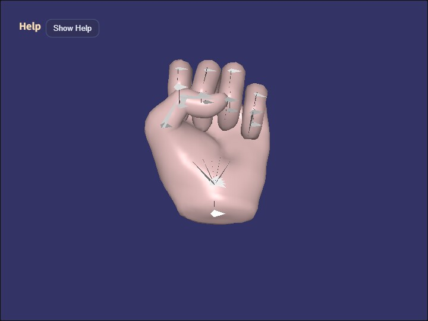

# animation_state

English | [日本語](README.md)

## Overview
- This sample loads the hand from `samples/gltf_loader/hand.glb` and demonstrates a setup where each finger pose is still played as an `Action`, while `AnimationState` decides which action should be selected at the current moment
- The sample is arranged so that simply switching the desired state with `1 - 6` starts the corresponding action, making it easier to follow the division of responsibilities between state control and action playback
- The operation guide is shown in a collapsible help panel at the upper left by using `buildHelpPanelOptions()` and `showOverlayPanel()`, while the current state is displayed separately on the canvas HUD

## How to Run
- Open [./animation_state.html](./animation_state.html)
- Use a browser with WebGPU support, and check the help panel and HUD together with the sample when needed

## webg Features Used
- `WebgApp`: initializes `Screen / Shader / Space / Input / Message` together and loads `hand.glb` with `loadModel(..., { format: "gltf" })`
- `Skeleton / Bone`: used for bone display and bone rotation
- `Action`: handles pattern playback and action playback for the finger poses
- `AnimationState`: a minimal state machine that decides which action to start from the desired state and transition conditions
- Each pose action is treated as a one-shot playback, and the last pose reached remains visible until the state changes
- `buildHelpPanelOptions() + showOverlayPanel()`: builds the standard help panel at the upper left and toggles the visibility of the operation guide
- `Message`: displays the HUD and state information

## Checkpoints
- Confirm that the help panel appears at the upper left, that pressing `Hide Help` leaves only the `Show Help` button, and that `Show Help` restores the panel
- Confirm that the HUD shows `desired state / current state / current action / current pattern / transition`, so you can follow the separation between state transitions and action playback directly on screen
- When `P` enables auto cycle, confirm that the desired state changes after a fixed interval and that the state machine keeps switching actions continuously
- With `hand.glb`, confirm that the hold ranges correspond to `0: rest`, `1: fist`, `2-3: one finger extended`, `4-5: scissors`, `6-7: three fingers extended`, `8-9: four fingers extended`, `10-11: open hand`, and `12-13: fist`

## Controls
- `Hide Help / Show Help` in the upper-left help panel: show or hide the operation-guide body text
- `W / S`: rotate the model around the X axis
- `A / D`: rotate the model around the Y axis
- `Z / X`: rotate the model around the Z axis
- `J`: print the bone list to the console
- `E / R`: rotate the selected bone around the X axis
- `Y / U`: rotate the selected bone around the Y axis
- `C / V`: rotate the selected bone around the Z axis
- `N / M`: switch mesh selection backward or forward
- `O / I`: hide or show the selected mesh
- `9 / 0`: show or hide bones
- `1 - 5`: change the desired state to `pose1 - pose5`
- `6`: change the desired state to `pose0`
- `/`: advance to the next desired state
- `@`: restart the current state
- `P`: toggle auto cycle on or off
- `7 / 8`: toggle rendering on or off
- `K`: enable delayed rendering mode
- `Q`: stop the sample

## Notes
- `AnimationState` does not hold clip data itself; it is a thin control layer that receives existing `Action` objects as controllers
- This sample uses only the connection `state.action -> Action.start(actionId)` and does not handle cross-fade or blend
