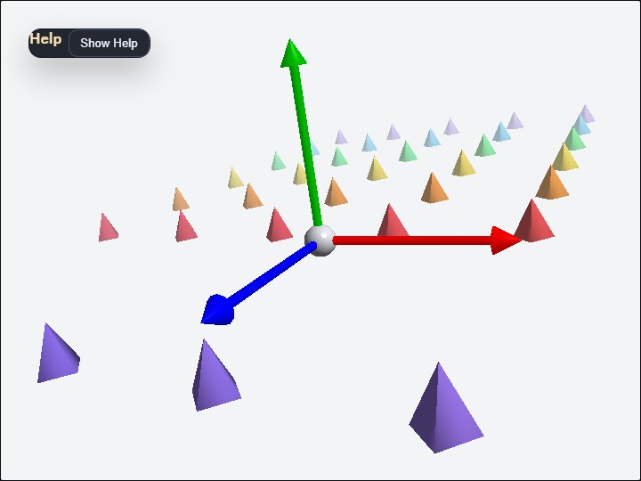

# axis

[English](README.en.md) | 日本語

## 概要
- 3D 空間の原点に X / Y / Z の基準軸を置き、座標系の向きとスケール感を確認する教育用サンプルです
- WebgApp で起動をまとめ、EyeRig の orbit camera と WebgApp.updateProjection() による投影更新を同じ画面で見比べられるようにしています
- projectionFar を 160 に絞り、samples/dof と同じく depth buffer の精度を読みやすい範囲へ合わせています
- - / = で FOV を動かし、[ / ] やホイールで camera 距離を変えることで、projection matrix が見え方をどう変えるかを追いやすくしています
- camera の world 座標を FOV の近くに表示し、視点位置と見え方の関係を同時に確認しやすくしています
- 背景と fog を少しグレー寄りにして、CommandPalette は黒で重ねることで、軸と四角錐の色を読みやすくしています
- 赤い X、緑の Y、青の Z は少し太めにして、白背景でも軸そのものが埋もれにくいようにしています
- 赤い X、緑の Y、青の Z に加えて、はっきりした色の小さな四角錐を Z 軸の正負方向へ広い範囲に並べ、横方向はより密にして座標軸に近い面で奥行きと遠近法を確認しやすくしています
- F で fog を切り替え、D で DOF を切り替えると、同じ scene でも depth cue の出方がどう変わるかを確認しやすくしています
- V で composite / scene / depth / focusMask / stage / smallBlur / mediumBlur / largeBlur を切り替え、focus mask と staged blur の段階を目視比較しやすくしています
- focusRange は最大 blur までの距離ではなく 1 stage 分の距離幅として扱い、focus 面から外れた部分のにじみ方を段階的に確認できます
- maxBlurMix を高めにして、焦点が合っている場合と外れている場合の差が見えやすいようにしています
- 5 / 6 で focus range を変え、焦点の合う距離帯そのものを調整しやすくしています
- 1 / 2 で sharpness width、3 / 4 で sharpness power を変え、focusRange に対する曲線の形を比べやすくしています
- DOF の焦点は常に原点へ合わせ、camera を動かしても center sphere が sharp に見えることを確認しやすくしています
- 軸と四角錐の grid は水平にそろえ、傾きによる見え方の混乱を避けやすくしています
- 原点は小さな球にして、座標軸の交点を軽く見せています
- 操作説明と教育用の補足は buildHelpPanelOptions() と showOverlayPanel() を使って左上の畳める help panel へまとめ、現在値は CommandPalette 側へ分けています

## 実行方法
- 実行ファイルは [./axis.html](./axis.html) です
- WebGPU に対応したブラウザで開き、必要に応じて help panel と CommandPalette と合わせて確認してください

## 使用している webg 機能
- buildHelpPanelOptions() + showOverlayPanel(): 左上の help panel を標準形式で生成し、操作説明と補足説明の表示 / 非表示を切り替える
- EyeRig: orbit camera と pointer / キーボード入力をまとめる
- Shape / Primitive: axis arrow、origin sphere、四角錐列の生成
- WebgApp.updateProjection(): viewAngle と viewport aspect から projection matrix を更新する入口
- CommandPalette: current value を表示しながら FOV / fog / DOF を変更する設定パネル

## 確認ポイント
- X / Y / Z の色と向きが想定どおりかを確認し、座標系の読み方を他のサンプルとそろえます
- camera orbit と FOV 変更で、同じ scene でも見え方が大きく変わることを確認します
- origin sphere と Z 方向に広げた四角錐の列が残ることで、軸だけよりも奥行きがつかみやすく、水平な grid との比較もしやすいことを確認します
- 左上の help panel に座標軸の補足と操作説明が表示され、Hide Help を押すと Show Help ボタンだけが残り、Show Help で再表示できることを確認します
- fog と DOF を切り替えると、奥行きの強調方法がどう変わるかを確認します
- CommandPalette と help panel が白背景上でも読みやすいことを確認します

## 操作方法
- 左上 help panel の Hide Help / Show Help: 操作説明本文の表示 / 非表示
- ドラッグ: orbit camera
- arrow keys: orbit camera
- ホイール / [ ]: camera 距離
- - / =: FOV
- F: fog の ON / OFF
- D: DOF の ON / OFF
- 5 / 6: focus range を狭める / 広げる
- 1 / 2: sharpness width を下げる / 上げる
- 3 / 4: sharpness power を下げる / 上げる
- V: DOF debug view を composite / scene / depth / focusMask / stage / smallBlur / mediumBlur / largeBlur で切り替え
- stage debug と small / medium / large blur を見比べ、focus 外のにじみ方を比較します
- r: camera、FOV、fog、DOF を reset
