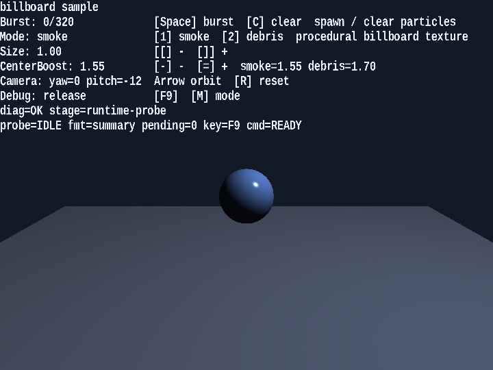

# billboard

English | [日本語](README.md)

## Overview
- This sample uses the `Billboard` class to render particle expressions that always face the camera
- It uses procedural textures generated by `Texture.buildProceduralBillboardTexture`, letting you switch between smoke and debris and compare the two looks
- Small spheres and a floor are placed in the background, and a world light together with ground shadow billboards makes the depth relationship of the particles easier to read

## How to Run
- Open [./billboard.html](./billboard.html)
- Use a browser with WebGPU support, and check the help panel and HUD together with the sample when needed

## webg Features Used
- `Billboard`: instance-based billboard rendering
- `BillboardShader`: particle shader with position, scale, and color
- `Texture`: procedural texture generation by combining a circular mask and noise
- `Space / Node / Shape / SmoothShader`: renders the background 3D scene
- `Billboard.drawGround`: draws shadow billboards laid down on the ground

## Checkpoints
- Confirm that the particles keep facing the front of the camera as it rotates, verifying that the billboard orientation logic is correct
- When switching between smoke and debris with `1 / 2`, confirm that the appearance changes significantly even though the particle update formula stays the same, simply because the texture character changes
- When changing `centerBoost` with `- / =`, confirm how the density at the center and the appearance of the edges change
- Confirm that this configuration can serve as a practical effect foundation because it keeps the vertex count lower than a mesh-based method with the same number of particles
- Confirm that the spheres receive highlights and that the lighting direction still looks natural when the camera rotates
- Confirm that a faint shadow billboard appears directly below each particle and that the shadow intensity changes with height

## Controls
- `Space`: create a particle burst
- `1`: switch to the smoke texture
- `2`: switch to the debris texture
- `[ / ]`: decrease or increase particle size
- `- / =`: decrease or increase the `centerBoost` of the current mode
- `ArrowLeft / ArrowRight`: rotate the camera horizontally
- `ArrowUp / ArrowDown`: rotate the camera vertically
- `R`: reset the camera angles
- `C`: clear all particles
- On smartphones (`coarse pointer`), touch buttons `← / → / ↑ / ↓ / BURST / 1 / 2 / C / [ / ] / - / +` are shown at the bottom of the screen
