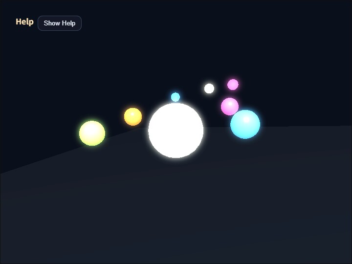

# bloom

English | [日本語](README.md)

## Overview
- This sample uses `BloomPass` to render the 3D scene once into an offscreen `RenderTarget`, then composites bloom before returning the result to the canvas
- It is a minimal implementation for confirming that postprocess can be added as an independent layer even before introducing PBR or shadow maps
- `WebgApp` is used for startup and CommandPalette display, while the 3D scene itself is switched to offscreen rendering with `autoDrawScene: false`
- The operation guide is collected at the upper left with `buildHelpPanelOptions()` and `showOverlayPanel()`, and when it is not needed the body can be folded away so only the `Show Help` button remains
- In addition to the specular highlight on the center sphere, strongly emissive warm, blue, and pink small spheres are placed so it is easier to see how colored glow spreads into the darker background

## How to Run
- Open [./bloom.html](./bloom.html)
- Use a browser with WebGPU support, and check the help panel and CommandPalette together with the sample when needed

## webg Features Used
- `buildHelpPanelOptions() + showOverlayPanel()`: builds the standard help panel at the upper left and toggles the visibility of the operation guide
- `EyeRig(type="orbit")`: orbit viewpoint for looking around the whole scene
- `RenderTarget`: offscreen color/depth texture that serves as the drawing destination for the 3D scene
- `BloomDebugFullscreenPass`: expands the canvas-format scene/extract targets and lower-resolution blur targets across the full screen with normalized UV coordinates for diagnostic display
- `WebgApp.light.mode = "world-node"`: uses a flow where the light is placed in world space instead of being fixed to the camera
- `Shape`: generates the glow objects and the floor geometry
- `CommandPalette`: shows and edits current bloom parameter values in one settings panel

## Checkpoints
- Confirm that the 3D scene is not drawn directly to the canvas but first to the offscreen target, then displayed after bloom compositing
- Confirm that blur appears around the center sphere and the bright orbs, and that only the bright parts spread rather than the whole image simply becoming blurry
- Confirm that glow also appears around the warm, blue, and pink emissive spheres in the upper-back area of the screen, so colored bloom is visible over the dark background
- Confirm that the help panel appears at the upper left, that pressing `Hide Help` leaves only the `Show Help` button, and that `Show Help` restores it
- Confirm that CommandPalette shows current values directly on steppers, selectors, and toggles, and that the values can be edited in place
- When `B` toggles bloom on or off, confirm that only the presence of the postprocess changes while the scene itself stays the same
- When changing threshold with `1 / 2`, strength with `3 / 4`, blur iterations with `5 / 6`, and blur radius with `7 / 8`, confirm that the visual result and the CommandPalette values match
- When changing `extractIntensity` with `A / S`, confirm how strongly the colored emissive spheres and highlights are routed into the extract view
- When `U` switches blur quality between full and half, confirm how the blur appearance and blur-target size change
- When changing `softKnee` with `Q / W`, `extractIntensity` with `A / S`, exposure with `T / Y`, and tone-map mode with `G`, confirm how the extraction boundary and final composite appearance change
- In the `Tone Map` and `Exposure` rows on the CommandPalette, confirm that the colors are tone-mapped after bloom compositing
- Confirm that the threshold boundary does not switch abruptly, and that `softKnee` makes highlights near the boundary extract more smoothly
- Because bloom extraction uses not only luma but also `max(rgb)` more strongly, confirm that strongly emissive blue and pink colors enter the extract view more easily
- Use `V` to switch between `composite / scene / extract / extractHeat / blurA / blurB` and confirm that the extract colors themselves and the gain shown as heat can be inspected separately
- Confirm that even when the viewport size changes, `BloomPass.resizeToScreen()` keeps the offscreen target in sync so bloom positions do not slip and resolution does not break
- Confirm that rotating only the camera does not make the highlight positions follow perfectly, showing that a world-fixed light is in use
- On narrow screens, confirm that CommandPalette can be opened only when needed, so parameter controls do not keep covering the scene

## Controls
- `Hide Help / Show Help` in the upper-left help panel: show or hide the operation-guide body text
- Drag / arrow keys: orbit camera rotation
- Mouse wheel / `[ / ]`: zoom
- `B`: toggle bloom on or off
- `1 / 2`: decrease or increase threshold
- `3 / 4`: decrease or increase bloom strength
- `5 / 6`: decrease or increase blur iterations
- `7 / 8`: decrease or increase blur radius
- `U`: switch blur quality between full and half
- `Q / W`: decrease or increase `softKnee`
- `A / S`: decrease or increase `extractIntensity`
- `T / Y`: decrease or increase exposure
- `G`: switch tone-map mode between `off / reinhard / aces`
- `V`: switch display between `composite / scene / extract / extractHeat / blurA / blurB`
- `Space`: pause or resume orb rotation
- `R`: restore bloom parameters to their defaults
