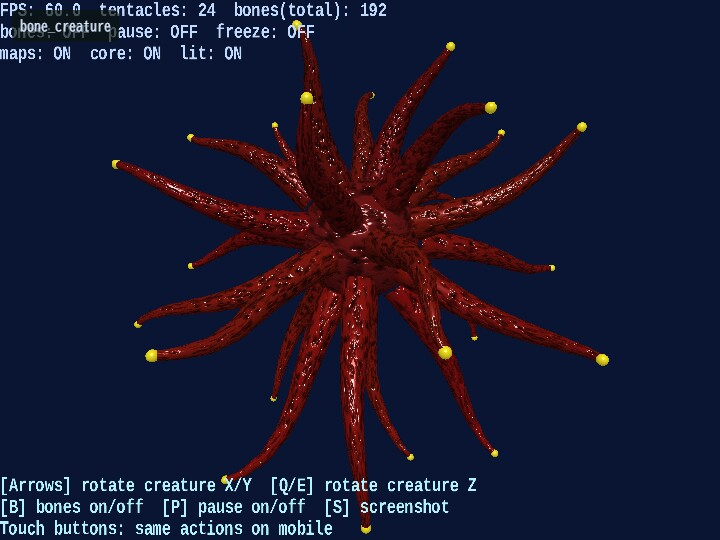

# bone_creature

English | [日本語](README.md)

## Overview
- This sample animates multiple skinned meshes (tentacles) at the same time so you can inspect bone deformation and the appearance of normal maps
- It is structured as a practical example of using `SmoothShader` for "skinning + normal map"

## How to Run
- Open [./bone_creature.html](./bone_creature.html)
- Use a browser with WebGPU support, and check the help panel and HUD together with the sample when needed

## webg Features Used
- `WebgApp`: standard initialization for `Screen / Shader / Space / Camera / Input / Message`
- `Skeleton / Bone`: bone hierarchy and pose updates
- `Shape + weights`: the meshes that are deformed by skinning
- `SmoothShader`: lighting with normal-map support for bone-deformed meshes
- `Texture`: generates a height map and normal map from procedural noise
- `WebgApp.setGuideLines / setStatusLines`: shows the operation guide and runtime status
- `Touch`: rotation / action buttons for mobile devices

## Checkpoints
- Confirm that the tentacles deform continuously while following the bone hierarchy, verifying that the weight setup and pose updates do not break
- Confirm that the density of the shading changes when the normal map is enabled or disabled, so the effect of introducing `SmoothShader` can be estimated
- When bone display is enabled, confirm that the visible bone directions match the actual directions of mesh deformation
- Confirm that the guide is displayed at the bottom and the status at the top, so the sample also demonstrates a split between display roles

## Controls
- `ArrowUp / ArrowDown`: rotate the whole creature around the X axis
- `ArrowLeft / ArrowRight`: rotate the whole creature around the Y axis
- `Q / E`: rotate the whole creature around the Z axis
- `B`: toggle bone display on or off
- `P`: toggle pause on or off
- `S`: save a screenshot
