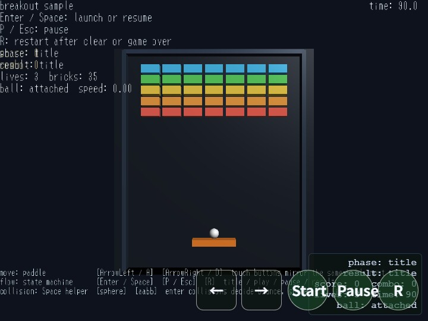

# breakout

[English](README.en.md) | 日本語

## 概要
- webg のゲーム向け基礎機能を使って、3D 表現を取り入れたシンプルなブロック崩しを作るサンプルです。
- WebgApp を入口にして、入力、HUD、scene phase、ゲーム状態管理、表示メッセージを 1 本の処理フローへまとめています。
- 盤面は title / play / pause / result の 4 状態で進み、入力の押下、残りブロック数、残り時間、残りライフによって自然に切り替わります。
- 見た目は 2D に近いですが、Paddle / Ball / Brick / Wall を 3D shape として生成し、2D 的な座標管理と組み合わせてゲームを構成しています。
- Message 系 HUD で score / combo / time / lives / phase / ball 状態を表示し、画面上の情報だけでゲーム進行を追えるようにしています。
- Touch による左右移動ボタンと Start / Pause / R ボタンを用意し、キーボード入力とタッチ入力の両方で同じゲーム操作を行えるようにしています。

## 実行方法
- 実行ファイルは [./breakout.html](./breakout.html) です
- WebGPU に対応したブラウザで開き、必要に応じて help panel や HUD と合わせて確認してください

## 使用している webg 機能
- WebgApp: Screen / Shader / Space / Input / Message / HUD / debug tools をまとめて初期化する
- app 側 GameStateManager: title / play / pause / result の状態遷移を整理する
- InputController: キーボードやタッチ入力から得た正規化済みキー名を action 名へ束ねる
- Touch: 左右移動と launch / pause / restart をタッチボタンで入力する
- Shape: Paddle / Brick / Wall / Backdrop などの任意サイズの box 形状を作る
- Primitive: Ball の球メッシュを生成する
- Space: 各 shape を node として配置し、表示用の 3D シーンを構成する
- Message: guide / control rows / game HUD / status 表示を画面に出す
- Toast: serve / pause / miss / result などの一時的な状態通知を表示する

実装上の特徴
- 入力は app.registerActionMap() で left / right / launch / pause / restart にまとめています。
- left は ArrowLeft / A、right は ArrowRight / D に対応します。
- launch は Enter / Space、pause は P / Esc、restart は R に対応します。
- タッチボタンの ← / → は hold 入力として扱い、Paddle の左右移動に使います。
- タッチボタンの Start / Pause / R は action 入力として扱い、それぞれ launch / pause / restart に対応します。
- Ball / Paddle / Brick / Wall には collision shape も設定していますが、このサンプルのゲーム判定自体は、makeBox() と circleIntersectsBox() を使ったサンプル側の 2D 判定で行っています。
- Ball の移動は 1 フレームを複数の小ステップに分割して進め、速い移動でも壁やブロックをすり抜けにくいようにしています。
- Paddle 反射では、Ball が Paddle のどの位置に当たったかに応じて反射方向を変えています。
- Brick に当たると 1 個だけ消え、score と combo が更新されます。
- 床側へ Ball が落ちると lives が減り、残り lives があれば Paddle 上に Ball を戻します。
- bricks が全消しになると clear、lives が 0 になると game over、time が 0 になると time up として result に入ります。

## 確認ポイント
- Enter / Space で title から play に入り、Ball が Paddle から打ち出されることを確認します。
- ArrowLeft / ArrowRight / A / D で Paddle が即時に動き、タッチボタンの ← / → でも同じ動きになることを確認します。
- P / Esc で pause に入り、Enter / Space または P / Esc で play に戻れることを確認します。
- play 中に Ball が Paddle に当たると、当たった位置に応じて反射方向が変わることを確認します。
- Brick に Ball が当たると 1 個だけ消え、score と combo が更新されることを確認します。
- 左右壁と天井で Ball が反射することを確認します。
- Ball が床側へ落ちると lives が減り、残り lives がある場合は Ball が Paddle 上へ戻ることを確認します。
- bricks が全消し、lives が 0、または time が 0 になると result に入り、R で title へ戻れることを確認します。
- タッチボタンの Start / Pause / R でも、キーボードと同じように開始、停止、再開、リスタートができることを確認します。
- HUD に score / combo / time / lives / phase / ball 状態が表示され、ゲームの進行状態を追えることを確認します。

## 操作方法
- ArrowLeft / A: Paddle を左へ動かす
- ArrowRight / D: Paddle を右へ動かす
- Enter / Space: title から開始、pause から再開、play 中のサーブ待機状態から Ball を打ち出す
- P / Esc: pause、または pause から再開
- R: result から title へ戻る
- タッチボタン ←: Paddle を左へ動かす
- タッチボタン →: Paddle を右へ動かす
- タッチボタン Start: launch action を発生させる
- タッチボタン Pause: pause action を発生させる
- タッチボタン R: restart action を発生させる

状態遷移
- title: 初期状態です。レベルを初期化し、開始入力を待ちます。
- play: 実際にゲームが進行する状態です。Paddle 移動、Ball 移動、反射、Brick 破壊、残り時間の更新を行います。
- pause: 一時停止状態です。ゲーム進行は止まりますが、Paddle の移動入力は確認できるようにしています。
- result: 終了状態です。clear / game over / time up の結果を表示し、restart 入力を待ちます。

補足
- このサンプルは、ゲーム向け API の最小確認として、見た目の派手さよりも state / input / HUD / collision 判定の流れを追いやすいことを優先しています。
- Ball は Primitive.sphere() で作成し、Paddle / Brick / Wall / Backdrop はサンプル内の createBoxShape() で任意サイズの box mesh として作成しています。
- Ball には sphere、Paddle / Brick / Wall には aabb の collision shape を設定しています。
- ただし、ゲーム進行に使う衝突判定は Space.stepCollisions() の enter 結果ではなく、サンプル側の circleIntersectsBox() による 2D 的な簡易判定です。
- Space には node と collision body を登録していますが、このサンプルでは主に「3D シーン上にゲーム要素を配置する基盤」として使っています。
- result 画面は clear / game over / time up を同じ phase へまとめ、終了理由だけを文言で切り替える構成にしています。
- 入力処理では、生の event.key を直接扱うのではなく、WebgApp / InputController 側で正規化されたキー名と action 名を使う前提にしています。
