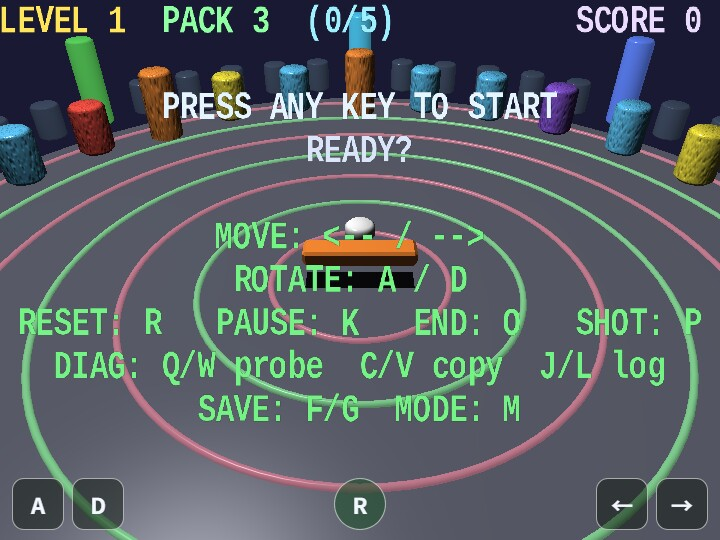

# circular_breaker

[English](README.en.md) | 日本語

## 概要
- webgの基本機能（シーン管理、衝突、HUD、音）をまとめて使った3Dブロック崩しの統合サンプルです。
- ゲーム実装時の「複数Shape再利用」「ノード更新」「入力反映」の参考実装として使えます。
- キャンバスはPC/スマホともにブラウザのviewport全体へ追従して表示されます。
- 縦長画面ではFOVを自動調整して視野を確保します。
- gameplay 中の短い状態表示は drawHud() の canvas HUD へまとめ、画面上の情報をゲーム進行に必要な表示へ絞っています。

## 実行方法
- 実行ファイルは [./circular_breaker.html](./circular_breaker.html) です
- WebGPU に対応したブラウザで開き、必要に応じて help panel や HUD と合わせて確認してください

## 使用している webg 機能
- app 側 GameStateManager: intro / play / pause / stage-clear / result の top-level phase 管理
- Space / Node: ゲームオブジェクト管理
- Shape: 床・壁・ブロック・パドル・パック生成
- SmoothShader: 法線マップ付き/無しブロック描画を 1 本で扱う標準材質
- ParticleEmitter: ブロック破壊時の spark effect をまとめて管理
- Texture: ブロック用の手続きテクスチャ生成
- Message: drawHud() から描く gameplay 専用 HUD
- Touch: ← / → / A / D / R の固定ボタン
- GameAudioSynth: melody preset と SE catalog を使った BGM/SE再生

## 実装の流れ

`main.js`は`WebgApp`、`SmoothShader`、`GameAudioSynth`を初期化し、arena、block、paddle、pack、particleを作成した後、入力、game runtime、scene phase、diagnosticsを接続します。毎frameの個別ルールを`main.js`へ集めず、初期化と各moduleの配線を追えるようにしています。

`gameRuntime.js`はscore、level、残りPACK数、paddleとpuckの位置・速度など、play中に変化する状態を保持します。paddle移動、puck反射、blockとの衝突、短時間の反動表示を更新し、stage進行に関する判断は`stageFlow.js`へ渡します。`stageFlow.js`は制限時間、目標破壊数、score計算、block再配置、game overを扱うため、物体の移動処理とstage規則を別々に確認できます。

`scenePhases.js`は`GameStateManager`を使い、`intro / play / pause / stage-clear / result`の最上位状態を切り替えます。stage内で起きた結果をscene phaseへ変換し、phaseごとのBGMと通知SEもここで選びます。HUDは`Hud.js`、sparkは`particleEffects.js`、high score保存は`highScoreStore.js`へ分けているため、描画、短時間演出、永続データをgameplay更新から独立して調べられます。

処理順序は、入力をactionへ変換し、scene phaseを更新し、phaseに応じてgame runtimeを進め、更新後のNodeを描画し、最後にparticleとHUDを重ねる流れです。pauseでは現在の画面を保ったままgameplay更新を止め、resultでは移動と衝突を止めて終了表示とparticleの更新だけを続けます。

## ファイル構成

- `main.js`: WebgApp初期化、scene構築、入力、更新・描画loop、diagnosticsの接続
- `constants.js`: arena寸法、block数、速度、stage時間などの共通値と2次元計算helper
- `arenaScene.js`: arenaの床、壁、guide ring、照明を作る
- `shapeFactory.js`: bevel付きboxとcylinderなど、共通Shapeを生成する
- `blockField.js`: block用textureとprototype、instance、block type、stageごとの再配置を管理する
- `gameRuntime.js`: paddleとpuckの運動、衝突、scoreなどplay中の状態を更新する
- `stageFlow.js`: 制限時間、目標、stage clear、score計算、game overを判定する
- `scenePhases.js`: `GameStateManager`による最上位phaseとphase別audioを管理する
- `particleEffects.js`: block破壊時のsparkを生成・描画する
- `Hud.js`: gameplay状態とdiagnosticsをcanvas HUDへ整形する
- `inputConfig.js`: keyboard、touch、debug actionの対応を定義する
- `highScoreStore.js`: `WebgApp.saveProgress()`と`loadProgress()`を使って上位5件を保存する

## 確認ポイント
- パドル移動と回転に対してパックの反射方向が安定して更新されるかを確認し、衝突応答ロジックの基礎品質を検証します
- パックを paddleNode ローカルZ正側へ入れた瞬間に PACK 残数が1減ること、領域に留まり続けても追加減算されないことを確認します
- PACK が 0 になったフレームでゲーム終了し、終了HUDにハイスコア上位5件が表示されることを確認します
- 緑色の補給ブロック（法線/テクスチャ無し、SmoothShader の単色経路）を破壊したときに PACK 残数が1増える演出が出ることを確認します
- ブロック破壊時にスコアや進捗表示（(現数/目標数)）が即時更新されるかを確認し、drawHud() による gameplay HUD 連携が正しいことを確認します
- SE/BGM がゲーム状態に応じて再生されるか（BGM preset, 通知SE, 衝突SE）が整理されているかを確認します

## 操作方法
- ArrowLeft / ArrowRight: パドルを長軸方向に移動
- A / D: パドルを回転
- R: プレイ中はパック位置をリセット、ゲーム終了後はゲームを再スタート
- K: 一時停止のON / OFF
- O: ゲームオーバーを強制
- P: スクリーンショット保存
- Q / W: diagnostics を text / json で probe 表示
- C / V: diagnostics を text / json で clipboard copy
- J / L: diagnostics を text / json で console log
- F / G: diagnostics を text / json で保存
- M: debug / release 表示切り替え
- Enter / Space / クリック: ステージ開始待機中の開始トリガ
- スマホ（coarse pointer）では画面下にタッチボタン ← / → / A / D / R を表示
- スマホUIに pause / debug / diagnostics 系の K / O / P / Q / W / C / V / J / L / F / G / M は表示しない
