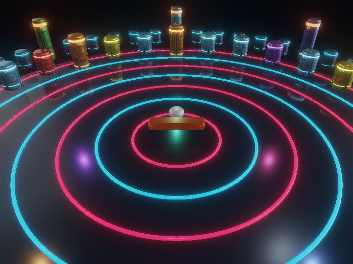

# circular_breaker2

柱とブロックは、円周を囲む上部の強い発光帯と、下部帯・インジケーターを持ちます。発光マスクの値は上部255、下部帯とインジケーター160です。

LEVEL、PACK、破壊数、SCORE、進行状態と目標は、Canvas外の先頭行にゲーム名と並べて表示します。幅が足りない場合は見出し内で折り返し、Canvasは残りの高さに追従します。

Canvasはウィンドウ幅と、見出しを除く高さへ追従します。ArenaSceneAppのResizeObserverが表示領域を監視し、Screen、カメラの縦横比、PBR描画先を更新します。描画解像度はCSSピクセルと同じ倍率に保ちます。

実行画面はゲーム名、得点、ステージ目標、操作案内、操作ボタンを表示し、診断情報はMキーで開きます。描画にはPBRの影と反射を使い、SSAOは無効にしています。

SceneYAML、ModelYAML、PBRを使って円形のブロック崩しを構成するサンプルです。

[サンプルを起動](./circular_breaker2.html)　[English](./README.en.md)

## 概要

円形の床、7本の同心円、48本の外周柱、28個のブロック、面取りしたパドルとパックを表示します。カメラはパドルの子Nodeに置き、パドルの移動・回転に追従します。寸法・配置・操作を保ち、暗い金属の床とシアン／赤の発光リングを組み合わせた配色にしています。

シーン全体のモデル参照、基本材質、描画設定を `scene.yaml` に、実寸の頂点・法線・UV、Node階層、初期配置を `model.yaml` に保存します。読み込み後はSceneAssetとModelAssetとして扱い、`ArenaSceneApp.create()` でPBR描画へ接続します。YAML原文とコメントは各Assetが保持します。

## 操作方法

ArrowLeft / ArrowRightでパドルの長軸方向へ移動し、A / Dで回転します。カメラも追従するため、回転時にはパドルを中心に周囲の景色が動きます。Enter、Space、クリックで開始し、Rでパックを戻します。Kで一時停止・再開します。終了画面ではRで再スタートします。画面下のボタンでも移動・回転できます。

Pはスクリーンショット、Oは強制終了です。Mで診断表示を切り替え、パドルの角度と位置を確認できます。Q/W、C/V、J/L、F/Gは診断の収集、コピー、ログ、保存操作です。押し続ける入力と、描画frameの間に押して離す短い入力の両方を受け付けます。

## 実装の分担

`ArenaSceneApp.js` はWebgSceneAppを継承し、シアン・アンバー・紫・緑・赤・青の6個の点光源をDeferred Lightingへ渡します。半径36の円周上、高さ22に固定配置し、各灯の照明範囲は半径72、相対強度は4.0です。方向光は強度0.12、環境光は0.65へ抑えています。カメラが動いても光源位置は固定です。追加点光源の個別シャドウマップは生成せず、既存の方向光の影を維持し、SSAOは無効にしています。点光源の配置と色は `createArenaLights()`、補助光は `scene.yaml` で調整します。

`main.js` は両Assetの読み込み、パドル追従カメラ、入力、画面上の得点表示を接続します。WebgSceneAppが作るOrbitカメラの入力更新とpointer操作を止め、視点をパドルの子へ移します。視点の相対位置は `[0, 34, 50]`、俯角は36度、画角は52度です。

`blockField.js` はModelYAMLの配置済みNodeを取得し、種別に応じて色と表示するNodeを変更します。標準・高い耐久用・被弾後の低い形状をModelYAMLから読み込み、耐久ブロックの最初の被弾で高さを12.8から6.4へ変えます。`panelTexture.js` が512×512のSF外装を手続き生成します。円周を4枚のパネルに分け、継ぎ目・浅い溝・細い発光帯・3本のインジケーターを配置します。色、高さ、発光マスクを分離し、外周柱と全ブロックで色テクスチャ・法線マップ・発光テクスチャを共有します。平滑な金属面の反射を保ち、マスクの白い部分だけを色付きの光にします。補給ブロックは外装を維持し、ランプが緑色に脈動します。

床はmetallic 0.72、roughness 0.18とし、SSRで画面内の物体を映します。画面外の物体や裏側はSSRで取得できる範囲に含まれず、IBLと組み合わせた反射になります。通常ブロックはmetallic 0.72、roughness 0.22、外周柱はroughness 0.20です。specularは1を保ち、金属度、粗さ、環境光で反射を調整します。

`main.js` で既存のComputeEffectPipelineのBloomを有効にします。threshold 1.1、strength 0.38で、HDR発光から取り出した光をトーンマッピング前に合成します。リングと補給ブロックはRGB成分の比率を変えた発光により、色を持つ光の広がりを作ります。Bloomは画面上の効果であり、周囲の物体へ照明を追加する処理とは別です。設定場所は、基本材質・SSRが `scene.yaml`、Bloomが `main.js`、補給の発光変化が `gameRuntime.js` です。

`gameRuntime.js` と `stageFlow.js` は移動、衝突、反射、ステージ進行を処理します。衝突音は `GameAudioSynth` を利用します。`particleEffects.js` は標準の `ComputeParticleEmitter` をPBRへ登録し、衝突ごとに32粒のシアン／暖色の火花を発生させます。寿命0.858〜1.32秒、最大480粒の循環プールを使い、古い割当から置換します。CPUは発生要求をまとめて送り、初期位置・速度・寿命の生成と更新をGPUで行います。透明合成後のHDR画像へ加算し、Bloomとトーンマッピングを適用します。Bloomの有効・無効にかかわらず火花は更新されます。Kによる一時停止では火花も停止し、再スタートで消去します。診断表示の `estimated` は最大寿命から求める推定数です。火花は画面効果用の粒子として描画し、遮蔽には不透明物の深度を使います。SSRは粒子描画より前のシーンを参照します。衝突は円形アリーナ向けの専用計算なので、モデルの寸法・配置を変更するときは `constants.js` の判定寸法も対応させてください。

## 形状の編集と再生成

移動する形状の寸法は頂点座標へ含め、Nodeのscaleを `[1, 1, 1]` に統一しています。これにより、ゲーム中の位置・回転更新後もパドルの12.4×1.8×3、パックの半径1.8が維持されます。

`tools/buildAssets.mjs` は定義した寸法から両YAMLを生成します。リポジトリのルートで `node samples/circular_breaker2/tools/buildAssets.mjs` を実行します。この操作は `model.yaml` と `scene.yaml` を上書きするため、手編集したYAMLは先に保存してください。通常のブラウザ起動では生成済みYAMLを読み込みます。

## 確認ポイント

開始後、A/Dで景色が回転し、左右キーで視点とパドルが一緒に移動することを確認します。ブロックへの衝突で得点が増え、破壊されたブロックは消えます。耐久ブロックは1回目の被弾で低くなります。Kで停止した間はパドルとパックが動かず、もう一度Kを押すと再開します。

視点を動かして床の映り込みと柱のハイライトが変わること、リングと補給ブロックの周囲に色付きの光が広がることを確認します。
