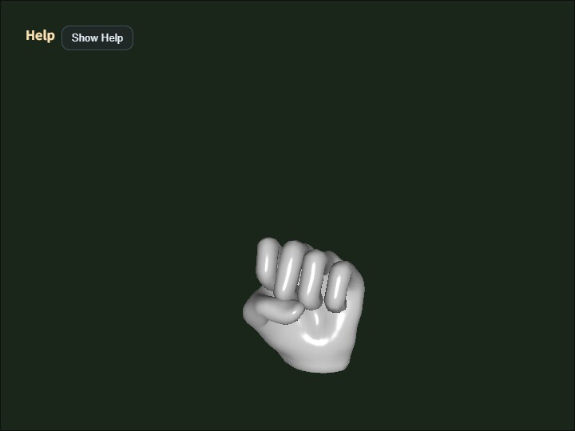

# collada_loader

English | [日本語](README.md)

## Overview
- This sample loads the Collada (`.dae`) file specified in `main.js`, normalizes it into `ModelAsset`, and then displays it
- It calls the Collada facade from `WebgApp.loadModel()` and demonstrates the shared entry point that covers everything from parsing to generating `ModelAsset` and runtime objects
- The loaded `ModelAsset` can be downloaded as a JSON file with the `D` key
- When exporting Collada (`.dae`) from Blender, the loader assumes files are exported in `Y-up`
- The loader's model-origin policy uses the skeleton root as the origin for skinned models and the mesh node as the origin for non-skinned models

## How to Run
- Open [./collada_loader.html](./collada_loader.html)
- Use a browser with WebGPU support, and check the Help Panel and CommandPalette together with the sample when needed

## webg Features Used
- `WebgApp`: standard initialization, render loop, and Help Panel display
- `CommandPalette`: groups animation control, wireframe, screenshot, JSON export, and camera reset
- `WebgApp.loadModel`: high-level entry point for the Collada facade
- `ModelLoader`: bundles DAE text load / parse / `ModelAsset` conversion / build / instantiate
- `ModelAsset`: holds the data representation and supports JSON download
- `ModelAsset.getClipNames`: inspects the clip list before build
- `ModelBuilder`: builds shapes, skeletons, and animations from `ModelAsset`
- `ModelBuilder.animationMap`: accesses runtime animations from clip IDs
- `build()` result helpers: `instantiate() / createNodeTree() / bindAnimationBindings() / getAnimation() / getAnimationNames() / startAllAnimations() / playAllAnimations() / setAnimationsPaused()`
- `EyeRig(type="orbit")`: orbit viewpoint based on the bounding box

## Processing Flow
- The sample calls `WebgApp.loadModel(COLLADA_FILE, { format: "collada" ... })` and enters the Collada facade through the shared loader entry point
- `ModelLoader` reads the DAE text and hands parsing and normalization to `ColladaShape`
- `ColladaShape` gathers mesh / skeleton / animation / node data into `ModelAsset` format
- After that, `ModelBuilder` assembles `Shape / Skeleton / Animation / Node`, and the sample uses the build result as the runtime
- Unlike glTF, the Collada loader side does not have a static-bake plan, but the final runtime helpers still go through the shared `ModelBuilder`

## How to Read the Downloaded JSON
- `meta.source` is expected to be `Collada`, and `meta.upAxis` is expected to be `Y`
- `meshes[]` shows the result of converting Collada meshes into shared `ModelAsset` geometry
- By looking at `nodes[].animationBindings` and `animations[].targetSkeleton`, you can confirm which clip is connected to which skeleton
- `skeletons[].jointOrder` stores the joint order referenced by skin weights and is also used when reconstructing through the builder
- Comparing `animations[].tracks[].joint` with `skeletons[].joints[].name` lets you confirm whether track names match the restored bone names

## Checkpoints
- Confirm that the DAE specified by `COLLADA_FILE` is converted correctly into shapes, skeletons, and animations
- Confirm that the Help Panel shows `file / model / orbit / target / anim / clip0 / wireframe` state so the necessary viewer state can be followed on screen
- Confirm that the sample uses the runtime returned by the facade and checks connections through `getAnimation()` / `getAnimationNames()` instead of direct `animationMap` access
- Confirm that the first clip can be restarted by name with `restartAnimation(clipId)` using the `1` key
- Confirm that `2 / 3` can pause and resume the first clip individually with `pauseAnimation(clipId)` / `resumeAnimation(clipId)`
- Confirm that the camera distance is set automatically from the model bounding box so the whole model is not clipped out in the initial framing
- Confirm that the JSON exported with the `D` key can still be reloaded and displayed by `json_loader`
- Confirm that `Shift + Arrow` and `Shift + Drag` move the camera target in parallel so fine details can be brought to the center
- Confirm that `W` toggles wireframe, `S` saves a screenshot, and `R` returns to the initial framing
- Confirm that the CommandPalette can run animation replay / pause / resume, wireframe, screenshot, JSON export, and camera reset
- Confirm that the Help Panel is used for current values and operation hints, while the CommandPalette is used for changing settings and running commands
- Treat DAE files exported from Blender with an up-axis other than `Y-up` as outside the loader's assumptions; in that case, orientation mismatch is handled as an asset-side issue

## Reading Points for AI / Users
- If "loading succeeds but the clip is not visible", first inspect `animations[]` and `nodes[].animationBindings`
- If "a skeleton exists but does not move", inspect the correspondence between `skeletons[].jointOrder` and `animations[].tracks[].joint`
- If "you cannot tell which node corresponds to which mesh in the original DAE", use `nodes[].colladaMeshIndex`
- If "only the displayed position looks suspicious", suspect the loader's model-origin policy and the initial camera placement, and compare bbox-based framing with the pan behavior

## Controls
- Drag / arrow keys: orbit camera rotation
- `Shift + Drag / arrow keys`: pan the camera target
- Mouse wheel / `[ / ]`: zoom
- `Space`: pause animation
- `1`: replay the first clip
- `2`: pause the first clip
- `3`: resume the first clip
- `W`: toggle wireframe
- `S`: save a screenshot
- `D`: download the `ModelAsset` JSON
- `R`: return the camera to the initial position based on the bounding box
- `/` or double tap the canvas: open the CommandPalette
