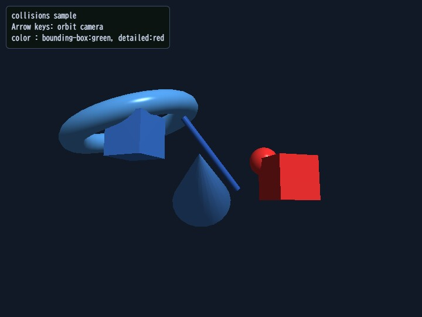

# collisions

[English](README.en.md) | 日本語

## 概要
- space.checkCollisions() で軸平行境界ボックス重なり判定（AABB, 広域）の候補を取り、サンプル内の球 vs mesh 距離判定で詳細衝突を検証するサンプルです。
- 衝突状態を青（非衝突）、緑（AABB のみ）、赤（詳細衝突）で色分けし、広域判定と詳細判定の差を同時に比較できるようにしています。

## 実行方法
- 実行ファイルは [./collisions.html](./collisions.html) です
- WebGPU に対応したブラウザで開き、必要に応じて help panel や HUD と合わせて確認してください

## 使用している webg 機能
- Space.checkCollisions: AABB の衝突候補ペア検出
- Shape.getBoundingBox / メッシュ参照: サンプル内の球 vs mesh 詳細判定の補助
- Shape.updateMaterial: 状態に応じた色変更
- Node: 移動体・カメラ軌道制御

## 確認ポイント
- AABB 候補だけの green hit と、球 vs mesh 距離判定まで通った red hit で、ヒット対象がどのように変わるかを比較します
- 衝突状態の色分けが判定タイミングに追従して変化するかを確認し、視覚デバッグフローとして有効かを確認します
- カメラ角度を変えても誤判定が増えないかを確認し、判定そのものが表示依存になっていないことを検証します

## 操作方法
- ArrowLeft / ArrowRight: カメラを水平オービット
- ArrowUp / ArrowDown: カメラを上下オービット
- タッチUI（coarse pointer端末）: 左側 ← / ↑、右側 ↓ / → の2グループで同じ操作ができます
