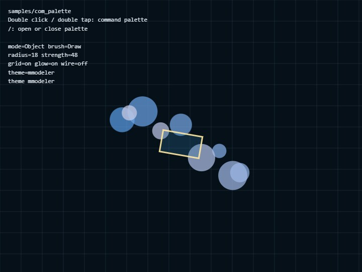

# com_palette

[English](README.en.md) | 日本語

## 概要

`com_palette`は、コアの`webg/CommandPalette.js`をWebgAppから独立したUI部品として使うサンプルです。button、toggle、stepper、select、排他的なmode switchを一つのpaletteへ配置し、command定義とapplication stateをどのように接続するかを確認します。

画面中央の2D previewとHUDは、paletteが更新する同じ`state`を読みます。`Obj / Edit / Scpt`を切り替えると選択中buttonのactive表示とpreviewが同時に変わり、toggleやstepperを操作すると次のframeから背景や図形へ反映されます。これにより、CommandPalette自身へapplication固有の状態を持たせず、利用側の状態を表示・更新する基本構成を確認できます。

## 実行方法

- [./com_palette.html](./com_palette.html) を開きます
- WebGPUは使用しないため、通常のCanvas 2DとDOMを利用できるbrowserで動作します

## 使用しているwebg機能

- `CommandPalette`: command定義からpaletteのDOMを生成し、開閉、ページ切り替え、値の表示を行う
- `getDefaultCommandPaletteCss()`: default CSSを取得し、部分的なstyle変更後に標準styleへ戻す
- `setStyle()`: paletteへ適用するCSS全体を差し替える
- `setTheme()`: 色などのCSS custom propertiesだけを変更する
- `attachToCanvas()`: double click、double tap、`/` keyをpaletteの開閉へ接続する

## 実装の流れ

`state`にはpause、grid、glow、wire、mode、brush、radius、strength、themeを保持します。`commands`配列の`value`関数と`getCommandState`は、この状態を読んでtoggle、stepper、select、mode switchの現在値を表示します。

buttonは`onCommand`で処理し、値を持つtoggle、stepper、selectは`onChange`で`state`を更新します。更新後に`palette.render()`とHUD更新を行うことで、palette、preview、HUDが同じ値を表示します。`pageRows: 4`を全体の基準とし、`pageRowsByPage: [4, 3]`で2ページ目だけ3行へ変更します。buttonは1 cell、stepperとselectは1行として数えるため、小さい画面でもcommandが重ならず次ページへ分割されます。

## 確認ポイント

- double click、double tap、`/` keyのどれから開いても同じpaletteが表示されること
- `Obj / Edit / Scpt`では一つだけがactiveになり、中央previewも同じmodeへ切り替わること
- toggle、stepper、selectの変更がHUDとpreviewへ反映され、paletteを開き直しても現在値が保たれること
- `Next`で行数を基準に分割された次pageへ進み、stepperとselectが途中で分断されないこと
- `CSS`で全体styleが変わり、`Def`でdefault CSSと既定themeへ戻ること

## 操作方法

- Double click / double tap: command palette
- `/`: command palette
- Palette button: command 実行
- Obj / Edit / Scpt: Mode Switch。選択中modeをactive色で示し、中央の図形も切り替える
- Next: 行数を基準に分割された次pageへ進む
- Radius / Strength: stepper
- Brush / Theme: select row
- CSS: `setStyle()` の実験
- Def: default style へ戻す
