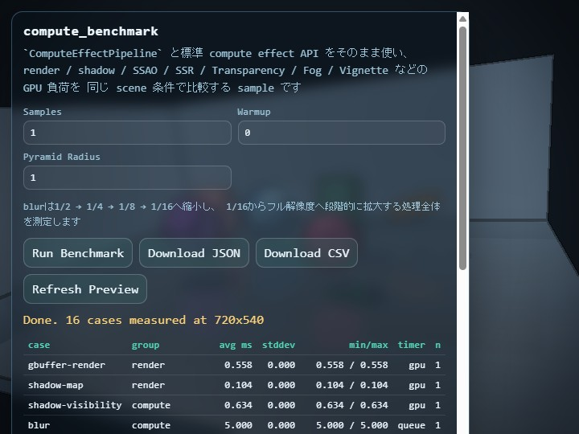

# compute_benchmark

English | [日本語](README.md)

## Overview

`compute_benchmark` is a sample for comparing how much GPU time each standard compute-effect API costs when used from `ComputeEffectPipeline`. While `samples/compute_effect` focuses on the look and interaction of a 3D application that combines multiple effects, this sample focuses on measurement: it helps application developers decide which effects are affordable for a target device under one shared scene condition.

This sample measures the standard-resolution behavior of `ComputeEffectPipeline`, `ComputePyramidBlurPass`, `ComputeBloomPass`, `ComputeDofPass`, `SsaoPass`, `ComputeSsrPass`, and related passes directly. The fixed benchmark scene includes a floor, walls, multiple opaque objects, a translucent object, and varied reflectivity so that the G-buffer, shadow map, transparency composition, screen-space reflection, Fog, and post effects all receive meaningful input.

## Measured Cases

`gbuffer-render` measures G-buffer creation, `shadow-map` measures shadow-map rendering, and `shadow-visibility` measures the compute stage that derives direct-light visibility from the G-buffer and shadow map. These cases provide the baseline cost that later effects depend on.

`blur`, `toon`, `dof`, `bloom`, `ssao`, `ssr-ray`, `ssr-composer`, `transparency`, `fog`, `tone-map`, `edge`, and `vignette` measure individual stages. `transparency` includes the two Frost blur levels, roughness mask, and translucent-triangle draw performed by `TransparencyPass`. `fog` consumes the transparency-composited HDR scene and opaque G-buffer depth. `vignette` consumes the display-color result after Tone Map and Edge.

`blur` measures the complete `ComputePyramidBlurPass`. It reduces the linear HDR scene continuously to 1/2, 1/4, 1/8, and 1/16 through `ComputeImagePyramid`, then enlarges the 1/16 image progressively through 1/8, 1/4, 1/2, and full resolution. Each downsample uses a 13-tap low-pass filter, and each upsample uses a 9-tap tent filter. Only the lowest-frequency image is enlarged, so intermediate Levels do not add extra color energy.

The final `full-pipeline` case enables shadow, SSAO, SSR, automatic transparency composition, Fog, Toon, DoF, Bloom, Tone Map, Edge, and Vignette in the current `ComputeEffectPipeline` order. The translucent material in the fixed scene ensures that transparency composition actually runs. This lets you compare both individual adoption cost and a representative combined stack inside one tool.

## How to Run

- Open [./compute_benchmark.html](./compute_benchmark.html)
- Use a browser and GPU that support WebGPU and `timestamp-query`
- `Samples` controls the number of recorded measurements, while `Warmup` controls the number of pre-runs excluded from statistics
- `Pyramid Radius` controls the sample spacing during downsampling and upsampling; its default is `1.0`, with a range from `0.25` through `3.0`
- `Pyramid Radius` applies only to the standalone `blur` measurement
- `dof`, `bloom`, and `full-pipeline` use fixed conditions based on each effect's defaults

Press `Run Benchmark` to measure each case after its warmup passes, then inspect the average, standard deviation, min, and max in the table. Use `Download JSON` or `Download CSV` to save the results. The JSON output also stores raw samples together with canvas size, DPR, browser metadata, `pyramidFilterRadius`, and `pyramidLevels` so that later cross-device comparisons remain traceable.

The preview and measured cases that include tone mapping use a fixed Reinhard exposure of `2.0`, making the dark regions readable without changing the benchmark lighting inputs. This value is also recorded as `toneMapExposure` in the JSON metadata.

## How to Read the Results

The reported time is meant to compare the GPU cost of each pass itself. The shared input preparation step is rebuilt before every case so the conditions stay consistent, but that preparation time is not folded into the pass result. This makes it easier to compare questions like “how expensive is DoF itself” or “how much extra cost does Bloom add.” When you want a broader frame-level estimate, check `full-pipeline` together with the Help Panel in `samples/compute_effect`.

Some cases internally execute multiple passes, and single-pass timestamps can become unstable depending on the browser and GPU driver. For those cases, this sample measures queue completion time instead. The `timer` column shows only `gpu` or `queue`: `gpu` means a `timestamp-query` GPU timestamp measurement, and `queue` means elapsed time from command submit to queue completion.

`avg ms` is the average of the recorded runs after warmup. This is the first value to compare when you want to judge the relative cost of an effect or compare devices. `stddev` shows how much the measurement fluctuated across runs. A larger value means the result was less stable. `min/max` shows the smallest and largest observed times, which helps you see the spread caused by driver state, queue timing, or other runtime variation. `n` is the number of recorded runs used for the statistics, which matches `Samples`.

`full-pipeline` is not a simple sum of the individual cases. It measures the end-to-end cost of running shadow, SSAO, SSR, transparency composition, Fog, Toon, DoF, Bloom, Tone Map, Edge, and Vignette together through `ComputeEffectPipeline` in one frame. That includes the real handoff between intermediate textures, the actual encode order, and the dependency chain where later stages read the output of earlier stages. Because of that, the sum of separately measured `transparency`, `fog`, `dof`, `bloom`, `edge`, and `vignette` does not necessarily match `full-pipeline`.

There are two main reasons why separate measurements and simultaneous execution can differ. First, an individual case isolates one pass, while `full-pipeline` executes the real chained workflow where earlier outputs feed later stages. Second, GPU cache behavior, resource reuse, command grouping, and queue-completion timing can differ between isolated and combined execution. As a result, `full-pipeline` can be a little smaller than the sum of individual cases in some environments, and a little larger in others.

In this sample, `gbuffer-render` is often relatively small, so it can look as if the shared baseline is small enough that `full-pipeline` stays close to the sum of the effect-specific cases. That is one factor, but it does not fully explain the meaning of `full-pipeline`. A practical way to read the results is to use the individual cases to identify which effects are expensive, then use `full-pipeline` to estimate how much the whole frame increases when those effects are enabled together.

## Checkpoints

- `main.js` uses the published `webg/ComputeEffectPipeline.js` and related passes directly instead of keeping a sample-local duplicate pipeline
- The same fixed scene can be used to compare cost differences among `render`, `shadow`, `SSAO`, `SSR`, transparency composition, `Fog`, `DoF`, `Bloom`, and `Vignette`
- `fog` uses the HDR scene after transparency composition, while `vignette` uses display color after Tone Map and Edge
- `blur` measures continuous reduction from 1/2 through 1/16 followed by progressive enlargement from 1/16 to full resolution
- Changing `Pyramid Radius` changes only the sample spacing of `blur`; the conditions for `dof`, `bloom`, and `full-pipeline` remain unchanged
- The JSON output stores canvas size, DPR, samples, warmup, and browser metadata so the measurement can be reused for device comparisons
