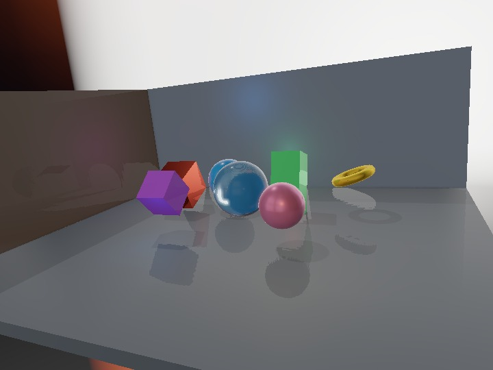

# compute_benchmark

English | [日本語](README.md)

## Overview

`compute_benchmark` measures every runtime stage used to build PBR output through `ComputeEffectPipeline`, covering PBR geometry, lighting, reflection, transparency, and output conversion. The measurement scope is limited to PBR processing so unrelated post-processing is not included in the baseline.

The fixed scene contains opaque objects with varied roughness and metallic values, a closed transmission sphere, a floor, and walls. Lighting combines a directional light, a selectable number of point lights, and a linear-HDR procedural IBL environment. SSR uses `pbr-ssr` to replace specular IBL, and the transparent sphere specifies IOR and attenuation distance. Deferred PBR, IBL, PBR SSR, transmission, frost, and transparent forward shading therefore all execute in every baseline run.

## Measured Stages

`gbuffer-render` renders opaque geometry into albedo, view-space normal, PBR material, emissive, and Reverse-Z depth targets. `shadow-map` renders the directional shadow map, while `shadow-visibility` derives screen-space direct-light visibility from the G-buffer and shadow map.

`ssao` includes both low-resolution AO generation and depth/normal bilateral reconstruction in `SsaoPass`. `deferred-lighting-pbr` evaluates GGX lighting with the directional light, local lights, SSAO, and precomputed IBL, producing both HDR lighting and the specular IBL component. `ssr-pbr` measures the `ComputeSsrPass` sequence of ray marching, roughness pyramid, and roughness filtering. `pbr-ssr-composer` measures the independent specular-IBL replacement pass. `ssr-pbr-fused` performs ray marching and the pyramid, then combines roughness filtering and specular-IBL replacement in one final dispatch. The two-stage sum and the fused case can therefore be compared in the same run.

`transparency-pbr` measures the whole transparent-surface stage. The sample also reads the named GPU profiler built into `TransparencyPass` and adds the following internal intervals as `transparency:*` rows:

- `transmissionMask`: draws front-surface normal, transmission strength, and depth
- `transmissionVolume`: draws attenuation color and attenuation distance
- `transmissionExit`: draws back-face position, normal, and IOR
- `transmissionComposite`: applies two-surface refraction and Beer-Lambert absorption to the background
- `frostPyramid`: builds lower-frequency backgrounds for transparent roughness
- `roughnessMask`: draws the maximum transparent-surface roughness
- `frostComposite`: selects and combines the frost background through the roughness mask
- `forward`: shades transparent PBR surfaces with shadows, local lights, and IBL

`tone-map` converts the linear HDR color after transparency into display color with Reinhard tone mapping. The final `full-pbr-pipeline` case records all top-level stages in one frame through `renderScene()` and `encode()`. It is an end-to-end measurement baseline that includes the actual texture handoffs and command sequence.

CPU or GPU preprocessing of an environment map happens at application startup or asset-build time and is measured separately from per-frame PBR. This sample creates a small precomputed procedural environment at startup and excludes its generation time. Fog, Toon, DoF, Bloom, Edge, and Vignette are also excluded from the PBR baseline.

## How to Run

1. Open [compute_benchmark.html](./compute_benchmark.html) in a browser that supports WebGPU and `timestamp-query`
2. Enter the number of recorded runs in `Samples` and the excluded pre-runs in `Warmup`
3. Enter a point-light count from `0` through `128` in `Local Lights`; the default is `8`
4. `PBR SSR` defaults to `Fused`; select `Two-pass reference` when comparing the two SSR execution modes
5. Use `Refresh Preview` to inspect the fixed scene, IBL background, reflections, and transmission sphere
6. Press `Run PBR Baseline`, then keep the browser tab and window in the foreground until every case finishes
7. Save the result with `Download JSON` or `Download CSV` when needed

Inputs outside their documented ranges are not corrected automatically. An invalid integer or light count stops the measurement and reports the error. Resolution uses the canvas physical pixel size, so results made with different window sizes or DPR values are not directly comparable. Keep canvas dimensions, DPR, local-light count, power state, browser, and GPU driver consistent when comparing two runs.

## Reading the Results

A top-level row containing one render/compute pass, or a sequence that can receive beginning and ending timestamps in its internal pass descriptors, uses `timestamp-query` GPU time and displays `gpu` in the `timer` column. `full-pbr-pipeline` places its beginning timestamp on the first shadow-map render pass and its ending timestamp on the final tone-map pass, measuring every PBR pass between them as GPU time. Standalone transparency cannot attach one outer interval to a single pass descriptor, so only `transparency-pbr` measures from immediately before command submission through queue completion and displays `queue`. `avg ms` is the mean, `median` is the median, `P95` is the slow-side five-percent boundary, `min/max` is the observed range, and `n` is the recorded count. Start with the median for normal cost, inspect P95 and max for instability, and investigate outliers when the mean differs substantially from the median.

The `timer` column shows `profile` for `transparency:*` rows. These values come from the rolling GPU timestamp statistics retained by `TransparencyPass` for at most 60 frames. The table shows their median, mean, minimum, and maximum. P95 and standard deviation are `--` because the pass does not expose its raw sample array. The outer `transparency-pbr` interval measures the entire transparent stage, so it will not exactly equal the sum of its internal intervals.

`full-pbr-pipeline` includes the G-buffer and shadow-map render passes together with the PBR compute and transparent render passes in one command sequence. The measurement covers GPU execution; CPU scene traversal and JavaScript command encoding are outside this measurement scope. Use isolated rows to find stage proportions and `full-pbr-pipeline` to confirm the end-to-end runtime PBR improvement.

The JSON output stores `rawSamplesMs` together with physical resolution, display dimensions, DPR, local-light count, PBR SSR fusion state, shadow-map size, SSAO, SSR, transmission, IBL, tone-map, excluded stages, and browser metadata. Before comparing two results, confirm that this metadata matches.

## Implementation Checkpoints

- The sample uses the published `ComputeEffectPipeline` and its pass objects directly, without a sample-local shader or duplicate pipeline
- Every PBR case uses the same Camera Frame, fixed scene, directional light, local lights, IBL, SSR, and transmission settings
- Shared inputs are prepared before each isolated case, while preparation time remains outside that case's timestamps
- PBR SSR composition explicitly receives Deferred Lighting's specular IBL, G-buffer material, AO, and BRDF LUT
- `Fused` reproduces the roughness output's `rgba16float` rounding and low-resolution pixel mapping, removing only the independent composer dispatch
- `Two-pass reference` runs the roughness filter and composer sequentially only when comparison is explicitly selected
- Transparency detail comes from `TransparencyPass.getPerformanceSnapshot()` and missing intervals are distinguished from measured values
- The last result is exposed as `window.pbrBenchmarkResult`, and completion is visible through `body[data-benchmark-status="ready"]`
