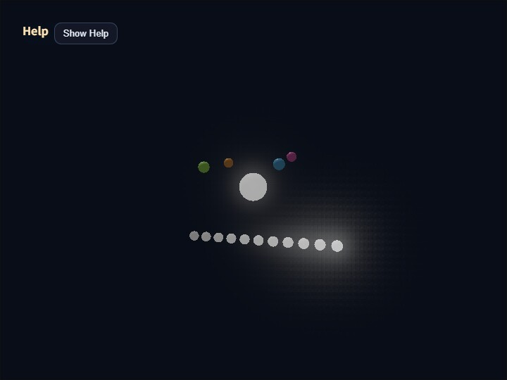

# compute_bloom

[English](README.en.md) | 日本語

## 概要

Bloomは、HDR sceneから高輝度部分を抽出し、その光を周囲へ広げてから元のsceneへ加算するポストプロセスです。このサンプルは、コアの`ComputeBloomPass`が使用するPyramid方式について、抽出、各縮小Level、再構成結果、最終合成を個別に表示して確認します。

Pyramid方式は、連続した近傍をfilterしながら段階的に解像度を下げ、解像度階層によってBloomの広がりを作ります。縮小した画像を低解像度側から段階的に拡大し、各Levelの成分を重み付きで合成します。

## Pyramid Bloomの処理

最初にfull-resolutionの線形HDR sceneへ`Threshold`と`Soft Knee`を一度だけ適用し、Bloom sourceを`rgba16float`で作ります。縮小後の平均輝度へthresholdを適用すると孤立した高輝度pixelが消える可能性があるため、bright extractは縮小前に完了させます。

extract後は、1/2、1/4、1/8、1/16、1/32解像度のtargetを前段から順番に作ります。各downsampleは13 tapのlow-pass filterとlinear samplerを使います。すべてのLevelが直前のLevelから連続した近傍を受け取るので、大きなsample stepによる空間的な抜けはありません。

再構成は1/32 Levelから始めます。coarse Levelを9 tapのtent filterで一つ上の解像度へ拡大し、その解像度固有のLevelを重み付きで加えます。この処理を1/16、1/8、1/4、1/2、full-resolutionの順に繰り返します。1/2 Levelは光源に近い比較的狭い成分を、1/32 Levelは散乱の多い環境で遠くまで届く弱い成分を表します。最終Bloomを線形HDR sceneへ加算した後、`ComputeEffectPipeline`のTone Mapで一度だけ表示色へ変換します。

## 操作と確認方法

実行ファイルは[./compute_bloom.html](./compute_bloom.html)です。WebGPU対応ブラウザーで開き、canvasをダブルタップするか`/`を押すとCommandPaletteを表示できます。

`View`では`scene / extract / half / quarter / eighth / sixteenth / thirty-second / blur / composite`を切り替えられます。`extract`は縮小前のBloom source、`half`から`thirty-second`はdownsample直後の各Level、`blur`はprogressive upsample後のfull-resolution Bloom、`composite`はsceneへ加算してTone Mapした最終表示です。低解像度Levelを表示する場合は、`BloomDebugViewPass`が線形補間で画面解像度へ拡大し、ReinhardとsRGB変換を適用します。

`Threshold`はBloomへ入るHDR輝度、`Soft Knee`はthreshold付近の立ち上がりを決めます。`Strength`は再構成済みBloomをsceneへ加える量です。`Filter Radius`はprogressive upsampleのtent filter間隔をcoarse texel単位で変更します。値を大きくすると各Levelの成分が広がりますが、Level間の重なり方も変わるため、`blur` Viewと`composite` Viewを合わせて確認してください。

2ページ目の`1/2 Weight`、`1/4 Weight`、`1/8 Weight`、`1/16 Weight`、`1/32 Weight`は、各解像度が最終Bloomへ寄与する量です。高解像度側を上げると光源近傍が強くなり、低解像度側を上げると外側の弱い光芒が目立ちます。1/2から1/16までの合計1.0を維持し、その外側へ1/32 Weight `0.18`を追加しています。散乱の多いデモとして、広がりと全体光量を同時に強める設定です。

カメラの既定距離は`14.0`で、中心の大きな球と周囲のBloomを近くから確認できます。中心球は発光レベルを`0.60`から`0.95`まで往復させます。中心球の下には`0.50`から`1.00`まで`0.05`刻みの固定発光体を配置しています。Threshold付近でBloomが連続的に立ち上がること、細い発光体が1/32 Levelでも欠落または粒状化しないこと、1/32 Weightを上げたときに滑らかな広い光芒が増えることを確認してください。

コアPassの既定値は`threshold=0.60`、`softKnee=0.40`、`strength=0.70`、`filterRadius=1.00`、`halfWeight=0.45`、`quarterWeight=0.28`、`eighthWeight=0.17`、`sixteenthWeight=0.10`、`thirtySecondWeight=0.18`です。このサンプルでは外側の弱い光芒を読み取りやすくするため、`strength=2.00`へ上書きしています。Tone Mapの`exposure=1.00`はBloom固有値ではありません。
