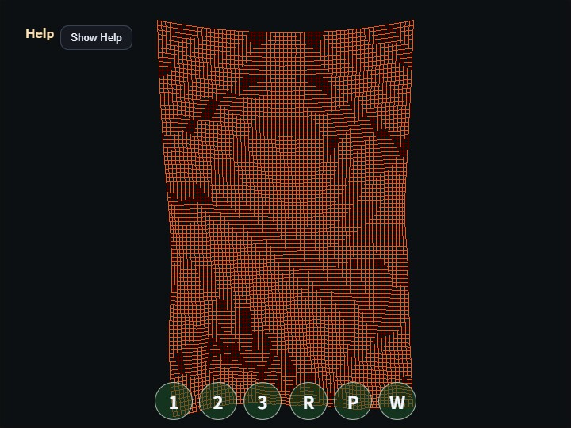

# compute_cloth

English | [日本語](README.md)

## Overview
- This sample uses a WebGPU compute shader to update a grid-shaped cloth with a mass-spring model
- Rather than adding a compute-specific API to the `webg` core library, it uses the WebGPU `device / queue / canvas context` initialized by `WebgApp` directly inside the sample
- Cloth vertices are stored in a storage buffer, and the compute pass reads the previous frame's vertex positions and neighboring vertices, then writes the next frame's positions and velocities
- Because the sample uses a ping-pong structure with separate `src` and `dst` buffers, it avoids conflicts where one invocation might overwrite a neighbor value while another vertex is still reading it
- Structural spring forces alone allow the cloth to stretch too much, so a strain limit is added that pulls vertices back slightly when the distance to the up / down / left / right neighbors exceeds the allowed length
- The masses of movable vertices are set to match the cumulative load of a 96-row curtain, so gravity stays constant as acceleration while the springs can still support the curtain length
- The collision floor is placed lower than the bottom edge at maximum permitted stretch, so a normally sagging curtain does not intersect the floor
- One frame is divided into 3 substeps, and velocity is recalculated from the actual movement after position constraints, preventing downward velocity from remaining after correction
- Bend springs are added between vertices two steps apart to suppress sharp folding and self-crossing near the lower area
- The wind reverses periodically in the same front-back direction across the whole curtain, while only the amplitude varies by position, preventing both a central fold-back and one-way flow escape
- The fixed top edge is shaped as a gentle arc with the center lowered by 0.18, so the cloth looks suspended rather than like a perfectly straight board
- The render pass reads the post-compute storage buffer in the vertex shader and draws it as either a `line-list` or `triangle-list` depending on `Wire / Flat / Smooth` mode

## How to Run
- Open [./compute_cloth.html](./compute_cloth.html)
- Use a browser with WebGPU support, and check the help panel and HUD together with the sample when needed

## webg Features Used
- `WebgApp`: initializes `Screen`, diagnostics, and the input foundation together
- `WebgApp` compute frame: `computeFrame: true` and the `onComputeFrame` handler skip standard scene drawing and control compute/render order
- `Screen.resize()`: updates the actual canvas pixel size on viewport changes through the `Screen` held by `WebgApp`
- `WebgApp.getGPU()`: entry point for building raw WebGPU pipelines on the sample side without changing the core API
- `buildHelpPanelOptions() + showOverlayPanel()`: displays the operation guide and current state as a collapsible help panel
- `InputController.installTouchControls()`: shows `1 / 2 / 3 / R / P / W` control buttons on both desktop and smartphones

## WebGPU Features Used
- `storage buffer`: keeps cloth vertex positions, fixed flags, and velocities on the GPU
- `vertex mass`: stores the mass of each movable vertex and converts spring force, wind force, and velocity damping into acceleration by dividing by mass
- `ping-pong buffer`: alternates a read-only source buffer and a writable destination buffer every frame
- `compute pipeline`: calculates neighboring springs, gravity, wind, and damping with one invocation per cloth vertex
- `bend spring`: connects vertices two steps apart horizontally and vertically with weak springs, helping support the cloth length while reducing local sharp folds
- `coherent gust`: reverses wind direction across the whole curtain with the same time wave, while varying only amplitude by horizontal position and height to create natural swaying
- `strain limit`: returns adjacent structural-spring distances to within 1.06 times their initial length, suppressing overstretch while keeping motion light
- `simulation substeps`: repeats integration and position limiting three times per frame, stabilizing the accumulated load of the long curtain
- `line vertex index stream`: draws horizontal and vertical grid lines in `Wire` mode
- `triangle vertex index stream`: splits each grid cell into 2 triangles so `Flat / Smooth` can share the same high-resolution surface
- `render pipeline`: reads the storage buffer in the vertex shader and displays the deformed cloth without CPU readback
- `fixed cloth color`: keeps the same fixed orange color for `Wire / Flat / Smooth` instead of changing vertex color according to wind speed
- `view-space lighting`: uses light from the upper-right of the view, with weak ambient, diffuse-dominant shading, and specular highlights to show surface direction
- `camera-following light`: transforms world-space normals into view space by camera rotation and computes lighting in the same coordinate system as the light fixed to the upper right of the screen
- `timestamp query`: measures GPU Compute time across all three substeps plus Render Pass time, then displays per-stage and total load

## Checkpoints
- Right after startup, confirm that a vertically long `64 x 96` cloth grid is fixed at the top and sways under gravity and wind
- Confirm that when you rotate the camera by drag, or pan by `Shift + Drag`, right-drag, or middle-drag, the cloth simulation still continues entirely on the GPU
- On smartphones, confirm that one-finger drag performs orbit, two-finger drag performs pan, and pinch performs zoom
- Confirm that the `1 / 2 / 3 / R / P / W` buttons shown at the bottom of the screen on both desktop and smartphones can control display mode, reset, pause, and wind
- Confirm that `H` or the help-panel button folds the explanation and that `Show Help` restores it
- Switch `Wire / Flat / Smooth` with `1 / 2 / 3` and confirm that line and polygon display can be switched from the same storage buffer
- Toggle wind with `W` and confirm that the front-back waving becomes weaker or returns
- When `P` pauses the sample, confirm that the compute pass stops and the current storage-buffer state is rendered as-is
- Confirm that `R` restores the cloth to its initial state
- Confirm that `GPU compute / GPU render / GPU total / JS time` and their load values update in the help panel and that render time while paused is not included in GPU Compute time

## Controls
- Drag: camera orbit
- `Shift + Drag / right-drag / middle-drag`: camera pan
- Mouse wheel: zoom
- One-finger drag: camera orbit
- Two-finger drag: camera pan
- Pinch: zoom
- `1`: wire display
- `2`: flat polygon display
- `3`: smooth polygon display
- `W`: wind on / off
- `P`: pause / resume
- `R`: reset cloth
- `H`: hide / show help

## Implementation Details
- The compute shader in `main.js` separates `srcState` as read-only and `dstState` as read-write
- Spring calculations read up / down / left / right and diagonal neighbors, and if the distance becomes extremely short they contribute zero instead of being normalized
- Gravity is added as acceleration independent of mass, while spring force, wind force, and velocity drag are divided by vertex mass to obtain acceleration
- After correcting positions with the strain limit and the floor, velocity is recalculated from the difference between the corrected position and the previous substep position, so downward velocity from before the correction is not retained
- The render shader uses a cloth-vertex index passed as a vertex attribute and directly references vertex positions inside the storage buffer
- `Flat / Smooth` share the same triangle stream. `Flat` sends the face normal created from the three deformed vertices as a constant value over the triangle with WGSL `@interpolate(flat)`, while `Smooth` interpolates vertex normals created from grid neighbors
- The cloth color is fixed, and the motion and surface direction are read from the diffuse and specular highlights produced by the light at the upper right of the view
- Operation guidance and state display are collected in the `OverlayPanel` help panel instead of a custom HUD, while smartphone single-tap actions are separated into touch buttons
- Because vertex coordinates are never returned to the CPU, this sample can be used as an example of keeping rendering-oriented simulations such as cloth or hair entirely on the GPU
