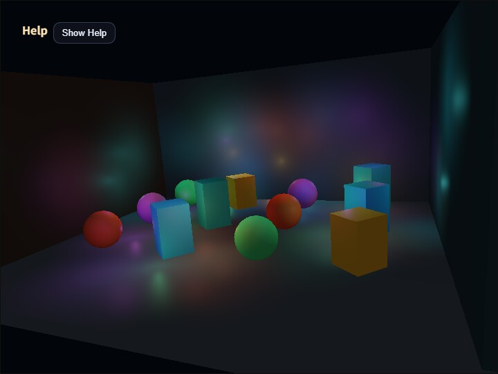

# compute_deferred_lighting

[English](README.en.md) | 日本語



## 概要

Deferred Lightingは、geometryを先にG-bufferへ描き、保存した表面情報に対して後段で光源を評価する描画方式です。このサンプルでは`ComputeEffectPipeline`がGeometry Buffer、Deferred Lighting、tone mappingを接続し、最大128個のLocal Lightをpixel単位で評価します。シーンのgeometryは光源数にかかわらず一度だけ描画されるため、geometryの複雑さと光源評価の複雑さを分けて観察できます。

Local Lightには、全方向へ放射する`type: "point"`と、指定方向の円錐内へ放射する`type: "cone"`があります。このサンプルは多数灯の負荷を比較しやすくするため、動く光源をすべてpointとして明示します。`type`は必須です。coneを使う場合は`direction`、`innerAngle`、`outerAngle`も必須で、不完全なconeがpointへ置き換えられることはありません。

光源の`position`と`direction`はWorld座標系で指定します。`DeferredLightingPass`は、その描画frameの`CameraFrame`を使い、位置をcamera-relativeなview-space位置へ、方向を平行移動を含まないview-space方向へ変換します。このため、アプリケーションがprojection配列やview matrixを別々に構築する必要はありません。

## 光源とフレームの接続

point Local Lightは次のように作ります。

```js
const lights = [{
  type: "point",
  position: [0.0, 2.0, -4.0],
  color: [1.0, 0.45, 0.12],
  radius: 9.0,
  intensity: 3.2
}];
```

同じframeの`cameraFrame`をG-buffer生成と照明計算へ渡します。サンプルではShadow、SSAO、SSR、DoF、Bloom、Toon、Edgeを無効にし、多数のLocal LightとG-bufferの関係だけを確認できる構成にしています。

```js
app.start({
  onBeforeDraw: ({ cameraFrame }) => {
    pipeline.renderScene(app.space, cameraFrame, app.clearColor, {
      shadowEnabled: false
    });
  },

  onAfterDraw3d: ({ cameraFrame }) => {
    app.getGPU().endPass();
    const finalColor = pipeline.encode(app.getGPU().commandEncoder, {
      cameraFrame,
      shadowEnabled: false,
      ssaoEnabled: false,
      ssrEnabled: false,
      lights,
      lightCount: 64,
      lightingView: "lighting"
    });
    app.screen.beginPresentPass({ clearColor: app.clearColor });
    copyPass.draw(finalColor);
    app.screen.clearDepthBuffer();
  }
});
```

`lightCount`は配列の先頭から評価する灯数です。配列長を超える値やconstructorの`maxLights`を超える値は例外になります。各pixelがすべてのactive lightを走査する基準実装なので、灯数を増やすと計算量も増えます。さらに多くの光源が必要なアプリケーションでは、tiled lightingやclustered lightingを検討します。

## 実行方法と確認点

[compute_deferred_lighting.html](./compute_deferred_lighting.html)をWebGPU対応ブラウザで開きます。`V`またはCommandPaletteで`lighting / albedo / normal / depth`を切り替えると、照明結果とG-buffer入力を分けて調べられます。

`1`と`2`、またはCommandPaletteのLightsで、有効灯数を`16, 32, 64, 96, 128`から選べます。Spaceキーでlight animationを止めると、同じ光源配置のままdebug viewや灯数を比較できます。light数を増やしたときにgeometryの形は変わらず、照明計算の負荷と重なりだけが増えることを確認してください。
