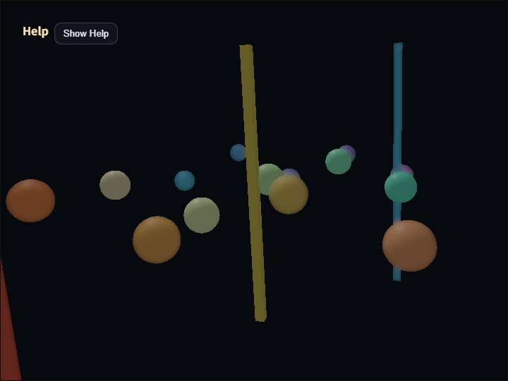

# compute_dof

[English](README.en.md) | 日本語



## 概要

DoFは、焦点距離に近い面を鮮明に残し、手前と奥をぼかすことでレンズの被写界深度を表現するポストプロセスです。このサンプルは、`ComputeEffectPipeline`に統合された`ComputeDofPass`の画像ピラミッド、geometry coverage、CoC metadata、近景・遠景の合成順を確認します。

DoFでは、「物体がその画素を覆う割合」と「焦点からどれだけ離れているか」を同じ値にすると、焦点外物体の中心へ鮮明なsceneが残ります。`ComputeDofPass`はgeometry coverageとCoCを別targetへ保存し、coverageを輪郭合成、CoCをぼかしLevelの選択だけに使います。

## 実行方法

- 実行ファイルは[./compute_dof.html](./compute_dof.html)です
- WebGPU対応ブラウザで開き、Help PanelとCommandPaletteを合わせて確認してください
- CommandPaletteはcanvasのダブルタップ、または`/`キーで開きます
- `V`キーで最終合成、coverage、CoC、画像ピラミッドなどの表示を切り替えます

## 画像ピラミッドとCoC

scene colorはlinear HDRの`rgba16float`で保持し、1/2、1/4、1/8、1/16解像度の低周波画像を順番に作ります。各Levelは一つ前のLevelを13 tap low-pass filterで縮小するため、解像度が下がるほど滑らかで広いぼかしになります。

CoCは焦点からのview-space距離差をLevel位置へ変換した値です。

```text
stage = clamp(
  abs(viewDepth - focusDistance) / focusRange * cocScale,
  0,
  4
)
```

`stage`が0より大きく1以下なら1/2、1から2なら1/2と1/4、2から3なら1/4と1/8、3から4なら1/8と1/16を補間します。`CoC Scale`を大きくすると、同じ距離差でも広いLevelへ早く進みます。これは鮮明なsceneを残す混合率ではありません。

`Blur Radius`は各Levelを作るlow-pass filterのsample間隔を0.25から3.0の範囲で調整します。`Blur Radius`はLevel自体の空間的な広さ、`CoC Scale`はどのLevelを選ぶかを決めます。

## geometry coverageとCoCの分離

CoC抽出Passは、近景色とcoverage、遠景色とcoverage、近景・遠景のCoC metadataを3枚のfull-resolution `rgba16float` targetへ出力します。geometryがある画素ではnearまたはfar targetへ`vec4f(scene.rgb, 1.0)`を書きます。Alphaは純粋なgeometry coverageであり、CoC stageを掛けません。clear background、合焦帯、反対側のlayerはcoverage 0です。

CoC metadataは近景stageをR、遠景stageをGへ保存します。色・coverageとCoC metadataにはそれぞれ1/2から1/16までの画像ピラミッドを作ります。縮小後のmetadataは`stage * coverage`の平均値になるため、輪郭外では`moment / coverage`として元のstageを復元します。これによりcoverageが薄くなっても、ぼかしLevelがcoverageへ引きずられません。

## 元geometry輪郭の内側と外側

焦点外geometryの元輪郭内部では、CoC stageが選んだscene全体の低周波画像が鮮明なscene colorを完全に置き換えます。scene Levelには物体色と周囲色がfilter済みの比率で含まれるため、元輪郭の内側でも不足coverageへ周囲色が入り、元の物体像を鮮明なまま復元しません。

near・far layerは元輪郭の外側へ物体色を広げるために使います。輪郭外ではpremultiplied色を`blurred.rgb / blurred.a`で復元し、`blurred.a`だけを背景または背後layerとの合成率にします。

一定色の物体なら、輪郭内側のscene低周波画像は次の式です。

```text
objectColor * coverage + surroundingColor * (1 - coverage)
```

輪郭外のcoverage合成も同じ式になるため、元geometry輪郭を境に結果が飛びません。元輪郭内部でnear・far layerをcoverage除算すると物体色を復元して鮮明な芯が残るため、その処理は行いません。

## 近景と遠景の合成順

遠景blurは焦点面や近景の後ろへ留めます。近景blurは遠景、焦点面、clear backgroundの手前へ重ねます。これにより焦点外の近景も元輪郭を越えて背景側へ広がります。

clear background自身にはview-space距離もCoCもありません。背景全体を無条件に1/16画像へ置き換えず、nearまたはfarのfiltered coverageが届いた範囲だけを合成します。

## 診断表示

`far coverage`と`near coverage`は各geometry layerのAlphaを白黒表示します。対象geometry内部が白、合焦帯、clear background、反対側layerが黒であれば、coverageへCoCを掛けていないことを確認できます。

`CoC metadata`は近景を赤、遠景を青で表示し、stage 4を最大輝度とします。`CoC Scale`を変えるとCoC表示の強度は変化しますが、coverage表示は変わりません。

`depth`はReverse-Z depth、`focus`は合焦帯と手前・奥の4段階、`half / quarter / eighth / sixteenth`はsceneの各低周波Level、`composite`は最終結果を表示します。

## 計算負荷

DoFはfull-resolution targetを4枚、4 Levelの画像ピラミッドを4組使います。1/2から1/16までの総画素数は元画像の`85 / 256`です。`rgba16float`を8 bytes/pixelとして、DoF target本体は42.625 bytes/full-resolution pixelです。

```text
4 * 8 bytes
  + 4 * 8 bytes * 85 / 256
  = 42.625 bytes / full-resolution pixel
```

2560×1440では約149.9 MiB、3840×2160では約337.1 MiBです。WebGPU実装側のrow alignmentやresource管理領域は含みません。

Compute dispatchは、scene、near、far、CoCの各4 Level、CoC抽出、最終合成の合計18回です。低解像度Levelほど処理画素が少ないため、dispatch数だけからGPU時間を判断することはできません。

## 制限

合焦帯を外れたgeometryは、鮮明sceneと1/2画像を混ぜず、最小でも1/2 Levelへ置き換えます。これにより鮮明な芯は残りませんが、合焦帯との境界でぼけ幅が変わって見える場合があります。

scene全体の低周波画像には異なるdepthの色も含まれるため、強いぼかしでは前後関係を越えた色が混ざることがあります。この方式は円形の玉ボケや完全なdepth-aware occlusionを再現するものではありません。リアルタイム用途で、鮮明な芯を残さず、近景・遠景の輪郭を連続して広げることを優先した構成です。
