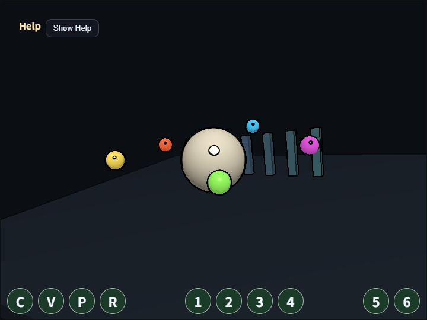

# compute_edge

English | [日本語](README.md)

## Overview
Edge detection looks at brightness differences between the current pixel and nearby pixels, then extracts image boundaries as lines. This sample reads the `3x3` neighborhood of the scene color in a compute shader and applies a Sobel filter to measure horizontal and vertical luminance changes.

The processing flow is the same single-dispatch structure as `compute_vignette`. The normal 3D scene is rendered to an offscreen target, the compute shader reads that color texture, and the result is written to a storage texture. The important difference is that one output pixel depends on eight neighboring pixels as well as the center. At texture edges, coordinates are clamped, and the WGSL checks bounds because the dispatch is rounded up to multiples of the workgroup size.

The role of this sample is to show the basic pattern for neighborhood sampling in a compute shader. Sobel filtering provides an approachable example of the same nearby-pixel access used by Blur, SSAO, SSR, and related effects. Edge processing uses the core `webg/ComputeEdgePass.js`, while scene rendering, input, and HUD logic remain on the sample side.

## How to Run
- Open [./compute_edge.html](./compute_edge.html)
- Use a browser with WebGPU support, and check the help panel and HUD together with the sample when needed

## Checkpoints
Press `C` to toggle processing and `V` to compare the original scene with the compute output. Confirm that pillars, spheres, and floor boundaries become dark black lines, and that moving small spheres keep their outlines.

`strength` amplifies the Sobel gradient, `threshold` controls how strong a boundary must be before it remains visible, and `source mix` controls overall edge influence. Use `7` / `8` to change `thickness`, which dilates the computed edge mask from a thin line to a broader outline. Press `M` to cycle through `black-multiply`, `black-subtract`, and `white-add`. `black-multiply` stays more restrained on dark surfaces, `black-subtract` pushes darker outlines more aggressively, and `white-add` overlays bright lines.

This sample only examines luminance differences in the color texture. It does not use depth or normals, so adjacent surfaces with similar brightness may produce weak lines, while texture or specular brightness changes may appear as edges. If you need shape-only outlines, a design based on G-buffer normal or depth would be more appropriate.
