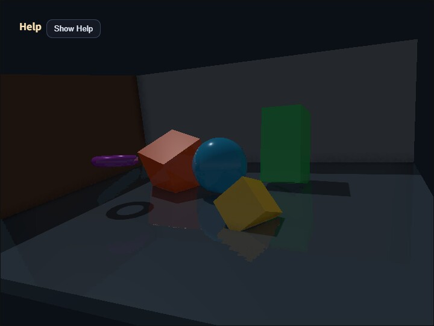

# compute_effect

[English](README.en.md) | 日本語



## 概要

`compute_effect` は、webg 第2版の統合レンダリングを `ComputeEffectPipeline` から利用するサンプルです。アプリケーション側は通常の `Space` と `Shape` でシーンを作り、Pipelineへそのフレームのcamera情報とeffect設定を渡します。G-buffer、Shadow、Ambient Occlusion、Deferred Lighting、Local Light、SSR、透明合成、Fog、High Dynamic Rangeのpost effect、Tone Mapping、Edge、Vignette、最終表示までの順序はPipelineが管理します。

このサンプルの目的は、個別のCompute Passを手作業で接続することではありません。WebgAppを使うアプリケーションから、統合された第2版APIをどの程度小さいコードで扱えるかを確認します。低水準のbind group、storage texture、Camera Reverse-Zの復元式はsample側で組み立てません。

## 処理フロー

処理順は次のとおりです。

```text
WebgAppが一描画frameのcamera状態を確定
  -> GeometryBufferPass
       albedo / view-space normal / surface material / Camera Reverse-Z depth
  -> ShadowMapPass または SpotShadowMapPass
  -> ComputeShadowPass / ComputeSpotShadowPass
       完成色ではなくshadow visibilityを生成
  -> SsaoPass
       ambient occlusion visibilityを生成
  -> DeferredLightingPass
       directional / spot / point・cone Local Lightと各visibilityを一度だけ評価
  -> ComputeSsrPass
       線形High Dynamic Rangeのreflectionを生成
  -> ComputeEffectComposer
  -> TransparencyPass（透明Shapeがある場合）
  -> ComputeFogPass（任意）
  -> ComputeToonPass（任意）
  -> ComputeDofPass（任意）
  -> ComputeBloomPass（任意）
  -> ComputeEffectToneMapPass
       exposure、tone mapping、gamma変換を一度だけ実行
  -> ComputeEdgePass（任意）
  -> ComputeVignettePass（任意）
  -> FullscreenPass
       depthなしpresentation passでcanvasへ提示
```

通常カメラのdepthは `depth32float` のReverse-Zです。Directional LightとSpot LightのShadow Map生成は、通常カメラとは独立したLight Viewとして意図的に通常Zを使います。Pipeline内部で両者のDepth Conventionを区別するため、sample側で符号やdepth比較を切り替える必要はありません。

## G-bufferと材質

第2版のG-bufferは照明済みcolorを保存しません。各Shapeから次の材質値を読みます。

- `color`: 未照明のalbedo
- `specular`: 鏡面反射強度。SSRの反射判定にも使用
- `roughness`: 表面の粗さ
- `metallic`: 金属度
- `emissive`: 照明に依存しない発光成分

このsampleでは床、壁、球、立方体、柱、トーラスへ値を明示しています。反射率は`specular`へ設定し、G-bufferの色へ直接光のspecularを加算しません。Deferred Lightingがalbedo、normal、surface material、light、shadow visibility、ambient occlusionを読み、GGX系の反射モデルで照明を一度だけ評価します。

反射率のpalette操作は、動くオブジェクトの `specular` を更新します。roughnessとmetallicはオブジェクトごとに維持されるため、同じspecularでも反射のぼけ方と材質感が異なります。

## 同じframeの共有

WebgAppは各描画frameでcamera状態を一度確定し、`onBeforeDraw` と `onAfterDraw3d` のcontextへ同じframe objectを渡します。このsampleは、そのobjectを `renderScene()` と `encode()` の両方へ渡します。

```js
onBeforeDraw: ({ cameraFrame }) => {
  pipeline.renderScene(app.space, cameraFrame, app.clearColor, {
    shadowEnabled: state.shadowEnabled,
    timestampWrites: app.getGpuRenderTimestampWrites(true, true)
  });
},

onAfterDraw3d: ({ cameraFrame }) => {
  const finalColor = pipeline.encode(gpu.commandEncoder, {
    cameraFrame,
    shadowEnabled: state.shadowEnabled,
    ssaoEnabled: state.ssaoEnabled,
    ssrEnabled: state.ssrEnabled
  });
}
```

これにより、G-buffer、screen-space effect、Deferred Lightingが異なるcamera位置やprojectionを参照する状態を防ぎます。sample側でprojection near / farから復元parameterを作ったり、eyeのWorld Matrixを複製したりする必要はありません。

## 最終表示とHUD

Tone Mapping後の `rgba8unorm` textureは、depth attachmentを持たないpresentation passでcanvasへ提示します。

```js
app.screen.beginPresentPass({
  clearColor: app.clearColor,
  colorLoadOp: "clear"
});
copyPass.draw(finalColor);
```

WebgAppはその後にFont/HUDを描きます。Font pipelineは `depth32float` attachmentを必要とするため、sampleは表示colorを保持したままCamera Reverse-Z depth付きpassを開き直します。

```js
app.screen.clearDepthBuffer();
```

Fullscreen copyを通常のdepth付きpassへ描いたり、反対にFontをdepthなしpassへ描いたりすると、WebGPUのattachment検証に失敗します。この二段階は色の補正ではなく、最終表示とHUDのattachment責務を分けるために必要です。

## 実行方法

- 実行ファイルは [./compute_effect.html](./compute_effect.html) です
- WebGPU対応ブラウザで開きます
- canvasをダブルタップするか `/` キーを押すとCommandPaletteが開きます
- dragでcameraをorbit操作できます

## 操作と確認項目

CommandPaletteは8ページで、各ページを最大10行まで使います。すべてのページでNextを1行目右端へ固定しているため、設定行が増えてもページ移動位置は変わりません。Bloomは7ページ目と8ページ目へ集め、`compute_bloom` と同じPyramid項目を個別に調整できるようにしています。

- 1ページ目: Shadow、SSAO、SSR、照明色、ambient、直接光、反射率、SSR合成、Tone Map、exposure、背景色
- 2ページ目: Toon、DoFと、段階数、強度、gamma、floor、焦点距離、焦点範囲、Pyramid filterのBlur Radius、CoC Scale（ぼけ段階を選ぶ倍率）
- 3ページ目: Ambient Only、Local Light、透明ガラス、SSAO詳細、Shadow bias、PCF、Local Light強度と半径
- 4ページ目: Fog、Edge、Vignette、SSR探索距離・厚み・step、Fog mode・色・near・far
- 5ページ目: Fog density、Edgeの強度・threshold・mix・太さ・合成方式、Vignetteの半径・softness・強度
- 6ページ目: Vignetteのtintと中心、saturation、gamma、ガラスのalphaとroughness
- 7ページ目: Bloomの有効・無効、threshold、全体強度、soft knee、upsample filter radius
- 8ページ目: 1/2、1/4、1/8、1/16、1/32 Levelのweight

Bloomの`threshold`と`soft knee`はfull-resolutionのHDR sceneへ一度だけ適用されます。その後、共通の`ComputeImagePyramid`が1/2から1/32までを連続13 tapで縮小し、Bloom Passが1/32から9 tap tent filterで段階的に拡大します。各Levelの`weight`は光源近傍から外側の弱い光芒までの配分、`filter radius`は拡大時の広がり、全体の`strength`は再構成結果をsceneへ加える量です。初期値にはcoreの`COMPUTE_BLOOM_DEFAULTS`を使うため、単独の`compute_bloom`と統合Pipelineで同じ基準値から比較できます。

同じ共通Pyramidは、DoFではscene colorの1/2、1/4、1/8、1/16を近景・遠景の深度差に応じて選ぶために、SSRでは反射色をmaterial roughnessに応じてぼかすために、Frostでは透明面の背後をroughnessに応じてぼかすために使われます。DoFは最大1/16までの4 Level、SSRとFrostは最大1/8までの3 Levelを生成します。いずれもBloomのような1/32までの長い光芒を必要としないため、各Effectが要求したLevelだけを生成します。

DoFではclear background自身へ仮の距離を与えません。geometryを符号付きCoCにより近景・遠景のpremultiplied色と被覆率へ分離し、両方のlayerを1/16まで低域通過させます。遠景ぼけは焦点面と近景の後ろ、近景ぼけは遠景・焦点面・clear backgroundの手前へ合成します。このため、焦点外の近景と遠景は背景との境界を越えて広がりますが、合焦した被写体自身の輪郭は広がりません。`DoF Blur Radius`はscene、近景、遠景の各Pyramid downsampleのsample間隔を変え、ボケの空間的な広さを調整します。

シーンにはpointとconeのLocal Light、半透明のガラス球を追加しています。これにより、設定を有効にするだけでなく、`DeferredLightingPass`のLocal Light配列と`TransparencyPass`も実際に通ることを確認できます。

Fog、Toon、DoF、Bloom、Edge、Vignetteは初期状態では無効です。まずDeferred Lighting、Shadow、SSAO、SSR、Local Light、透明合成の基本経路を確認し、その後に各post effectを追加すると、見た目とGPU負荷の変化を比較しやすくなります。

Help PanelはCPU、GPU Compute、GPU Render、GPU Totalの0.5秒平均を表示します。すべての追加effectを有効にするとCompute時間が増えるため、各passが実際に処理へ入っていることも負荷値から確認できます。

確認する主な点は次のとおりです。

- `main.js` が低水準のbind groupやstorage textureを直接扱っていない
- albedoとsurface materialが分離され、Deferred Lightingで一度だけ照明される
- 通常カメラReverse-ZとShadow Map通常Zが混在せず、背景や影が正しく表示される
- SSR、Fog、Toon、DoF、BloomがTone Mapping前の線形High Dynamic Rangeで動作する
- EdgeとVignetteがTone Mapping後の表示色へ順番に適用される
- 半透明ガラスが不透明G-bufferとは別のTransparencyPassで合成される
- Fullscreen copyとHUDが異なるattachment構成のpassとして正常に描画される
- palette操作後もWebGPU validation errorが発生しない

このsampleは `../../webg/ComputeEffectPipeline.js` を直接importし、sample専用のPipeline複製を持ちません。
