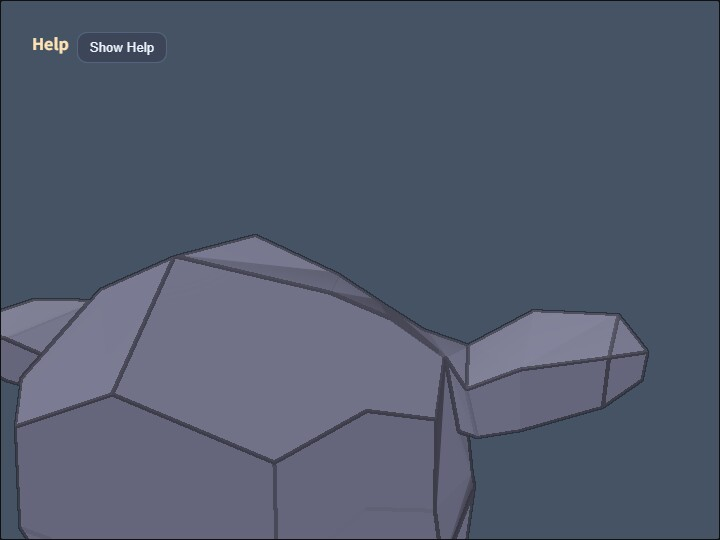

# compute_json

`compute_json` は、ModelAsset JSON に含まれる3Dモデルとアニメーションを読み込み、再生中のシーンへ `ComputeEffectPipeline` の画面効果を適用する汎用JSONビューアです。特定のモデル名、部品名、座標には依存していないため、`MODEL_ASSET_FILE` を別のModelAsset JSONへ変更しても同じ表示・アニメーション・効果確認の処理を利用できます。

同梱の `modelasset.json` にはスケルトンアニメーションがあり、頂点が動くモデルにToonやEdgeなどの効果が追従する様子を確認できます。初期状態ではToonとEdgeを有効にし、ほかの効果は操作によって個別に追加します。

## 実行方法

`./compute_json.html` をWebGPU対応ブラウザで開きます。ローカルファイルを直接開くのではなく、このリポジトリをHTTPサーバーで公開してアクセスしてください。

別のモデルを表示するときは、ModelAsset JSONまたはgzip圧縮したModelAsset JSONをこのフォルダへ置き、`main.js` の `MODEL_ASSET_FILE` を変更します。カメラの注視点、距離、移動量、ライト範囲はロードしたshape全体のbounding boxから決めるため、サンプルモデルと大きさが異なるモデルにも追従します。

## 使用しているwebgの機能

`WebgApp.loadModel()` はJSONを読み込み、再生可能なruntimeとクリップ情報を作成します。`startAnimations: true` によりアニメーションを開始し、フレーム更新時にはruntimeのアニメーションを進めてから描画します。

`createOrbitEyeRig()` はモデルの周囲を回るカメラを構成します。ドラッグ、パン、ズームに加え、視線軸を中心とするrollも試せます。2本指twistと `O` / `P` のroll入力は、mmodelerの操作に対して入力角度の符号だけを反転しています。

`ComputeEffectPipeline` はShadow Map、SSAO、SSR、Toon、DoF、Bloom、Edgeを1つの高水準APIから扱います。Shadow Mapは既定のdirectional lightに加え、アプリケーション側で `shadow.type: "spot"` を指定すればspot light shadowも選択できます。このビューアでは汎用モデル確認を優先し、既定のdirectional shadowとして扱います。`renderScene()` で必要なG-bufferを描画し、`encode()` で有効な効果だけを順に処理します。最終結果は `FullscreenPass` でcanvasへコピーします。

## 処理の流れ

1. `WebgApp.loadModel()` で `modelasset.json` を読み込み、runtimeとアニメーションクリップを取得します
2. shape全体のbounding boxを調べ、モデルが画面へ収まるorbit cameraとライト範囲を設定します
3. 毎フレームruntimeのアニメーションを更新し、変形後のshapeを `ComputeEffectPipeline.renderScene()` で描画します
4. `ComputeEffectPipeline.encode()` に現在のON/OFF状態を渡し、有効なCompute効果だけを実行します
5. `FullscreenPass` が合成済みの色textureをcanvasへ出力します

この順序により、静止したJSONモデルだけでなく、スケルトンやnode transformで動くモデルにも同じ画面効果を適用できます。すべての効果がOFFの場合は不要なeffect passを実行せず、通常のscene colorを最終出力へ渡します。

## 操作方法

- Drag / Arrow: orbit camera
- Shift + Drag / Shift + Arrow: camera targetのpan
- Wheel / `[` / `]`: zoom
- 2本指twist: 入力角度を反転したview roll
- `O` / `P`: rollの減少 / 増加
- `Y`: rollを0へ戻す
- `A`: SSAO
- `S`: Shadow Map
- `R`: SSR
- `T`: Toon
- `D`: DoF
- `B`: Bloom
- `E`: Edge
- `L`: direct + ambient / ambient only
- `5` / `6`: Toonの段階数
- `7` / `8`: Edgeの太さ
- `M`: Edgeの合成方法
- `Space`: 全アニメーションの一時停止 / 再開
- `1`: 選択中クリップを先頭から再生
- `2` / `3`: 選択中クリップの一時停止 / 再開
- `4` / `9`: 前 / 次のクリップを選択
- `W`: wireframe
- `K`: screenshot
- `J`: 読み込んだModelAsset JSONをdownload
- `0`: モデル全体に合わせてcameraをreset
- Double tap / Double click: command paletteを開く / 閉じる

## 確認ポイント

アニメーション中の輪郭や陰影へToonとEdgeが追従することを確認します。次にSSAO、Shadow Map、SSR、DoF、Bloomを個別に切り替え、各効果が必要なときだけ出力フローへ追加されることをHUDのGPU Compute / GPU Render表示と見た目から比較できます。

複数のanimation clipを持つJSONへ差し替えた場合は、`4` / `9` で選択対象が変わり、`1` / `2` / `3` が選択中clipだけに作用することも確認できます。animationを持たないJSONでもモデル表示とCompute効果の操作は利用できます。

## Blender用import / exportアドオン

`blender_modelasset_animation_io.py` は、Blenderのmesh、Armature、vertex weight、ActionをModelAsset JSONへ変換するアドオンです。BlenderのPreferencesにあるAdd-ons画面からこのPythonファイルをインストールすると、FileメニューのImport / Exportに `Webg Animated ModelAsset JSON` が追加されます。通常JSONとgzip圧縮した `.json.gz` の両方を読み書きできます。

export時の `Export Skeletons` をONにすると、選択したmeshのArmature modifierを調べ、bone階層、rest pose、inverse bind matrix、各頂点のweightを出力します。1頂点あたりweightの大きい4boneを採用して正規化します。Armatureに対するweightが1つもない頂点は、意図しない変形を隠さないようエラーにします。

RigifyのArmatureには、meshを直接変形しない `ORG-*` や `MCH-*` の制御用boneが多数含まれます。エクスポータはこれらをweightの有無にかかわらずjointへ出力せず、子boneのlocal matrixへ畳み込みます。rest pose、inverse bind matrix、Action評価後のposeを保ちながら制御用jointを除外し、最終的に必要なboneがwebgの上限である320本を超える場合はexport時にエラーで停止します。頂点が `ORG-*` / `MCH-*` にしかweightを持たない場合は通常boneへ自動付け替えず、weightの不備としてエラーにします。

`Export Animations` をONにすると、対象Armatureのpose boneを操作するBlender Actionをclipとして出力します。各boneのF-Curveに置かれたキーフレーム時刻の和集合を作り、その時刻だけをModelAssetの共通timesとして保存します。キーフレーム時点ではconstraintを含むscene評価後のposeを取得しますが、BlenderのBezier補間曲線そのものは出力しないため、キーフレーム間はwebg側のanimation補間になります。`Export Animations` はskeletonを参照するため、`Export Skeletons` がOFFのときは選択できません。

import時の `Import Skeletons` はModelAssetのskeletonからBlender Armatureとvertex groupを復元します。`Import Animations` は各clipをBlender Actionへ変換し、keyframeをlinear補間で作成します。animationを持たない静的ModelAssetも同じアドオンで読み込めます。

skinned meshではArmature変形前の頂点とvertex groupを対応させる必要があるため、export時の`Apply Modifiers`はskinned meshには適用されず、静的meshに適用されます。animationはArmatureによるskeletal animationに対応します。shape key、morph target、object transformだけのAction、NLA stripそのもののclip化は対象外です。

出力ファイルを `modelasset.json` としてこのフォルダへ置くと `compute_json` で再生できます。同じModelAsset形式を使う `json_loader` でも、skeletonとanimationを含む状態で読み込めます。

## ファイル

- `compute_json.html`: 実行ページ
- `main.js`: JSON読み込み、animation操作、camera、Compute効果の実装
- `modelasset.json`: スケルトンanimationを含む確認用ModelAsset
- `blender_modelasset_animation_io.py`: skeletonとanimationに対応したBlender用import / exportアドオン
- `blender_animation_sample.blend`: 2bone、vertex weight、Actionを含むBlender確認用source
- `README.md`: 日本語の説明
- `README.en.md`: 英語の説明
