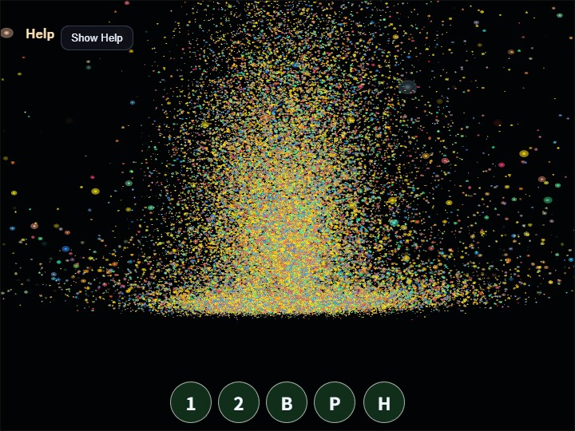

# compute_particles

English | [日本語](README.md)

## Overview
- This sample uses WebGPU compute shaders to update and render a large number of particles entirely on the GPU
- It uses the core `GpuParticleEmitter` to share particle GPU resources and Compute/Render Pass encoding
- Particle position, velocity, lifetime, color, and size are stored in a storage buffer and updated every frame by the compute pass
- The render pass reads the same storage buffer in the vertex shader and draws each particle as an instanced billboard quad made of two triangles
- `GpuParticleEmitter` owns the particle buffer, uniforms, Compute/Render pipelines, and command encoding
- Because particle positions are not read back from the GPU to the CPU, the CPU side does not run per-particle movement calculations
- Drag, `Shift + Drag`, and the mouse wheel move the orbit camera so the GPU particle group can be inspected from different angles and positions

## How to Run
- Open [./compute_particles.html](./compute_particles.html)
- Use a browser with WebGPU support, and check the help panel and HUD together with the sample when needed

## webg Features Used
- `WebgApp`: initializes `Screen`, diagnostics, and the input foundation together
- `WebgApp` compute frame: `computeFrame: true` and the `onComputeFrame` handler skip standard scene drawing and control compute/render order
- `GpuParticleEmitter`: manages the particle storage buffer, billboard quad, uniforms, Compute/Render pipelines, pass encoding, and resource destruction
- `Screen.resize()`: updates the actual canvas pixel size on viewport changes through the `Screen` held by `WebgApp`
- `WebgApp.getGPU()`: passes the WebGPU context to `GpuParticleEmitter` and the sample-specific frame code
- `buildHelpPanelOptions() + showOverlayPanel()`: displays the operation guide and current state in the `OverlayPanel` help panel

## WebGPU Features Used
- `storage buffer`: stores the particle array as GPU-readable and GPU-writable data
- `uniform buffer`: passes `deltaTime`, frame count, screen size, and emitter mode to the shader
- `orbit camera uniform`: passes `yaw`, `pitch`, `distance`, `targetY`, and pan offset to the render shader so the particle group can be transformed into view space
- `compute pipeline`: updates position, velocity, and lifetime with one invocation per particle
- `render pipeline`: reads the storage buffer in the vertex shader and draws billboard instances
- `alpha blending`: uses standard alpha compositing so overlapping particles keep visible outlines instead of washing out to white too quickly
- `timestamp query`: measures Compute Pass and Render Pass GPU time and displays per-stage and total load

## Checkpoints
- Confirm that 49,152 particles appear in a fountain-like pattern right after startup
- Press `Space` and confirm that some particles are regenerated and a momentary burst becomes visible
- Confirm that `1 / 2` switches the emitter mode between `fountain` and `ring`
- Confirm that drag performs orbit, `Shift + Drag` performs pan, and the mouse wheel performs zoom
- When `P` pauses the sample, confirm that particle updates stop while rendering continues
- Press `H` to fold the `OverlayPanel` help panel and confirm that `H` again or the `Show Help` button restores it
- Confirm that `GPU compute / GPU render / GPU total / JS time` and their load values update in the help panel. On systems without `timestamp-query`, GPU timing is shown as unavailable
- If you inspect browser devtools, confirm that the CPU is not running a per-particle position-update loop every frame

## Controls
- `Space`: burst
- Drag: camera orbit
- `Shift + Drag`: camera pan
- Mouse wheel: zoom
- `1`: fountain emitter
- `2`: ring emitter
- `P`: pause / resume
- `H`: hide / show help

## Implementation Details
- The compute shader in `main.js` rewrites only the same index in the storage buffer, avoiding write conflicts between particles
- Particle spawning, gravity, swirl, floor response, color, and lifetime remain in sample-specific WGSL, so `GpuParticleEmitter` does not fix one simulation algorithm
- `GpuParticleEmitter` does not own the command encoder or submission; the `WebgApp` compute-frame handler decides the order of Compute, Render, and timestamp queries
- The render shader uses instanced billboard quads instead of point lists, so particle size, outlines, and alpha falloff can be controlled in the shader
- Camera control is handled only by the view transform in the render shader, while pan is passed as a post-projection offset through uniforms, preserving a design that never returns particle positions from GPU to CPU
- The operation guide and state display are collected in the standard foldable `OverlayPanel` help panel instead of a custom DOM HUD
- The sample can be used as a compute-shader example for large-scale visual effects and background-effect generation
