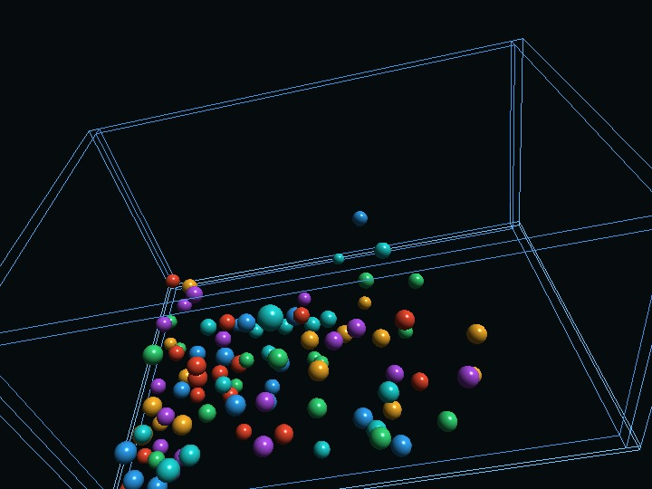

# compute_physics_bounce

English | [日本語](README.md)

## Overview
- Sphere position, radius, velocity, restitution, friction, and color are stored in a storage buffer
- In the compute shader, one invocation is responsible for one sphere and calculates gravity integration, collisions with the floor and walls, and sphere-sphere collision response
- It uses ping-pong `src / dst` buffers so every invocation reads the same previous state and writes to a separate sphere entry
- The compute result is not read back to the CPU; the vertex shader reads the same storage buffer directly and renders the spheres as instances
- The sample treats `1 unit` as `1 m` and uses gravity of about `1.634 m/s²`, roughly one-sixth of Earth's gravity
- The container is `0.76 m` wide and `0.50 m` deep, and sphere radii are about `1.25 - 1.8 cm`
- The default 96 spheres fall from about `0.22 - 0.25 m` in height, near the upper edge of the wireframe frame
- The sample owns the GPU simulation, buffer management, and render passes while `WebgApp` provides application setup
- It enables `computeFrame: true` on `WebgApp` and issues its Compute and Render Passes from the `onComputeFrame` handler
- It manages source/destination indices with the sample-local `PingPongBuffer` and uses timestamp queries to measure GPU Compute time across all substeps plus Render Pass time

## How to Run
- Open [./compute_physics_bounce.html](./compute_physics_bounce.html)
- Use a browser with WebGPU support, and check the help panel and HUD together with the sample when needed

## Checkpoints
- This sample compares the GPU compute-shader simulation with the CPU rigid-body simulation in `samples/physics_bounce`
- Press `P` to pause, `R` to reset, and `C` to toggle sphere-sphere collisions on or off
- The touch buttons `T / C / P / R` can also control tilt, collisions, pause, and reset
- You can specify the sphere count with the URL parameter `?count=`. The default is `96`, and the maximum is `512`
- The sample checks every sphere pair (`O(N^2)`) and solves linear velocity without rotational degrees of freedom
- The help panel's Compute load, Render load, GPU load, and JS load can be used to compare which stage grows as the sphere count increases
