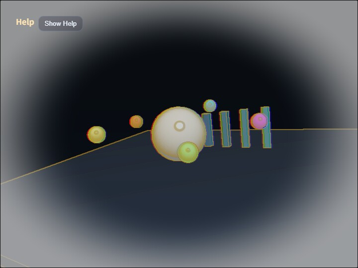

# compute_postprocess

[English](README.en.md) | 日本語

## 概要
- 第20章のポストプロセス描画フローを、fragment shader の FullscreenPass ではなく Compute Shader で加工するサンプルです。
- webg core は変更せず、WebgApp から取得した WebGPU device と Screen.createRenderTarget() だけで compute pass を組み込みます。
- 3D scene を offscreen RenderTarget へ描画し、compute shader がその color texture を読み、storage texture へ書き出します。
- 最後に FullscreenPass で compute 出力 texture を canvas へ表示し、操作説明は Help Panel、現在値の変更は CommandPalette にまとめます。

## 実行方法
- 実行ファイルは [./compute_postprocess.html](./compute_postprocess.html) です
- WebGPU に対応したブラウザで開き、必要に応じて help panel と CommandPalette と合わせて確認してください

## 使用している webg 機能
- WebgApp(autoDrawScene: false): 3D scene の描画先と postprocess の順序を sample 側で制御する
- RenderTarget: scene color/depth と compute output の texture を保持する
- FullscreenPass: compute shader が書き込んだ storage texture を canvas へコピーする
- Shape / Primitive: postprocess の見え方を確認するための標準的な 3D scene を作る
- buildHelpPanelOptions() + showOverlayPanel(): 操作説明を左上の折りたたみパネルへ表示する

## 確認ポイント
- 3D scene が一度 offscreen target に描かれ、その後 compute pass を経由して表示されることを確認します
- C で Compute Postprocess の ON / OFF を切り替え、同じ scene のまま後処理だけが変化することを確認します
- V で view を composite / scene / output へ切り替え、元 scene と compute 出力を比較します
- 1 / 2 で黒線 + 暖色ハイライトの edge、3 / 4 で局所コントラストを強める sharpness、5 / 6 で白い vignette、7 / 8 で赤青の chromatic offset を変えたとき、CommandPalette の数値と画面の変化が一致することを確認します
- M で mode を film / edge / heat に切り替え、同じ compute shader 内の分岐で見え方を変えられることを確認します
- viewport サイズを変えても scene target と compute output が screen サイズへ追従することを確認します

## 操作方法
- ドラッグ / 矢印キー: オービットカメラ回転
- ホイール / [ / ]: ズーム
- C: compute postprocess の ON / OFF
- V: composite / scene / output 表示切り替え
- M: film / edge / heat mode の切り替え
- 1 / 2: edge strength を下げる / 上げる
- 3 / 4: sharpness を下げる / 上げる
- 5 / 6: white vignette を下げる / 上げる
- 7 / 8: chromatic offset を 1px ずつ下げる / 上げる
- Space: scene animation の一時停止 / 再開
- R: パラメータを初期値へ戻す
