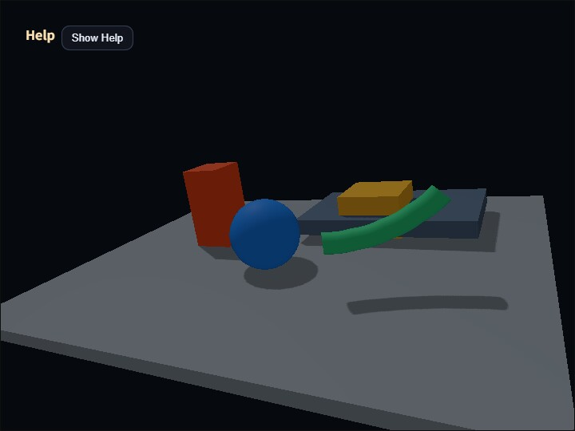

# compute_shadow_map

[English](README.en.md) | 日本語



## 概要

このサンプルは、directional light 1灯のshadow mapを検証します。`webg/ShadowMapPass.js`が光源視点からsceneをdepth textureへ描き、`GeometryBufferPass`がcamera視点のalbedo、normal、depthを作ります。その後、`webg/ComputeShadowPass.js`がcamera側の位置をworld-spaceへ戻し、light spaceへ投影してshadow mapと比較します。

shadow map生成をRender Pass、影の評価と合成をCompute Passへ分けています。三角形のrasterizeとdepth testはRender Pipelineへ任せ、Compute Shaderは生成済みdepthを使ったbias、PCF、debug表示に集中します。`GeometryBufferPass`が入力を生成し、`SsaoPass`や`DeferredLightingPass`が後段で読む構成と同じ責務分割です。

`ShadowMapPass`はwebgコアの実装です。static Shapeとskinned ShapeをSpaceから収集し、depth-only Render Passで描きます。skinned Shapeでは標準`Shape`の2本のvertex bufferと`Skeleton`のmatrix paletteを読み、通常描画や`GeometryBufferPass`と同じbone姿勢をshadow mapへ反映します。alpha testは対象外であり、暗黙に別の処理へ置き換えません。

`FrameTimer`はshadow depthとG-bufferのRender Pass、shadow評価のCompute Passをtimestamp queryで計測します。CommandPaletteとHelp panelには`GPU Compute`、`GPU Render`、`GPU Total`、`GPU Load`を表示します。GPU Loadは計測対象のGPU合計時間をframe間隔で割った目安です。最終的なfullscreen copyは計測対象外です。

## 処理フロー

```text
Space
  -> ShadowMapPass
  -> directional light depth

Space
  -> GeometryBufferPass
  -> camera albedo / normal / depth

camera G-buffer + light depth
  -> ComputeShadowPass
  -> shadowed color
  -> FullscreenPass
  -> canvas
```

directional lightには正射影を使います。この sample では、固定の正射影範囲を使う `fixed` と、camera 視錐台を light-space へ変換してそのAABBへ合わせる `frustum-fit` を切り替えられます。camera 視錐台そのものの形と大きさは near / far / fov / aspect で決まりますが、その視錐台を light-space に置いたときのAABBは、camera と光源の向き・位置関係で変化します。`frustum-fit` はその変化するAABBへ shadow map を割り当てるため、近景へ texel を集中しやすい一方、遠くまで含めるとAABBが広がって fixed より不利になることがあります。

`Fit Far` は、`frustum-fit` で camera 視錐台の far 側をどこまで shadow fit の対象に含めるかを制御します。値を大きくすると遠方まで影を含めやすくなりますが、light-space AABB も広がり、同じ1024×1024のshadow mapをより広い空間へ割り当てるため精度は下がりやすくなります。値を下げると近景へ解像度を集中できますが、その距離より先にある物体の影は fit 対象から外れます。

spot light shadow はコアの `SpotShadowMapPass` と `ComputeSpotShadowPass` で扱います。spot light では光源位置、照射方向、FOV、inner / outer angle、near、farから透視投影のlight view-projection matrixを作り、coneの外側を徐々に暗くします。このサンプルはdirectional lightの低水準構成を確認するためのものなので、spot light shadowの実行確認は `ComputeEffectPipeline` の `shadow.type: "spot"` を使うアプリケーション側で行います。

## 実行方法

- 実行ファイルは [./compute_shadow_map.html](./compute_shadow_map.html) です
- WebGPU対応ブラウザで開きます
- cameraはdrag、矢印キー、wheelで操作できます

## 操作と確認ポイント

- `F`は`fixed / frustum-fit`を切り替えます
- `V`は`composite / shadow / albedo / normal / depth`を切り替えます
- `1`と`2`はconstant depth biasを減少・増加します
- `3`はPCF radiusを0、1、2へ切り替えます
- `Space`は緑色のskinned shadow casterの移動、回転、曲げを停止・再開します
- CommandPaletteでは`Fit Far`を変更できます
- Help panelで`Light Box`の幅、高さ、near、farが`fixed / frustum-fit`でどう変わるかを確認します
- CommandPaletteとHelp panelでGPU時間とGPU Loadが更新されることを確認します

`shadow`表示はvisibilityを白、遮蔽を黒で表示します。物体表面に細かな自己影が出る場合はbias不足、影が物体から離れて見える場合はbias過大を疑います。PCF radius 0は1 sample、1は3×3、2は5×5で比較するため、境界の変化と追加sample数を確認できます。

画面手前側を移動する緑色の円柱は両端を平面で閉じ、5本のboneで連続的に曲がりながらNode自体も回転します。端面は側面と頂点を分け、各端のboneへ固定しているため、曲げても側面から分離しません。本体の移動、回転、曲げと床へ落ちる影の輪郭が同時に変化することを確認します。`ShadowMapPass`はSkeletonごとにbone palette用BufferとBind Groupを再利用し、毎frameは現在のmatrix paletteだけを更新します。static Shapeは同じpipelineを使いますが、skinning無効flagと正式なdummy vertex bindingを渡すため、誤ってbone変形を適用しません。

このサンプルはstatic/skinned opaque Shape、単一directional light、固定解像度1024×1024のshadow mapを対象にしています。spot lightはコアAPIで利用できますが、このサンプルでは扱いません。Cascaded Shadow Maps、point light、alpha testは対象外です。
