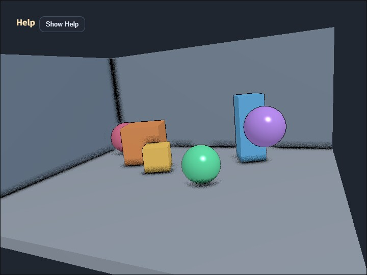

# compute_ssao

[English](README.en.md) | 日本語

## 概要
SSAO は、画面上で近くに別の面がある場所を暗くし、接地感や角の奥行きを強調するポストプロセスです。このサンプルは normal 用 G-buffer を使わず、scene color と sampleable depth だけから Ambient Occlusion を計算する depth-only 版です。

処理では、まず通常の scene を color と sampleable depth を持つ `RenderTarget` へ描画します。Compute Shader は depth から view-space 位置を復元し、近傍 pixel の depth 差分から簡易 normal を作ります。その normal を基準に、周辺 16 方向の depth を調べ、床との接触部、壁の角、object 同士の隙間を暗くします。

この方式を使う理由は、MRT や normal texture を追加せず、既存の RenderTarget depth だけで SSAO の基本構造を確認できるためです。入力 resource が少ない一方で、depth 不連続や細い形状では normal 近似が不安定になることがあります。G-buffer normal を使う構成との比較には `samples/compute_ssao_gbuffer` を参照してください。

## 実行方法
- 実行ファイルは [./compute_ssao.html](./compute_ssao.html) です
- WebGPU に対応したブラウザで開き、必要に応じて help panel と CommandPalette と合わせて確認してください

## 確認ポイント
`C` で SSAO の ON/OFF、`V` で `composite / scene / ao` を切り替えます。`ao` 表示では、遮蔽係数だけを白黒で確認できるため、暗くなっている場所が合成前に正しいかを見られます。

`radius` は screen-space の探索半径、`strength` は暗さ、`bias` は同じ面を自分自身で遮蔽してしまう誤判定を抑える値です。`samples` を増やすと方向数が増えて滑らかになりますが、pixel あたりの `textureLoad` も増えます。

注意点として、depth から復元した normal は物体境界で壊れやすく、細い形状や急な depth 差ではノイズが出る場合があります。このサンプルは core を変更せず、depth-only SSAO の長所と限界を見比べるための実装です。
