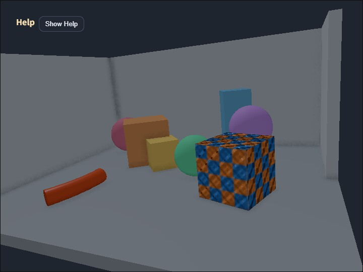

# compute_ssao_gbuffer

English | [日本語](README.md)

## Overview
- `GeometryBufferPass` from `webg/GeometryBufferPass.js` outputs lit color, view-space normals, and depth in `lit` mode
- `SsaoPass` from `webg/SsaoPass.js` reads the normal texture and surrounding depth to calculate ambient occlusion
- `SsaoPass` can lower only the raw AO target resolution while keeping the final color composite at full resolution
- It shares G-buffer generation, normal encoding, and depth reconstruction rules with `compute_deferred_lighting` and `compute_ssr`
- `GeometryBufferPass` collects Shapes from `Space`, so the same Shapes are not registered separately with the scene graph and G-buffer
- It reads the standard Shape material used by `SmoothShader` and applies textures, normal maps, skinning, ambient, specular, and power to the G-buffer

## How to Run
- Open [./compute_ssao_gbuffer.html](./compute_ssao_gbuffer.html)
- Use a browser with WebGPU support, and check the help panel and CommandPalette together with the sample when needed

## Checkpoints
- Press `V` to switch between `composite / scene / AO / normal` and inspect the G-buffer normals
- Compared with the depth-difference normal approximation used by `compute_ssao`, this sample can use more stable normals on object boundaries and flat surfaces
- `radius`, `strength`, `bias`, and `sample count` have the same meanings as in `compute_ssao`
- `SSAO Scale` is the resolution scale for the raw AO target. The default is 0.70, and the editable range is 0.50 to 1.00
- Lowering `SSAO Scale` reduces the number of pixels processed by raw AO generation, making it useful for checking the balance between GPU load and image quality
- Color, depth, normal, and the final composite remain full resolution, so this is different from simply lowering the resolution of the whole final image
- Bright back, left, and right walls make it possible to compare the stronger AO where the floor and walls or two walls meet
- Boxes, spheres, the pillar, the textured cube, and the skinned cylinder are slightly enlarged and moved toward the scene center so AO is visible both at floor contacts and between nearby objects
- The textured cube uses a fine height pattern, a generated normal map, and strong specular lighting so its small bumps are visible without subdividing the surface
- Three spheres use specular highlights to make their smooth surface directions visible
- The skinned cylinder rotates its root bone by 90 degrees to lie parallel to the floor, then distributes the bend across four remaining joints so skinning and contact AO can be inspected together
- Alpha-blended transparency remains separate because a single depth and normal cannot preserve multiple front-to-back surfaces

## Controls
- Press `9` / `0` to change `SSAO Scale`
- `SSAO Scale` is also available on page 2 of the CommandPalette
- Compare `SSAO Scale` values of 1.00, 0.70, and 0.50 first to observe the quality and GPU load tradeoff
