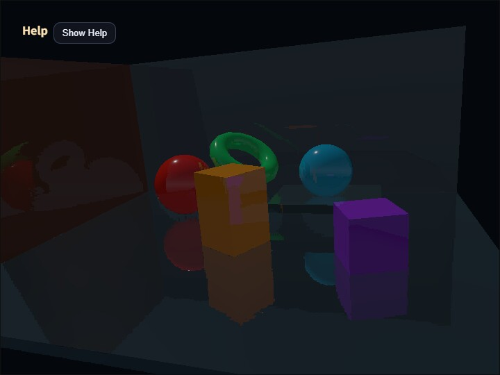

# compute_ssr

English | [日本語](README.md)



## Overview

SSR is a screen-space effect that approximates reflections from color, depth, and normals already present on the screen. In this sample, `GeometryBufferPass` produces albedo, view-space normals, and depth, and `ComputeSsrPass` marches a reflected view-space ray while reprojecting it to the screen.

`ComputeSsrPass` does not use a fixed `distance / steps` interval. Instead, it treats `distance` as the UI-side upper bound for the search distance, clips camera-facing rays to `usableDistance` before they cross the near plane, and chooses the coarse step count dynamically from the ray's major-axis pixel length on the screen.

Because five binary-search iterations can shrink the hit interval to 1/32, the coarse march targets roughly 8 px spacing. To keep GPU cost bounded, the maximum coarse step count is `steps * 2`, with an absolute cap of 128. Binary search and the "first valid hit only" rule are preserved.

To reduce cost, `ComputeSsrPass` can lower only the SSR output target resolution. The default `resolutionScale` is `0.7`, and the valid range is `0.5..1.0`. The G-buffer stays at full resolution, and each low-resolution SSR pixel samples the corresponding G-buffer pixel. The default `reflectivityThreshold` is `0.05`; pixels where `albedo.a * intensity` is at or below this value skip ray marching. When `enabled=false` or `intensity=0`, ray marching is also skipped and the pass returns the base color, or black in the reflection view.

```text
dynamicSteps = clamp(
  ceil(projectedRayPixels / 8),
  baseSteps,
  min(baseSteps * 2, 128)
)

stepLength = usableDistance / dynamicSteps
```

`FrameTimer` measures G-buffer generation as GPU Render time and SSR ray marching as GPU Compute time through timestamp queries. The Help panel and CommandPalette show each duration and its load relative to the frame interval. The final fullscreen copy is outside the measured range.

## How to Run

- Open [./compute_ssr.html](./compute_ssr.html)
- Use a browser with WebGPU support, and check the help panel and CommandPalette together with the sample

## Checkpoints

Press `V` to switch between `composite / scene / reflection / normal / depth`. The `reflection` view shows only the reflection component, while `normal` and `depth` show the inputs used by ray marching.

Use `1` and `2` to change reflection intensity, `3` and `4` to change ray distance, `5` and `6` to change depth thickness, and `7` and `8` to change the base step count. Use `9` and `0` to decrease / increase `SSR Scale`, and change `Reflect Min` from page 3 of the CommandPalette. Larger distance can reach farther reflection candidates, but screen-space SSR still cannot reflect off-screen regions or surfaces hidden behind occluders.

Also confirm that `GPU compute / GPU render / GPU total / JS time` and their load values update in the Help panel. GPU Compute measures only the SSR pass, providing a stable comparison baseline for ray-marching changes under the same scene and resolution.
