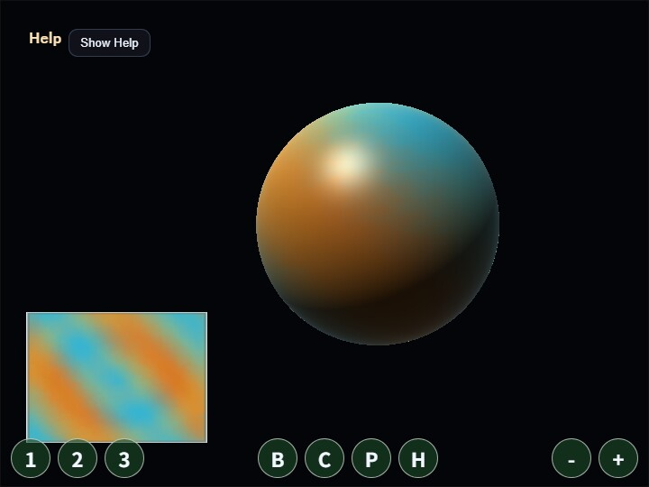

# compute_texture

[English](README.en.md) | 日本語

## 概要
- WebGPU の Compute Shader を使い、2 枚の texture を ping-pong しながら毎フレーム内容を書き換えるサンプルです
- webg コアライブラリには compute 専用 API を追加せず、WebgApp が初期化した WebGPU device / queue / canvas context をサンプル内で直接使っています
- compute pass は前フレームの sampled texture を読み、拡散、流れ場、背景模様、ポインタ入力、中央 burst を合成して次フレームの storage texture へ書き込みます
- render pass は同じ texture を左下の平面 preview と、`Primitive.sphere()` で作った球 mesh へ同時に使い、GPU 内で更新したテクスチャを CPU readback なしで画面へ出します
- ドラッグするとポインタ位置に色の種を注入し、クリック時には反転した色の輪が少しずつ大きくなりながら薄れていく演出も重なります。左下の平面 preview では入力位置との対応を確認でき、中央の球体では貼り込まれた texture と照明の見え方を確認できます

## 実行方法
- 実行ファイルは [./compute_texture.html](./compute_texture.html) です
- WebGPU に対応したブラウザで開き、必要に応じて help panel や HUD と合わせて確認してください

## 使用している webg 機能
- WebgApp: Screen、diagnostics、入力基盤をまとめて初期化する
- WebgApp computeFrame: `computeFrame: true`と`onComputeFrame` handlerで、標準scene描画を行わずcompute / renderの順序を制御する
- Screen.resize(): WebgApp が保持する Screen を通じて viewport 変更時の canvas 実ピクセルを更新する
- WebgApp.getGPU(): core API を変更せず、サンプル側で raw WebGPU texture / sampler / pipeline を作るための入口
- buildHelpPanelOptions() + showOverlayPanel(): 操作説明と現在状態を OverlayPanel の help panel として表示する
- InputController.installTouchControls(): PC とスマートフォンの両方へ mode 切替や clear を行うタッチボタンを表示する

## 使用している WebGPU 機能
- sampled texture: 前フレームの色分布を compute shader が読む入力として使う
- storage texture: compute shader が次フレームの色を書き込む出力として使う
- ping-pong texture: 同じ texture を読み書きせず、source と destination を毎フレーム交換して更新競合を避ける
- sampler: 隣接 pixel や流れ方向のずれた UV を線形補間で読み、にじみや流れを作る
- uniform buffer: time、deltaTime、pointer 位置、mode、brush 半径、burst、brush color を shader へ渡す
- compute pipeline: 1 invocation = 1 pixel として前フレームの色、近傍色、背景波形、入力注入を合成する
- render pipeline: compute 後の texture を平面 preview と `Primitive.sphere()` の照明付き球 mesh に使い、書き換え結果を 2 通りの見え方で可視化する
- timestamp query: texture更新のGPU Compute時間とRender Pass時間を取得し、各区間と合計のloadを表示する

## 確認ポイント
- 起動後に、左下の平面 preview と中央の球体の両方へ、クリック前から色の入った時間変化する流れ模様が表示されることを確認します
- ドラッグまたは 1 本指ドラッグで色を描くと、平面 preview ではポインタ位置と同じ向きに色が入り、短いクリックやタップでも注入色が少し残ってから Compute Shader によって流れながら広がることを確認します
- クリックやタップの直後には、入力位置を中心に色反転を含む輪が色を変えながら外側へ広がり、時間とともに薄くなることを確認します
- 球体側では、`Primitive.sphere()` の UV へ同じ texture が回転しながら貼られ、明暗と highlight によって面の丸みと texture の巻かれ方が分かることを確認します
- 1 / 2 / 3 で mode を切り替えると、同じ更新構造のまま色調と模様の出方が変わることを確認します
- B または Space で中央 burst を発生させると、画面中心から輪が広がることを確認します
- C で texture が初期化され、残っていた色の履歴が消えることを確認します
- P で pause したとき、compute 更新が止まり、現在の texture 表示だけが維持されることを確認します
- ホイールまたは - / + ボタンで brush 半径を変えると、描画時の注入範囲が変わることを確認します
- H で OverlayPanel の help panel を畳み、再度 H または Show Help ボタンで再表示できることを確認します
- Help panelの`GPU compute / GPU render / GPU total / JS time`と各loadが更新されることを確認します

## 操作方法
- ドラッグ: texture へ色を描く
- 1 本指ドラッグ: texture へ色を描く
- ホイール: brush 半径の変更
- - / +: brush 半径の変更
- 1: Aurora mode
- 2: Ink mode
- 3: Cells mode
- B / Space: center burst
- C: clear texture
- P: pause / resume
- H: hide / show help

## 実装の詳細
- main.js の compute shader は sampled texture を read、storage texture を write として分け、前フレームの内容を壊さず次フレームを作っています
- 同じ 2 枚の texture を毎フレーム入れ替える ping-pong 構成にしているため、動的なテクスチャフィードバックを GPU 内だけで継続できます
- pointer 入力は CPU 側で座標、半径、残像用の注入エネルギー、click pulse の進行度と中心座標を uniform へ渡し、実際の注入範囲、色反転、色の加算は compute shader 側で pixel ごとに判定しています
- render 側の球体は `Primitive.sphere()` の geometry.positions / uvs / indices を raw render pipeline 用 buffer へ詰めて描画し、seam が目立ちにくい既存の UV 展開をそのまま使っています
- 球体はその UV で texture を sample し、directional light、specular、rim light を使って面の向きと貼り込み状態を見やすくしています
- ポストプロセス、反応する HUD、手続き模様、ペイント可能な effect map など、動的 texture 生成の入口として確認できます
