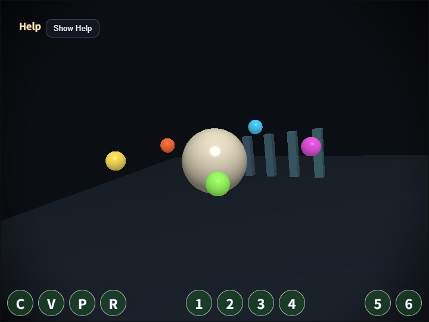

# compute_vignette

[English](README.en.md) | 日本語

## 概要
Vignette は、画面中心を明るく残し、外周へ向かって少しずつ暗くすることで視線を中央へ集める基本的なポストプロセスです。このサンプルは、既存の `VignettePass` と同じ種類の効果を Fragment Shader ではなく Compute Shader の 1 dispatch で実行し、画面処理を「描画後の画像を読む処理」として分解して確認できるようにしています。

処理の流れは、まず通常の 3D scene を offscreen の `RenderTarget` へ描画し、その color texture を Compute Shader から読みます。Compute Shader は 1 invocation で 1 pixel を担当し、中心からの距離、半径、softness、strength を使って減衰係数を計算して `rgba8unorm` の storage texture へ書き込みます。最後に `FullscreenPass` が storage texture を通常の texture として読み、canvas へ表示します。

この構成を使う理由は、Compute Shader の最小形を安全に確認できるためです。入力 texture、uniform buffer、出力 storage texture、dispatch size の対応が画面全体の 1 段処理だけに絞られているので、Bloom や DoF のような複数 pass へ進む前の入口として使いやすくなります。実験用の接続処理はサンプル側に置き、`webg` コアの `VignettePass` は変更していません。

## 実行方法
- 実行ファイルは [./compute_vignette.html](./compute_vignette.html) です
- WebGPU に対応したブラウザで開き、必要に応じて help panel や HUD と合わせて確認してください

## 確認ポイント
まず `C` で Compute Vignette の ON/OFF を切り替え、同じ scene に対して後処理だけが変わることを確認します。`V` では元の scene と compute 出力を切り替えられるため、offscreen 描画結果と storage texture へ書き込んだ結果を直接比較できます。

`radius` は暗くなり始める外周半径、`softness` は減衰が広がる幅、`strength` は外周をどれだけ暗くするかです。横長の画面でも円形の印象が崩れにくいよう、shader 内では aspect 比で距離を補正しています。viewport を変更したときに出力 texture が画面サイズへ追従することも合わせて確認してください。

このサンプルは単独の画質改善というより、Compute Shader で画面全体を処理するときの最小データフローを読むためのものです。`samples/compute_edge` と同じ共通 runtime を使っているため、WGSL と uniform packing だけを差し替えると別の 1 dispatch effect へ展開できます。
