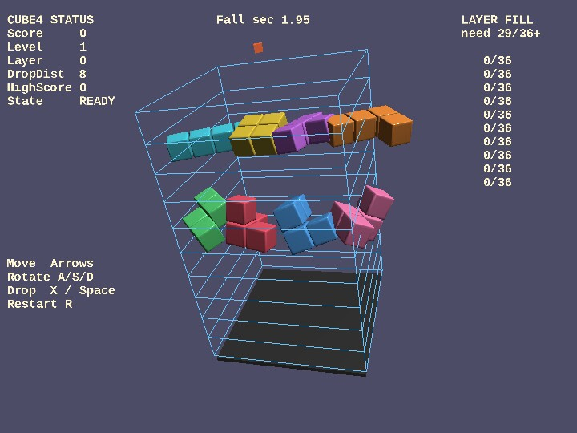

# cube4

English | [日本語](README.md)

## Overview
- This is a 3D falling-block game built on top of `webg`
- It drops polycubes into a `6x6x10` 3D board and raises the score by clearing layers that become filled beyond a threshold
- `WebgApp` is used as the entry point, and `Shape / Primitive` are used to build the floor, blocks, and per-layer wireframe walls
- The camera uses an `EyeRig` orbit configuration, and movement input is corrected into the `x / z` directions based on camera yaw
- Before the game starts, pieces do not fall automatically, so you can inspect the controls while watching the rotation demo of every block type
- During gameplay, the HUD is reduced to a single `score / level / layer` line, and the operation guide is shown only before the start and on game over
- The sample includes ghost display, next-piece display, high-score saving, screenshots, sound effects, and BGM
- Layer clear does not require every cell in a layer to match exactly; a clear occurs when at least 29 of the 36 cells in one layer are filled, and score changes according to occupancy rate

## How to Run
- Open [./cube4.html](./cube4.html)
- Use a browser with WebGPU support, and check the help panel and HUD together with the sample when needed

## webg Features Used
- `WebgApp`: standard initialization for `Screen / Shader / Space / Input / Message / progress` saving
- `EyeRig(type="orbit")`: orbit camera for viewing the whole board
- `Shape / Primitive`: generates blocks, floor, pedestal, and wireframe walls for each layer
- `Shape.createInstance()`: reuses the shared resource of block shapes and changes only color and material for each slot
- `Shape.setWireframe(true)`: displays layer walls as wireframe polygon-edge loops
- `Message`: HUD display for status and guide information
- `GameAudioSynth`: playback of sound effects and BGM
- `takeScreenshot()`: saves a screen capture

## Checkpoints
- Confirm that wireframe walls surrounding each layer are visible around the 3D board, making it easier to understand the height of the blocks
- Confirm that arrow-key movement is corrected based on camera yaw, producing natural left-right / front-back movement relative to the viewing direction
- Confirm that before the start, pieces do not fall automatically and the game begins only after move / rotate / drop input
- Confirm that the ghost display indicates the final drop position and that hard drop fixes the piece there immediately
- Confirm that a layer clears when 29 or more cells are filled and that score increases according to how full the layer was
- Confirm that before the game starts, the rotation demo shows 8 polycube types at individual speeds and disappears after gameplay begins
- Confirm that the `score / level / layer` HUD, sound effects, BGM, high-score saving, and screenshot behavior all work together

## Reading Shape and Rendering Cost
- This sample is arranged so that you can inspect the effect of mesh sharing through `Shape.createInstance()` while displaying many blocks. Looking at diagnostics such as `vertexCount`, `triangleCount`, `nodeCount`, `shapeCount`, and `meshCount` shows that the number of vertices and meshes sent to the GPU can vary greatly even when the appearance looks similar. Representative values for each block-shape configuration are shown below
- Bevel 1 stage
- `vertexCount=42112`
- `triangleCount=17824`
- `nodeCount=429`
- `shapeCount=417`
- `meshCount=408`
- Bevel 3 stages
- `vertexCount=84128`
- `triangleCount=37216`
- `nodeCount=429`
- `shapeCount=417`
- `meshCount=408`
- Bevel 3 stages + shared vertices
- `vertexCount=23932`
- `triangleCount=37216`
- `nodeCount=429`
- `shapeCount=417`
- `meshCount=408`
- Bevel 3 stages + shared vertices + instancing
- `vertexCount=391`
- `triangleCount=508`
- `nodeCount=429`
- `shapeCount=417`
- `meshCount=9`
- Increasing bevel from 1 stage to 3 stages raises both triangle count and vertex count, but shared vertices greatly reduce vertex count while keeping the same triangle count. Reusing shared resources through `Shape.createInstance()` then greatly reduces the number of built meshes and vertices even though the `shapeCount` and `nodeCount` hanging from the scene stay the same

## Controls
- Arrow keys: move based on camera direction
- `A / S / D`: rotate around the X / Y / Z axes
- `X`: move down by 1 step
- `Space`: hard drop
- `P`: pause
- `R`: restart
- `K`: save a screenshot
- `B`: switch block-shape mode
- `T`: toggle touch controls on or off on desktop
- Touch buttons: `RX / RY / RZ / ⬇`, `← / → / ↑ / ↓`, `R`
