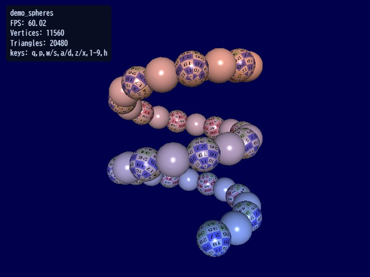

# demo_spheres

[English](README.en.md) | 日本語

## 概要
- 球体を複数配置し、色・テクスチャ・回転・カメラ操作をまとめて確認するサンプルです。
- Shape.referShape を使ったメッシュ再利用の基本パターンも含みます。

## 実行方法
- 実行ファイルは [./demo_spheres.html](./demo_spheres.html) です
- WebGPU に対応したブラウザで開き、必要に応じて help panel や HUD と合わせて確認してください

## 使用している webg 機能
- Shape.sphere / Shape.referShape
- Texture と shaderParameter 設定
- Space / Node: 階層回転とカメラ制御
- Screen.screenShot, HUD表示

## 確認ポイント
- referShape で複製した球体が同一メッシュを共有しつつ個別の姿勢更新ができるかを確認します
- カメラ回転とズームが破綻せず、複数球体を安定して観察できるかを確認します
- 形状切り替えやスクリーンショット保存が描画ループ中に安全に実行できるかを確認します

## 操作方法
- Q: 終了
- P: スクリーンショット保存
- W / S: カメラをX軸回転
- A / D: カメラをY軸回転
- Z / X: ズームイン / ズームアウト
- 1 - 9: 表示形状の切り替え
- H: ヘルプ表示のON / OFF
