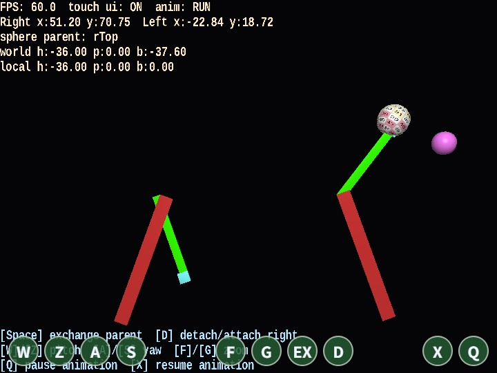

# detouch

English | [日本語](README.md)

## Overview
- This sample switches parent-child relationships at runtime with `attach / detach`
- It is an educational sample for learning hierarchical operations that "replace the parent while preserving the visible position", using both the actual motion and the HUD

## How to Run
- Open [./detouch.html](./detouch.html)
- Use a browser with WebGPU support, and check the help panel and HUD together with the sample when needed

## webg Features Used
- `WebgApp`: standard initialization for `Screen / Shader / Space / Camera / Input / Message`
- `Node.attach / Node.detach`
- `Node.getWorldPosition / getWorldAttitude`
- `WebgApp.setGuideLines / setStatusLines`: shows hierarchy state and pose information
- `Texture + SmoothShader`: visualizes the spheres
- `InputController / Touch`: unifies keyboard input and touch input under the same operations

## Checkpoints
- Confirm that even when the sphere's parent is switched between the tips of the left and right rotating arms, the visible position and attitude of the sphere do not jump, so the world-space preservation behavior can be observed
- Compare the status displays `sphere parent`, `world h/p/b`, and `local h/p/b`, and confirm that the local values change after a parent switch while the visible world-side result is preserved
- Compare the difference between `detach/attach right` and `exchange parent`, and confirm the difference in processing flow between detaching to `null` and reconnecting to another parent

## Controls
- `W / Z`: rotate the camera pitch
- `A / S`: rotate the camera yaw
- `F / G`: zoom in / out
- `D`: toggle detach/attach with the right-end node
- `Space`: swap the parent node of the sphere object between left and right
- `Q`: stop the animation
- `X`: resume the animation
